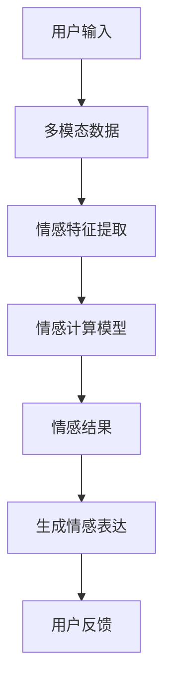
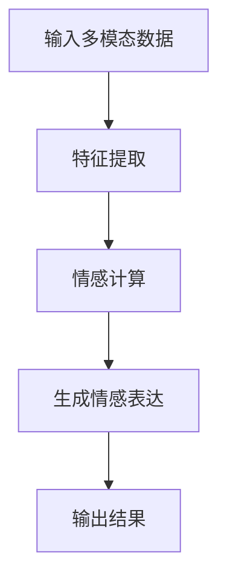
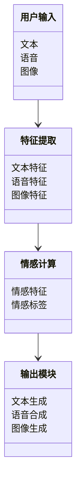
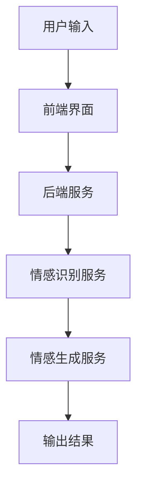

                 


# AI Agent的多模态情感识别与生成

## 关键词：
AI Agent, 多模态情感识别, 情感生成, 情感计算, 多模态数据, 深度学习, 情感交互

## 摘要：
本文详细探讨了AI Agent在多模态情感识别与生成领域的核心原理、算法实现和系统架构。通过背景介绍、核心概念分析、算法原理、系统设计与项目实战的逐步讲解，为读者提供了从理论到实践的全面指导。文章结合实际案例，深入分析了多模态数据的整合与处理、情感计算模型的设计与优化，以及AI Agent的情感交互机制。同时，通过代码示例和数学公式的详细解析，帮助读者理解技术细节，掌握实现方法。

---

# 第一部分: AI Agent的多模态情感识别与生成概述

## 第1章: AI Agent与多模态情感识别生成的背景介绍

### 1.1 问题背景与问题描述
#### 1.1.1 情感识别与生成的定义
情感识别是指通过分析文本、语音、图像等多模态数据，判断出用户的情感状态（如快乐、悲伤、愤怒等）。情感生成则是根据目标情感状态，生成相应的文本、语音或图像内容。

#### 1.1.2 多模态数据的定义与特点
多模态数据指的是来自多种感官渠道的信息，如文本、语音、图像、视频等。多模态数据的特点是信息丰富、互补性强，能够更全面地反映用户的情感状态。

#### 1.1.3 AI Agent在情感交互中的作用
AI Agent（智能体）是一种能够感知环境并主动采取行动以实现目标的计算机系统。在情感交互中，AI Agent通过多模态情感识别技术，能够更准确地理解用户情感，并生成相应的情感表达，从而提升人机交互的自然性和流畅性。

### 1.2 多模态情感识别与生成的核心要素
#### 1.2.1 多模态数据的整合与处理
多模态数据的整合与处理是情感识别与生成的关键步骤。需要将文本、语音、图像等多种数据进行融合，提取出与情感相关联的特征。

#### 1.2.2 情感计算的基本原理
情感计算是通过分析多模态数据，计算出用户的情感状态。常用的方法包括基于规则的分类和基于深度学习的模型。

#### 1.2.3 AI Agent的情感交互模型
AI Agent的情感交互模型包括情感识别模块和情感生成模块。情感识别模块负责分析用户的输入，提取情感特征；情感生成模块根据提取的情感特征，生成相应的文本、语音或图像内容。

### 1.3 问题解决与边界外延
#### 1.3.1 情感识别与生成的主要应用场景
情感识别与生成技术广泛应用于智能客服、教育辅助、智能家居、社交机器人等领域。

#### 1.3.2 AI Agent在情感交互中的边界与限制
AI Agent的情感交互能力受限于数据质量、模型精度和硬件性能。此外，情感的主观性和文化差异也对情感识别与生成提出了挑战。

#### 1.3.3 多模态数据处理的挑战与解决方案
多模态数据处理的挑战包括数据异构性、特征提取的复杂性和模型训练的难度。解决方案包括数据预处理、特征对齐和多模态融合等技术。

### 1.4 概念结构与核心要素组成
#### 1.4.1 多模态情感识别生成的系统架构
多模态情感识别生成系统由输入模块、特征提取模块、情感计算模块和输出模块组成。

#### 1.4.2 AI Agent的核心功能模块
AI Agent的核心功能模块包括感知模块、决策模块和执行模块。感知模块负责接收多模态输入，决策模块负责分析情感并生成响应，执行模块负责输出情感表达。

#### 1.4.3 情感数据的特征提取与建模
情感数据的特征提取包括文本特征、语音特征和图像特征的提取。情感建模常用的方法包括支持向量机（SVM）、随机森林（RF）和深度学习模型（如LSTM、Transformer）。

### 1.5 本章小结
本章详细介绍了AI Agent在多模态情感识别与生成中的背景、核心概念和系统架构。通过分析多模态数据的特点和情感计算的基本原理，为后续章节的深入探讨奠定了基础。

---

## 第2章: 多模态情感识别与生成的核心概念与联系

### 2.1 核心概念原理
#### 2.1.1 多模态数据的融合方法
多模态数据的融合方法包括特征级融合、决策级融合和混合融合。特征级融合将不同模态的特征进行组合，决策级融合将不同模态的决策结果进行融合，混合融合则是两者的结合。

#### 2.1.2 情感计算的基本原理
情感计算的基本原理包括数据预处理、特征提取、模型训练和结果输出。模型训练中常用的支持向量机（SVM）和深度学习模型（如CNN、RNN）。

#### 2.1.3 AI Agent的情感交互机制
AI Agent的情感交互机制包括情感识别和情感生成。情感识别通过分析输入数据，提取情感特征；情感生成根据情感特征，生成相应的文本、语音或图像内容。

### 2.2 核心概念属性特征对比
#### 2.2.1 情感识别与生成的主要特征对比
情感识别注重准确性，情感生成注重多样性。

#### 2.2.2 多模态数据与单模态数据的优劣势分析
多模态数据的优势在于信息丰富，但处理复杂；单模态数据的优势在于处理简单，但信息量有限。

#### 2.2.3 AI Agent与传统情感计算的区别
AI Agent具有主动性，能够根据情感识别结果采取相应的行动；传统情感计算仅限于情感分析和分类。

### 2.3 ER实体关系图架构


### 2.4 本章小结
本章通过对比分析，详细阐述了多模态情感识别与生成的核心概念和联系。通过ER实体关系图，展示了情感交互的整体流程，为后续章节的系统设计提供了参考。

---

## 第3章: 多模态情感识别与生成的算法原理

### 3.1 算法原理概述
#### 3.1.1 多模态数据的预处理方法
多模态数据的预处理包括数据清洗、标准化和特征提取。文本数据需要进行分词和词向量转换，语音数据需要进行降噪和特征提取，图像数据需要进行归一化和特征提取。

#### 3.1.2 情感识别的主流算法
主流的情感识别算法包括基于规则的分类（如情感词典）和基于深度学习的模型（如LSTM、Transformer）。深度学习模型在情感识别中表现更为优异。

#### 3.1.3 情感生成的实现方式
情感生成的实现方式包括基于模板的生成和基于模型的生成。模板生成简单但缺乏多样性，模型生成多样化但实现复杂。

### 3.2 算法流程图


### 3.3 算法实现代码
```python
import numpy as np
from sklearn.metrics import accuracy_score

# 情感分类模型
def emotion_classifier(X_train, y_train, X_test):
    # 训练模型
    model.fit(X_train, y_train)
    # 预测
    y_pred = model.predict(X_test)
    # 计算准确率
    accuracy = accuracy_score(y_test, y_pred)
    return accuracy

# 情感生成模型
def emotion_generator(emotion_label):
    # 根据情感标签生成文本
    if emotion_label == 'happy':
        return "今天天气真好，心情也很愉悦！"
    elif emotion_label == 'sad':
        return "心情低落，今天遇到了一些困难。"
    # 其他情感标签的处理方式类似
```

### 3.4 算法数学公式
情感分类模型的损失函数可以表示为：
$$ L = -\sum_{i=1}^{n} y_i \log(p_i) + (1 - y_i) \log(1 - p_i) $$
其中，$y_i$ 是真实标签，$p_i$ 是模型预测的概率。

情感生成模型的生成过程可以表示为：
$$ P(y|x) = \text{softmax}(Wx + b) $$
其中，$W$ 是权重矩阵，$b$ 是偏置项，$x$ 是输入特征。

### 3.5 本章小结
本章详细介绍了多模态情感识别与生成的算法原理，包括数据预处理、模型选择和实现代码。通过数学公式的推导，帮助读者理解模型的工作原理。

---

## 第4章: 系统分析与架构设计方案

### 4.1 问题场景介绍
本系统旨在设计一个基于AI Agent的多模态情感识别与生成系统，能够通过文本、语音和图像等多种模态数据，准确识别用户情感，并生成相应的文本、语音或图像内容。

### 4.2 系统功能设计
#### 4.2.1 系统功能模块
系统功能模块包括输入模块、特征提取模块、情感计算模块和输出模块。

#### 4.2.2 领域模型设计


### 4.3 系统架构设计
#### 4.3.1 系统架构图


### 4.4 系统接口设计
系统接口包括用户输入接口、特征提取接口、情感计算接口和输出接口。接口设计遵循RESTful API标准，使用JSON格式传递数据。

### 4.5 系统交互序列图
```mermaid
sequenceDiagram
    用户 ->+> 前端界面: 发送多模态输入
    前端界面 ->+> 后端服务: 请求情感识别
    后端服务 ->+> 情感识别服务: 处理请求
    情感识别服务 ->+> 情感生成服务: 请求生成情感表达
    情感生成服务 ->+> 后端服务: 返回情感表达
    后端服务 ->+> 用户: 返回结果
```

### 4.6 本章小结
本章通过系统设计，详细描述了多模态情感识别与生成系统的架构和接口设计。通过系统交互序列图，展示了系统的工作流程。

---

## 第5章: 项目实战

### 5.1 环境安装
需要安装Python、TensorFlow、Keras、scikit-learn等库。可以通过以下命令安装：
```bash
pip install numpy scikit-learn tensorflow
```

### 5.2 系统核心实现
#### 5.2.1 情感识别模块
```python
from sklearn.svm import SVC
from sklearn.metrics import accuracy_score

# 训练情感分类模型
model = SVC()
model.fit(X_train, y_train)

# 预测情感标签
y_pred = model.predict(X_test)
accuracy = accuracy_score(y_test, y_pred)
print(f"准确率: {accuracy}")
```

#### 5.2.2 情感生成模块
```python
import tensorflow as tf
from tensorflow.keras.models import Model
from tensorflow.keras.layers import Input, Dense

# 情感生成模型
input_layer = Input(shape=(input_dim,))
dense_layer = Dense(128, activation='relu')(input_layer)
output_layer = Dense(num_classes, activation='softmax')(dense_layer)
model = Model(inputs=input_layer, outputs=output_layer)
model.compile(optimizer='adam', loss='sparse_categorical_crossentropy', metrics=['accuracy'])
model.fit(X_train, y_train, epochs=10, batch_size=32)
```

### 5.3 实际案例分析
#### 5.3.1 情感识别案例
输入文本：“我今天真的很开心！”
模型预测情感为“happy”。

#### 5.3.2 情感生成案例
输入情感标签：“happy”
模型生成文本：“今天是个好天气，心情非常愉快！”

### 5.4 代码应用解读与分析
通过上述代码，可以实现基本的情感识别和生成功能。情感识别模块使用支持向量机（SVM）进行分类，情感生成模块使用深度学习模型进行生成。

### 5.5 本章小结
本章通过项目实战，详细展示了多模态情感识别与生成系统的实现过程。通过代码示例，帮助读者理解技术细节。

---

## 第6章: 总结与展望

### 6.1 本项目总结
本项目通过设计和实现一个多模态情感识别与生成系统，验证了AI Agent在情感交互中的应用潜力。系统实现了情感识别和生成的核心功能，为后续研究提供了参考。

### 6.2 最佳实践 Tips
- 数据预处理是关键，需要仔细清洗和特征提取。
- 深度学习模型在情感识别和生成中表现优异，值得进一步研究。
- 系统设计时需要考虑多模态数据的异构性，选择合适的融合方法。

### 6.3 注意事项
- 情感计算的准确性受数据质量和模型精度的影响。
- 情感生成需要考虑多样性和自然性，避免生成不连贯的内容。
- 系统实现时需要考虑性能优化，避免计算资源浪费。

### 6.4 拓展阅读
- 深度学习在情感计算中的应用
- 多模态数据融合的最新研究
- 情感生成的创造性与控制性研究

### 6.5 本章小结
本章总结了项目的主要成果，提出了最佳实践建议，并展望了未来的研究方向。

---

通过以上章节的详细讲解，读者可以全面理解AI Agent的多模态情感识别与生成的核心原理和实现方法。

