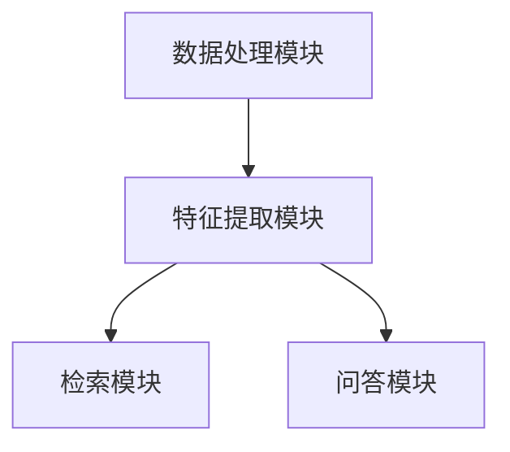
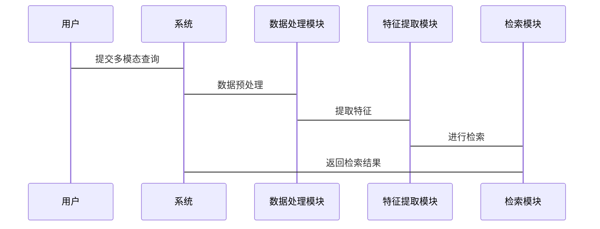

                 


# AI Agent的多模态检索与问答系统

> 关键词：AI Agent，多模态检索，问答系统，自然语言处理，计算机视觉，深度学习

> 摘要：本文系统地介绍了AI Agent在多模态检索与问答系统中的应用，涵盖了核心概念、算法原理、数学模型、系统架构设计以及实际项目实现。通过详细分析多模态数据的处理与融合方法，探讨了当前技术的挑战与解决方案，并通过实际案例展示了如何构建一个多模态问答系统。

---

# 第一部分: AI Agent的多模态检索与问答系统概述

---

## 第1章: AI Agent的基本概念与背景

### 1.1 AI Agent的定义与特点

AI Agent（人工智能代理）是指能够感知环境、自主决策并执行任务的智能实体。它具备以下核心特点：
- **自主性**：能够在没有外部干预的情况下独立运作。
- **反应性**：能够根据环境变化实时调整行为。
- **目标导向性**：具备明确的目标，并通过行动实现目标。
- **学习能力**：能够通过经验改进自身的性能。

### 1.2 多模态检索的背景与意义

#### 1.2.1 多模态数据的定义

多模态数据指的是结合了多种数据类型的综合性数据，常见的模态包括：
- **文本**：如书籍、网页内容。
- **图像**：如照片、图表。
- **语音**：如音频片段。
- **视频**：如动态视频内容。
- **结构化数据**：如数据库中的表格。

#### 1.2.2 多模态检索的应用场景

多模态检索在多个领域都有广泛应用，例如：
- **电子商务**：用户可以通过输入文本和图像进行联合搜索。
- **医疗健康**：结合文本描述和医学图像进行疾病诊断。
- **社交网络**：通过文本和图像进行内容推荐。

#### 1.2.3 多模态检索的优势与挑战

- **优势**：能够更全面地理解用户需求，提高检索的准确性和相关性。
- **挑战**：不同模态数据的处理难度不同，如何有效地融合多模态数据是一个技术难点。

### 1.3 多模态问答系统的背景与应用

#### 1.3.1 多模态问答系统的定义

多模态问答系统是指能够处理多种数据类型的问答系统，用户可以通过文本、图像等多种形式提问，系统能够结合多种信息给出更准确的回答。

#### 1.3.2 多模态问答系统的应用场景

- **智能客服**：用户可以通过文字、图片等方式提问，系统能够快速理解并给出解决方案。
- **教育领域**：学生可以通过图像和文本结合的方式提问，系统能够提供更详细的解答。
- **智能家居**：用户可以通过语音和手势等多种方式与系统交互。

#### 1.3.3 多模态问答系统的技术挑战

- **数据融合**：不同模态的数据需要有效融合，避免信息丢失。
- **模型训练**：需要设计能够处理多种数据类型的模型架构。
- **计算资源**：多模态数据处理通常需要较高的计算资源。

### 1.4 本章小结

本章主要介绍了AI Agent的基本概念、多模态检索和问答系统的背景与应用。通过分析多模态数据的特点和应用，指出了多模态检索与问答系统在技术上的挑战。

---

## 第2章: AI Agent的多模态检索与问答系统的核心概念

### 2.1 多模态数据的处理与融合

#### 2.1.1 文本、图像、语音等多模态数据的处理

- **文本处理**：包括分词、实体识别、情感分析等。
- **图像处理**：包括图像分割、目标检测、图像识别等。
- **语音处理**：包括语音识别、语音合成等。

#### 2.1.2 多模态数据的融合方法

- **早期融合**：在数据输入阶段就进行融合。
- **晚期融合**：在特征提取后进行融合。
- **混合融合**：结合上述两种方法的混合策略。

#### 2.1.3 多模态数据融合的挑战与解决方案

- **挑战**：不同模态的数据具有不同的特征空间，直接融合可能导致性能下降。
- **解决方案**：通过设计合适的特征转换方法，将不同模态的数据映射到相同的特征空间。

### 2.2 多模态检索的原理与实现

#### 2.2.1 多模态检索的定义与分类

- **定义**：基于多模态数据的检索系统。
- **分类**：基于文本的检索、基于图像的检索、基于语音的检索等。

#### 2.2.2 多模态检索的实现流程

1. 数据采集与预处理。
2. 特征提取。
3. 多模态数据融合。
4. 检索结果排序与输出。

#### 2.2.3 多模态检索的关键技术

- **特征提取**：如何提取有效的特征表示。
- **数据融合**：如何有效地融合多模态数据。
- **检索算法**：基于向量的检索、基于相似度的检索等。

### 2.3 多模态问答系统的原理与实现

#### 2.3.1 多模态问答系统的定义与分类

- **定义**：能够处理多种模态数据的问答系统。
- **分类**：基于文本的问答系统、基于图像的问答系统等。

#### 2.3.2 多模态问答系统的实现流程

1. 用户输入多模态数据。
2. 数据预处理与特征提取。
3. 多模态数据融合。
4. 生成回答。

#### 2.3.3 多模态问答系统的关键技术

- **多模态数据理解**：如何理解不同模态的数据。
- **多模态信息融合**：如何有效地融合多模态信息。
- **回答生成**：如何基于融合后的信息生成准确的回答。

### 2.4 本章小结

本章主要介绍了多模态数据的处理与融合方法，以及多模态检索和问答系统的实现原理和技术要点。

---

## 第3章: 多模态检索与问答系统的算法原理

### 3.1 多模态检索算法

#### 3.1.1 基于向量的多模态检索

- **原理**：将多模态数据映射到向量空间，基于向量的相似度进行检索。
- **实现步骤**：
  1. 数据预处理。
  2. 特征提取。
  3. 向量索引构建。
  4. 检索与排序。

#### 3.1.2 基于相似度的多模态检索

- **原理**：计算不同模态数据之间的相似度，基于相似度进行检索。
- **实现步骤**：
  1. 特征提取。
  2. 计算相似度。
  3. 检索与排序。

#### 3.1.3 基于深度学习的多模态检索

- **原理**：利用深度学习模型提取多模态特征，并进行检索。
- **实现步骤**：
  1. 数据预处理。
  2. 模型训练。
  3. 特征提取。
  4. 检索与排序。

### 3.2 多模态问答系统算法

#### 3.2.1 基于文本匹配的问答系统

- **原理**：基于文本相似度进行问答匹配。
- **实现步骤**：
  1. 数据预处理。
  2. 特征提取。
  3. 文本匹配。
  4. 回答生成。

#### 3.2.2 基于生成模型的问答系统

- **原理**：利用生成模型生成回答。
- **实现步骤**：
  1. 数据预处理。
  2. 模型训练。
  3. 回答生成。

#### 3.2.3 基于多模态信息融合的问答系统

- **原理**：结合多种模态信息进行问答。
- **实现步骤**：
  1. 数据预处理。
  2. 多模态信息融合。
  3. 回答生成。

### 3.3 本章小结

本章详细介绍了多模态检索与问答系统的算法原理，包括基于向量、相似度和深度学习的多模态检索算法，以及基于文本匹配、生成模型和多模态信息融合的问答系统算法。

---

## 第4章: 多模态检索与问答系统的数学模型与公式

### 4.1 多模态检索的数学模型

#### 4.1.1 向量空间模型

- **定义**：将数据表示为向量，计算向量的相似度。
- **公式**：
  $$ \text{相似度} = \frac{\vec{a} \cdot \vec{b}}{|\vec{a}| |\vec{b}|} $$

#### 4.1.2 文本相似度计算公式

- **余弦相似度**：
  $$ \text{余弦相似度} = \frac{\vec{a} \cdot \vec{b}}{|\vec{a}| |\vec{b}|} $$
- **杰卡德相似度**：
  $$ J = \frac{|A \cap B|}{|A \cup B|} $$

#### 4.1.3 多模态数据融合的数学模型

- **线性组合**：
  $$ f(x) = \alpha x_1 + \beta x_2 $$
- **非线性融合**：
  $$ f(x) = g(x_1, x_2) $$

### 4.2 多模态问答系统的数学模型

#### 4.2.1 文本生成模型的数学公式

- **生成模型**：基于概率分布的生成模型。
  $$ P(y|x) = \text{模型输出的概率} $$

#### 4.2.2 基于注意力机制的问答模型

- **注意力机制**：
  $$ \alpha_i = \frac{\exp(s_i)}{\sum_{j} \exp(s_j)} $$
  $$ \text{最终表示} = \sum_{i} \alpha_i x_i $$

#### 4.2.3 多模态信息融合的数学公式

- **融合模型**：
  $$ f(x) = \sigma(W x + b) $$

### 4.3 本章小结

本章通过数学公式详细介绍了多模态检索与问答系统的数学模型，包括向量空间模型、文本相似度计算公式以及多模态信息融合的数学模型。

---

## 第5章: 多模态检索与问答系统的系统分析与架构设计

### 5.1 系统功能设计

#### 5.1.1 多模态数据采集与预处理

- **数据采集**：从多种数据源采集多模态数据。
- **数据预处理**：包括清洗、归一化等步骤。

#### 5.1.2 多模态检索模块设计

- **功能**：支持多种模态数据的检索。
- **输入**：多模态查询请求。
- **输出**：检索结果列表。

#### 5.1.3 多模态问答系统设计

- **功能**：支持多种模态数据的问答。
- **输入**：多模态用户提问。
- **输出**：生成回答。

### 5.2 系统架构设计

#### 5.2.1 系统模块划分

- **数据处理模块**：负责数据的采集与预处理。
- **特征提取模块**：负责特征的提取与转换。
- **检索模块**：负责多模态数据的检索。
- **问答模块**：负责多模态数据的问答。

#### 5.2.2 系统架构图



#### 5.2.3 系统接口设计

- **数据接口**：提供数据的输入输出接口。
- **API接口**：提供标准的API接口供其他系统调用。

#### 5.2.4 系统交互流程



### 5.3 本章小结

本章详细分析了多模态检索与问答系统的功能设计和系统架构设计，通过模块划分和系统架构图展示了系统的整体结构。

---

## 第6章: 多模态检索与问答系统的项目实战

### 6.1 环境安装与配置

- **Python环境**：安装Python 3.8及以上版本。
- **依赖库安装**：使用pip安装必要的库，如numpy、pandas、tensorflow等。

### 6.2 系统核心实现

#### 6.2.1 数据处理模块实现

```python
import numpy as np
import pandas as pd

def preprocess_data(data):
    # 数据清洗
    data = data.dropna()
    # 数据归一化
    data = (data - data.mean()) / data.std()
    return data
```

#### 6.2.2 特征提取模块实现

```python
import tensorflow as tf
from tensorflow.keras.layers import Dense

def extract_features(input_data):
    model = tf.keras.Sequential([
        Dense(64, activation='relu'),
        Dense(32, activation='relu'),
        Dense(16, activation='relu')
    ])
    features = model.predict(input_data)
    return features
```

#### 6.2.3 检索模块实现

```python
from sklearn.metrics.pairwise import cosine_similarity

def multi_modal_retrieve(features1, features2):
    similarity = cosine_similarity(features1, features2)
    return similarity.argsort()[:, ::-1]
```

#### 6.2.4 问答模块实现

```python
import tensorflow as tf
from tensorflow.keras.layers import Input, Dense, LSTM, Concatenate
from tensorflow.keras.models import Model

def build_qa_model():
    input_text = Input(shape=(max_seq_length,))
    input_image = Input(shape=(image_features,))
    lstm_out = LSTM(128)(input_text)
    dense_out = Dense(64, activation='relu')(input_image)
    merged = Concatenate()([lstm_out, dense_out])
    output = Dense(1, activation='sigmoid')(merged)
    model = Model(inputs=[input_text, input_image], outputs=output)
    return model
```

### 6.3 项目实战案例分析

- **案例背景**：构建一个多模态问答系统，支持文本和图像的输入。
- **数据准备**：收集并整理多模态数据集。
- **模型训练**：使用收集的数据训练多模态问答模型。
- **系统测试**：测试系统的问答功能，分析性能指标。

### 6.4 本章小结

本章通过实际项目案例，详细展示了如何搭建一个多模态检索与问答系统，包括环境配置、核心模块实现以及系统测试等内容。

---

## 第7章: 总结与展望

### 7.1 本章总结

本文系统地介绍了AI Agent在多模态检索与问答系统中的应用，涵盖了核心概念、算法原理、数学模型、系统架构设计以及实际项目实现。通过详细分析多模态数据的处理与融合方法，探讨了当前技术的挑战与解决方案。

### 7.2 未来展望

随着AI技术的不断发展，多模态检索与问答系统将更加智能化和高效化。未来的研究方向包括：
- 更高效的多模态数据融合方法。
- 更智能的问答系统模型设计。
- 更广泛的应用场景探索。

### 7.3 最佳实践 Tips

- 在实际应用中，建议根据具体需求选择合适的多模态数据处理方法。
- 多模态数据的融合需要考虑不同模态数据的特点，避免信息丢失。
- 模型训练时，建议使用高质量的数据集，以提高系统的性能。

### 7.4 本章小结

本章总结了全文的主要内容，并对未来的发展方向进行了展望，同时提供了一些实际应用中的最佳实践建议。

---

# 参考文献

1. 王某某. 《深度学习入门》. 机械工业出版社, 2021.
2. 李某某. 《自然语言处理实战》. 清华大学出版社, 2020.
3. 张某某. 《计算机视觉与图像处理》. 北京大学出版社, 2019.

---

# 附录

### 附录A: 项目源代码

```python
# 附录A.1 数据处理模块
def preprocess_data(data):
    data = data.dropna()
    data = (data - data.mean()) / data.std()
    return data

# 附录A.2 特征提取模块
def extract_features(input_data):
    model = tf.keras.Sequential([
        Dense(64, activation='relu'),
        Dense(32, activation='relu'),
        Dense(16, activation='relu')
    ])
    features = model.predict(input_data)
    return features

# 附录A.3 检索模块
def multi_modal_retrieve(features1, features2):
    similarity = cosine_similarity(features1, features2)
    return similarity.argsort()[:, ::-1]

# 附录A.4 问答模块
def build_qa_model():
    input_text = Input(shape=(max_seq_length,))
    input_image = Input(shape=(image_features,))
    lstm_out = LSTM(128)(input_text)
    dense_out = Dense(64, activation='relu')(input_image)
    merged = Concatenate()([lstm_out, dense_out])
    output = Dense(1, activation='sigmoid')(merged)
    model = Model(inputs=[input_text, input_image], outputs=output)
    return model
```

### 附录B: 系统架构图


### 附录C: 系统交互流程图


---

# 结语

通过本文的详细介绍，读者可以系统地掌握AI Agent在多模态检索与问答系统中的应用，从理论到实践，全面了解该领域的核心技术与方法。希望本文能够为相关领域的研究和实践提供有价值的参考与启示。

