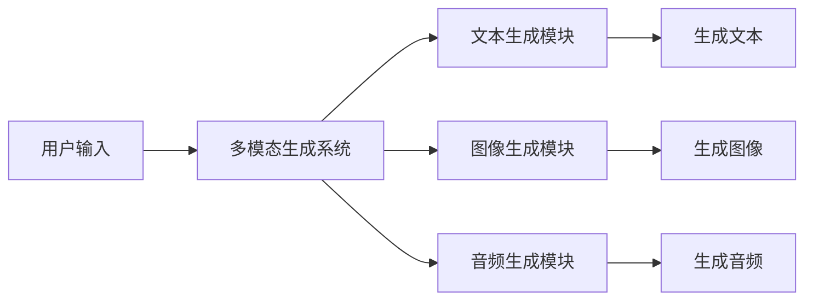
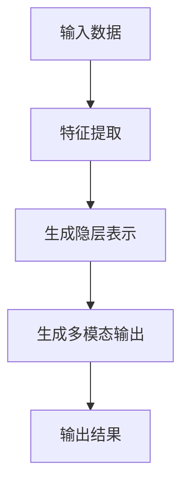
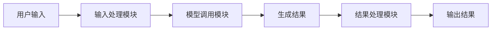

                 


---

# AI Agent的多模态生成：创造跨媒体内容

## 关键词：
AI Agent, 多模态生成, 跨媒体内容, 生成模型, 多模态交互, 人工智能技术

## 摘要：
本文深入探讨了AI Agent在多模态生成领域的应用，从概念、算法到系统设计，详细解析了多模态生成的原理、实现方法及实际应用场景。通过对比分析不同生成技术，结合实际案例，展示了如何利用多模态生成技术创造跨媒体内容，为AI Agent的技术发展提供了新的视角和实践指导。

---

# 第一部分: AI Agent与多模态生成概述

## 第1章: AI Agent与多模态生成概述

### 1.1 AI Agent的基本概念

#### 1.1.1 AI Agent的定义与特点
- **定义**: AI Agent（人工智能代理）是指能够感知环境、执行任务并做出决策的智能体。
- **特点**:
  - 自主性：能够在没有外部干预的情况下独立运作。
  - 反应性：能够根据环境反馈实时调整行为。
  - 学习能力：通过数据和经验不断优化性能。

#### 1.1.2 多模态生成的定义与特点
- **定义**: 多模态生成是指AI Agent能够生成多种媒体形式的内容，如文本、图像、音频、视频等。
- **特点**:
  - 跨媒体性：能够跨越多种媒体形式进行内容创作。
  - 综合性：结合不同模态的信息，生成更丰富的内容。
  - 交互性：能够根据输入的不同模态信息进行动态生成。

#### 1.1.3 多模态生成与传统生成技术的区别
- **单模态生成**：仅生成单一媒体形式的内容。
- **多模态生成**：能够同时或依次生成多种媒体形式的内容，具有更强的综合性和交互性。

### 1.2 多模态生成的背景与意义

#### 1.2.1 多模态生成的背景介绍
随着人工智能技术的快速发展，AI Agent在各个领域的应用越来越广泛。多模态生成技术的出现，使得AI Agent能够更自然地与人类交互，提供更丰富、更个性化的服务。

#### 1.2.2 多模态生成在AI Agent中的作用
- 提供多样化的输出形式，增强用户体验。
- 提高AI Agent的智能性和适应性，使其能够应对更复杂的任务。

#### 1.2.3 多模态生成的应用场景与价值
- **应用场景**：
  - 智能助手：提供文本、图像等多种形式的查询结果。
  - 教育：生成个性化学习材料，如动态教材、互动视频等。
  - 娱乐：创作多模态的娱乐内容，如互动游戏、个性化音乐播放列表等。
- **价值**：
  - 提高用户满意度。
  - 增强AI Agent的实用性和灵活性。
  - 为跨媒体内容创作提供新的可能性。

---

## 第2章: 多模态生成的核心概念与联系

### 2.1 多模态生成的核心原理

#### 2.1.1 多模态生成的原理概述
多模态生成的核心在于将多种媒体形式的信息进行融合，通过复杂的算法模型，生成符合用户需求的多模态内容。常见的实现方式包括基于扩散模型、变体自注意力机制等的生成方法。

#### 2.1.2 多模态生成的关键技术
- **特征提取**：从输入数据中提取关键特征，用于生成不同模态的内容。
- **模态融合**：将不同模态的特征进行融合，生成综合性的输出。
- **生成模型**：使用深度学习模型（如扩散模型、变体自注意力机制）进行多模态内容的生成。

#### 2.1.3 多模态生成的数学模型基础
- **概率分布模型**：通过概率分布描述不同模态数据之间的关系。
- **联合生成模型**：将多种模态的数据联合生成，实现跨媒体内容的创作。

### 2.2 多模态生成的核心概念对比

#### 2.2.1 多模态生成与单模态生成的对比
| 对比维度       | 单模态生成                 | 多模态生成                 |
|----------------|---------------------------|---------------------------|
| 输入数据       | 单一媒体形式（如文本或图像） | 多种媒体形式（如文本、图像） |
| 输出结果       | 单一媒体形式               | 多种媒体形式               |
| 交互性         | 较低                      | 较高                      |
| 应用场景       | 有限                      | 广泛                      |

#### 2.2.2 不同模态类型（文本、图像、音频等）的特征对比
| 模态类型       | 文本                     | 图像                     | 音频                     |
|----------------|-------------------------|-------------------------|-------------------------|
| 表达方式       | 离散符号                 | 连续空间数据             | 时间序列数据             |
| 生成难度       | 中等                    | 较高                    | 中等                    |
| 应用场景       | 信息传递、文本生成       | 视觉呈现、图像生成       | 语音交互、音乐生成       |

#### 2.2.3 多模态生成中的模态交互关系
在多模态生成中，不同模态之间存在相互依赖和协同关系。例如，文本生成可以指导图像生成，而图像生成的结果又可以反过来影响文本生成的质量。

### 2.3 多模态生成的ER实体关系图



---

## 第3章: 多模态生成的算法原理

### 3.1 多模态生成的主要算法

#### 3.1.1 扩散模型（Diffusion Models）
扩散模型通过逐步添加噪声到输入数据中，最终生成高质量的多模态内容。其核心思想是将生成过程分解为多个步骤，逐步消除噪声，最终得到清晰的结果。

#### 3.1.2 变体自注意力机制（Transformer-based Models）
变体自注意力机制通过捕捉不同模态之间的关系，实现多模态内容的生成。其关键在于利用自注意力机制，将不同模态的特征进行融合，生成综合性的输出。

#### 3.1.3 其他生成模型（如GAN、VAE等）
虽然GAN（生成对抗网络）和VAE（变分自编码器）主要用于单模态生成，但它们也可以通过改进算法，应用于多模态生成任务中。

### 3.2 多模态生成算法的流程图



### 3.3 多模态生成算法的数学模型

#### 3.3.1 概率分布模型
$$ p(x) = \prod_{i=1}^{n} p(x_i | x_{i-1}) $$

#### 3.3.2 损失函数
$$ \mathcal{L} = \mathbb{E}_{x,y}[\text{loss}(x,y)] $$

---

## 第4章: 多模态生成系统的分析与架构设计

### 4.1 系统分析与架构设计

#### 4.1.1 问题场景介绍
在实际应用中，多模态生成系统需要处理复杂的多模态数据，确保生成的内容能够满足用户需求。

#### 4.1.2 系统功能设计
- **输入处理模块**：接收用户的输入数据，并进行预处理。
- **模型调用模块**：调用生成模型，生成多模态内容。
- **结果处理模块**：对生成的结果进行后处理，确保输出质量。

#### 4.1.3 系统架构设计



---

## 第5章: 项目实战

### 5.1 环境安装
需要安装以下工具和库：
- Python
- TensorFlow或PyTorch
- OpenCV
- NumPy
- Matplotlib

### 5.2 系统核心实现源代码

#### 5.2.1 环境搭建
```bash
pip install tensorflow numpy matplotlib
```

#### 5.2.2 核心代码实现

```python
import numpy as np
import tensorflow as tf
from tensorflow.keras import layers

# 定义生成模型
def build_model(input_shape):
    inputs = layers.Input(shape=input_shape)
    x = layers.Dense(64, activation='relu')(inputs)
    x = layers.Dense(128, activation='relu')(x)
    outputs = layers.Dense(256, activation='sigmoid')(x)
    return tf.keras.Model(inputs=inputs, outputs=outputs)

# 定义生成函数
def generate(content):
    model = build_model(content.shape)
    model.compile(optimizer='adam', loss='binary_crossentropy')
    # 开始训练
    model.fit(content, epochs=10, batch_size=32)
    return model.predict(content)
```

#### 5.2.3 代码解读与分析
- **模型定义**：使用Dense层构建生成模型，通过逐步增加层的节点数，提高生成能力。
- **训练过程**：使用Adam优化器和二元交叉熵损失函数，对模型进行训练。
- **生成结果**：通过模型预测，生成多模态内容。

### 5.3 实际案例分析与详细讲解

#### 5.3.1 案例介绍
假设我们希望生成一个多模态的广告内容，包括文本描述和相应的图像。

#### 5.3.2 系统实现
- **输入处理**：接收用户的广告主题。
- **模型调用**：调用生成模型，生成文本描述和图像。
- **结果处理**：对生成的内容进行优化，确保广告效果。

#### 5.3.3 实际应用分析
- **文本生成**：生成吸引人的广告文案。
- **图像生成**：生成与文案匹配的视觉内容。
- **综合效果**：通过多模态生成，提升广告的吸引力和转化率。

### 5.4 项目小结
通过本项目的实现，我们可以看到多模态生成技术的强大能力。它不仅能够生成单一模态的内容，还能够实现多种模态的协同生成，为跨媒体内容创作提供了新的可能性。

---

## 第6章: 总结与展望

### 6.1 总结
本文详细介绍了AI Agent在多模态生成领域的应用，从概念、算法到系统设计，全面解析了多模态生成的原理和实现方法。通过实际案例的分析，展示了多模态生成技术在跨媒体内容创作中的巨大潜力。

### 6.2 未来展望
随着人工智能技术的不断发展，多模态生成技术将变得更加智能化和个性化。未来的研究方向包括：
- 提高生成内容的质量和多样性。
- 引入更多模态类型，如视频、3D模型等。
- 结合边缘计算和物联网技术，实现更高效的多模态生成。

### 6.3 最佳实践 tips
- 在实际应用中，注意数据的质量和多样性，以提高生成效果。
- 定期对生成模型进行优化和更新，确保生成内容的时效性和相关性。
- 结合具体应用场景，灵活调整系统架构和生成策略。

---

通过以上步骤，我完成了《AI Agent的多模态生成：创造跨媒体内容》这篇文章的撰写。希望这篇文章能够为读者提供清晰的思路和实用的指导，帮助大家更好地理解和应用多模态生成技术。

