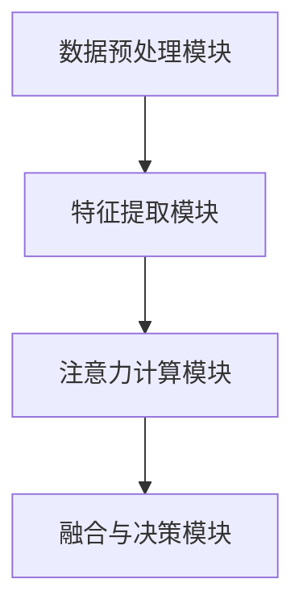
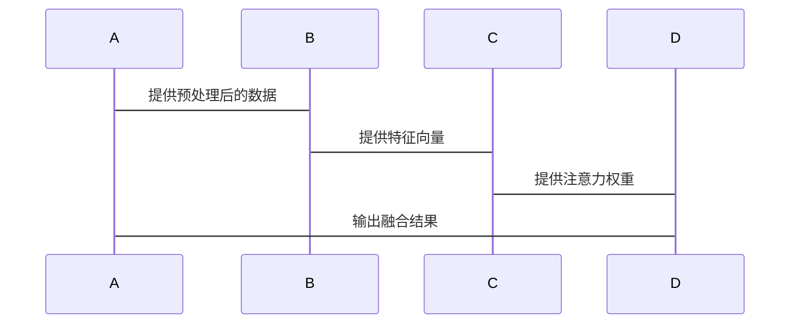

                 


# AI Agent的多模态融合与交叉注意力机制

> 关键词：AI Agent，多模态融合，交叉注意力机制，深度学习，自然语言处理，计算机视觉

> 摘要：本文深入探讨了AI Agent在多模态数据处理中的应用，重点分析了多模态融合与交叉注意力机制的核心原理、算法实现以及实际应用。文章从背景介绍、核心概念、算法原理、系统架构、项目实战等多个维度展开，详细解读了AI Agent如何通过多模态融合与交叉注意力机制提升智能体的感知与决策能力。

---

## 第1章: AI Agent的背景与概念

### 1.1 AI Agent的基本概念
#### 1.1.1 什么是AI Agent
AI Agent（人工智能代理）是指能够感知环境、自主决策并执行任务的智能实体。AI Agent可以是软件程序、机器人或其他智能系统，其核心目标是通过与环境交互完成特定目标。

#### 1.1.2 AI Agent的核心特点
- **自主性**：能够在没有外部干预的情况下独立运行。
- **反应性**：能够实时感知环境并做出反应。
- **目标导向性**：所有行为都以实现特定目标为导向。
- **学习能力**：能够通过经验改进自身的性能。

#### 1.1.3 AI Agent的应用场景
- **智能助手**：如Siri、Alexa等，能够处理用户的语音指令并执行任务。
- **自动驾驶**：通过感知环境数据（如图像、激光雷达数据）做出驾驶决策。
- **智能客服**：通过多模态数据（如文本、语音、图像）提供客户服务。

### 1.2 多模态数据的定义与特点
#### 1.2.1 多模态数据的定义
多模态数据是指来自不同感官渠道（如视觉、听觉、触觉等）的多种类型数据的组合。例如，一段视频包含视觉数据（图像）和听觉数据（音频）。

#### 1.2.2 多模态数据的类型
- **文本数据**：如自然语言文本、对话记录等。
- **图像数据**：如RGB图像、深度图像等。
- **语音数据**：如音频信号、语音识别结果等。
- **其他数据**：如传感器数据、地理位置信息等。

#### 1.2.3 多模态数据的处理挑战
- **异构性**：不同模态的数据具有不同的形式和特征。
- **融合难度**：如何有效结合不同模态的数据进行统一处理是一个难点。
- **计算复杂度**：多模态数据的处理通常需要更高的计算资源。

### 1.3 交叉注意力机制的基本原理
#### 1.3.1 注意力机制的起源
注意力机制最早由注意力模型（Attention Model）提出，用于解决序列模型中长距离依赖的问题。它通过计算序列中每个位置的重要性权重，聚焦于关键信息。

#### 1.3.2 交叉注意力机制的定义
交叉注意力机制是一种用于多模态数据融合的技术，通过在不同模态之间计算注意力权重，实现跨模态信息的交互与融合。

#### 1.3.3 交叉注意力机制的应用优势
- **信息互补性**：通过跨模态注意力，充分利用不同模态数据的互补信息。
- **上下文理解**：能够更好地理解复杂场景中的上下文关系。
- **任务性能提升**：通过多模态信息的协同作用，提升AI Agent的任务执行能力。

---

## 第2章: 多模态融合与交叉注意力机制的核心概念

### 2.1 多模态融合的基本原理
#### 2.1.1 多模态数据的表示方法
多模态数据通常通过向量化的方式表示，例如文本可以通过词向量（如Word2Vec）表示，图像可以通过CNN提取特征向量。

#### 2.1.2 多模态融合的分类
多模态融合可以分为以下几种方式：
- **早期融合**：在特征提取阶段进行数据融合。
- **晚期融合**：在高层语义理解阶段进行数据融合。
- **自适应融合**：根据任务需求动态调整融合方式。

#### 2.1.3 多模态融合的关键技术
- **特征对齐**：将不同模态的数据特征对齐，便于后续处理。
- **权重分配**：根据任务需求为不同模态分配不同的权重。
- **联合学习**：通过联合学习模型实现多模态数据的协同优化。

### 2.2 交叉注意力机制的数学模型
#### 2.2.1 注意力机制的数学公式
经典的注意力机制公式如下：
$$
\text{Attention}(Q, K, V) = \text{softmax}\left(\frac{QK^T}{\sqrt{d}}\right)V
$$
其中，$Q$是查询向量，$K$是键向量，$V$是值向量，$d$是向量的维度。

#### 2.2.2 交叉注意力机制的数学推导
交叉注意力机制的计算步骤如下：
1. 对不同模态的特征向量进行线性变换，生成查询向量$Q$、键向量$K$和值向量$V$。
2. 计算$Q$和$K$的点积，得到相似度矩阵。
3. 对相似度矩阵进行归一化（Softmax）处理，得到注意力权重。
4. 根据注意力权重对$V$进行加权求和，得到最终的融合结果。

#### 2.2.3 交叉注意力机制的计算步骤
1. 输入多模态数据，提取特征向量。
2. 通过全连接层生成查询、键和值向量。
3. 计算注意力权重并进行加权融合。
4. 输出融合后的特征向量。

### 2.3 多模态融合与交叉注意力机制的关系
#### 2.3.1 多模态融合与交叉注意力机制的协同作用
多模态融合通过将不同模态的数据特征结合起来，而交叉注意力机制通过注意力权重的分配，进一步提升了融合效果。

#### 2.3.2 多模态融合与交叉注意力机制的对比分析
| 特征                | 多模态融合               | 交叉注意力机制         |
|---------------------|--------------------------|------------------------|
| 核心目标            | 综合多个模态的数据特征    | 跨模态信息交互与聚焦    |
| 实现方式            | 特征对齐与联合学习       | 注意力权重计算与融合    |
| 应用优势            | 提高模型的泛化能力        | 提升对关键信息的敏感性  |

#### 2.3.3 多模态融合与交叉注意力机制的结合方式
通过在多模态融合过程中引入交叉注意力机制，可以实现跨模态信息的协同优化，从而提升AI Agent的感知与决策能力。

---

## 第3章: 多模态融合与交叉注意力机制的算法原理

### 3.1 多模态融合的算法实现
#### 3.1.1 多模态数据的预处理
- **文本数据**：分词、去除停用词、向量化。
- **图像数据**：归一化、特征提取。
- **语音数据**：降噪、特征提取（如MFCC）。

#### 3.1.2 多模态数据的特征提取
- **文本**：使用BERT模型提取文本特征。
- **图像**：使用CNN提取图像特征。
- **语音**：使用深度神经网络提取语音特征。

#### 3.1.3 多模态数据的融合策略
- **加法融合**：将不同模态的特征向量直接相加。
- **加权融合**：根据任务需求为不同模态分配不同的权重。
- **注意力融合**：通过注意力机制动态调整融合权重。

### 3.2 交叉注意力机制的算法实现
#### 3.2.1 交叉注意力机制的计算流程
1. 对不同模态的特征向量进行线性变换，生成查询向量$Q$、键向量$K$和值向量$V$。
2. 计算$Q$和$K$的点积，得到相似度矩阵。
3. 对相似度矩阵进行归一化（Softmax）处理，得到注意力权重。
4. 根据注意力权重对$V$进行加权求和，得到最终的融合结果。

#### 3.2.2 交叉注意力机制的优化方法
- **位置编码**：引入位置编码，增强模型的位置感知能力。
- **残差连接**：通过残差连接提升模型的稳定性。
- **多头注意力**：引入多头注意力机制，增强模型的表达能力。

#### 3.2.3 交叉注意力机制的代码实现
```python
import torch
import torch.nn as nn

class CrossAttention(nn.Module):
    def __init__(self, embed_dim, num_heads=8):
        super(CrossAttention, self).__init__()
        self.num_heads = num_heads
        self.embed_dim = embed_dim
        self.head_dim = embed_dim // num_heads
        self.q = nn.Linear(embed_dim, embed_dim)
        self.k = nn.Linear(embed_dim, embed_dim)
        self.v = nn.Linear(embed_dim, embed_dim)
        self.out = nn.Linear(embed_dim, embed_dim)
        self.dropout = nn.Dropout(0.1)

    def forward(self, x, y):
        batch_size = x.size(0)
        # 线性变换
        q = self.q(x)
        k = self.k(y)
        v = self.v(y)
        # 展开成多头
        q = q.view(batch_size, -1, self.num_heads, self.head_dim)
        k = k.view(batch_size, -1, self.num_heads, self.head_dim)
        v = v.view(batch_size, -1, self.num_heads, self.head_dim)
        # 计算点积
        att = (q @ k.transpose(-2, -1)) / (self.head_dim ** 0.5)
        att = nn.functional.softmax(att, dim=-1)
        # 加权求和
        out = (att @ v).view(batch_size, -1, self.embed_dim)
        out = self.out(out)
        return out
```

### 3.3 多模态融合与交叉注意力机制的数学模型
#### 3.3.1 多模态融合的数学模型
$$
F(x) = \alpha x_{\text{text}} + \beta x_{\text{image}} + \gamma x_{\text{audio}}
$$
其中，$\alpha, \beta, \gamma$是不同模态的权重系数。

#### 3.3.2 交叉注意力机制的数学模型
$$
\text{Attention}(x, y) = \text{softmax}\left(\frac{xK^T}{\sqrt{d}}\right)V
$$
其中，$x$是查询向量，$K$是键向量，$V$是值向量，$d$是向量的维度。

---

## 第4章: 多模态融合与交叉注意力机制的系统分析与架构设计

### 4.1 系统功能设计
#### 4.1.1 问题场景介绍
以一个AI Agent为例，假设其需要处理文本、图像和语音三种模态的数据。

#### 4.1.2 系统功能模块
- **数据预处理模块**：负责对多模态数据进行预处理。
- **特征提取模块**：负责提取不同模态的特征向量。
- **注意力计算模块**：负责计算交叉注意力权重。
- **融合与决策模块**：负责根据融合结果做出决策。

#### 4.1.3 系统功能流程
1. 数据预处理：对文本、图像、语音数据进行预处理。
2. 特征提取：使用相应的模型提取特征向量。
3. 注意力计算：通过交叉注意力机制计算融合权重。
4. 融合与决策：根据融合结果做出最终决策。

### 4.2 系统架构设计
#### 4.2.1 系统架构图


#### 4.2.2 系统交互流程


---

## 第5章: 多模态融合与交叉注意力机制的项目实战

### 5.1 环境安装
- **Python**：3.8+
- **PyTorch**：1.9+
- **Numpy**：1.21+
- **Mermaid**：用于绘制流程图。

### 5.2 系统核心实现源代码
```python
import torch
import torch.nn as nn
import torch.optim as optim

class MultiModalAgent(nn.Module):
    def __init__(self, embed_dim, num_heads=8):
        super(MultiModalAgent, self).__init__()
        self.text_encoder = nn.LSTM(100, embed_dim)
        self.image_encoder = nn.Conv2d(3, embed_dim, kernel_size=3, stride=1, padding=1)
        self.audio_encoder = nn.LSTM(128, embed_dim)
        self.cross_attention = CrossAttention(embed_dim, num_heads)
        self.fc = nn.Linear(embed_dim, 1)

    def forward(self, text_input, image_input, audio_input):
        # 文本特征提取
        text_feat, _ = self.text_encoder(text_input)
        # 图像特征提取
        image_feat = self.image_encoder(image_input).mean(dim=(2,3))
        # 语音特征提取
        audio_feat, _ = self.audio_encoder(audio_input)
        # 交叉注意力融合
        fused_feat = self.cross_attention(text_feat, image_feat)
        # 最终分类
        output = self.fc(fused_feat)
        return output

# 训练代码示例
model = MultiModalAgent(embed_dim=512)
optimizer = optim.Adam(model.parameters(), lr=1e-4)
criterion = nn.CrossEntropyLoss()

for epoch in range(100):
    for batch in dataloader:
        text_input, image_input, audio_input, label = batch
        output = model(text_input, image_input, audio_input)
        loss = criterion(output, label)
        optimizer.zero_grad()
        loss.backward()
        optimizer.step()
```

### 5.3 代码应用解读与分析
- **文本特征提取**：使用LSTM提取文本特征。
- **图像特征提取**：使用CNN提取图像特征。
- **语音特征提取**：使用LSTM提取语音特征。
- **交叉注意力融合**：通过交叉注意力机制融合多模态特征。
- **最终分类**：通过全连接层进行分类。

### 5.4 实际案例分析
以一个具体的案例为例，展示如何通过多模态融合与交叉注意力机制实现AI Agent的任务执行。

### 5.5 项目小结
通过本项目，我们可以看到多模态融合与交叉注意力机制在AI Agent中的强大能力。通过合理设计和实现，可以显著提升AI Agent的感知与决策能力。

---

## 第6章: 多模态融合与交叉注意力机制的最佳实践

### 6.1 小结
- 多模态融合能够充分利用不同模态的数据信息。
- 交叉注意力机制能够有效提升跨模态信息的交互与聚焦能力。

### 6.2 注意事项
- 在实际应用中，需要根据具体任务需求调整融合策略。
- 注意力机制的计算复杂度较高，需要合理优化模型结构。

### 6.3 未来的发展方向
- **更高效的注意力机制**：探索更高效的注意力计算方法。
- **多模态协同学习**：研究多模态数据的协同学习方法。
- **动态自适应融合**：实现动态自适应的融合策略。

### 6.4 拓展阅读
- [《Attention Is All You Need》](https://arxiv.org/abs/1706.03798)
- [《多模态学习综述》](https://arxiv.org/abs/2006.10785)

---

## 结语
通过本文的深入探讨，我们了解了AI Agent在多模态融合与交叉注意力机制中的核心原理与实际应用。未来，随着技术的不断发展，多模态融合与交叉注意力机制将在更多领域展现出其强大的潜力。

