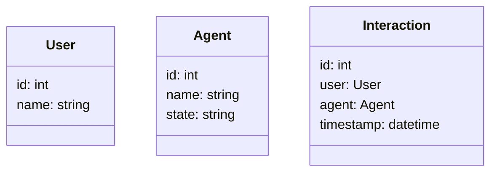
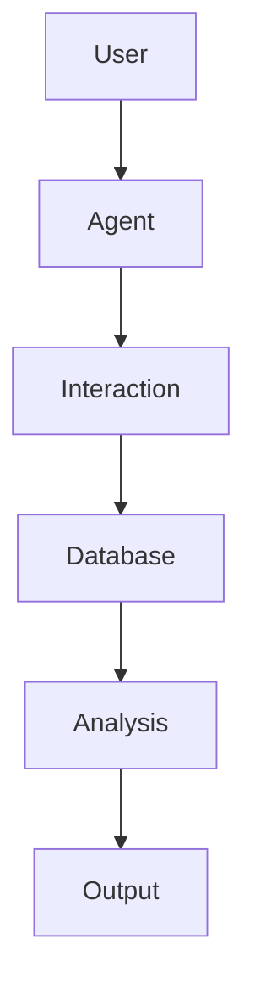
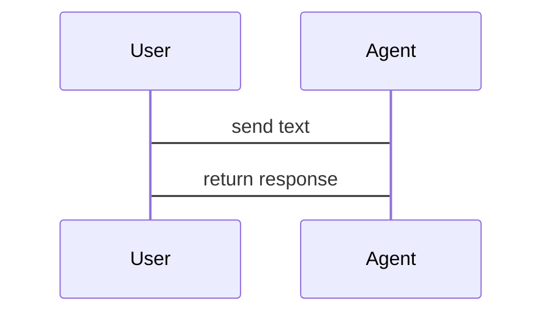

                 


```markdown
# AI Agent的多模态融合在情感计算中的应用

> 关键词：AI Agent, 多模态融合, 情感计算, 情感分析, 机器学习

> 摘要：本文探讨了AI Agent在情感计算中的多模态融合应用，分析了多模态数据处理、情感计算方法以及AI代理在不同场景中的应用。通过详细讲解核心概念、算法原理、系统架构和项目实战，为读者提供全面的理论和实践指导。

---

## 第1章：背景介绍

### 1.1 问题背景
#### 1.1.1 多模态数据的兴起
在人工智能领域，多模态数据的处理越来越重要。传统的单一模态分析难以满足复杂场景的需求，因此，如何有效地融合多模态数据成为一个关键问题。

#### 1.1.2 情感计算的定义与目标
情感计算是指对人类情感进行识别、理解和模拟的过程。其目标是通过计算机技术来实现人类情感的智能化处理。

#### 1.1.3 AI Agent在情感计算中的作用
AI Agent作为智能体，能够感知环境并做出相应的反应。在情感计算中，AI Agent可以通过多模态数据融合，提升情感识别的准确性和鲁棒性。

### 1.2 问题描述
#### 1.2.1 多模态数据处理的挑战
多模态数据来自不同的模态（如文本、语音、图像等），如何有效地整合这些数据是一个技术难题。

#### 1.2.2 情感计算在实际场景中的应用需求
在实际应用中，情感计算可以帮助实现更自然的人机交互，提升用户体验。

#### 1.2.3 AI Agent在情感计算中的应用边界
AI Agent在情感计算中的应用需要考虑数据隐私、计算资源和应用场景的限制。

### 1.3 问题解决
#### 1.3.1 多模态融合的核心思想
通过整合多种模态的信息，提升情感计算的准确性和全面性。

#### 1.3.2 情感计算的技术实现路径
采用机器学习和深度学习方法，构建多模态情感计算模型。

#### 1.3.3 AI Agent在情感计算中的解决方案
设计高效的多模态数据处理算法，并将其集成到AI Agent中，实现智能化的情感计算。

### 1.4 边界与外延
#### 1.4.1 多模态融合的适用范围
适用于需要多源信息融合的场景，如智能客服、虚拟助手等。

#### 1.4.2 情感计算的局限性
情感计算目前主要基于数据驱动，难以理解复杂的情感语境。

#### 1.4.3 AI Agent在情感计算中的应用边界
受限于数据质量和计算能力，AI Agent在复杂情感场景中的应用仍需进一步研究。

### 1.5 核心概念与组成
#### 1.5.1 多模态数据的定义与特征
多模态数据是指来自多种模态的数据，具有异构性和互补性的特点。

#### 1.5.2 情感计算的核心要素
包括情感识别、情感理解和情感模拟三个核心要素。

#### 1.5.3 AI Agent在情感计算中的角色
AI Agent作为执行者，负责感知、分析和响应情感信息。

---

## 第2章：核心概念与联系

### 2.1 多模态融合的原理
#### 2.1.1 多模态数据的整合方法
采用加权融合、特征融合等方法，整合多模态数据以提升计算效果。

#### 2.1.2 多模态融合的数学模型
通过构建多模态融合模型，将不同模态的数据进行有效整合。

#### 2.1.3 多模态融合的优缺点对比
优点包括提升准确性和鲁棒性，缺点包括计算复杂性和数据异构性。

### 2.2 情感计算的原理
#### 2.2.1 情感计算的基本流程
包括数据采集、特征提取、情感识别和情感分析四个步骤。

#### 2.2.2 情感计算的关键技术
涉及自然语言处理、语音识别和计算机视觉等技术。

#### 2.2.3 情感计算的评价指标
常用准确率、召回率和F1值作为评价指标。

### 2.3 AI Agent在情感计算中的应用
#### 2.3.1 AI Agent的基本功能
包括感知环境、分析情感和做出响应。

#### 2.3.2 AI Agent在情感计算中的角色
作为智能体，AI Agent能够实时感知用户情感，并做出相应的交互响应。

#### 2.3.3 AI Agent与多模态融合的结合
通过多模态数据融合，AI Agent能够更准确地理解用户情感，提升交互体验。

---

## 第3章：算法原理讲解

### 3.1 多模态融合算法
#### 3.1.1 多模态融合的分类
包括加性融合、乘性融合和混合融合三种类型。

#### 3.1.2 多模态融合的实现步骤
1. 数据预处理：对多模态数据进行清洗和标准化。
2. 特征提取：提取各模态的特征向量。
3. 融合方法：采用加权融合等方法整合特征。
4. 模型训练：训练融合模型以优化情感计算效果。

#### 3.1.3 多模态融合的Python代码实现
```python
import numpy as np

def multi_modal_fusion(text_score, audio_score, visual_score, weights):
    fused_score = weights[0] * text_score + weights[1] * audio_score + weights[2] * visual_score
    return fused_score

# 示例数据
text_score = 0.8
audio_score = 0.6
visual_score = 0.7
weights = [0.5, 0.3, 0.2]

result = multi_modal_fusion(text_score, audio_score, visual_score, weights)
print("Fused Score:", result)
```

### 3.2 情感计算模型
#### 3.2.1 情感计算模型的构建
基于深度学习的模型，如LSTM和Transformer，用于情感特征提取和分类。

#### 3.2.2 情感计算模型的训练
使用标注数据进行监督学习，优化模型参数以提高准确率。

#### 3.2.3 情感计算模型的评价
通过交叉验证和性能指标评估模型的效果。

---

## 第4章：数学模型与公式推导

### 4.1 情感计算的概率模型
#### 4.1.1 情感概率计算公式
$$ P(positive) = \frac{\sum_{i=1}^{n} w_i x_i}{\sum_{i=1}^{n} w_i} $$
其中，\( w_i \) 是第i个特征的权重，\( x_i \) 是第i个特征的值。

### 4.2 多模态融合的加权模型
$$ F = \sum_{j=1}^{m} \lambda_j X_j $$
其中，\( \lambda_j \) 是第j个模态的权重，\( X_j \) 是第j个模态的特征向量。

---

## 第5章：系统分析与架构设计

### 5.1 项目场景介绍
设计一个智能客服系统，通过多模态融合提升情感计算的准确性。

### 5.2 系统功能设计
#### 5.2.1 领域模型（Mermaid类图）


#### 5.2.2 系统架构设计（Mermaid架构图）


### 5.3 系统接口设计
定义RESTful API接口，用于用户与AI Agent之间的交互。

### 5.4 系统交互流程（Mermaid序列图）


---

## 第6章：项目实战

### 6.1 环境安装
安装必要的库，如Python、TensorFlow、Keras等。

### 6.2 核心代码实现
实现多模态融合算法和情感计算模型。

### 6.3 代码解读与分析
详细解读代码实现，分析各部分的功能和作用。

### 6.4 实际案例分析
通过具体案例展示多模态融合在情感计算中的实际应用。

---

## 第7章：总结与展望

### 7.1 总结
总结全书内容，强调多模态融合在情感计算中的重要性和应用价值。

### 7.2 展望
展望未来的研究方向，如更高效的情感计算模型和更智能的AI Agent设计。

---

通过以上结构，本文系统地介绍了AI Agent在情感计算中的多模态融合应用，为读者提供了从理论到实践的全面指导。
```

