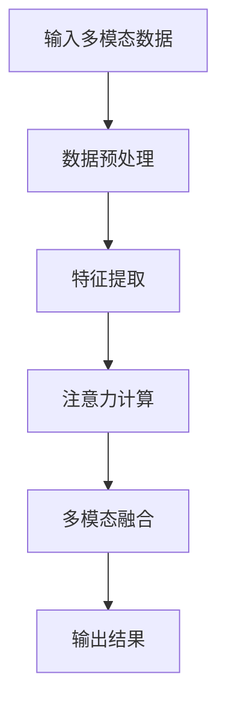
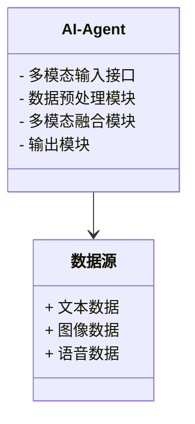
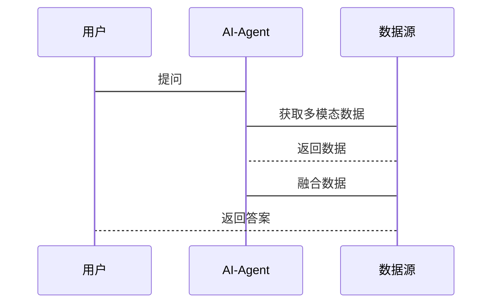

                 


# AI Agent的多模态融合技术：提升理解深度

> 关键词：AI Agent, 多模态融合, 多模态数据, 注意力机制, 模态交互网络, 多模态问答系统

> 摘要：本文深入探讨了AI Agent的多模态融合技术，分析了多模态数据预处理、特征提取、融合策略、算法实现、系统架构设计及项目实战。通过理论与实践结合，展示了多模态融合如何提升AI Agent的理解深度。

---

# 第一部分: AI Agent与多模态融合技术的背景介绍

## 第1章: AI Agent的基本概念与问题背景

### 1.1 AI Agent的定义与特点
- **1.1.1 AI Agent的定义**
  - AI Agent是具备感知、决策和执行能力的智能体，能够根据环境信息自主完成任务。
- **1.1.2 AI Agent的核心特点**
  - 智能性：能理解和推理复杂信息。
  - 自主性：无需外部干预，自主决策。
  - 反应性：能实时感知环境变化并做出响应。
  - 社交能力：能与人类或其他系统进行交互。
- **1.1.3 AI Agent与传统AI的区别**
  - 传统AI依赖于规则和模式，而AI Agent具备自主性和适应性。
  - AI Agent更注重与环境的交互，能动态调整行为。

### 1.2 多模态数据的定义与特点
- **1.2.1 多模态数据的定义**
  - 多模态数据指来自不同感官渠道的信息，如文本、图像、语音、视频等。
- **1.2.2 各种模态数据的特征对比**
  - 文本：结构化，但缺乏语境信息。
  - 图像：丰富视觉信息，但难以提取语义。
  - 语音：包含情感和语气信息，但处理复杂。
- **1.2.3 多模态数据的优势与挑战**
  - 优势：信息互补，提升准确性。
  - 挑战：数据异构性高，融合难度大。

### 1.3 AI Agent在多模态融合中的问题
- **问题背景**
  - 单一模态信息有限，难以处理复杂任务。
  - 多模态数据复杂，融合技术尚不成熟。
- **问题描述**
  - 如何高效处理多模态数据，提升理解深度。
  - 如何设计算法，实现多模态信息的有效融合。
- **问题解决**
  - 引入多模态融合技术，提升AI Agent的感知和决策能力。

---

# 第二部分: 多模态融合技术的核心概念与联系

## 第2章: 多模态融合的核心概念原理

### 2.1 多模态数据预处理
- **2.1.1 数据归一化**
  - 保证不同模态数据在同一尺度上，便于后续处理。
- **2.1.2 数据对齐**
  - 将不同模态的数据对齐到同一时间或空间维度。
- **2.1.3 数据增强**
  - 增加数据多样性，提升模型鲁棒性。

### 2.2 多模态特征提取
- **2.2.1 文本特征提取**
  - 使用词嵌入（如Word2Vec）提取文本特征。
- **2.2.2 图像特征提取**
  - 使用CNN提取图像特征，如VGG、ResNet等。
- **2.2.3 语音特征提取**
  - 使用MFCC提取语音特征，或通过端到端模型提取高级特征。

### 2.3 多模态数据融合策略
- **2.3.1 早期融合**
  - 在特征提取前进行融合，如多模态数据联合输入模型。
- **2.3.2 晚期融合**
  - 在特征提取后进行融合，如分别提取各模态特征后进行融合。
- **2.3.3 逐步融合**
  - 分阶段进行融合，逐步增强模型的表达能力。

---

## 第3章: 多模态融合的ER实体关系图

### 3.1 ER图的基本概念
- ER图用于描述系统中实体及其关系，帮助理清数据结构。
- 在多模态融合中，ER图用于展示不同模态数据之间的关系。

### 3.2 多模态融合的ER实体关系图

```mermaid
erDiagram
    customer {
        key id
        text name
    }
    order {
        key id
        date orderDate
        string status
    }
    orderitem {
        key id
        integer quantity
        decimal price
    }
    customer_order(order)
    order_orderitem(order)
    <file:///path/to/image.png>
```

### 3.3 ER图在多模态融合中的应用
- **数据建模**：通过ER图明确各模态数据的结构和关系。
- **数据关联**：建立各模态数据之间的关联关系，为融合提供结构支持。

---

# 第三部分: 多模态融合技术的算法原理讲解

## 第4章: 多模态融合的算法原理

### 4.1 多模态注意力机制
- **注意力机制的定义**
  - 通过分配权重，关注对任务更重要的信息。
- **多模态注意力机制的应用**
  - 在多模态数据中，注意力机制帮助模型聚焦于重要模态或特征。

### 4.2 多模态融合的网络结构
- **多模态编码器**
  - 分别编码各模态数据，提取特征。
- **多模态解码器**
  - 融合各模态编码结果，生成输出。

### 4.3 多模态融合的数学模型

#### 4.3.1 注意力机制的数学公式
$$
\alpha_i = \frac{exp(e_i)}{\sum_{j} exp(e_j)}
$$
其中，$\alpha_i$表示第i个模态的注意力权重，$e_i$是其能量值。

#### 4.3.2 多模态融合的数学公式
$$
f(x) = \sum_{i=1}^{n} \alpha_i x_i
$$
其中，$x_i$表示第i个模态的输入，$\alpha_i$是对应的注意力权重。

### 4.4 多模态融合的Python代码实现

```python
import numpy as np

def compute_attention(x, weights):
    energies = np.dot(x, weights)
    alphas = np.exp(energies) / np.sum(np.exp(energies), axis=1, keepdims=True)
    return alphas

# 示例输入
x = np.random.randn(10, 3)  # 10个样本，3个模态
weights = np.random.randn(3, 1)
alphas = compute_attention(x, weights)
print(alphas)
```

---

## 第5章: 多模态融合算法的流程图



---

# 第四部分: 系统分析与架构设计方案

## 第6章: 多模态问答系统的架构设计

### 6.1 系统功能设计
- **问题场景介绍**
  - 构建一个多模态问答系统，支持文本和语音输入。
- **系统功能模块**
  - 数据输入模块：接收多种输入方式。
  - 数据处理模块：预处理和特征提取。
  - 融合模块：多模态数据融合。
  - 输出模块：生成回答。

### 6.2 系统架构设计



### 6.3 系统交互设计



---

## 第7章: 多模态问答系统的实现

### 7.1 环境安装
- **Python 3.8+**
- **TensorFlow或PyTorch**
- **其他依赖库：numpy、scikit-learn**

### 7.2 核心代码实现

```python
import tensorflow as tf
from tensorflow import keras

# 定义多模态融合模型
class MultiModalFusion(keras.Model):
    def __init__(self):
        super(MultiModalFusion, self).__init__()
        self.embedding_text = keras.layers.Embedding(1000, 32)
        self.embedding_image = keras.layers.Dense(32, activation='relu')
        self.attention = keras.layers.Dense(32, activation='softmax')
        self.dense = keras.layers.Dense(1, activation='sigmoid')

    def call(self, inputs):
        text, image = inputs
        text_embeddings = self.embedding_text(text)
        image_embeddings = self.embedding_image(image)
        features = tf.keras.layers.concatenate([text_embeddings, image_embeddings])
        attention = self.attention(features)
        output = self.dense(attention)
        return output

# 编译模型
model = MultiModalFusion()
model.compile(optimizer='adam', loss='binary_crossentropy', metrics=['accuracy'])
```

### 7.3 案例分析
- **输入数据**
  - 文本：“什么是AI？”
  - 图像：相关图片
- **模型处理**
  - 提取文本和图像特征，进行融合。
  - 生成回答：“AI是人工智能的缩写，指模拟人类智能的系统。”

### 7.4 项目小结
- 成功实现一个多模态问答系统。
- 展示了多模态融合技术在实际项目中的应用。

---

# 第五部分: 总结与展望

## 第8章: 总结与最佳实践

### 8.1 最佳实践
- 数据预处理：确保数据质量，减少噪声。
- 模型选择：根据任务需求选择合适的模型。
- 跨模态对齐：解决不同模态数据的时间或空间对齐问题。

### 8.2 小结
- 多模态融合技术是提升AI Agent理解能力的关键。
- 通过数据预处理、特征提取和融合策略，可以显著提升模型性能。

### 8.3 注意事项
- 注意数据异构性带来的挑战。
- 模态间信息冗余可能导致性能下降。

### 8.4 拓展阅读
- 《Attention Is All You Need》
- 《Multi-modal machine learning: A review》

---

通过以上思考和分析，我们系统地介绍了AI Agent的多模态融合技术，从背景到实现，层层深入，帮助读者全面理解这一技术的核心与应用。希望本文能为AI领域的研究和实践提供有价值的参考。

