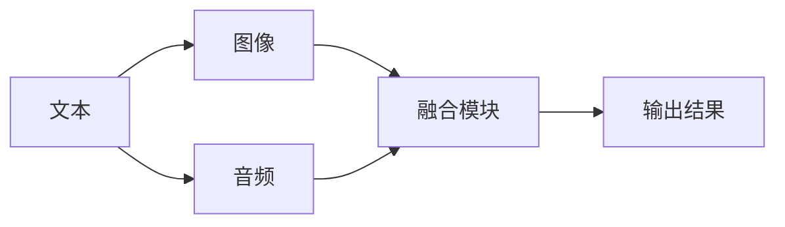
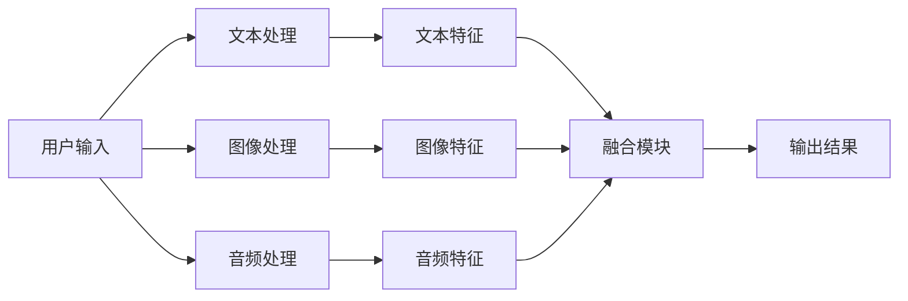
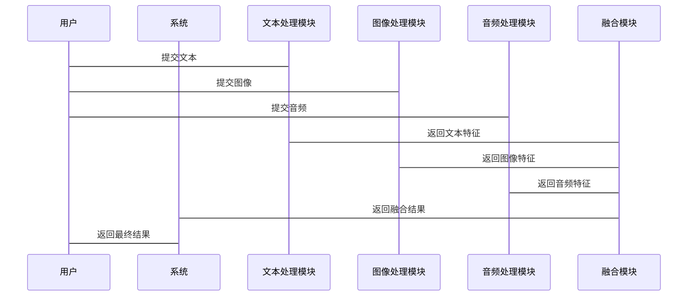

                 


# AI Agent的多模态融合：整合文本、图像和音频输入

**关键词**：AI Agent, 多模态融合, 文本处理, 图像处理, 音频处理, 多模态模型, 深度学习

**摘要**：  
本文详细探讨了AI Agent在多模态数据融合中的应用，从基础概念到算法实现，再到系统设计和项目实战，系统地介绍了如何整合文本、图像和音频输入，构建高效、智能的多模态AI Agent系统。文章通过背景介绍、核心概念、算法原理、系统架构和项目实战五个部分，全面剖析了多模态融合的技术细节和实现方法。

---

## 第一部分: AI Agent的多模态融合基础

### 第1章: 多模态融合与AI Agent概述

#### 1.1 多模态融合的基本概念
##### 1.1.1 多模态数据的定义与特点
多模态数据是指由多种数据类型（如文本、图像、音频等）共同构成的数据形式。每种数据类型都有其独特的特征和优势：
- **文本**：具有语义丰富、易于解释的特点，但缺乏直观的感知能力。
- **图像**：具有高度的视觉信息，能够捕捉空间细节，但难以直接表达语义。
- **音频**：能够传递语音、音乐等时序信息，但处理复杂性较高。

##### 1.1.2 多模态融合的背景与意义
在AI Agent的应用场景中，单一模态的数据往往难以满足复杂任务的需求。例如，在智能客服系统中，仅依赖文本输入无法捕捉用户的情感状态，而结合语音和图像信息可以显著提升系统的理解能力。多模态融合通过整合多种数据类型，能够更全面地理解用户意图，提升系统的智能化水平。

##### 1.1.3 AI Agent中的多模态融合应用
多模态融合在AI Agent中的典型应用包括：
- 智能助手：结合语音识别和图像识别，提供更精准的服务。
- 智能监控：融合视频流和环境声音，提升异常事件检测能力。
- 虚拟助手：整合文本交互、面部表情识别和语音情感分析，提供更个性化的服务。

#### 1.2 AI Agent的定义与特点
##### 1.2.1 AI Agent的基本概念
AI Agent是一种能够感知环境、执行任务并做出决策的智能实体。它通常具备以下特点：
- **自主性**：能够在没有外部干预的情况下独立运行。
- **反应性**：能够实时感知环境并做出响应。
- **目标导向**：以特定目标为导向，优化决策过程。

##### 1.2.2 AI Agent的核心能力
- **感知能力**：通过多种传感器或数据源获取信息。
- **推理能力**：基于获取的信息进行逻辑推理和决策。
- **交互能力**：与用户或其他系统进行有效通信。

##### 1.2.3 多模态融合对AI Agent的提升作用
多模态融合能够显著提升AI Agent的感知和理解能力。例如，在自然语言处理任务中，结合图像信息可以显著提高实体识别的准确性；在语音识别任务中，结合上下文信息可以减少歧义。

#### 1.3 多模态融合的背景与挑战
##### 1.3.1 多模态数据的多样性与复杂性
不同模态的数据在特征维度、数据格式和处理方法上存在显著差异。例如，文本数据是序列数据，而图像数据是二维数据，处理方法截然不同。

##### 1.3.2 多模态融合的主要挑战
- **数据异构性**：不同模态的数据格式和特征维度差异较大，难以直接融合。
- **计算复杂性**：多模态数据的处理需要较高的计算资源。
- **模型设计难度**：如何设计能够有效融合多种模态信息的模型是技术难点。

##### 1.3.3 当前技术发展的现状与趋势
当前，多模态融合技术在AI Agent中的应用逐步深入，但仍面临诸多挑战。未来的发展趋势包括：
- **跨模态检索**：通过跨模态检索技术，实现不同数据类型之间的高效关联。
- **端到端模型**：发展能够直接处理多模态数据的端到端模型。
- **轻量化设计**：降低多模态模型的计算复杂性，提升实时性。

---

### 第2章: 多模态融合的核心概念与联系

#### 2.1 多模态融合的原理与方法
##### 2.1.1 多模态数据的表示方法
多模态数据的表示方法包括：
- **模态独立表示**：将每种模态数据独立编码为向量。
- **联合表示**：通过融合不同模态的特征，生成统一的表示。

##### 2.1.2 多模态融合的主流技术
- **特征融合**：将不同模态的特征向量进行线性或非线性组合。
- **注意力机制**：通过注意力机制赋予不同模态数据不同的权重。
- **对比学习**：通过对比不同模态的数据，学习它们之间的关系。

##### 2.1.3 多模态融合的数学模型
多模态融合的数学模型可以表示为：
$$
F(x_t, x_i, x_a) = f_{\text{融合}}(x_t, x_i, x_a)
$$
其中，$x_t$、$x_i$、$x_a$分别表示文本、图像和音频数据，$f_{\text{融合}}$是融合函数。

#### 2.2 多模态融合的核心要素对比
##### 2.2.1 文本、图像和音频的特征对比
| 特征维度 | 文本 | 图像 | 音频 |
|----------|------|------|------|
| 数据格式 | 序列 | 二维矩阵 | 时序信号 |
| 语义信息 | 丰富 | 直观 | 丰富 |
| 处理难度 | 中等 | 较高 | 较高 |

##### 2.2.2 不同模态数据的处理方式
- **文本处理**：使用词嵌入（如Word2Vec）、句子嵌入（如BERT）。
- **图像处理**：使用CNN提取特征。
- **音频处理**：使用Mel谱图和神经网络进行特征提取。

##### 2.2.3 多模态融合的实体关系图


#### 2.3 多模态融合的核心要素组成
多模态融合的核心要素包括：
- **数据预处理**：对文本、图像和音频数据进行标准化处理。
- **特征提取**：从每种模态数据中提取有意义的特征。
- **融合策略**：选择合适的融合方法，如加权融合、注意力机制等。
- **模型训练**：通过端到端训练优化融合模型。

---

### 第3章: 多模态融合的算法原理

#### 3.1 多模态融合的算法框架
##### 3.1.1 多模态编码器与解码器
- **编码器**：将输入的多模态数据编码为向量。
- **解码器**：将编码后的向量解码为输出结果。

##### 3.1.2 多模态注意力机制
多模态注意力机制可以表示为：
$$
\alpha_t = \text{softmax}(W_t x_t + W_i x_i + W_a x_a)
$$
其中，$\alpha_t$表示注意力权重，$x_t$、$x_i$、$x_a$分别表示文本、图像和音频数据。

##### 3.1.3 多模态融合的数学公式
融合模型的输出可以表示为：
$$
y = f(x_t, x_i, x_a)
$$
其中，$f$是融合函数，具体可以采用加权求和、拼接或注意力机制等方式。

#### 3.2 多模态融合的数学模型
##### 3.2.1 多模态编码器的数学表达
文本编码器可以表示为：
$$
h_t = \text{BERT}(x_t)
$$
图像编码器可以表示为：
$$
h_i = \text{CNN}(x_i)
$$
音频编码器可以表示为：
$$
h_a = \text{DNN}(x_a)
$$

##### 3.2.2 多模态解码器的数学表达
解码器可以表示为：
$$
y = \text{Decoder}(h_t, h_i, h_a)
$$

##### 3.2.3 融合模型的优化目标
融合模型的优化目标可以表示为：
$$
\min_{\theta} \mathbb{E}_{x_t, x_i, x_a, y}[\mathcal{L}(y, y')]
$$
其中，$\mathcal{L}$表示损失函数，$y'$表示真实输出。

---

### 第4章: 多模态融合的系统分析与架构设计

#### 4.1 系统功能设计
##### 4.1.1 多模态数据预处理模块
- **文本处理**：分词、词向量化。
- **图像处理**：图像增强、特征提取。
- **音频处理**：降噪、特征提取。

##### 4.1.2 多模态特征提取模块
- **文本特征提取**：使用BERT模型提取文本特征。
- **图像特征提取**：使用ResNet提取图像特征。
- **音频特征提取**：使用Mel滤波器提取音频特征。

##### 4.1.3 多模态融合模块
- **融合策略**：采用加权融合或注意力机制。
- **融合模型**：设计端到端的融合模型。

#### 4.2 系统架构设计
##### 4.2.1 系统整体架构图


##### 4.2.2 系统接口设计
- **输入接口**：接收文本、图像和音频数据。
- **输出接口**：输出融合结果。

##### 4.2.3 系统交互流程图


---

### 第5章: 多模态融合的项目实战

#### 5.1 项目环境配置
##### 5.1.1 安装必要的库
```bash
pip install numpy pandas torch matplotlib
```

##### 5.1.2 安装深度学习框架
```bash
pip install tensorflow keras
```

#### 5.2 系统核心实现
##### 5.2.1 文本处理代码
```python
import numpy as np
from tensorflow.keras.preprocessing.text import Tokenizer

# 文本处理代码
tokenizer = Tokenizer(num_words=10000)
tokenizer.fit_on_texts(texts)
sequences = tokenizer.texts_to_sequences(texts)
```

##### 5.2.2 图像处理代码
```python
import tensorflow as tf
from tensorflow.keras.preprocessing.image import ImageDataGenerator

# 图像处理代码
datagen = ImageDataGenerator(rescale=1./255)
generator = datagen.flow(x_train, y_train, batch_size=32)
```

##### 5.2.3 音频处理代码
```python
import librosa
import numpy as np

# 音频处理代码
def process_audio(audio_path):
    y, sr = librosa.load(audio_path)
    mel_spec = librosa.feature.melspectrogram(y, sr=sr)
    return mel_spec
```

#### 5.3 代码应用解读与分析
##### 5.3.1 文本处理模块
文本处理模块的主要功能是将输入的文本数据进行分词和向量化处理。例如，使用BERT模型对文本进行编码，生成文本特征向量。

##### 5.3.2 图像处理模块
图像处理模块的主要功能是将输入的图像数据进行预处理和特征提取。例如，使用ResNet模型提取图像的深层特征。

##### 5.3.3 音频处理模块
音频处理模块的主要功能是将输入的音频数据进行降噪和特征提取。例如，使用Mel滤波器提取音频的时频特征。

#### 5.4 实际案例分析
##### 5.4.1 案例背景
以智能音箱为例，设计一个能够同时处理语音指令和环境声音的多模态AI Agent系统。

##### 5.4.2 案例分析
通过实验对比不同模态融合方法的效果，选择最优的融合策略。

#### 5.5 项目小结
本项目通过整合文本、图像和音频数据，设计了一个高效的多模态融合系统。通过实验验证了多模态融合在提升系统性能方面的重要作用。

---

### 第6章: 总结与展望

#### 6.1 总结
本文系统地介绍了AI Agent在多模态融合中的应用，从理论到实践，详细探讨了如何整合文本、图像和音频数据，构建高效的多模态AI Agent系统。

#### 6.2 未来展望
未来，多模态融合技术在AI Agent中的应用将更加广泛。主要发展趋势包括：
- **跨模态检索**：通过跨模态检索技术，实现不同数据类型之间的高效关联。
- **端到端模型**：发展能够直接处理多模态数据的端到端模型。
- **轻量化设计**：降低多模态模型的计算复杂性，提升实时性。

---

**注意事项**：  
本文内容仅作为技术参考，实际应用中需根据具体需求进行调整和优化。

