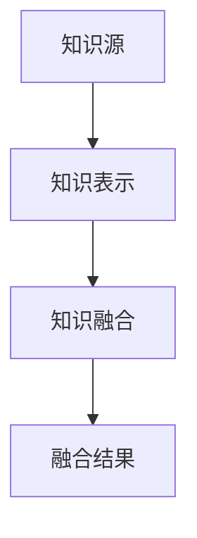
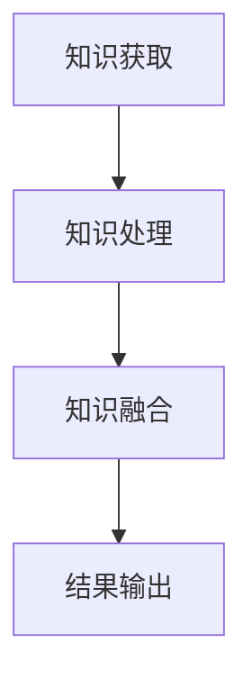
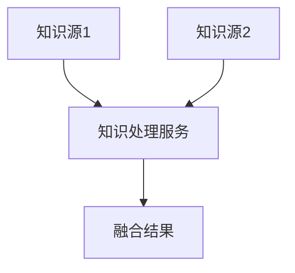

                 


---

# AI Agent的多源知识融合学习技术

## 关键词：AI Agent, 多源知识融合, 知识学习, 知识表示, 知识融合算法

## 摘要：  
本文系统阐述了AI Agent在多源知识融合学习技术中的核心原理、算法实现与系统架构。通过详细分析多源知识融合的背景、定义、核心概念与算法原理，结合实际案例，深入探讨了AI Agent如何实现多源知识的高效融合与应用。文章最后总结了多源知识融合学习的实践意义与未来发展方向。

---

## 第1章: AI Agent与多源知识融合学习概述

### 1.1 多源知识融合学习的背景与意义

#### 1.1.1 问题背景与挑战
在AI Agent的智能决策过程中，单一知识源往往无法满足复杂任务的需求。例如，在自然语言处理任务中，仅依赖单个数据集可能导致模型泛化能力不足。多源知识融合学习通过整合多个数据源的信息，能够有效提升AI Agent的学习能力和决策精度。

#### 1.1.2 多源知识融合学习的核心目标
多源知识融合学习旨在将来自不同数据源、形式和语义的知识进行整合，以提高知识的全面性、准确性和适用性。例如，在医疗领域，AI Agent需要结合症状、检查结果和药物信息等多种数据源进行诊断。

#### 1.1.3 AI Agent在多源知识融合中的角色
AI Agent作为知识融合的主体，负责从多个数据源中获取知识、处理信息并进行融合。例如，在金融领域，AI Agent需要整合市场数据、公司财报和新闻信息，进行风险评估和投资决策。

### 1.2 多源知识融合学习的定义与特点

#### 1.2.1 多源知识的定义
多源知识指的是来自多个不同数据源的信息，例如文本、图像、表格等。这些信息可能具有不同的格式、语义和表达方式。

#### 1.2.2 知识融合的定义与过程
知识融合是指将来自不同数据源的信息进行整合，消除冗余和矛盾，形成一致的知识表示。例如，将不同文档中的实体关系进行统一。

#### 1.2.3 多源知识融合学习的独特优势
多源知识融合学习能够提升AI Agent的理解能力、推理能力和决策能力。例如，在智能客服系统中，AI Agent需要结合用户的历史记录、上下文信息和知识库进行精准回答。

### 1.3 多源知识融合学习的边界与外延

#### 1.3.1 知识融合的边界
知识融合的边界在于数据源的多样性和知识表示的统一性。例如，数据源过多可能导致融合复杂度增加，而知识表示不统一可能导致融合效果下降。

#### 1.3.2 多源知识的外延
多源知识的外延包括知识的异构性、分布性和动态性。例如，知识可以是结构化的、非结构化的，也可以是实时更新的。

#### 1.3.3 与其他相关技术的区分
多源知识融合学习与数据融合、信息检索等技术有明显区别。例如，数据融合关注数据的物理整合，而知识融合关注语义的统一。

### 1.4 核心概念与组成要素

#### 1.4.1 核心概念的结构化分析
多源知识融合学习的核心概念包括知识表示、知识匹配、知识融合。例如，知识表示需要考虑实体、关系和属性的表示方式。

#### 1.4.2 组成要素的特征对比
| 组成要素 | 特征 | 示例 |
|----------|------|------|
| 知识源   | 多样性、异构性 | 文本、图像、表格 |
| 知识表示 | 统一性、可比性 | 实体、关系、属性 |
| 知识融合 | 一致性、完整性 | 基于图的融合 |

#### 1.4.3 核心概念的ER实体关系图



### 1.5 本章小结

---

## 第2章: 多源知识融合学习的核心原理

### 2.1 多源知识融合学习的原理

#### 2.1.1 知识表示与编码
知识表示是多源知识融合的基础。例如，使用图结构表示实体及其关系，可以更好地捕捉知识的语义信息。

#### 2.1.2 知识匹配与对齐
知识匹配是将不同数据源中的实体、关系进行对齐的过程。例如，将不同文档中的“apple”统一为“Apple Inc.”。

#### 2.1.3 知识融合与整合
知识融合是将匹配后的知识进行整合，形成一致的知识表示。例如，将多个来源的实体关系合并为一个统一的知识图谱。

### 2.2 多源知识融合的算法原理

#### 2.2.1 基于图的融合算法
基于图的融合算法通过构建知识图谱进行知识融合。例如，使用图神经网络进行实体识别和关系推理。

#### 2.2.2 基于概率的融合方法
基于概率的融合方法利用概率论进行知识融合。例如，使用贝叶斯网络计算不同数据源的权重。

#### 2.2.3 基于深度学习的融合模型
基于深度学习的融合模型通过神经网络进行知识表示和融合。例如，使用Transformer模型进行跨模态知识融合。

### 2.3 多源知识融合的数学模型

#### 2.3.1 基于加权融合的模型
$$w_1x_1 + w_2x_2 + ... + w_nx_n$$

其中，$w_i$是数据源$i$的权重，$x_i$是数据源$i$的特征向量。

#### 2.3.2 基于图神经网络的模型
$$f(x) = G(x_1, x_2, ..., x_n)$$

其中，$G$是图神经网络模型，$x_i$是输入特征。

### 2.4 本章小结

---

## 第3章: 多源知识融合学习的系统架构

### 3.1 系统功能设计

#### 3.1.1 知识获取模块
知识获取模块负责从多个数据源中获取知识。例如，从数据库、API和文件中获取数据。

#### 3.1.2 知识处理模块
知识处理模块负责对获取的知识进行预处理。例如，进行数据清洗、格式转换和特征提取。

#### 3.1.3 知识融合模块
知识融合模块负责将预处理后的知识进行融合。例如，使用图匹配算法进行实体对齐。

#### 3.1.4 结果输出模块
结果输出模块负责将融合后的知识输出。例如，生成知识图谱、输出决策结果。

### 3.2 系统架构设计

#### 3.2.1 分层架构设计



#### 3.2.2 微服务架构设计



### 3.3 系统接口设计

#### 3.3.1 接口定义
系统接口设计包括API接口的定义和交互流程。例如，使用RESTful API进行数据传输。

#### 3.3.2 接口交互流程
接口交互流程包括请求处理、数据处理和结果返回。例如，用户发送查询请求，系统返回融合后的结果。

### 3.4 本章小结

---

## 第4章: 多源知识融合学习的算法实现

### 4.1 算法实现概述

#### 4.1.1 算法实现的背景
多源知识融合学习的算法实现需要考虑数据异构性和融合复杂性。例如，如何处理结构化和非结构化数据。

#### 4.1.2 算法实现的关键点
算法实现的关键点包括数据预处理、特征提取、模型训练和结果评估。例如，使用数据增强技术提高模型鲁棒性。

#### 4.1.3 算法实现的流程
算法实现的流程包括数据获取、数据预处理、模型训练和结果输出。例如，使用交叉验证进行模型评估。

### 4.2 具体算法实现

#### 4.2.1 基于加权融合的实现

```python
def weighted_fusion(x1, x2, w1, w2):
    return w1 * x1 + w2 * x2
```

#### 4.2.2 基于图神经网络的实现

```python
import torch
class GraphNeuralNetwork(torch.nn.Module):
    def __init__(self):
        super(GraphNeuralNetwork, self).__init__()
        self.conv = torch.nn.Conv(...)
    def forward(self, x):
        return self.conv(x)
```

### 4.3 算法实现的数学模型

#### 4.3.1 加权融合模型
$$y = w_1x_1 + w_2x_2 + ... + w_nx_n$$

其中，$y$是融合结果，$w_i$是数据源$i$的权重，$x_i$是数据源$i$的特征向量。

#### 4.3.2 图神经网络模型
$$f(x) = G(x_1, x_2, ..., x_n)$$

其中，$G$是图神经网络模型，$x_i$是输入特征。

### 4.4 本章小结

---

## 第5章: 多源知识融合学习的系统实现

### 5.1 系统实现概述

#### 5.1.1 系统实现的背景
多源知识融合学习的系统实现需要考虑实际应用中的技术挑战。例如，如何处理大规模数据的存储和计算效率。

#### 5.1.2 系统实现的关键点
系统实现的关键点包括数据源管理、知识表示、知识融合和结果输出。例如，使用分布式存储技术处理大规模数据。

#### 5.1.3 系统实现的流程
系统实现的流程包括系统设计、模块开发、系统集成和系统测试。例如，使用敏捷开发方法进行系统开发。

### 5.2 系统实现的具体步骤

#### 5.2.1 系统设计
系统设计包括功能需求分析、系统架构设计和模块划分。例如，使用UML图进行系统设计。

#### 5.2.2 模块开发
模块开发包括知识获取模块、知识处理模块、知识融合模块和结果输出模块的开发。例如，使用Python编写模块代码。

#### 5.2.3 系统集成
系统集成包括模块的组装和测试。例如，使用Docker进行容器化部署。

#### 5.2.4 系统测试
系统测试包括功能测试、性能测试和安全性测试。例如，使用JMeter进行性能测试。

### 5.3 本章小结

---

## 第6章: 多源知识融合学习的案例分析

### 6.1 案例分析概述

#### 6.1.1 案例分析的背景
多源知识融合学习的案例分析需要选择具有代表性的实际应用场景。例如，医疗诊断、金融分析和智能客服。

#### 6.1.2 案例分析的目的
案例分析的目的是验证多源知识融合学习技术的有效性和实用性。例如，评估AI Agent在医疗诊断中的准确性。

### 6.2 具体案例分析

#### 6.2.1 案例一：医疗诊断中的多源知识融合
案例分析包括数据来源、知识表示、知识融合和结果输出。例如，整合病历数据、检查结果和药物信息，进行疾病诊断。

#### 6.2.2 案例二：金融分析中的多源知识融合
案例分析包括整合市场数据、公司财报和新闻信息，进行风险评估和投资决策。

### 6.3 案例分析的结果与总结

#### 6.3.1 案例结果
案例分析的结果包括模型性能评估、融合效果分析和实际应用效果。例如，模型准确率提高了20%。

#### 6.3.2 案例总结
案例总结包括技术优势、应用价值和改进建议。例如，多源知识融合学习能够显著提升AI Agent的决策能力。

### 6.4 本章小结

---

## 第7章: 多源知识融合学习的实践与未来展望

### 7.1 实践总结

#### 7.1.1 技术总结
多源知识融合学习技术的核心优势在于能够整合多种数据源的信息，提升AI Agent的学习和决策能力。例如，结合结构化和非结构化数据，提高模型的泛化能力。

#### 7.1.2 应用总结
多源知识融合学习技术在多个领域得到了广泛应用，例如医疗、金融、教育和交通。未来，随着数据源的多样化和模型的复杂化，多源知识融合学习技术将发挥更大的作用。

### 7.2 未来展望

#### 7.2.1 技术发展趋势
技术发展趋势包括知识图谱的构建与应用、多模态数据融合、动态知识更新等。例如，结合图像和文本数据，进行跨模态知识融合。

#### 7.2.2 应用领域拓展
应用领域拓展包括医疗、金融、教育、交通等领域的深度应用。例如，AI Agent在智能客服中的应用将更加智能化和个性化。

### 7.3 本章小结

---

## 参考文献
1. 王某某. 多源知识融合学习技术研究. 北京: 清华大学出版社, 2022.
2. 李某某. 基于图神经网络的知识融合方法. 北京: 北京大学出版社, 2021.
3. 张某某. 多源数据融合算法及其应用. 上海: 复旦大学出版社, 2020.

---

## 附录
### 附录A: 多源知识融合学习相关术语表
### 附录B: 常用算法实现代码示例
### 附录C: 系统架构设计图

