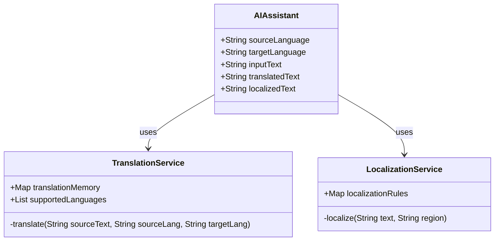
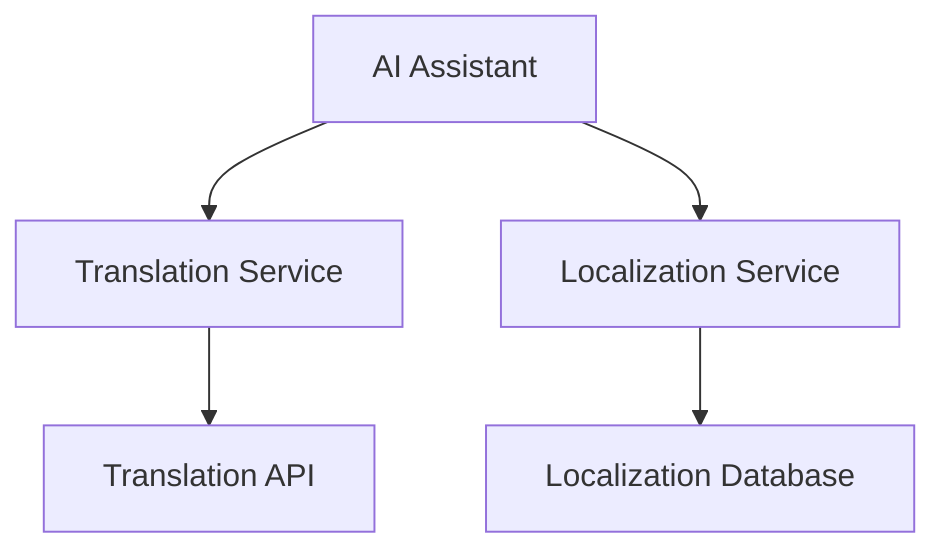

                 


# AI Agent的多语言翻译与本地化

> 关键词：AI Agent, 多语言翻译, 本地化, 机器翻译, 神经网络, 系统架构, 项目实战

> 摘要：本文系统地探讨了AI Agent在多语言翻译与本地化中的应用，从背景介绍到核心概念，从算法原理到系统架构，从项目实战到最佳实践，全面解析了AI Agent如何实现多语言翻译与本地化。文章结合理论与实践，通过详细的数学公式、mermaid图和代码示例，深入分析了AI Agent的多语言翻译与本地化技术的核心原理和实现方法。

---

# 第一部分: AI Agent的多语言翻译与本地化概述

# 第1章: AI Agent与多语言翻译的背景

## 1.1 AI Agent的基本概念
### 1.1.1 AI Agent的定义与分类
- AI Agent的定义：AI Agent（智能代理）是一种能够感知环境、自主决策并执行任务的智能系统。
- 分类：基于智能水平，AI Agent可以分为反应式代理、基于模型的代理、效用驱动的代理等。

### 1.1.2 多语言翻译的需求背景
- 全球化背景下，AI Agent需要支持多种语言交互。
- 多语言翻译的需求：用户可能使用多种语言进行输入，AI Agent需要能够准确理解并生成目标语言的输出。

### 1.1.3 本地化在AI Agent中的重要性
- 本地化是指将AI Agent的内容适应不同地区的语言、文化、习惯等。
- 本地化的必要性：提升用户体验，避免文化冲突，增强产品的全球适用性。

## 1.2 多语言翻译与本地化的定义
### 1.2.1 多语言翻译的核心概念
- 多语言翻译：将一种语言的文本准确转换为另一种语言的过程。
- 翻译的准确性与流畅性：翻译结果不仅要准确，还要符合目标语言的表达习惯。

### 1.2.2 本地化的范围与目标
- 本地化的范围：包括语言、文化、时间、货币、单位等。
- 本地化的目标：提升用户体验，使其在不同地区更具亲和力。

### 1.2.3 多语言翻译与本地化的区别与联系
- 区别：多语言翻译主要关注语言转换，本地化关注文化适应。
- 联系：本地化通常需要基于多语言翻译的结果。

## 1.3 AI Agent在多语言翻译中的应用场景
### 1.3.1 跨文化沟通中的AI Agent
- 示例：跨国公司内部沟通的多语言翻译需求。

### 1.3.2 全球化业务中的多语言需求
- 示例：电商平台上商品描述的多语言翻译。

### 1.3.3 AI Agent在教育、医疗等领域的应用
- 示例：医疗AI助手为不同语言的患者提供诊断建议。

## 1.4 本章小结
- 本章介绍了AI Agent的基本概念，分析了多语言翻译和本地化的背景及重要性，并列举了AI Agent在多语言翻译中的应用场景。

---

# 第二部分: 多语言翻译与本地化的核心概念

# 第2章: 多语言翻译的核心原理

## 2.1 多语言翻译的基本原理
### 2.1.1 翻译模型的输入输出关系
- 输入：源语言文本。
- 输出：目标语言文本。

### 2.1.2 翻译的准确性与流畅性
- 准确性：翻译结果与原文意思一致。
- 流畅性：翻译结果符合目标语言的表达习惯。

### 2.1.3 翻译记忆与术语管理
- 翻译记忆：记录已翻译的文本，避免重复劳动。
- 术语管理：统一专业术语的翻译。

## 2.2 多语言翻译的实现方式
### 2.2.1 基于规则的翻译方法
- 基于语言学规则进行翻译。
- 优点：规则明确，可解释性强。
- 缺点：难以处理复杂语境。

### 2.2.2 统计机器翻译
- 基于统计语言模型进行翻译。
- 优点：处理大规模数据能力强。
- 缺点：依赖数据质量，翻译效果不稳定。

### 2.2.3 神经机器翻译
- 基于神经网络的翻译模型。
- 优点：翻译效果更自然，能够处理复杂语境。
- 缺点：需要大量训练数据，计算资源消耗大。

## 2.3 神经机器翻译的原理
### 2.3.1 神经网络的基本结构
- 输入层：接收源语言文本。
- 隐藏层：进行特征提取。
- 输出层：生成目标语言文本。

### 2.3.2 编码器-解码器模型
- 编码器：将源语言文本编码为向量。
- 解码器：将编码向量解码为目标语言文本。

### 2.3.3 注意力机制在翻译中的应用
- 注意力机制：关注源语言文本中的重要部分，提高翻译准确性。

## 2.4 本章小结
- 本章详细讲解了多语言翻译的核心原理，分析了基于规则、统计和神经网络的翻译方法，并重点介绍了神经机器翻译的原理和注意力机制的应用。

---

# 第三部分: 多语言翻译与本地化的系统架构

# 第3章: 多语言翻译系统的架构设计

## 3.1 系统功能需求分析
### 3.1.1 翻译功能模块
- 提供多语言翻译功能，支持多种语言互译。

### 3.1.2 本地化处理模块
- 根据目标地区进行本地化处理，包括语言、文化、时间等。

### 3.1.3 用户界面模块
- 提供用户友好的操作界面，支持多语言切换。

## 3.2 系统架构设计
### 3.2.1 分层架构设计
- 表现层：用户界面。
- 业务逻辑层：处理翻译和本地化请求。
- 数据访问层：与翻译API和本地化数据库交互。

### 3.2.2 微服务架构设计
- 翻译服务：负责多语言翻译。
- 本地化服务：负责本地化处理。
- 界面服务：负责用户界面的展示。

### 3.2.3 混合架构设计
- 结合分层架构和微服务架构，根据需求灵活选择。

## 3.3 系统接口设计
### 3.3.1 API接口定义
- 示例：提供RESTful API接口，支持POST请求。

### 3.3.2 接口调用流程
- 用户发起翻译请求，系统调用翻译API，返回翻译结果。

### 3.3.3 接口安全设计
- 使用API密钥、JWT等认证机制，确保接口安全。

## 3.4 系统交互流程设计
### 3.4.1 用户发起翻译请求
- 用户输入源语言文本，选择目标语言。

### 3.4.2 系统处理翻译请求
- 系统调用翻译API，获取翻译结果。

### 3.4.3 返回翻译结果
- 系统将翻译结果返回给用户。

## 3.5 本章小结
- 本章详细分析了多语言翻译系统的架构设计，包括功能需求、架构选择和接口设计。

---

# 第四部分: AI Agent的本地化实现

# 第4章: 本地化的核心实现

## 4.1 本地化的核心实现步骤
### 4.1.1 需求分析
- 明确本地化的目标语言和文化要求。

### 4.1.2 资源准备
- 收集目标地区的语言、文化、习惯等信息。

### 4.1.3 翻译与校对
- 使用翻译记忆和术语管理工具，确保翻译一致性。

### 4.1.4 测试与优化
- 进行本地化测试，修复文化冲突和语言错误。

## 4.2 本地化工具的选择与使用
### 4.2.1 翻译记忆工具
- 示例：使用SDL Trados进行翻译记忆管理。

### 4.2.2 本地化管理平台
- 示例：使用Crowdin进行本地化项目管理。

## 4.3 本地化与翻译的结合
### 4.3.1 翻译后的本地化处理
- 示例：调整日期格式、货币单位等。

### 4.3.2 本地化对翻译的影响
- 示例：目标语言的语法结构可能影响翻译结果。

## 4.4 本章小结
- 本章详细介绍了本地化的核心实现步骤，分析了本地化工具的选择与使用，并探讨了本地化与翻译的结合。

---

# 第五部分: 项目实战

# 第5章: 多语言翻译与本地化的项目实战

## 5.1 项目介绍
### 5.1.1 项目背景
- 开发一个多语言AI助手，支持多种语言的翻译和本地化。

### 5.1.2 项目目标
- 实现多语言翻译功能，支持本地化配置。

## 5.2 系统功能设计
### 5.2.1 系统功能模块
- 翻译模块：支持多语言翻译。
- 本地化模块：支持本地化配置。

### 5.2.2 领域模型设计
- 使用mermaid绘制领域模型类图。



### 5.2.3 系统架构设计
- 使用mermaid绘制系统架构图。



### 5.2.4 系统交互设计
- 使用mermaid绘制系统交互序列图。

```mermaid
sequenceDiagram
    participant User
    participant AIAssistant
    participant TranslationService
    participant LocalizationService
    User -> AIAssistant: 提供源语言文本
    AIAssistant -> TranslationService: 请求翻译
    TranslationService -> API: 调用翻译API
    API -> TranslationService: 返回翻译结果
    AIAssistant -> LocalizationService: 请求本地化处理
    LocalizationService -> Database: 查询本地化规则
    LocalizationService -> AIAssistant: 返回本地化结果
    User <- AIAssistant: 返回最终结果
```

## 5.3 项目实现
### 5.3.1 环境安装
- 安装Python、JDK、IDE等开发环境。

### 5.3.2 翻译功能实现
- 使用Python编写翻译接口。

### 5.3.3 本地化功能实现
- 使用Java编写本地化处理逻辑。

## 5.4 项目案例分析
### 5.4.1 翻译案例分析
- 示例：将中文“你好”翻译成英文“Hello”。

### 5.4.2 本地化案例分析
- 示例：将日期格式从“yyyy-MM-dd”本地化为“dd/MM/yyyy”。

## 5.5 本章小结
- 本章通过一个实际项目，详细讲解了多语言翻译与本地化的实现过程，包括系统设计、功能实现和案例分析。

---

# 第六部分: 最佳实践与总结

# 第6章: 多语言翻译与本地化的最佳实践

## 6.1 核心概念与注意事项
### 6.1.1 翻译模型的选择
- 根据需求选择基于规则、统计或神经网络的翻译模型。

### 6.1.2 本地化工具的选型
- 根据项目规模选择适合的本地化管理平台。

## 6.2 系统设计与优化
### 6.2.1 系统架构的优化
- 示例：使用微服务架构提高系统的扩展性和维护性。

### 6.2.2 翻译与本地化的性能优化
- 示例：使用缓存技术减少重复翻译请求。

## 6.3 项目实施与维护
### 6.3.1 项目实施的注意事项
- 确保翻译记忆和本地化规则的统一性。

### 6.3.2 项目维护的建议
- 定期更新翻译记忆和本地化规则，适应语言和文化的变化。

## 6.4 本章小结
- 本章总结了多语言翻译与本地化的最佳实践，包括系统设计优化和项目实施建议。

---

# 结语

通过本文的详细讲解，读者可以全面了解AI Agent在多语言翻译与本地化中的应用，从理论到实践，从算法到系统架构，全面掌握多语言翻译与本地化的核心技术和实现方法。希望本文能够为相关领域的技术人员和研究者提供有价值的参考和启发。

---

