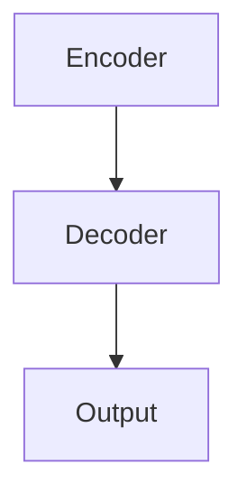
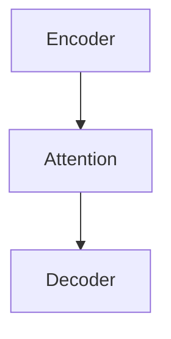
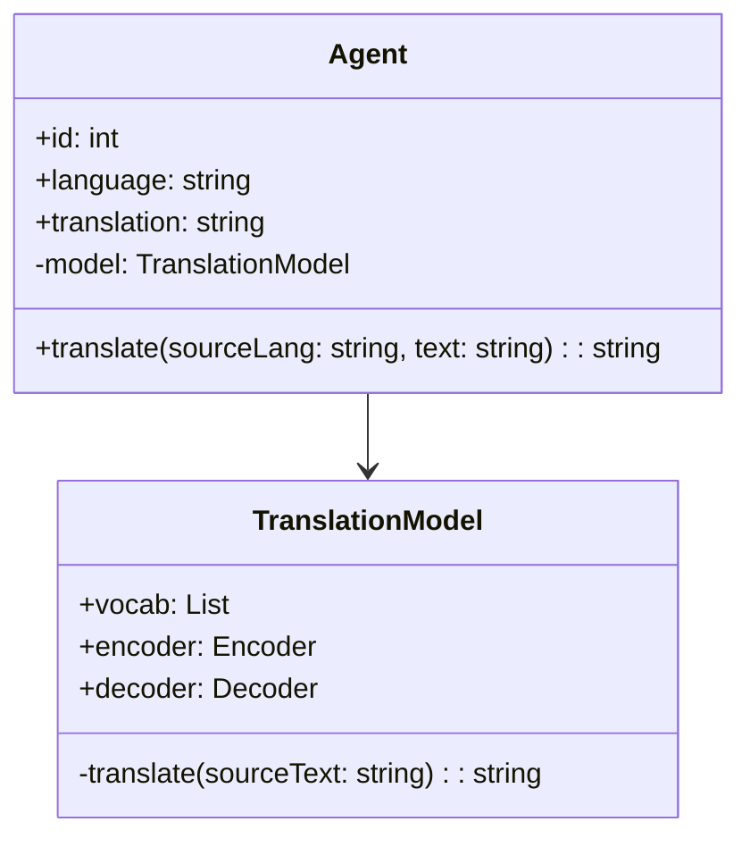
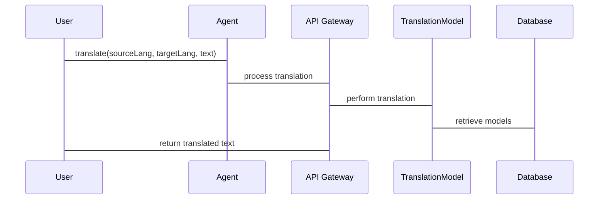

                 


# AI Agent的多语言翻译能力：突破语言障碍

## 关键词：
AI Agent, 多语言翻译, 神经机器翻译, 注意力机制, 多语言模型, 系统架构

## 摘要：
本文深入探讨AI Agent的多语言翻译能力，分析其在突破语言障碍中的作用。从背景、核心概念到算法原理、系统架构，再到项目实战和总结，全面解析AI Agent在多语言翻译中的实现与应用，为技术开发者和研究者提供参考。

---

# 第一部分: AI Agent的多语言翻译能力概述

## 第1章: 问题背景与核心概念

### 1.1 问题背景
#### 1.1.1 多语言翻译的挑战
在国际化环境中，语言障碍一直是信息传递的主要瓶颈。传统的翻译工具受限于规则库或双语对照，翻译准确率和流畅度难以满足需求。AI Agent通过深度学习和自然语言处理技术，能够实时理解上下文，提供更精准的翻译。

#### 1.1.2 AI Agent在多语言翻译中的作用
AI Agent通过整合NLP技术，能够实时响应用户的多语言需求，支持多种语言的双向翻译，解决跨语言沟通问题。

#### 1.1.3 问题的边界与外延
本文主要探讨AI Agent在多语言翻译中的技术实现，暂不涉及语音识别或图像识别等其他AI能力。

### 1.2 核心概念
#### 1.2.1 AI Agent的定义与特点
AI Agent是一种智能代理，能够理解并执行任务，支持多语言交互。

#### 1.2.2 多语言翻译能力的核心要素
- 输入处理：支持多种语言输入
- 翻译引擎：神经机器翻译模型
- 输出优化：语境优化

#### 1.2.3 核心概念的ER实体关系图
```mermaid
er
    actor(Agent, "AI Agent")
    actor(Language, "语言")
    actor(Translation, "翻译结果")
    relation(Agent, "拥有", Translation)
    relation(Language, "支持", Agent)
```

## 第2章: 多语言翻译的实现原理

### 2.1 神经机器翻译模型
#### 2.1.1 编码器-解码器结构


#### 2.1.2 注意力机制


## 第3章: 多语言模型的训练与优化

### 3.1 多语言模型的训练策略
#### 3.1.1 跨语言迁移学习
#### 3.1.2 联合训练方法
#### 3.1.3 基于对比学习的多语言模型优化

### 3.2 模型压缩与轻量化
#### 3.2.1

---

# 第二部分: 系统分析与架构设计方案

## 第4章: 系统架构设计

### 4.1 问题场景介绍
设计一个多语言翻译系统，支持多种语言实时翻译。

### 4.2 项目介绍
一个支持多语言翻译的AI Agent系统。

### 4.3 系统功能设计
#### 4.3.1 领域模型


### 4.4 系统架构设计
```mermaid
graph TD
    Agent --> API Gateway
    API Gateway --> TranslationModel
    TranslationModel --> Database
```

### 4.5 系统接口设计
#### 4.5.1 API接口
```json
{
    "sourceLang": "zh",
    "targetLang": "en",
    "text": "你好"
}
```

### 4.6 系统交互流程


---

# 第三部分: 项目实战

## 第5章: 项目实战

### 5.1 环境安装
安装必要的库，如TensorFlow、Keras等。

### 5.2 系统核心实现源代码
```python
class Encoder:
    def encode(self, text):
        # 编码逻辑
        pass

class Decoder:
    def decode(self, encoded_text):
        # 解码逻辑
        pass

class TranslationModel:
    def __init__(self, encoder, decoder):
        self.encoder = encoder
        self.decoder = decoder

    def translate(self, source_text):
        encoded = self.encoder.encode(source_text)
        result = self.decoder.decode(encoded)
        return result
```

### 5.3 代码应用解读与分析
解释每部分代码的功能和实现逻辑。

### 5.4 实际案例分析
案例分析，展示AI Agent在多语言翻译中的应用。

### 5.5 项目小结
总结项目成果和经验。

---

# 第四部分: 总结与展望

## 第6章: 总结与展望

### 6.1 最佳实践 tips
总结实现AI Agent多语言翻译能力的关键点。

### 6.2 小结
总结全文内容。

### 6.3 注意事项
提醒开发者注意的问题。

### 6.4 拓展阅读
推荐进一步阅读的资料。

---

通过以上步骤，我们详细分析了AI Agent的多语言翻译能力，从理论到实践，帮助读者全面理解其技术实现和应用。

