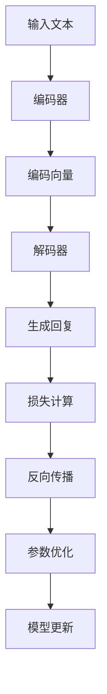
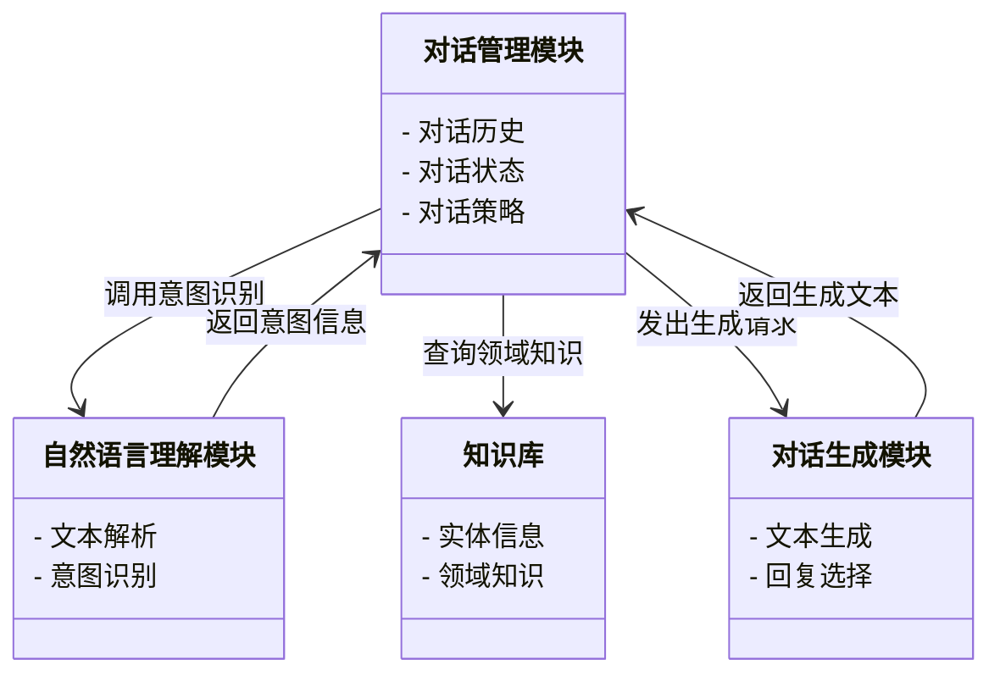
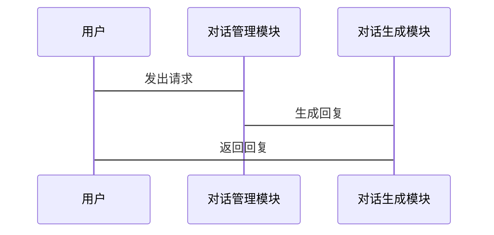

                 


# AI Agent的多轮对话管理系统设计

> 关键词：AI Agent，多轮对话管理，自然语言处理，对话系统，对话状态管理，意图识别

> 摘要：本文系统地探讨了AI Agent在多轮对话管理中的设计与实现。从基础概念到核心算法，从系统架构到项目实战，详细分析了多轮对话管理的各个层面，旨在为读者提供一个全面而深入的指导。

---

## 第一部分: AI Agent与多轮对话管理基础

## 第1章: AI Agent与多轮对话管理概述

### 1.1 AI Agent的基本概念

#### 1.1.1 AI Agent的定义与特点
AI Agent（人工智能代理）是指能够感知环境、自主决策并执行任务的智能体。它具备以下特点：
- **自主性**：能够在没有外部干预的情况下独立运行。
- **反应性**：能够实时感知环境并做出反应。
- **目标导向**：具有明确的目标，并能采取行动以实现目标。
- **学习能力**：能够通过经验或数据改进自身的性能。

#### 1.1.2 多轮对话管理的定义与背景
多轮对话管理是指在多个轮次的对话中，系统能够理解用户意图、保持对话上下文，并生成符合逻辑的回复。随着自然语言处理技术的快速发展，多轮对话管理在智能客服、智能音箱、虚拟助手等领域得到了广泛应用。

#### 1.1.3 AI Agent在对话管理中的作用
AI Agent在多轮对话管理中充当“智能大脑”，负责理解用户需求、规划对话流程，并协调各个模块完成对话任务。

### 1.2 多轮对话管理的核心问题

#### 1.2.1 对话历史与上下文的理解
多轮对话的核心在于理解对话历史，这需要系统能够记住之前的对话内容，并根据上下文生成合适的回复。

#### 1.2.2 对话目标的识别与规划
系统需要明确对话的目标，并根据当前对话状态制定下一步的对话策略。

#### 1.2.3 对话策略的制定与执行
根据对话目标和当前状态，系统需要制定具体的对话策略，并执行相应的操作以实现目标。

### 1.3 多轮对话管理的应用场景

#### 1.3.1 智能客服系统
通过多轮对话管理，智能客服可以更好地理解用户需求，提供更精准的服务。

#### 1.3.2 智能音箱与对话助手
多轮对话管理使智能音箱能够与用户进行更自然的交互，提供更丰富的服务。

#### 1.3.3 游戏AI与虚拟助手
在游戏和虚拟助手领域，多轮对话管理能够增强用户体验，使其更加智能化和个性化。

---

## 第2章: 多轮对话管理的核心概念与联系

### 2.1 对话管理模型的实体关系图

```mermaid
er
    actor: 用户
    agent: AI Agent
    conversation: 对话记录
    intent: 对话意图
    slot: 对话槽位
    action: 对话动作
    actor --> intent: 提出意图
    agent --> action: 执行动作
    conversation --> intent, slot, action: 记录对话信息
```

### 2.2 对话管理模型的属性特征对比

| 概念       | 输入          | 输出          | 功能               |
|------------|---------------|---------------|--------------------|
| 对话意图识别 | 用户输入文本  | 对话意图标签   | 识别用户意图       |
| 对话槽位填充 | 用户输入文本  | 关键信息提取   | 提取关键信息       |
| 对话策略生成 | 对话历史与状态 | 对话动作       | 制定对话策略       |

---

## 第3章: 多轮对话管理的算法原理

### 3.1 对话生成模型的训练流程



对话生成模型的核心是基于生成对抗网络（GAN）或Transformer架构，通过以下公式计算损失函数：

$$
L = \text{交叉熵损失}(y, y_{\text{pred}})
$$

其中，$y$ 是真实标签，$y_{\text{pred}}$ 是模型预测的标签。

---

## 第4章: 多轮对话管理的系统架构

### 4.1 系统功能设计



### 4.2 系统交互设计



---

## 第5章: 多轮对话管理的项目实战

### 5.1 项目介绍

#### 5.1.1 项目背景
我们以智能客服系统为例，展示如何设计一个多轮对话管理系统。

### 5.2 系统实现

#### 5.2.1 环境配置
```bash
pip install python
pip install transformers
pip install numpy
```

#### 5.2.2 核心代码实现

```python
class DialogManager:
    def __init__(self):
        self.conversation_history = []
        self.current_state = None

    def process_input(self, input_text):
        # 分析输入文本
        intent = self.nlu_module.get_intent(input_text)
        slots = self.nlu_module.get_slots(input_text)
        self.conversation_history.append((intent, slots))
        self.current_state = intent

    def generate_response(self):
        # 根据当前状态生成回复
        response = self.generator.generate_response(self.current_state)
        return response
```

---

## 第6章: 多轮对话管理的最佳实践

### 6.1 设计原则

1. **保持对话连贯性**：确保每次回复都与前文相关联。
2. **关注上下文**：系统需要实时更新对话上下文。
3. **灵活应对变化**：能够根据用户反馈调整对话策略。

### 6.2 性能优化

1. **使用缓存技术**：减少重复计算，提高系统响应速度。
2. **并行处理**：充分利用多核处理器，提高处理效率。

### 6.3 安全性与隐私保护

1. **数据加密**：确保用户数据的安全性。
2. **访问控制**：限制未经授权的访问。

### 6.4 可扩展性

1. **模块化设计**：便于后续功能的扩展。
2. **接口标准化**：方便与其他系统的集成。

---

## 第7章: 附录

### 7.1 工具与资源

- **Python库**：transformers、numpy、scikit-learn。
- **开发框架**：Flask、Django。
- **数据集**：公开的对话数据集（如Persona Chat）。

---

## 总结

本文系统地探讨了AI Agent在多轮对话管理中的设计与实现，从基础概念到算法原理，从系统架构到项目实战，为读者提供了一个全面而深入的指导。通过本文的学习，读者可以掌握多轮对话管理的核心技术，并将其应用到实际项目中。

