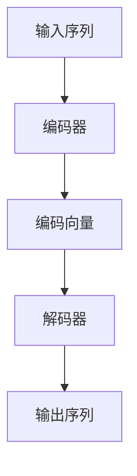
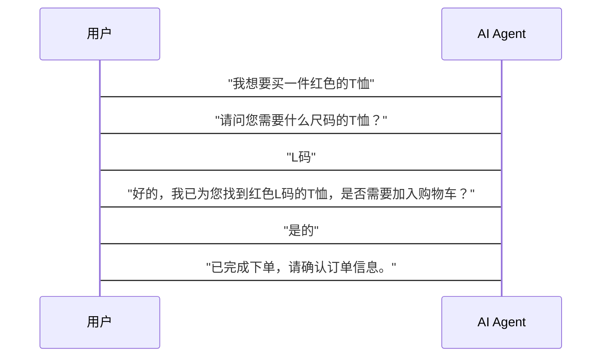

                 


# AI Agent的多轮对话能力优化

## 关键词：AI Agent，多轮对话，自然语言处理，对话系统，优化算法

## 摘要：  
AI Agent的多轮对话能力优化是当前人工智能领域的重要研究方向。随着自然语言处理技术的快速发展，AI Agent需要能够理解用户意图、保持对话连贯性并提供高效的服务。本文从AI Agent的基本概念出发，详细分析了多轮对话的核心原理、优化算法、系统设计和实际应用案例，最后总结了优化策略和未来发展方向。通过本文的深入探讨，读者可以全面理解如何优化AI Agent的多轮对话能力，从而提升用户体验和系统性能。

---

## 第一部分: AI Agent与多轮对话概述

### 第1章: AI Agent的基本概念与多轮对话的重要性

#### 1.1 AI Agent的基本概念
AI Agent（人工智能代理）是一种能够感知环境、自主决策并执行任务的智能实体。它能够通过与用户的交互，理解用户需求，并通过内部逻辑推理提供相应的服务。AI Agent的核心特点包括智能性、自主性、反应性和社会性。

#### 1.2 多轮对话的基本概念
多轮对话是指用户与AI Agent之间通过多轮交互完成一次完整的任务。与单轮对话相比，多轮对话更注重对话的连贯性和上下文的理解。例如，在电商场景中，用户可能需要通过多轮对话完成商品咨询、下单和支付等操作。

#### 1.3 多轮对话的重要性
在实际应用场景中，多轮对话能够显著提升用户体验。通过理解对话历史，AI Agent可以更好地捕捉用户需求，提供更精准的服务。此外，多轮对话还能提高系统的健壮性，使其能够处理复杂的对话场景。

#### 1.4 AI Agent在多轮对话中的角色
AI Agent在多轮对话中扮演着核心角色，包括：
- **理解用户意图**：通过自然语言处理技术解析用户的输入。
- **维护对话状态**：记录对话历史，跟踪用户需求的变化。
- **生成回复**：基于对话状态和用户意图生成合适的回复。

---

## 第二部分: 多轮对话的核心概念与原理

### 第2章: 多轮对话的组成与流程

#### 2.1 多轮对话的组成
多轮对话主要由以下部分组成：
- **用户输入**：用户的自然语言输入，如“我想要买一件红色的T恤”。
- **对话历史**：记录所有历史对话内容，用于理解当前对话的上下文。
- **对话状态**：反映当前对话的进展，包括用户的需求、已提供的信息等。
- **系统输出**：AI Agent根据对话历史和当前输入生成的回复。

#### 2.2 多轮对话的流程
多轮对话的流程可以分为以下几个阶段：
1. **初始对话**：用户提出需求，AI Agent理解并确认需求。
2. **对话延续**：根据用户反馈，逐步细化需求，提供相关信息。
3. **对话终止**：完成任务或确认需求无法满足，结束对话。

#### 2.3 多轮对话的关键技术
- **意图识别**：通过自然语言处理技术识别用户的意图。
- **对话状态管理**：维护对话历史，跟踪用户需求的变化。
- **槽位填充**：提取用户输入中的关键信息，如商品名称、价格范围等。

---

## 第三部分: 多轮对话的算法原理

### 第3章: 基于Seq2Seq的多轮对话模型

#### 3.1 Seq2Seq模型的基本原理
Seq2Seq模型是一种经典的序列到序列模型，广泛应用于机器翻译和对话生成任务。其核心思想是通过编码器将输入序列编码为一个固定长度的向量，然后通过解码器将该向量解码为输出序列。

##### 3.1.1 编码器
编码器将输入序列转换为一个固定长度的向量，表示输入的语义信息。编码器通常由RNN（循环神经网络）或Transformer模型实现。

##### 3.1.2 解码器
解码器根据编码器生成的向量，逐步生成输出序列。解码器同样可以使用RNN或Transformer模型。

##### 3.1.3 注意力机制
注意力机制是一种用于Seq2Seq模型的关键技术，能够提高模型对输入序列中关键部分的重视。通过计算输入序列中每个词与当前输出词的相关性，模型能够更好地捕捉上下文信息。

##### 3.1.4 模型流程图


#### 3.2 Seq2Seq模型的数学模型
Seq2Seq模型的编码器和解码器通常使用RNN或Transformer实现。以下是一个简化的Seq2Seq模型的数学表达式：

$$
\text{编码器: } x_i = \text{RNN}(x_{i-1}, x_0)
$$

$$
\text{解码器: } y_i = \text{RNN}(y_{i-1}, c)
$$

其中，\( c \) 是编码器生成的编码向量。

#### 3.3 Seq2Seq模型的优缺点
- **优点**：能够处理长序列，捕捉上下文信息。
- **缺点**：训练复杂，对稀见词汇的处理能力较弱。

---

## 第四部分: 多轮对话的系统设计与优化

### 第4章: 多轮对话系统的分析与设计

#### 4.1 系统功能设计
多轮对话系统需要实现以下功能：
- **意图识别**：准确识别用户的意图。
- **对话状态管理**：维护对话历史，跟踪用户需求。
- **槽位填充**：提取关键信息，生成回复。

#### 4.2 系统架构设计
多轮对话系统的架构通常包括以下几个部分：
- **输入层**：接收用户的输入。
- **处理层**：解析输入，生成回复。
- **输出层**：将回复返回给用户。

#### 4.3 系统交互流程图


---

## 第五部分: 项目实战

### 第5章: 多轮对话优化的项目实现

#### 5.1 项目背景与目标
本项目旨在优化AI Agent的多轮对话能力，提升用户体验。我们选择一个电商客服对话系统作为案例，通过优化对话流程和算法，提高对话的准确性和连贯性。

#### 5.2 项目环境安装
```bash
pip install numpy
pip install tensorflow
pip install transformers
```

#### 5.3 核心实现代码
```python
from transformers import AutoTokenizer, AutoModelForSeq2Seq
import torch

tokenizer = AutoTokenizer.from_pretrained("facebook/bart-large")
model = AutoModelForSeq2Seq.from_pretrained("facebook/bart-large")

def generate_response(input_text):
    inputs = tokenizer.encode(input_text, return_tensors="pt")
    outputs = model.generate(inputs, max_length=50, num_beams=5)
    response = tokenizer.decode(outputs[0], skip_special_tokens=True)
    return response

input_text = "我想要买一件红色的T恤"
response = generate_response(input_text)
print(response)
```

#### 5.4 代码解读与分析
- **输入处理**：将用户输入编码为模型可接受的格式。
- **模型生成**：使用Seq2Seq模型生成回复。
- **输出处理**：将生成的回复解码为自然语言。

#### 5.5 实际案例分析
通过上述代码实现的电商客服对话系统，能够准确理解用户需求并生成连贯的回复。例如：
- 用户输入：“我想要买一件红色的T恤。”
- 系统回复：“请问您需要什么尺码的T恤？”

---

## 第六部分: 优化策略与总结

### 第6章: 多轮对话优化策略

#### 6.1 数据增强
通过增加训练数据的多样性和质量，提高模型的泛化能力。

#### 6.2 模型微调
在特定领域数据上对模型进行微调，提升模型在该领域的表现。

#### 6.3 对话策略优化
通过优化对话策略，提高对话的连贯性和用户体验。

#### 6.4 最佳实践
- **数据多样性**：确保训练数据覆盖各种场景。
- **模型选择**：根据具体任务选择合适的模型。
- **持续优化**：定期更新模型和对话策略。

---

## 第七部分: 未来展望

### 第7章: 多轮对话能力优化的未来方向

#### 7.1 结合大模型
未来，多轮对话能力优化将更加依赖于大模型，如GPT-3、GPT-4等，通过强大的语言理解能力提升对话质量。

#### 7.2 跨模态对话
随着多模态技术的发展，未来的多轮对话将不仅仅局限于文本，还将结合图像、语音等多种模态信息。

#### 7.3 个性化对话
通过用户画像和行为分析，实现个性化的对话服务，提升用户体验。

---

## 总结

通过本文的详细探讨，我们可以看到，AI Agent的多轮对话能力优化是一个复杂而重要的任务。从算法原理到系统设计，再到实际应用，每一个环节都需要深入思考和实践。未来，随着技术的进步，多轮对话能力优化将更加智能化和个性化，为用户提供更高效、更贴心的服务。

