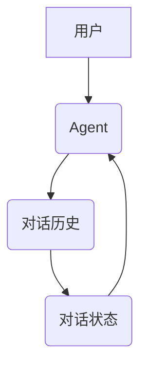
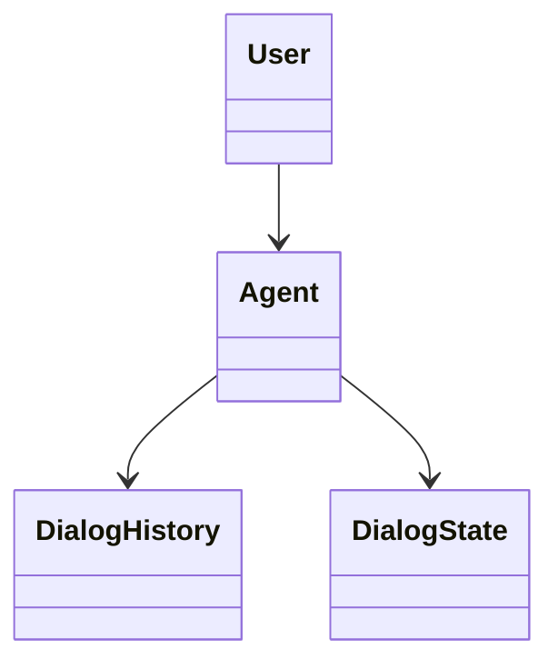
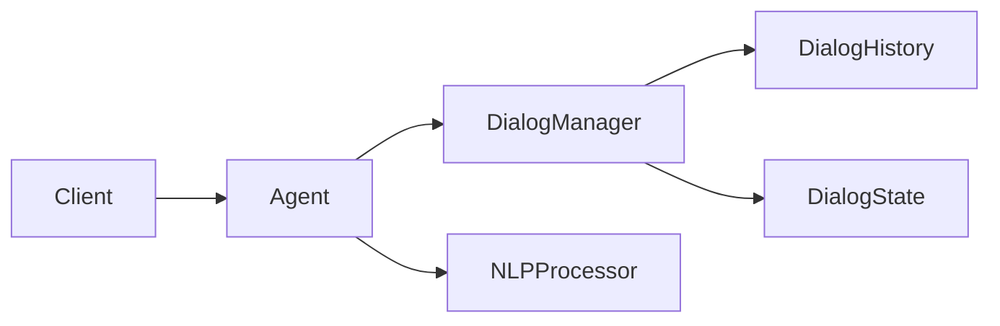

                 


# AI Agent的多轮对话能力增强

## 关键词：AI Agent，多轮对话，自然语言处理，对话系统，机器学习

## 摘要

本文深入探讨了AI Agent在多轮对话能力方面的增强方法，分析了当前多轮对话中存在的问题，并提出了基于自然语言处理和机器学习的解决方案。文章从理论到实践，详细讲解了多轮对话的关键原理、算法实现、系统架构设计以及项目实战，帮助读者全面理解并提升AI Agent的多轮对话能力。

---

# 正文

## 第1章 AI Agent与多轮对话概述

### 1.1 AI Agent的基本概念

#### 1.1.1 AI Agent的定义与特点
AI Agent（人工智能代理）是一种能够感知环境、自主决策并执行任务的智能体。其特点包括：
- **自主性**：无需外部干预，自主完成任务。
- **反应性**：能够实时感知环境并做出反应。
- **目标导向**：基于目标驱动行为。
- **学习能力**：通过数据和经验不断优化性能。

#### 1.1.2 多轮对话的基本概念
多轮对话是指用户与AI Agent之间进行的多轮交互，每一轮对话都基于前一轮的信息进行。其特点包括：
- **连续性**：对话在时间上具有延续性。
- **上下文依赖**：每一轮对话都依赖于之前的对话内容。
- **复杂性**：需要处理用户的意图、情感、上下文等多种信息。

#### 1.1.3 多轮对话在AI Agent中的重要性
多轮对话能力是AI Agent实现高效人机交互的核心能力。增强多轮对话能力可以显著提升用户体验，使其更加自然、流畅。

### 1.2 多轮对话的背景与问题背景

#### 1.2.1 当前AI Agent对话中的问题
当前AI Agent在多轮对话中存在以下问题：
- **上下文理解不足**：无法有效记忆和利用之前的对话内容。
- **对话连贯性差**：回答可能与上下文脱节，显得生硬。
- **意图识别不准确**：难以准确理解用户的深层需求。

#### 1.2.2 多轮对话能力增强的必要性
随着AI Agent应用场景的扩大（如智能客服、虚拟助手等），增强多轮对话能力是实现更高效、更自然人机交互的关键。

#### 1.2.3 多轮对话能力增强的目标与边界
目标：通过技术手段增强AI Agent的多轮对话能力，使其能够更准确地理解和生成对话内容。
边界：不涉及其他领域（如视觉识别、数据分析等），专注于对话能力的提升。

### 1.3 多轮对话的核心概念与联系

#### 1.3.1 多轮对话的关键原理
- **对话上下文处理**：理解和利用对话历史信息。
- **对话状态管理**：跟踪对话的状态和进展。
- **对话历史利用**：基于历史信息生成连贯的回答。

#### 1.3.2 核心概念对比与ER实体关系图

##### 1.3.2.1 不同模型的对话能力对比（表格形式）
| 模型名称       | 对话能力特点                   | 优点                       | 缺点                       |
|----------------|-------------------------------|---------------------------|---------------------------|
| 基于规则的模型 | 预定义规则，简单可控         | 实现简单                   | 灵活性差                   |
| RNN模型        | 基于序列数据，捕捉上下文信息   | 能够处理长序列             | 训练时间较长               |
| Transformer模型 | 基于自注意力机制，全局上下文   | 并行处理能力强             | 参数量大                   |

##### 1.3.2.2 多轮对话中的实体关系（Mermaid图）


---

## 第2章 多轮对话的算法原理

### 2.1 序列到序列模型

#### 2.1.1 模型结构与工作流程（Mermaid图）
```mermaid
graph LR
    Encoder -> Decoder
    Decoder -> 输出
```

#### 2.1.2 算法实现的Python代码示例
```python
import torch
import torch.nn as nn

class Seq2Seq(nn.Module):
    def __init__(self, input_size, hidden_size, output_size):
        super(Seq2Seq, self).__init__()
        self.encoder = nn.LSTM(input_size, hidden_size)
        self.decoder = nn.LSTM(hidden_size, hidden_size)
        self.fc = nn.Linear(hidden_size, output_size)

    def forward(self, input, hidden):
        encoded, _ = self.encoder(input, hidden)
        decoded, _ = self.decoder(encoded, hidden)
        output = self.fc(decoded)
        return output
```

#### 2.1.3 数学模型与公式
- 编码器：$f_{\text{enc}}(x) = h_{\text{enc}}$
- 解码器：$f_{\text{dec}}(h_{\text{enc}}, y_{<t}) = h_{\text{dec}}$
- 输出概率：$P(y_t|x) = \text{softmax}(W_{\text{out}}h_{\text{dec}})$

---

### 2.2 注意力机制在多轮对话中的应用

#### 2.2.1 注意力机制的原理（Mermaid图）
```mermaid
graph LR
    Encoder -> Attention
    Attention -> Decoder
```

#### 2.2.2 基于注意力机制的对话模型实现
```python
import torch
import torch.nn as nn

class Attention(nn.Module):
    def __init__(self, hidden_size):
        super(Attention, self).__init__()
        self.weight = nn.Parameter(torch.randn(hidden_size, hidden_size))

    def forward(self, query, keys):
        energies = torch.bmm(query.unsqueeze(1), keys.unsqueeze(2) @ self.weight)
        attention = torch.softmax(energies, dim=2)
        return attention
```

---

## 第3章 系统分析与架构设计

### 3.1 项目场景与需求分析

#### 3.1.1 问题场景介绍
AI Agent需要在实际应用场景中支持多轮对话，例如智能客服、虚拟助手等。

#### 3.1.2 项目目标与需求
目标：提升AI Agent的多轮对话能力，使其能够更准确地理解和生成对话内容。

需求：
- 实现对话历史的存储与利用。
- 管理对话状态，跟踪对话进展。
- 支持多轮对话中的上下文理解与生成。

### 3.2 系统功能设计

#### 3.2.1 领域模型设计（Mermaid类图）


#### 3.2.2 系统架构设计（Mermaid架构图）


---

## 第4章 项目实战与实现

### 4.1 环境安装与数据准备

#### 4.1.1 开发环境配置
- Python 3.8+
- PyTorch 1.9+
- Transformers库

#### 4.1.2 数据集收集与预处理
- 数据来源：公开对话数据集（如Cornell Movie Dialogs Dataset）
- 数据清洗：去除无关内容，标注对话角色。

### 4.2 核心算法实现

#### 4.2.1 对话模型训练代码
```python
import torch
from torch.utils.data import Dataset, DataLoader

class DialogDataset(Dataset):
    def __init__(self, data):
        self.data = data

    def __len__(self):
        return len(self.data)

    def __getitem__(self, idx):
        return self.data[idx]

def train_model(model, dataloader, optimizer, criterion, num_epochs):
    for epoch in range(num_epochs):
        for inputs, labels in dataloader:
            outputs = model(inputs)
            loss = criterion(outputs, labels)
            optimizer.zero_grad()
            loss.backward()
            optimizer.step()
```

#### 4.2.2 对话管理模块实现
```python
class DialogManager:
    def __init__(self):
        self.dialog_history = []
        self.dialog_state = {}

    def add_to_history(self, utterance):
        self.dialog_history.append(utterance)

    def update_state(self, state):
        self.dialog_state.update(state)
```

### 4.3 实际案例分析与解读
通过实际案例分析，展示AI Agent如何利用增强的多轮对话能力与用户进行高效交互。

---

## 第5章 总结与展望

### 5.1 实践中的注意事项
- 数据质量对模型性能影响重大。
- 对话模型需要不断优化和更新。
- 需要关注用户隐私和数据安全。

### 5.2 小结
通过本文的讲解，读者可以全面理解AI Agent多轮对话能力的增强方法，并掌握其实现技巧。

### 5.3 注意事项
- 在实际应用中，需注意对话模型的鲁棒性和健壮性。
- 定期更新模型以适应用户需求的变化。

### 5.4 拓展阅读
- 推荐阅读相关领域的最新论文和技术博客。

---

通过以上内容，本文系统地介绍了AI Agent多轮对话能力的增强方法，从理论到实践，为读者提供了全面的知识和指导。

