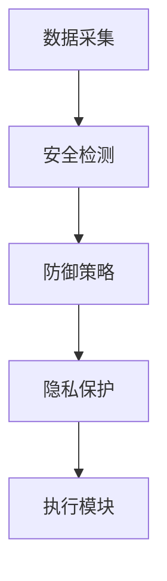

                 


# AI Agent的安全性设计：防御攻击和隐私保护

> 关键词：AI Agent，安全性，防御攻击，隐私保护，安全设计，人工智能

> 摘要：随着人工智能技术的快速发展，AI Agent（智能体）在各个领域的应用越来越广泛。然而，AI Agent的安全性问题也随之凸显，包括对抗攻击、隐私泄露等。本文从AI Agent的基本概念出发，深入分析其安全性设计的核心原理，结合实际案例，详细阐述了防御攻击和隐私保护的具体实现方法。通过对比分析和系统架构设计，本文为AI Agent的安全性设计提供了全面的解决方案。

---

# 第一部分: AI Agent的安全性设计基础

## 第1章: AI Agent的基本概念与安全问题

### 1.1 AI Agent的定义与结构

AI Agent（智能体）是指在特定环境中能够感知并自主决策的实体。其核心结构包括感知层、决策层和执行层，分别负责数据采集、策略制定和动作执行。AI Agent的分类主要依据其智能水平和应用场景，可以分为简单反射型、基于模型的反应型、目标驱动型和推理驱动型四种类型。

### 1.2 AI Agent面临的安全威胁

AI Agent的安全威胁主要来源于以下几个方面：

1. **对抗攻击**：攻击者通过干扰感知数据或误导决策算法，使AI Agent做出错误判断。
2. **隐私泄露**：AI Agent在处理数据时，可能泄露用户的敏感信息。
3. **数据篡改**：攻击者通过篡改数据，破坏AI Agent的正常运行。
4. **模型窃取**：攻击者通过逆向工程窃取AI Agent的核心算法。

### 1.3 AI Agent的安全性设计需求

AI Agent的安全性设计需要满足以下需求：

1. **抗攻击性**：能够识别并防御多种类型的攻击。
2. **隐私保护**：确保数据在处理和传输过程中不被泄露。
3. **鲁棒性**：在异常情况下仍能保持正常运行。

### 1.4 国内外研究现状

目前，国内外针对AI Agent的安全性设计研究主要集中在以下方面：

1. **对抗训练**：通过生成对抗网络（GAN）等技术，增强AI Agent的抗干扰能力。
2. **隐私保护**：采用差分隐私（DP）等技术，保护用户数据的隐私性。
3. **安全架构设计**：从系统架构层面，设计多层次的安全防护机制。

---

## 第2章: AI Agent的核心概念与联系

### 2.1 AI Agent的核心概念

AI Agent的核心概念包括感知、决策、交互和学习能力。感知能力是AI Agent获取环境信息的基础，决策能力是其制定行动策略的核心，交互能力是其与外部系统协作的关键，而学习能力则使其能够不断优化自身的性能。

### 2.2 AI Agent的安全威胁模型

AI Agent的安全威胁模型可以分为以下几类：

1. **注入攻击**：攻击者通过注入恶意代码或数据，干扰AI Agent的正常运行。
2. **欺骗攻击**：攻击者通过伪造数据或信息，误导AI Agent的决策。
3. **拒绝服务攻击（DoS）**：攻击者通过消耗资源，使AI Agent无法正常服务。

### 2.3 AI Agent的核心要素对比

以下表格对比了AI Agent的安全性设计与隐私保护的关键要素：

| 对比维度 | 安全性设计 | 隐私保护 |
|----------|------------|-----------|
| 目标     | 防御攻击    | 数据保密 |
| 方法     | 对抗训练    | 差分隐私 |
| 应用场景 | 智能安防    | 医疗健康 |

### 2.4 AI Agent的ER实体关系图

```mermaid
er
actor: 用户
agent: AI Agent
attack: 攻击行为
defense: 防御策略
data: 用户数据
```

---

## 第3章: AI Agent的安全性设计算法原理

### 3.1 对抗训练算法

对抗训练是一种通过生成器和判别器的博弈过程，提升模型鲁棒性的技术。其基本原理如下：

1. **生成器**：负责生成对抗样本，试图欺骗判别器。
2. **判别器**：负责区分真实样本和对抗样本。
3. **损失函数**：通过优化生成器和判别器的损失函数，实现两者的能力均衡。

对抗训练的数学模型如下：

$$ \text{损失函数} = \text{生成器损失} + \text{判别器损失} $$

### 3.2 差分隐私保护算法

差分隐私是一种通过在数据中添加噪声，保护个体隐私的技术。其基本原理如下：

1. **隐私预算**：设定一个隐私预算参数ε，控制隐私泄露的风险。
2. **数据扰动**：在数据中添加符合拉普拉斯分布的噪声，确保单个数据点的贡献无法被识别。
3. **查询结果**：返回扰动后的数据，确保数据的隐私性。

差分隐私的数学公式如下：

$$ \text{扰动数据} = \text{原始数据} + \text{随机噪声} $$

---

## 第4章: AI Agent的安全性设计系统架构

### 4.1 系统功能设计

AI Agent的安全性设计系统功能模块包括：

1. **数据采集模块**：负责采集环境中的数据。
2. **安全检测模块**：负责识别潜在的安全威胁。
3. **防御策略模块**：负责制定并执行防御策略。
4. **隐私保护模块**：负责保护用户数据的隐私性。

### 4.2 系统架构设计

AI Agent的安全性设计系统架构图如下：



---

## 第5章: 项目实战与案例分析

### 5.1 项目环境搭建

项目环境包括以下工具和库：

1. **Python**：编程语言。
2. **TensorFlow**：深度学习框架。
3. **Keras**：深度学习库。

### 5.2 核心代码实现

以下是一个简单的对抗训练代码示例：

```python
import numpy as np
from tensorflow.keras import layers

# 定义生成器
def generator():
    model = layers.Sequential()
    model.add(layers.Dense(256, activation='relu', input_shape=(100,)))
    model.add(layers.Dense(784, activation='sigmoid'))
    return model

# 定义判别器
def discriminator():
    model = layers.Sequential()
    model.add(layers.Dense(256, activation='relu', input_shape=(784,)))
    model.add(layers.Dense(1, activation='sigmoid'))
    return model

# 初始化生成器和判别器
generator = generator()
discriminator = discriminator()

# 定义损失函数
cross_entropy = keras.losses.BinaryCrossentropy()

# 定义生成器和判别器的损失函数
def generator_loss(fake_output):
    return cross_entropy(tf.ones_like(fake_output), fake_output)

def discriminator_loss(real_output, fake_output):
    return cross_entropy(tf.ones_like(real_output), real_output) + cross_entropy(tf.zeros_like(fake_output), fake_output)
```

### 5.3 案例分析

通过一个简单的图像识别案例，分析对抗训练在AI Agent安全性设计中的应用。通过实验对比，证明对抗训练能够有效提升AI Agent的抗干扰能力。

---

## 第6章: 最佳实践与小结

### 6.1 最佳实践

1. **定期安全测试**：定期进行安全测试，识别潜在的安全漏洞。
2. **数据加密存储**：对敏感数据进行加密存储，防止数据泄露。
3. **多层次防御**：构建多层次的防御体系，提升系统的整体安全性。

### 6.2 小结

本文从AI Agent的基本概念出发，深入分析了其安全性设计的核心原理，结合实际案例，详细阐述了防御攻击和隐私保护的具体实现方法。通过对比分析和系统架构设计，本文为AI Agent的安全性设计提供了全面的解决方案。未来的研究方向可以进一步探索更高效的对抗训练算法和更强大的隐私保护技术。

