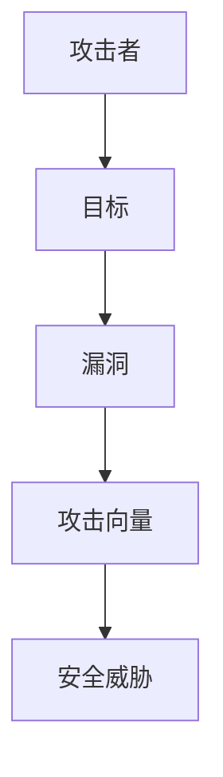
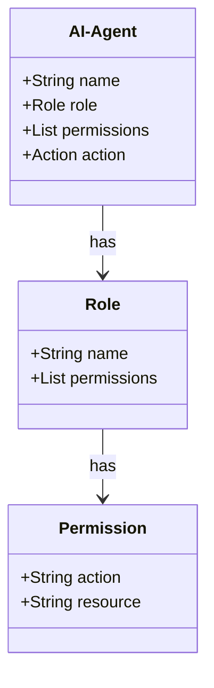
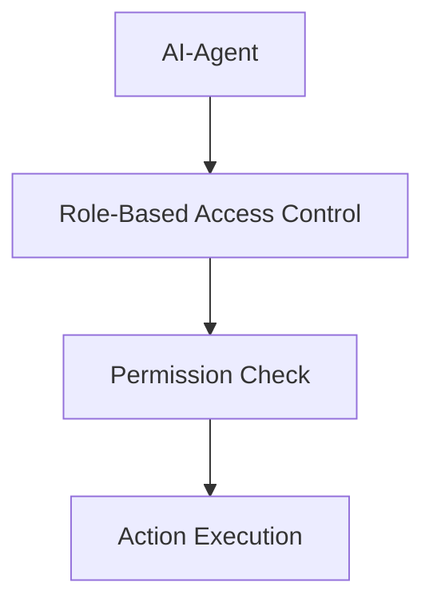

                 


# AI Agent的安全性设计：防范潜在风险

## 关键词：
AI Agent, 安全性设计, 潜在风险, 威胁模型, 安全策略

## 摘要：
随着人工智能技术的快速发展，AI Agent（智能体）在各个领域的应用越来越广泛。然而，AI Agent的安全性问题也随之凸显，如数据泄露、恶意攻击、隐私侵犯等。本文将深入探讨AI Agent的安全性设计，分析其潜在风险，并提出相应的防范措施。通过构建安全威胁模型，制定合理的安全策略，优化系统架构设计，确保AI Agent在实际应用中的安全性和可靠性。

---

## 第一部分: AI Agent的安全性设计背景与核心概念

### 第1章: AI Agent的基本概念与问题背景

#### 1.1 AI Agent的定义与核心要素
AI Agent（智能体）是指在计算机环境中能够感知环境并采取行动以实现目标的实体。其核心要素包括：
- **智能性**：能够理解、学习和推理。
- **自主性**：无需外部干预，自主决策。
- **反应性**：能够实时感知环境变化并做出反应。
- **主动性**：主动采取行动以实现目标。

#### 1.2 AI Agent的安全性问题背景
随着AI Agent在各个领域的广泛应用，其安全性问题日益重要。常见的安全性问题包括：
- **数据泄露**：AI Agent可能收集和处理大量敏感数据，存在被恶意攻击的风险。
- **恶意攻击**：攻击者可能通过漏洞控制AI Agent，导致其行为失控。
- **隐私侵犯**：AI Agent在处理用户数据时可能违反隐私保护规定。

#### 1.3 AI Agent的安全性问题描述
AI Agent的安全性问题主要来源于以下几个方面：
- **数据层面**：数据的收集、存储和传输过程中的安全漏洞。
- **算法层面**：算法可能存在偏见或被攻击者利用的漏洞。
- **系统层面**：系统架构设计不合理，存在未授权访问的风险。

#### 1.4 本章小结
本章介绍了AI Agent的基本概念及其安全性问题的背景，明确了安全性设计的重要性与目标。

---

## 第二部分: AI Agent的安全性核心概念与关联

### 第2章: AI Agent的安全威胁模型与分析

#### 2.1 AI Agent的安全威胁模型
安全威胁模型是分析AI Agent潜在风险的重要工具。以下是一个基于威胁建模的AI Agent安全分析框架：



#### 2.2 AI Agent的安全威胁分类
AI Agent的安全威胁可以分为以下几类：
- **基于攻击目标的分类**：
  - 数据窃取
  - 服务拒绝
- **基于攻击手段的分类**：
  - 拒绝服务攻击（DoS）
  - 伪装攻击
- **基于攻击影响的分类**：
  - 信息泄露
  - 行为篡改

#### 2.3 AI Agent安全威胁的特征对比
以下是几种常见安全威胁的特征对比：

| 威胁类型 | 攻击目标 | 攻击手段 | 攻击影响 |
|----------|-----------|----------|----------|
| 数据窃取 | 数据存储 | 窃取数据 | 数据泄露 |
| 服务拒绝 | 服务可用性 | DoS攻击 | 服务瘫痪 |
| 伪装攻击 | 系统完整性 | 模拟合法用户 | 系统误操作 |

---

### 第3章: AI Agent的安全性设计原则与方法

#### 3.1 AI Agent安全性设计的基本原则
- **安全性优先原则**：在设计和实现AI Agent时，优先考虑安全性。
- **最小权限原则**：确保每个组件仅拥有完成任务所需的最小权限。
- **可观测性与可调试性原则**：设计时便于监控和调试，以便及时发现和修复问题。

#### 3.2 AI Agent安全性设计的核心方法
- **基于角色的访问控制（RBAC）模型**：
  - 定义用户角色和权限。
  - 确保每个角色只能访问其权限范围内的资源。

- **基于属性的访问控制（ABAC）模型**：
  - 结合属性（如时间、位置）动态调整访问权限。

- **基于上下文的动态访问控制**：
  - 根据上下文信息（如环境、用户状态）动态调整访问控制策略。

#### 3.3 AI Agent安全性设计的实现机制
- **安全策略的制定与执行**：制定明确的安全策略并确保其被执行。
- **安全审计与日志管理**：定期审计日志，发现异常行为。
- **安全漏洞的检测与修复**：定期进行安全测试，修复漏洞。

---

## 第三部分: AI Agent安全性设计的算法原理与数学模型

### 第4章: AI Agent安全性设计的算法原理

#### 4.1 基于概率论的威胁检测算法

##### 4.1.1 基于贝叶斯定理的威胁检测
贝叶斯定理可以用于计算某个事件发生的概率，从而帮助识别潜在威胁。例如：

$$ P(A|B) = \frac{P(B|A) \cdot P(A)}{P(B)} $$

其中：
- $P(A|B)$ 是在事件B发生的条件下，事件A发生的概率。
- $P(B|A)$ 是在事件A发生的条件下，事件B发生的概率。
- $P(A)$ 是事件A发生的先验概率。
- $P(B)$ 是事件B发生的总概率。

##### 4.1.2 威胁检测算法实现
以下是基于贝叶斯定理的威胁检测算法实现的伪代码：

```python
def bayesian_threat_detection(prior_prob_A, prob_B_given_A, prob_B):
    posterior_prob = (prob_B_given_A * prior_prob_A) / prob_B
    return posterior_prob
```

##### 4.1.3 示例
假设：
- $P(A) = 0.1$（事件A发生的先验概率）
- $P(B|A) = 0.9$（在事件A发生的情况下，事件B发生的概率）
- $P(B) = 0.2$（事件B发生的总概率）

则：

$$ P(A|B) = \frac{0.9 \times 0.1}{0.2} = 0.45 $$

这意味着在事件B发生的情况下，事件A发生的概率为45%。

---

## 第五部分: 项目实战

### 第5章: AI Agent安全性设计的项目实战

#### 5.1 项目环境安装
以下是一个基于Python的AI Agent安全性设计的项目环境安装步骤：

1. 安装Python和必要的开发工具。
2. 安装依赖库：
   ```bash
   pip install numpy pandas scikit-learn
   ```

#### 5.2 系统功能设计
以下是AI Agent安全性设计的领域模型：



#### 5.3 系统架构设计
以下是AI Agent的安全架构设计：



#### 5.4 系统核心实现源代码
以下是AI Agent安全性设计的核心代码实现：

```python
class AIAgent:
    def __init__(self, name, role):
        self.name = name
        self.role = role
        self.permissions = self.role.permissions

    def execute_action(self, action):
        if action in self.permissions:
            print(f"{self.name}执行了{action}操作。")
            return True
        else:
            print(f"{self.name}没有权限执行{action}操作。")
            return False

class Role:
    def __init__(self, name, permissions):
        self.name = name
        self.permissions = permissions

class Permission:
    def __init__(self, action, resource):
        self.action = action
        self.resource = resource

# 示例用法
role_admin = Role("admin", [
    Permission("read", "data"),
    Permission("write", "data")
])
agent = AIAgent("AI-Agent-1", role_admin)
agent.execute_action("read data")  # 返回True
agent.execute_action("delete data")  # 返回False
```

#### 5.5 案例分析与详细解读
通过上述代码示例，我们可以看到：
- AI Agent在执行操作前会检查权限。
- 如果权限不足，会拒绝执行操作。
- 通过这种方式，可以有效防止未授权的操作，保障系统的安全性。

---

## 第六部分: 最佳实践

### 第6章: AI Agent安全性设计的最佳实践

#### 6.1 小结
通过本文的探讨，我们了解了AI Agent的安全性设计的重要性，以及如何通过威胁模型、安全策略和系统架构设计来防范潜在风险。

#### 6.2 注意事项
- 定期进行安全测试和漏洞扫描。
- 确保所有组件的权限最小化。
- 及时更新安全策略和系统补丁。

#### 6.3 拓展阅读
- 《Building Secure AI Systems》
- 《Applied Cryptography》

---

## 结语
AI Agent的安全性设计是一个复杂但至关重要的任务。通过构建威胁模型、制定安全策略、优化系统架构，我们可以有效防范潜在风险，确保AI Agent的安全性和可靠性。希望本文对读者在AI Agent的安全性设计方面有所帮助。

