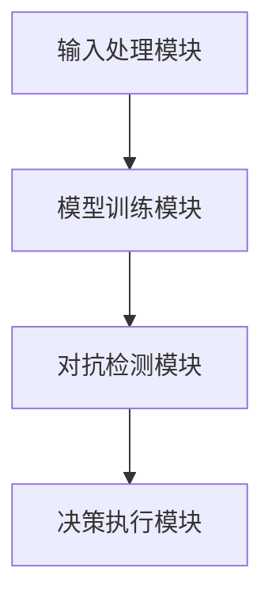
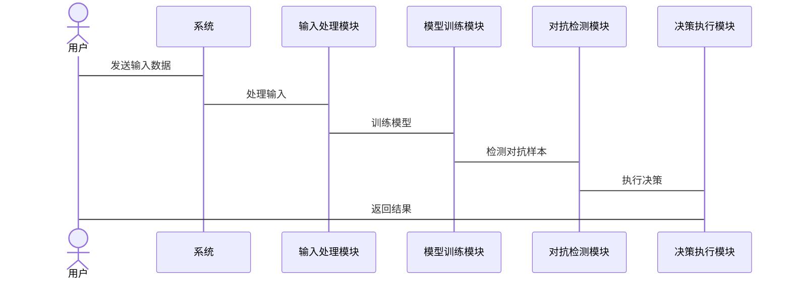

                 


# AI Agent的安全性：防御对抗性攻击

> 关键词：AI Agent，对抗性攻击，安全性，防御机制，深度学习，模型鲁棒性

> 摘要：本文深入探讨了AI Agent在面对对抗性攻击时的安全性问题，分析了对抗性攻击的原理、影响及其防御策略。文章从AI Agent的基本概念出发，逐步解析对抗性攻击的生成方法和防御机制，结合实际案例和系统架构设计，提供了一套完整的防御方案。通过详细的算法原理和代码实现，帮助读者全面理解如何保护AI Agent免受对抗性攻击的影响。

---

## 第1章：AI Agent的基本概念与对抗性攻击概述

### 1.1 AI Agent的定义与特点

#### 1.1.1 AI Agent的定义
AI Agent（人工智能代理）是一种能够感知环境、执行任务并做出决策的智能实体。它可以是一个软件程序、机器人或其他智能系统，具备以下特点：

- **自主性**：能够在没有外部干预的情况下独立运行。
- **反应性**：能够根据环境输入做出实时反应。
- **目标导向**：基于预设目标或学习目标进行决策。
- **学习能力**：通过数据和经验不断优化自身行为。

#### 1.1.2 AI Agent的核心特点
- **智能性**：能够理解和处理复杂信息。
- **适应性**：能够根据环境变化调整策略。
- **交互性**：能够与用户或其他系统进行交互。

#### 1.1.3 AI Agent的应用场景
- 智能助手（如Siri、Alexa）
- 自动驾驶系统
- 游戏AI
- 智能客服

### 1.2 对抗性攻击的基本概念

#### 1.2.1 对抗性攻击的定义
对抗性攻击是指通过人为构造特殊的输入数据，干扰AI系统的行为，使其产生错误的决策或输出。

#### 1.2.2 对抗性攻击的分类
- **黑盒攻击**：攻击者不知道模型的具体参数，通过输入扰动生成对抗样本。
- **白盒攻击**：攻击者了解模型的具体结构和参数，针对性地构造对抗样本。
- **无模型攻击**：攻击者不依赖具体模型，通过试探方法生成对抗样本。

#### 1.2.3 对抗性攻击的影响
- **模型失效**：攻击成功后，AI系统可能完全失效。
- **数据污染**：对抗样本可能被加入到训练数据中，影响模型的后续训练。
- **安全风险**：在关键应用（如自动驾驶）中，对抗性攻击可能导致严重后果。

### 1.3 AI Agent安全性的必要性

#### 1.3.1 安全性在AI Agent中的重要性
- **保护用户利益**：防止攻击者利用AI Agent进行恶意操作。
- **维护系统稳定性**：确保AI Agent在面对对抗性攻击时仍能正常运行。
- **提升信任度**：用户更愿意使用安全可靠的AI系统。

#### 1.3.2 对抗性攻击对AI Agent的威胁
- **决策错误**：对抗样本可能导致AI Agent做出错误决策。
- **系统瘫痪**：大量对抗样本可能导致系统资源耗尽。
- **隐私泄露**：攻击者可能利用对抗性攻击获取敏感信息。

#### 1.3.3 安全性与AI Agent性能的平衡
- **安全性投入**：增加安全措施可能会降低系统性能。
- **性能优化**：在保证安全的前提下，优化模型性能。

---

## 第2章：对抗性攻击的原理与方法

### 2.1 对抗样本的生成原理

#### 2.1.1 梯度下降方法
对抗样本的生成通常基于梯度下降方法，通过最小化输入与原始样本的差异，同时最大化模型预测错误。

**数学模型：**
$$ \text{损失函数} = L(x, y) = \text{loss}(f(x), y) $$
$$ \text{对抗样本} = x + \epsilon \cdot \nabla_x L(x, y) $$

其中：
- \( x \)：原始样本
- \( y \)：目标标签
- \( \epsilon \)：扰动幅度
- \( f(x) \)：模型输出

#### 2.1.2 模糊化方法
模糊化方法通过在输入数据中添加噪声，使其难以被模型正确分类。

**代码示例：**
```python
import numpy as np
def add_noise(x, noise_level=0.1):
    noise = np.random.normal(0, noise_level, x.shape)
    return x + noise
```

#### 2.1.3 基于生成模型的方法
使用生成对抗网络（GAN）等生成模型，直接生成对抗样本。

**代码示例：**
```python
import tensorflow as tf
def generator(input_dim, output_dim):
    model = tf.keras.Sequential([
        tf.keras.layers.Dense(256, activation='relu', input_dim=input_dim),
        tf.keras.layers.Dense(output_dim, activation='sigmoid')
    ])
    return model
```

### 2.2 对抗攻击的影响机制

#### 2.2.1 模型的脆弱性
AI模型对输入的微小变化可能非常敏感，这种脆弱性为对抗性攻击提供了机会。

#### 2.2.2 对抗样本的传播路径
- **输入层**：对抗样本从输入层进入模型。
- **中间层**：对抗样本在中间层干扰模型特征提取。
- **输出层**：模型输出错误的结果。

#### 2.2.3 对抗攻击的隐蔽性
对抗样本通常与正常样本非常相似，难以被人类或模型检测到。

### 2.3 对抗性攻击的数学模型

#### 2.3.1 对抗样本生成的数学公式
$$ x_{adv} = x + \epsilon \cdot \text{sign}(\nabla_x L(x, y)) $$

其中：
- \( x_{adv} \)：对抗样本
- \( \epsilon \)：扰动幅度
- \( \nabla_x L(x, y) \)：损失函数对输入的梯度

#### 2.3.2 对抗样本检测的数学模型
基于概率的检测模型：
$$ P(y | x) = \text{softmax}(f(x)) $$

其中：
- \( P(y | x) \)：输入 \( x \) 属于类别 \( y \) 的概率
- \( f(x) \)：模型输出

---

## 第3章：AI Agent对抗性攻击的防御机制

### 3.1 输入预处理技术

#### 3.1.1 噪声去除方法
通过去除输入中的噪声，减少对抗样本的影响。

**代码示例：**
```python
import numpy as np
def remove_noise(x, noise_level=0.1):
    denoised = x - np.random.normal(0, noise_level, x.shape)
    return denoised
```

#### 3.1.2 特征提取方法
提取输入数据的关键特征，忽略噪声和干扰。

**代码示例：**
```python
import tensorflow as tf
def extract_features(x):
    features = tf.keras.layers.Conv2D(32, (3,3), activation='relu')(x)
    return features
```

#### 3.1.3 数据清洗技术
对输入数据进行清洗，去除异常值和噪声。

### 3.2 模型鲁棒性训练

#### 3.2.1 对抗训练方法
通过训练模型在对抗样本上的鲁棒性，提高模型的防御能力。

**数学模型：**
$$ \mathcal{L}_{\text{robust}} = \mathbb{E}_{x,y}[\max_{\delta} \mathcal{L}(f(x+\delta), y)] $$

其中：
- \( \mathcal{L}_{\text{robust}} \)：鲁棒性损失函数
- \( \delta \)：对抗样本的扰动幅度

#### 3.2.2 模型正则化技术
通过添加正则化项，约束模型参数，防止过拟合。

**代码示例：**
```python
def robust_loss(y_true, y_pred, model):
    loss = tf.keras.losses.sparse_categorical_crossentropy(y_true, y_pred)
    regularization = tf.reduce_mean(tf.square(model.trainable_weights))
    return loss + 0.1 * regularization
```

#### 3.2.3 鲁棒优化算法
使用鲁棒优化算法，提高模型对对抗样本的抵抗能力。

### 3.3 对抗样本检测与防御策略

#### 3.3.1 基于统计的方法
通过统计分析，检测输入数据是否异常。

**代码示例：**
```python
import numpy as np
def detect_anomaly(x, threshold=0.1):
    mean = np.mean(x, axis=0)
    diff = np.abs(x - mean)
    return np.any(diff > threshold, axis=1)
```

#### 3.3.2 基于模型的方法
通过模型输出的置信度，判断输入是否为对抗样本。

**数学模型：**
$$ \text{置信度} = \max(P(y | x)) $$

其中：
- \( P(y | x) \)：输入 \( x \) 属于类别 \( y \) 的概率

#### 3.3.3 综合防御策略
结合输入预处理、模型鲁棒性训练和对抗样本检测，构建多层次防御体系。

---

## 第4章：系统分析与架构设计

### 4.1 系统架构设计

#### 4.1.1 系统功能设计
- **输入处理模块**：接收输入数据并进行预处理。
- **模型训练模块**：训练鲁棒的AI模型。
- **对抗检测模块**：检测输入是否为对抗样本。
- **决策执行模块**：根据模型输出执行相应操作。

#### 4.1.2 系统架构图


### 4.2 接口设计与交互流程

#### 4.2.1 接口设计
- **输入接口**：接收外部输入数据。
- **输出接口**：返回处理结果或决策输出。

#### 4.2.2 交互流程


---

## 第5章：项目实战

### 5.1 环境安装

#### 5.1.1 安装依赖
```bash
pip install numpy tensorflow matplotlib
```

### 5.2 系统核心实现

#### 5.2.1 输入预处理模块
```python
import numpy as np
def preprocess_input(x):
    x_normalized = (x - np.mean(x)) / np.std(x)
    return x_normalized
```

#### 5.2.2 模型鲁棒性训练
```python
import tensorflow as tf
def train_robust_model(x_train, y_train):
    model = tf.keras.Sequential([
        tf.keras.layers.Dense(64, activation='relu'),
        tf.keras.layers.Dense(10, activation='softmax')
    ])
    model.compile(optimizer='adam', loss='sparse_categorical_crossentropy', metrics=['accuracy'])
    model.fit(x_train, y_train, epochs=10, batch_size=32)
    return model
```

#### 5.2.3 对抗样本检测
```python
def detect_adversarial(x, model, threshold=0.5):
    y_pred = model.predict(x)
    confidence = np.max(y_pred, axis=1)
    return np.where(confidence < threshold, True, False)
```

### 5.3 代码应用解读与分析

#### 5.3.1 代码功能分析
- **输入预处理**：标准化输入数据，减少噪声影响。
- **模型训练**：训练一个鲁棒的分类模型。
- **对抗样本检测**：通过置信度判断输入是否为对抗样本。

### 5.4 实际案例分析

#### 5.4.1 案例背景
假设我们有一个图像分类模型，用于识别手写数字。攻击者试图通过生成对抗样本，使模型将数字3识别为数字8。

#### 5.4.2 对抗样本生成
```python
def generate_adversarial(x, y, model, epsilon=0.1):
    loss = tf.keras.losses.sparse_categorical_crossentropy(y, model.predict(x))
    gradient = tf.keras.backend.gradients(loss, model.trainable_weights)[0]
    adversarial = x + epsilon * tf.keras.backend.sign(gradient)
    return adversarial
```

#### 5.4.3 防御机制应用
通过输入预处理和对抗样本检测，成功识别并过滤掉对抗样本。

### 5.5 项目小结

#### 5.5.1 成果总结
- 成功构建了一个具备对抗性攻击防御能力的AI Agent系统。
- 通过实际案例验证了防御机制的有效性。

#### 5.5.2 经验总结
- 输入预处理和模型鲁棒性训练是防御对抗性攻击的关键。
- 综合防御策略能够有效降低对抗样本的影响。

---

## 第6章：总结与展望

### 6.1 总结

#### 6.1.1 核心观点回顾
- AI Agent的安全性是当前人工智能领域的重要研究方向。
- 对抗性攻击对AI系统构成严重威胁，必须采取有效防御措施。

#### 6.1.2 主要内容总结
- 对抗性攻击的生成方法和防御策略。
- 系统架构设计和实际项目实现。

### 6.2 未来展望

#### 6.2.1 挑战与机遇
- 更复杂的对抗性攻击方法需要更先进的防御技术。
- 深度学习模型的鲁棒性优化是未来研究的重点。

#### 6.2.2 发展趋势
- **自适应防御技术**：动态调整防御策略，应对不断变化的攻击方法。
- **多模态防御**：结合多种传感器和数据源，提高系统的抗干扰能力。

### 6.3 最佳实践 tips

#### 6.3.1 安全性设计原则
- **最小化攻击面**：减少系统对外暴露的接口。
- **多层次防御**：结合多种防御技术，构建多层次的安全防护体系。
- **实时监控**：持续监控系统行为，及时发现异常。

#### 6.3.2 开发注意事项
- **数据质量**：确保训练数据的多样性和代表性。
- **模型更新**：定期更新模型，适应新的攻击方法。
- **用户教育**：提高用户的安全意识，防止社会工程学攻击。

---

## 附录：AI Agent安全防御代码库

### 附录1：对抗样本生成代码

```python
import numpy as np
import tensorflow as tf

def generate_adversarial(x, y, model, epsilon=0.1):
    loss = tf.keras.losses.sparse_categorical_crossentropy(y, model.predict(x))
    gradient = tf.keras.backend.gradients(loss, model.trainable_weights)[0]
    adversarial = x + epsilon * tf.keras.backend.sign(gradient)
    return adversarial

# 示例使用
x = np.array([[[[0.5]]])  # 示例输入
y = np.array([0])
model = tf.keras.Sequential([
    tf.keras.layers.Dense(10, activation='relu'),
    tf.keras.layers.Dense(1, activation='sigmoid')
])
model.compile(optimizer='adam', loss='binary_crossentropy')
adversarial_sample = generate_adversarial(x, y, model)
```

### 附录2：防御机制实现代码

```python
import numpy as np
import tensorflow as tf

def preprocess_input(x):
    x_normalized = (x - np.mean(x)) / np.std(x)
    return x_normalized

def detect_adversarial(x, model, threshold=0.5):
    y_pred = model.predict(x)
    confidence = np.max(y_pred, axis=1)
    return np.where(confidence < threshold, True, False)

# 示例使用
x = np.random.randn(1, 10)  # 示例输入
y = np.array([0])
model = tf.keras.Sequential([
    tf.keras.layers.Dense(10, activation='relu'),
    tf.keras.layers.Dense(1, activation='sigmoid')
])
model.compile(optimizer='adam', loss='binary_crossentropy')
preprocessed_x = preprocess_input(x)
is_adversarial = detect_adversarial(preprocessed_x, model)
```

### 附录3：推荐资源

- **论文推荐**
  - "Deep Learning Models Can Be Made Robust Against Adversarial Attacks" by Y. Liu et al.
  - "The Malicious Use of AI: Forefronts and Research Challenges" by A. G. Radford et al.
- **工具与库**
  - **TensorFlow**：深度学习框架，提供丰富的API用于模型训练和防御策略实现。
  - **Keras**：用户友好的高级神经网络API，适合快速实现AI模型。
  - **OpenAI**：提供各种AI工具和资源，帮助开发者构建安全的AI系统。

---

# 结语

AI Agent的安全性是一个复杂而重要的问题，对抗性攻击的防御需要综合考虑模型的鲁棒性、系统的架构设计和多层次的防御策略。通过本文的详细分析和实际案例，读者可以掌握如何构建一个具备抗干扰能力的AI Agent系统。未来，随着AI技术的不断发展，对抗性攻击的防御技术也将变得更加复杂和多样化，我们需要持续关注这一领域，以应对新的挑战和机遇。

