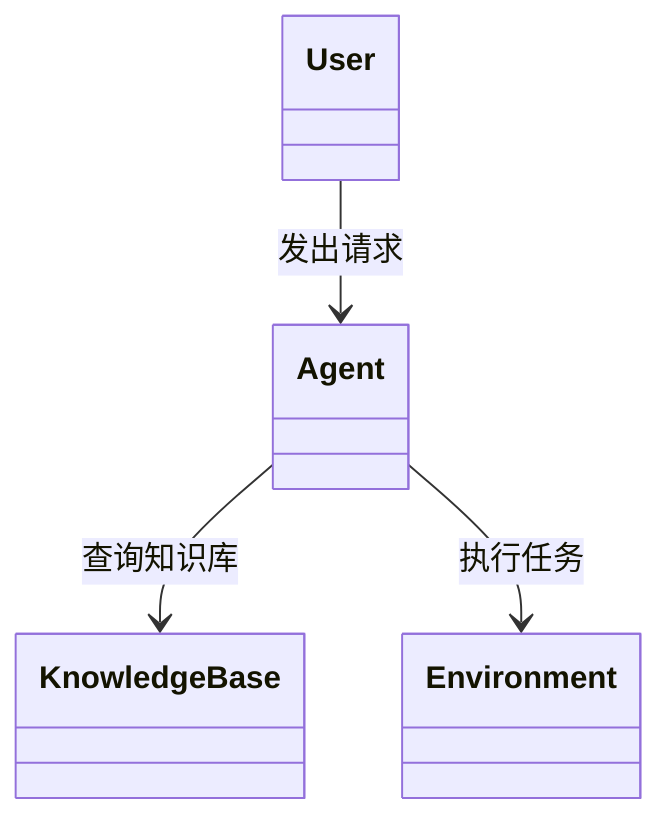
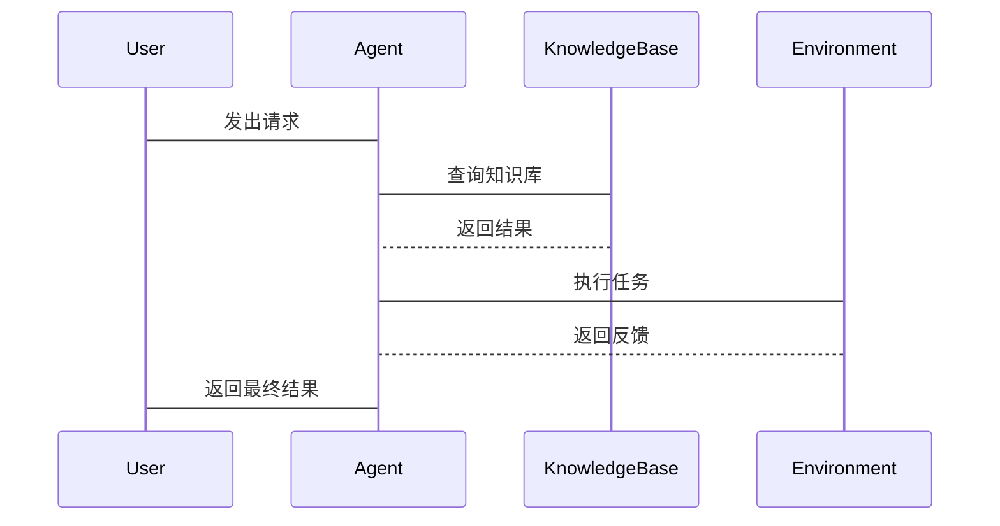

                 


# AI Agent的定义与特性：智能助手的核心要素

## 关键词：AI Agent, 智能助手, 人工智能, 机器学习, 自然语言处理, 系统架构, 算法原理

## 摘要：AI Agent（人工智能代理）是一种能够感知环境、自主决策并执行任务的智能实体，是实现人机交互和智能助手的核心技术。本文将从AI Agent的定义、特性、分类入手，深入分析其算法原理和系统架构设计，结合实际案例，详细阐述AI Agent在智能助手中的应用与实现。

---

# 第1章 AI Agent 的基本概念

## 1.1 AI Agent 的定义与背景

### 1.1.1 什么是 AI Agent
AI Agent（人工智能代理）是一种能够感知环境、自主决策并执行任务的智能实体。它通过接收输入信息，分析问题，制定解决方案，并输出执行结果，从而实现与用户或其他系统的交互。

### 1.1.2 AI Agent 的发展背景
随着人工智能技术的快速发展，AI Agent逐渐从理论研究走向实际应用。其发展背景主要源于以下几个方面：
1. **智能化需求**：用户对智能化服务的需求不断增加，例如智能助手、智能客服等。
2. **技术进步**：机器学习、自然语言处理等技术的成熟为AI Agent的实现提供了技术基础。
3. **应用场景扩展**：AI Agent广泛应用于智能家居、自动驾驶、机器人等领域。

### 1.1.3 AI Agent 的应用领域
AI Agent的应用领域非常广泛，主要包括：
1. **智能助手**：如 Siri、Alexa 等。
2. **自动驾驶**：如 Tesla 的自动驾驶系统。
3. **智能客服**：通过自然语言处理实现自动问答。
4. **机器人控制**：用于工业机器人和家庭服务机器人。

## 1.2 AI Agent 的核心特性

### 1.2.1 智能性
AI Agent的核心特性之一是智能性，它能够通过感知环境信息，利用知识库和推理机制，做出合理决策。

### 1.2.2 反应性
AI Agent的反应性是指其能够实时感知环境变化，并做出相应的反应。例如，当用户输入一个查询时，AI Agent能够快速分析并返回结果。

### 1.2.3 主动性
主动性是AI Agent的另一个重要特性，它能够在没有明确指令的情况下，主动执行任务。例如，智能助手可以根据用户的日历安排，主动提醒用户即将到来的会议。

### 1.2.4 学习能力
现代AI Agent通常具备学习能力，能够通过数据反馈不断优化自身的行为。例如，基于强化学习的AI Agent可以在与环境的交互中不断改进其决策策略。

## 1.3 AI Agent 的分类

### 1.3.1 基于规则的 AI Agent
基于规则的AI Agent通过预定义的规则来执行任务。这些规则通常基于逻辑推理，例如条件-动作规则。

### 1.3.2 基于模型的 AI Agent
基于模型的AI Agent利用知识表示和推理机制来实现智能决策。例如，专家系统中的AI Agent就是基于模型的。

### 1.3.3 基于强化学习的 AI Agent
基于强化学习的AI Agent通过与环境的交互，不断优化其行为策略。例如，自动驾驶系统可以通过强化学习不断优化其路径规划。

### 1.3.4 混合型 AI Agent
混合型AI Agent结合了多种方法，例如结合基于规则和强化学习的方法，以实现更复杂的任务。

---

# 第2章 AI Agent 的核心概念与联系

## 2.1 AI Agent 的核心概念原理

### 2.1.1 知识表示
知识表示是AI Agent实现智能决策的基础。常见的知识表示方法包括语义网络、框架表示和逻辑表示。

### 2.1.2 问题求解
问题求解是AI Agent的核心任务之一。它通过搜索、推理和规划等方法来解决复杂问题。

### 2.1.3 行为选择
行为选择是AI Agent在多选项中选择最优行为的过程。这通常涉及到效用函数和决策树的构建。

## 2.2 AI Agent 的概念属性特征对比

### 2.2.1 不同类型 AI Agent 的对比表格
| 类型                | 基于规则的AI Agent | 基于模型的AI Agent | 基于强化学习的AI Agent |
|---------------------|--------------------|--------------------|-------------------------|
| 决策方式            | 预定义规则          | 知识推理            | 强化学习优化           |
| 学习能力            | 无                 | 有                 | 强                     |
| 适用场景            | 简单任务            | 复杂任务            | 动态环境               |

### 2.2.2 AI Agent 的 ER 实体关系图
```mermaid
er
actor(AI Agent) -|> knowledge_base: 使用知识库
actor -|> environment: 与环境交互
knowledge_base -|> rule_set: 包含规则集
knowledge_base -|> model: 包含模型
```

---

# 第3章 AI Agent 的算法原理

## 3.1 基于规则的 AI Agent 算法

### 3.1.1 算法流程图
```mermaid
graph TD
    A[开始] -> B[接收输入]
    B -> C[匹配规则库]
    C -> D[执行对应动作]
    D -> E[返回结果]
    E -> F[结束]
```

### 3.1.2 算法实现代码
```python
def rule_based_agent(input):
    # 匹配规则库
    for rule in rule_set:
        if rule.condition(input):
            return rule.action(input)
    return default_action(input)
```

### 3.1.3 算法数学模型
基于规则的AI Agent的决策过程可以用逻辑表达式表示：
$$
\text{如果 } p \text{ 则 } q
$$
其中，\( p \) 是输入条件，\( q \) 是输出动作。

## 3.2 基于模型的 AI Agent 算法

### 3.2.1 算法流程图
```mermaid
graph TD
    A[开始] -> B[接收输入]
    B -> C[推理引擎]
    C -> D[生成输出]
    D -> E[返回结果]
    E -> F[结束]
```

### 3.2.2 算法实现代码
```python
def model_based_agent(input):
    # 知识推理
    result = knowledge_engine.inference(input)
    return result
```

### 3.2.3 算法数学模型
基于模型的AI Agent通常使用一阶逻辑表示知识：
$$
\forall x, P(x) \rightarrow Q(x)
$$
其中，\( P \) 和 \( Q \) 是命题。

## 3.3 基于强化学习的 AI Agent 算法

### 3.3.1 算法流程图
```mermaid
graph TD
    A[开始] -> B[接收输入]
    B -> C[动作选择]
    C -> D[执行动作]
    D -> E[获取反馈]
    E -> F[更新策略]
    F -> G[返回结果]
    G -> H[结束]
```

### 3.3.2 算法实现代码
```python
def reinforcement_learning_agent(input):
    # 状态感知
    state = get_state(input)
    # 动作选择
    action = policy_network.predict(state)
    # 执行动作
    result = execute_action(action)
    # 反馈学习
    update_policy(action, result)
    return result
```

### 3.3.3 算法数学模型
基于强化学习的AI Agent通常使用Q-learning算法：
$$
Q(s, a) = Q(s, a) + \alpha [r + \gamma \max Q(s', a') - Q(s, a)]
$$
其中，\( Q \) 是Q值函数，\( \alpha \) 是学习率，\( \gamma \) 是折扣因子。

---

# 第4章 AI Agent 的系统分析与架构设计

## 4.1 问题场景介绍

### 4.1.1 智能助手的典型应用场景
智能助手的典型应用场景包括：
1. 语音交互
2. 信息查询
3. 任务管理
4. 个性化推荐

### 4.1.2 系统功能需求分析
系统功能需求分析包括：
1. 用户身份识别
2. 语音识别
3. 自然语言理解
4. 任务执行
5. 反馈机制

## 4.2 系统功能设计

### 4.2.1 领域模型类图


### 4.2.2 系统架构设计图


### 4.2.3 系统接口设计
1. **输入接口**：接收用户输入，例如语音或文本。
2. **输出接口**：返回处理结果，例如文本或语音。
3. **知识库接口**：与知识库交互，获取所需信息。
4. **执行接口**：调用外部服务，执行具体任务。

### 4.2.4 系统交互流程图


---

# 第5章 AI Agent 的项目实战

## 5.1 智能助手的设计与实现

### 5.1.1 环境安装
安装必要的库：
```bash
pip install numpy
pip install scikit-learn
pip install transformers
```

### 5.1.2 核心代码实现

#### 5.1.2.1 知识库构建
```python
from sklearn.feature_extraction.text import TfidfVectorizer
from sklearn.metrics.pairwise import cosine_similarity

class KnowledgeBase:
    def __init__(self, documents):
        self.vectorizer = TfidfVectorizer()
        self.vectors = self.vectorizer.fit_transform(documents)
    
    def query(self, question):
        q_vector = self.vectorizer.transform([question])
        similarities = cosine_similarity(q_vector, self.vectors)
        return similarities.argsort()[-1][0]
```

#### 5.1.2.2 自然语言理解
```python
from transformers import pipeline

nlp = pipeline("question-answering")
def answer_question(question, context):
    return nlp(question + context)[0]['answer']
```

#### 5.1.2.3 任务执行
```python
import subprocess

def execute_task(task):
    subprocess.run(task, shell=True)
```

### 5.1.3 代码解读与分析
1. **知识库构建**：使用TF-IDF和余弦相似度进行信息检索。
2. **自然语言理解**：基于预训练模型实现问答任务。
3. **任务执行**：通过调用外部命令执行具体任务。

### 5.1.4 实际案例分析
例如，当用户询问“如何安装Python库？”时，AI Agent会从知识库中找到相关文档，并通过自然语言理解生成答案：“请运行`pip install package_name`命令。”

### 5.1.5 项目小结
通过实际案例，我们可以看到AI Agent在智能助手中的具体应用。从知识库构建到任务执行，每个环节都需要精心设计和实现。

---

# 第6章 最佳实践与注意事项

## 6.1 最佳实践 tips

### 6.1.1 模块化设计
建议将AI Agent的各个模块（知识库、推理引擎、执行模块）进行模块化设计，以便于维护和扩展。

### 6.1.2 数据安全
在设计AI Agent时，必须重视数据安全和隐私保护，确保用户数据不被滥用。

### 6.1.3 可解释性
尽可能设计具有可解释性的AI Agent，以便于调试和用户信任。

## 6.2 小结
本文从AI Agent的定义、特性、分类、算法原理、系统架构设计、项目实战等多个方面进行了详细阐述，帮助读者全面理解AI Agent的核心要素。

## 6.3 注意事项
1. 在实际应用中，AI Agent的设计需要结合具体场景，选择合适的算法和工具。
2. 保持对AI技术的关注，及时更新和优化AI Agent的实现。

## 6.4 拓展阅读
推荐读者进一步阅读以下内容：
1. 《机器学习实战》
2. 《深度学习》
3. 《自然语言处理入门》

---

# 结语

AI Agent作为智能助手的核心技术，正在改变我们的生活方式和工作方式。通过本文的深入分析，我们希望能够帮助读者更好地理解AI Agent的定义与特性，并将其应用于实际场景中。未来，随着技术的不断进步，AI Agent将变得更加智能和强大，为人类创造更多的价值。

