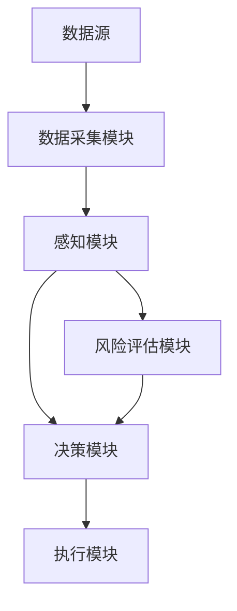
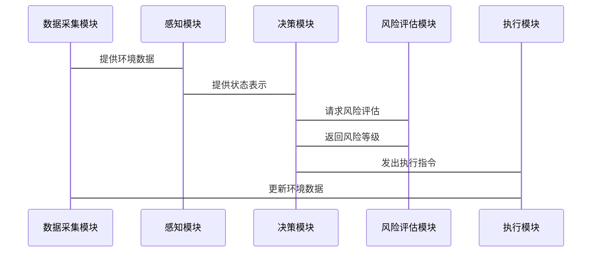

                 

<think>
好的，我将按照您的要求撰写一篇关于《AI Agent的实时决策与风险评估系统》的技术博客文章。让我们一步一步地进行分析和推理。

---

# AI Agent的实时决策与风险评估系统

**关键词**：AI Agent, 实时决策, 风险评估, 系统架构, 算法原理, 项目实战

**摘要**：  
本文探讨了AI Agent在实时决策与风险评估系统中的应用，详细分析了其实现原理、系统架构、核心算法以及实际项目案例。文章从AI Agent的基本概念出发，逐步深入，结合数学模型和实际代码示例，全面解析了如何构建一个高效、可靠的实时决策与风险评估系统。通过系统化的分析和案例研究，本文为读者提供了从理论到实践的完整指导。

---

## 第一部分：AI Agent的概述与背景

### 第1章：AI Agent的基本概念

#### 1.1 什么是AI Agent  
AI Agent（人工智能代理）是一种能够感知环境、自主决策并执行任务的智能实体。它可以是一个软件程序、机器人或其他智能系统，目标是通过与环境交互来实现特定目标。

#### 1.2 AI Agent的分类  
AI Agent可以根据不同的标准进行分类：  
1. **基于智能水平**：分为反应式、认知式和混合式代理。  
2. **基于应用领域**：如自动驾驶、金融交易、机器人控制等。  
3. **基于决策方式**：分为基于规则、基于模型和基于学习的代理。

#### 1.3 AI Agent的应用场景  
AI Agent广泛应用于多个领域：  
- **自动驾驶**：实时感知环境并做出驾驶决策。  
- **金融交易**：基于市场数据进行实时交易决策。  
- **机器人控制**：在工业或服务场景中执行复杂任务。

---

### 第2章：实时决策与风险评估的背景

#### 2.1 实时决策的重要性  
在动态变化的环境中，AI Agent需要快速做出决策以应对不确定性。实时决策能够确保系统在最短时间内做出响应，避免因延迟而导致的损失。

#### 2.2 风险评估的必要性  
在复杂环境中，AI Agent的决策可能面临多种风险。例如，在金融交易中，错误的决策可能导致重大损失。因此，风险评估是确保系统稳定运行的关键。

#### 2.3 两者的结合与应用  
实时决策与风险评估的结合能够帮助AI Agent在复杂环境中做出更优决策。例如，在自动驾驶中，AI Agent需要实时感知环境并评估潜在风险，以确保行车安全。

---

## 第二部分：AI Agent的核心概念与原理

### 第3章：AI Agent的核心概念

#### 3.1 感知与决策  
AI Agent的核心功能包括感知环境、做出决策并执行动作。  
- **感知**：通过传感器或数据源获取环境信息。  
- **决策**：基于感知信息，选择最优动作。  
- **执行**：将决策转化为具体动作。

#### 3.2 风险评估的核心要素  
风险评估是确保AI Agent决策可靠性的关键。  
- **风险来源**：环境不确定性、系统故障、外部干扰等。  
- **风险影响**：可能的损失程度。  
- **风险控制**：通过优化算法或冗余设计降低风险。

#### 3.3 实时决策与风险评估的关系  
实时决策依赖于快速、准确的风险评估。只有通过实时评估风险，AI Agent才能做出可靠的决策。

---

### 第4章：AI Agent的算法原理

#### 4.1 状态空间与动作空间  
AI Agent的决策过程基于状态空间和动作空间。  
- **状态空间**：所有可能的状态集合。  
- **动作空间**：所有可能的动作集合。  
- **状态转移**：动作执行后引起的状态变化。

#### 4.2 感知模型的构建  
感知模型用于将环境信息转换为可用的状态表示。  
- **数据预处理**：去除噪声，提取特征。  
- **特征表示**：将环境信息表示为向量形式。  
- **模型训练**：使用机器学习算法训练感知模型。

#### 4.3 决策算法的实现  
常用的决策算法包括：  
1. **基于规则的决策**：通过预定义的规则进行决策。  
2. **基于模型的决策**：使用数学模型计算最优动作。  
3. **基于学习的决策**：通过强化学习等方法训练决策模型。

---

## 第三部分：系统架构与项目实战

### 第5章：系统架构设计

#### 5.1 系统功能设计  
- **数据采集模块**：获取环境信息。  
- **感知模块**：将环境信息转换为状态表示。  
- **决策模块**：基于状态和动作空间做出决策。  
- **执行模块**：将决策转化为具体动作。  
- **风险评估模块**：实时评估决策风险。

#### 5.2 系统架构图  
以下是系统的整体架构图：



#### 5.3 系统交互设计  
以下是系统交互的序列图：



---

### 第6章：项目实战

#### 6.1 项目背景  
以金融交易为例，设计一个AI Agent用于实时股票交易决策。

#### 6.2 环境配置  
- 安装Python、TensorFlow、Pandas、Matplotlib等工具。

#### 6.3 核心功能实现  
1. **数据采集模块**：从金融数据源获取实时股票数据。  
2. **感知模块**：将股票数据转换为状态向量。  
3. **决策模块**：基于强化学习算法做出买卖决策。  
4. **风险评估模块**：评估每笔交易的风险等级。  
5. **执行模块**：将决策指令发送至交易系统。

#### 6.4 代码实现  
以下是决策模块的Python代码示例：

```python
import numpy as np
import tensorflow as tf

# 定义状态空间
state_space = 10
action_space = 3  # 0: 卖出, 1: 持有, 2: 买入

# 构建神经网络模型
model = tf.keras.Sequential([
    tf.keras.layers.Dense(64, activation='relu', input_dim=state_space),
    tf.keras.layers.Dense(64, activation='relu'),
    tf.keras.layers.Dense(action_space, activation='softmax')
])

# 定义损失函数和优化器
loss = tf.keras.losses.sparse_categorical_crossentropy
optimizer = tf.keras.optimizers.Adam(learning_rate=0.001)

model.compile(optimizer=optimizer, loss=loss, metrics=['accuracy'])

# 训练模型
model.fit(X_train, y_train, epochs=100, batch_size=32)
```

#### 6.5 案例分析  
通过实际交易数据验证系统的性能，分析模型的准确性和风险控制能力。

---

## 第四部分：总结与展望

### 第7章：总结与展望

#### 7.1 本章总结  
本文详细探讨了AI Agent在实时决策与风险评估系统中的应用，从理论到实践，全面解析了其实现原理和系统架构。

#### 7.2 未来展望  
未来，随着AI技术的不断发展，AI Agent将在更多领域得到应用。研究方向包括：  
- 更高效的决策算法。  
- 更准确的风险评估模型。  
- 更智能化的系统架构设计。

---

通过本文的分析，读者可以全面了解AI Agent的实时决策与风险评估系统的核心概念、实现原理和实际应用。希望本文能为相关领域的研究和实践提供有价值的参考。

