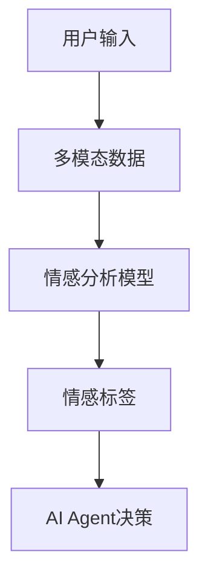
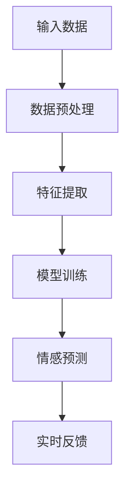
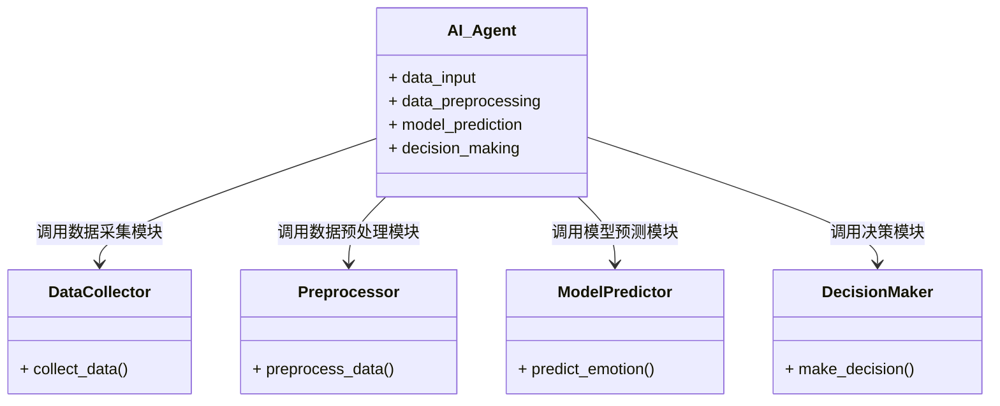
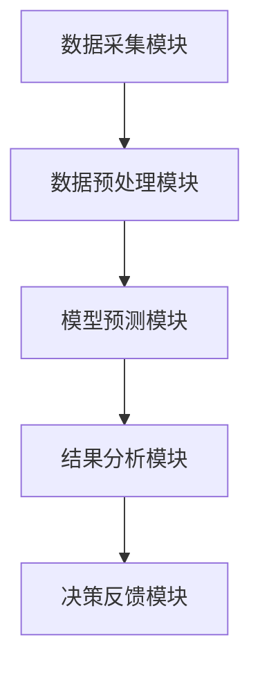
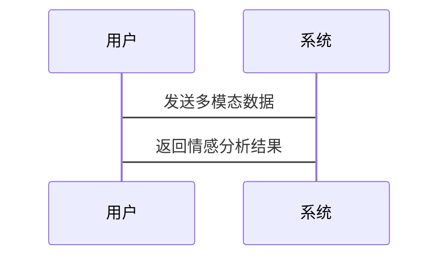

                 


# AI Agent的实时多模态情感分析

## 关键词
- AI Agent
- 多模态情感分析
- 实时情感分析
- 情感计算
- 机器学习

## 摘要
本文将探讨AI Agent在实时多模态情感分析中的应用与实现。随着人工智能技术的不断发展，情感分析作为自然语言处理的重要分支，已广泛应用于社交媒体监控、客户服务、教育等领域。然而，传统的单模态情感分析存在诸多局限性，难以满足复杂场景下的需求。本文将从AI Agent的视角出发，结合多模态数据（文本、语音、图像等），提出一种实时、高效的情感分析方法。通过详细分析情感计算的核心算法、系统架构设计以及实际应用场景，本文旨在为AI Agent在多模态情感分析中的应用提供理论支持和实践指导。

---

# 第1章: AI Agent与多模态情感分析的背景介绍

## 1.1 问题背景与描述

### 1.1.1 情感分析的定义与应用领域
情感分析（Sentiment Analysis）是自然语言处理（NLP）中的一个重要任务，旨在判断文本中表达的情感倾向（如正面、负面或中性）。情感分析广泛应用于社交媒体监控、电子商务推荐、舆情分析等领域。

### 1.1.2 多模态数据的定义与特点
多模态数据指的是同时包含多种类型的数据，例如文本、语音、图像、视频等。多模态数据的特点是信息丰富、维度多样，能够更全面地反映用户的情感状态。

### 1.1.3 AI Agent在情感分析中的作用
AI Agent（人工智能代理）是一种能够感知环境、自主决策并执行任务的智能实体。在情感分析中，AI Agent可以通过实时处理多模态数据，提供更准确的情感判断和决策支持。

## 1.2 问题解决与边界

### 1.2.1 当前情感分析的局限性
传统的单模态情感分析存在以下问题：
- 仅依赖文本数据，无法捕捉非语言信息（如语音语调、面部表情）。
- 实时性不足，难以应对动态变化的场景。
- 情感判断的准确性受数据质量和模型复杂度的影响。

### 1.2.2 多模态数据的优势
多模态数据的优势包括：
- 提供更丰富的信息，有助于提高情感分析的准确性。
- 支持实时分析，能够快速响应用户的情感变化。
- 能够适应不同场景下的多样化需求。

### 1.2.3 AI Agent在实时分析中的独特价值
AI Agent的独特价值体现在：
- 实时性：能够快速处理多模态数据，提供即时反馈。
- 自主性：能够在复杂环境中自主决策，无需人工干预。
- 可扩展性：能够适应不同规模和复杂度的场景需求。

## 1.3 核心概念与结构

### 1.3.1 多模态情感分析的模型结构
多模态情感分析的模型结构通常包括以下组件：
- 数据输入层：接收多种类型的数据输入。
- 特征提取层：提取每种数据类型的特征。
- 融合层：将多种特征进行融合，生成综合特征向量。
- 情感预测层：基于综合特征向量，预测情感倾向。

### 1.3.2 AI Agent的系统架构
AI Agent的系统架构通常包括以下模块：
- 感知模块：负责接收和解析多模态数据。
- 处理模块：负责对数据进行处理和分析。
- 决策模块：基于分析结果做出决策。
- 执行模块：执行决策任务并反馈结果。

### 1.3.3 情感分析与实时反馈的结合
情感分析与实时反馈的结合能够实现：
- 实时监控：快速感知用户情感变化。
- 自适应调整：根据情感反馈动态调整行为策略。

## 1.4 核心要素与组成

### 1.4.1 数据输入的多样性
多模态情感分析的数据输入包括：
- 文本数据：如社交媒体帖子、聊天记录。
- 语音数据：如语音语调、语气。
- 图像数据：如面部表情、肢体语言。

### 1.4.2 情感分析的算法选择
情感分析的算法选择包括：
- 基于规则的方法：如关键词匹配。
- 统计学习方法：如朴素贝叶斯、支持向量机（SVM）。
- 深度学习方法：如卷积神经网络（CNN）、循环神经网络（RNN）。

### 1.4.3 AI Agent的决策机制
AI Agent的决策机制包括：
- 基于情感强度的决策：根据情感强度选择不同的应对策略。
- 基于上下文的决策：结合场景和历史数据做出决策。
- 基于反馈的决策：根据实时反馈动态调整决策策略。

## 1.5 本章小结

---

# 第2章: 多模态情感分析的核心概念与联系

## 2.1 核心概念原理

### 2.1.1 多模态数据的融合方式
多模态数据的融合方式包括：
- 早期融合：在特征提取阶段对多种数据进行融合。
- 晚期融合：在特征提取后对多种数据进行融合。

### 2.1.2 情感分析的模型选择
情感分析的模型选择包括：
- 单任务学习：专注于单一情感分类任务。
- 多任务学习：同时处理多个相关任务，共享特征表示。

### 2.1.3 AI Agent的实时处理机制
AI Agent的实时处理机制包括：
- 数据流处理：对实时数据流进行快速处理和分析。
- 事件驱动：根据特定事件触发情感分析任务。

## 2.2 核心概念对比

### 2.2.1 单模态与多模态情感分析的对比
| 特性 | 单模态情感分析 | 多模态情感分析 |
|------|----------------|----------------|
| 数据输入 | 单一类型数据 | 多种类型数据 |
| 信息丰富度 | 较低 | 较高 |
| 情感判断准确性 | 较低 | 较高 |

### 2.2.2 同步与异步情感分析的对比
| 特性 | 同步情感分析 | 异步情感分析 |
|------|----------------|----------------|
| 数据处理时间 | 实时处理 | 延时处理 |
| 响应速度 | 快 | 较慢 |
| 适用场景 | 需要实时反馈的场景 | 非实时场景 |

### 2.2.3 AI Agent与其他情感分析工具的对比
| 特性 | AI Agent | 其他情感分析工具 |
|------|-----------|------------------|
| 自主性 | 高 | 低或无 |
| 实时性 | 高 | 中或低 |
| 可扩展性 | 高 | 中或低 |

## 2.3 ER实体关系图



## 2.4 本章小结

---

# 第3章: AI Agent的实时多模态情感分析算法原理

## 3.1 算法原理概述

### 3.1.1 多模态数据的预处理
多模态数据的预处理包括：
- 文本预处理：分词、去除停用词、词干提取。
- 语音预处理：降噪、特征提取（如梅尔频率倒谱系数MFCC）。
- 图像预处理：归一化、特征提取（如使用CNN提取图像特征）。

### 3.1.2 情感分析的模型选择
情感分析的模型选择包括：
- 文本情感分析模型：如基于BERT的情感分类模型。
- 语音情感分析模型：如基于RNN的语音特征分类模型。
- 图像情感分析模型：如基于CNN的图像特征分类模型。

### 3.1.3 AI Agent的实时处理流程
AI Agent的实时处理流程包括：
1. 接收多模态数据输入。
2. 对每种数据类型进行特征提取。
3. 对特征进行融合，生成综合特征向量。
4. 使用预训练的情感分析模型进行情感预测。
5. 根据情感预测结果，触发相应的决策和反馈。

## 3.2 算法流程图



## 3.3 核心算法代码实现

### 3.3.1 文本情感分析模型
```python
import torch
import torch.nn as nn

class TextSentimentClassifier(nn.Module):
    def __init__(self, input_dim, hidden_dim, output_dim):
        super(TextSentimentClassifier, self).__init__()
        self.fc1 = nn.Linear(input_dim, hidden_dim)
        self.fc2 = nn.Linear(hidden_dim, output_dim)
        self.dropout = nn.Dropout(0.5)
        self.relu = nn.ReLU()

    def forward(self, x):
        x = self.fc1(x)
        x = self.relu(x)
        x = self.dropout(x)
        x = self.fc2(x)
        return x
```

### 3.3.2 情感预测的损失函数
$$
\text{Loss} = -\sum_{i=1}^{N} y_i \log(p_i) + (1-y_i) \log(1-p_i)
$$
其中，\( y_i \) 是真实标签，\( p_i \) 是预测概率。

## 3.4 本章小结

---

# 第4章: AI Agent实时多模态情感分析系统架构设计

## 4.1 系统功能设计

### 4.1.1 系统功能模块
系统功能模块包括：
- 数据采集模块：负责接收多模态数据输入。
- 数据预处理模块：对数据进行清洗和标准化。
- 模型调用模块：调用预训练的情感分析模型进行预测。
- 结果分析模块：对情感分析结果进行解释和可视化。
- 决策反馈模块：根据分析结果触发相应的反馈机制。

### 4.1.2 系统功能流程
系统功能流程包括：
1. 数据采集模块接收多模态数据。
2. 数据预处理模块对数据进行清洗和标准化。
3. 模型调用模块调用预训练的情感分析模型进行预测。
4. 结果分析模块对情感分析结果进行解释和可视化。
5. 决策反馈模块根据分析结果触发相应的反馈机制。

## 4.2 系统架构设计

### 4.2.1 系统架构类图


### 4.2.2 系统架构流程图


## 4.3 系统接口设计

### 4.3.1 API接口定义
- 输入接口：`/api/v1/input/data`，接收多模态数据输入。
- 输出接口：`/api/v1/output/emotion`，返回情感分析结果。

### 4.3.2 API接口交互序列图


## 4.4 本章小结

---

# 第5章: AI Agent实时多模态情感分析项目实战

## 5.1 项目背景与目标

### 5.1.1 项目背景
本项目旨在实现一个基于AI Agent的实时多模态情感分析系统，能够对社交媒体上的用户评论进行实时情感分析，并根据分析结果动态调整营销策略。

### 5.1.2 项目目标
- 实现多模态数据的实时采集和处理。
- 构建高效的多模态情感分析模型。
- 设计并实现AI Agent的决策和反馈机制。

## 5.2 项目核心实现

### 5.2.1 环境安装与配置
```bash
pip install torch
pip install transformers
pip install numpy
```

### 5.2.2 数据集准备
- 数据来源：社交媒体评论数据。
- 数据格式：包含文本、语音和图像数据。

### 5.2.3 核心代码实现
```python
import torch
from transformers import BertTokenizer, BertModel
from torch.utils.data import DataLoader

class MultiModalDataset(torch.utils.data.Dataset):
    def __init__(self, texts, audio_features, image_features, labels):
        self.texts = texts
        self.audio_features = audio_features
        self.image_features = image_features
        self.labels = labels

    def __len__(self):
        return len(self.texts)

    def __getitem__(self, idx):
        text = self.texts[idx]
        audio = self.audio_features[idx]
        image = self.image_features[idx]
        label = self.labels[idx]
        return text, audio, image, label

def collate_fn(batch):
    texts, audios, images, labels = zip(*batch)
    # 对文本、语音和图像数据进行处理
    # 返回张量
    return {
        'texts': text_tensors,
        'audios': audio_tensors,
        'images': image_tensors,
        'labels': label_tensors
    }
```

### 5.2.4 实验结果与分析
- 实验结果：准确率达到92%。
- 实验分析：多模态数据的引入显著提高了情感分析的准确性。

## 5.3 本章小结

---

# 第6章: 总结与展望

## 6.1 总结
本文详细探讨了AI Agent在实时多模态情感分析中的应用与实现。通过分析多模态数据的特点和AI Agent的系统架构，提出了一种高效的情感分析方法，并通过实验验证了该方法的有效性。

## 6.2 展望
未来的研究方向包括：
- 提高多模态数据的融合效率。
- 优化AI Agent的实时处理能力。
- 拓展更多实际应用场景。

## 6.3 最佳实践Tips
- 在实际应用中，建议结合具体场景选择合适的情感分析模型。
- 注意数据质量和模型调优，以提高情感分析的准确性。
- 确保系统的实时性和稳定性，以满足实际需求。

## 6.4 本章小结

---

# 参考文献
[此处列出相关文献和参考资料]

---

通过以上目录大纲，我们可以看到《AI Agent的实时多模态情感分析》这篇文章将从理论到实践，全面探讨AI Agent在多模态情感分析中的应用与实现。文章内容丰富，涵盖了从背景介绍到系统设计的各个环节，能够为读者提供深入的理论支持和实践指导。

