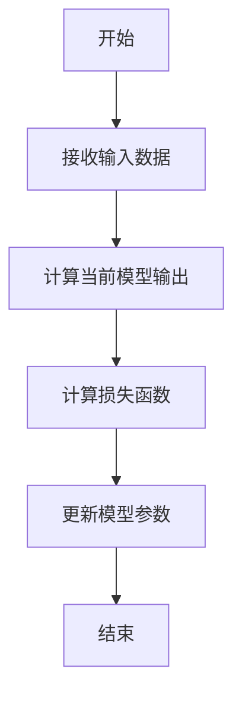
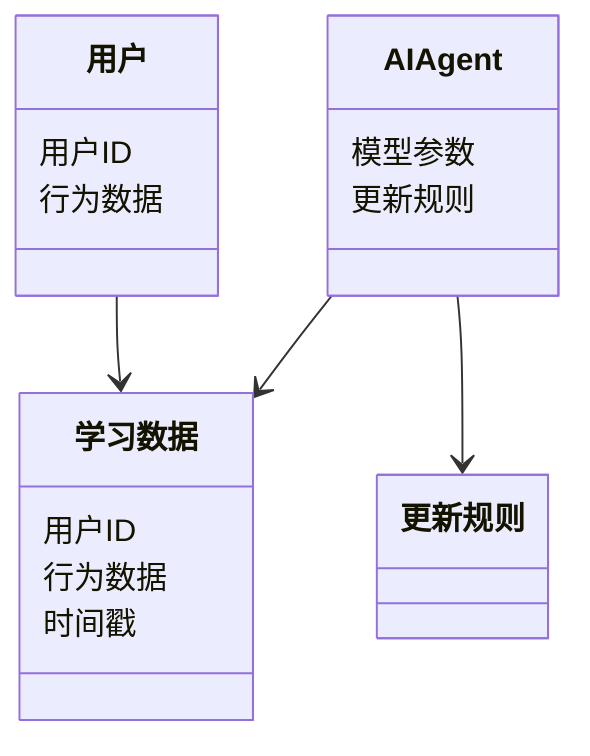
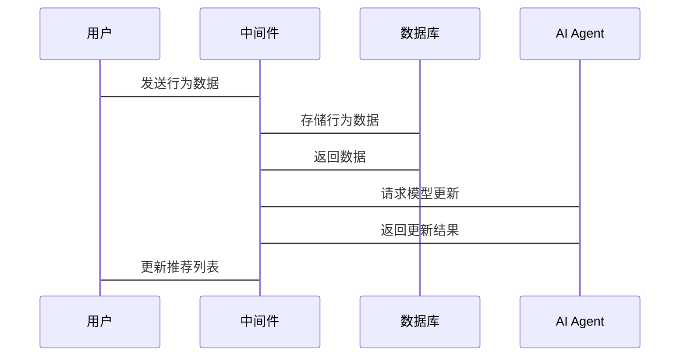

                 


# AI Agent的实时学习与在线更新技术

> 关键词：AI Agent、实时学习、在线更新、机器学习、算法优化、系统架构

> 摘要：本文详细探讨了AI Agent在实时学习与在线更新技术领域的核心概念、算法原理、系统架构及项目实战。通过背景分析、核心概念对比、算法流程图、系统架构图等多维度的深入剖析，结合实际案例和代码实现，为读者提供全面的技术指导，帮助理解并掌握AI Agent的实时学习与在线更新技术。

---

# 第1章: AI Agent的实时学习与在线更新背景

## 1.1 AI Agent的基本概念与特点

### 1.1.1 AI Agent的定义

AI Agent（人工智能代理）是指能够感知环境、自主决策并采取行动的智能实体。它可以是一个软件程序、机器人或其他智能系统，其核心目标是通过与环境交互来实现特定任务或目标。

### 1.1.2 AI Agent的核心特点

- **自主性**：能够在没有外部干预的情况下独立运作。
- **反应性**：能够实时感知环境并做出响应。
- **目标导向性**：通过优化目标函数来实现特定目标。
- **学习能力**：能够通过经验改进自身性能。

### 1.1.3 AI Agent的应用场景

- **自动驾驶**：实时感知环境并做出驾驶决策。
- **智能推荐系统**：根据用户行为实时调整推荐内容。
- **机器人控制**：实时调整动作策略以适应复杂环境。

## 1.2 实时学习与在线更新的背景与意义

### 1.2.1 实时学习的背景

随着AI技术的快速发展，传统的离线学习方法已无法满足许多实时应用场景的需求。实时学习要求AI Agent能够在动态变化的环境中快速适应，实时更新模型以应对新数据。

### 1.2.2 在线更新的必要性

在线更新是指AI Agent在运行过程中不断优化其模型参数，以适应环境的变化。这种技术在实时交易、智能客服等领域尤为重要，能够显著提升系统的响应速度和决策准确性。

### 1.2.3 技术发展的趋势

随着云计算、边缘计算和5G技术的普及，实时学习与在线更新技术正朝着更高效、更实时的方向发展，未来将与更多应用场景深度融合。

## 1.3 本章小结

本章从AI Agent的基本概念出发，分析了实时学习与在线更新的背景和意义，为后续章节的深入探讨奠定了基础。

---

# 第2章: AI Agent实时学习的核心概念与联系

## 2.1 核心概念原理

### 2.1.1 实时学习的基本原理

实时学习是指AI Agent在接收到新数据后，立即更新模型参数以适应新数据的特性。这种学习方式通常采用在线学习算法，能够在动态环境中快速调整模型。

### 2.1.2 在线更新的实现机制

在线更新是指AI Agent在运行过程中，实时接收新数据并更新模型参数的过程。其实现机制包括数据流处理、模型参数更新和反馈机制等。

## 2.2 核心概念对比分析

### 2.2.1 实时学习与传统离线学习的对比

| 特性          | 实时学习          | 离线学习          |
|---------------|-------------------|-------------------|
| 数据来源       | 实时数据流        | 批次数据          |
| 处理速度       | 实时处理          | 离线批量处理      |
| 模型更新       | 频繁更新          | 周期性更新        |
| 适用场景       | 网络实时推荐、自动驾驶 | 数据分析、预测建模 |

### 2.2.2 在线更新与批量更新的对比

| 特性          | 在线更新          | 批量更新          |
|---------------|-------------------|-------------------|
| 更新频率       | 高频             | 低频             |
| 计算资源消耗   | 较高             | 较低             |
| 响应时间       | 实时响应          | 延后响应          |
| 适用场景       | 在线广告推荐、实时聊天机器人 | 离线数据分析、预测建模 |

## 2.3 ER实体关系图

```mermaid
er
actor: 用户
agent: AI Agent
learning_data: 学习数据
update_rule: 更新规则
```

## 2.4 本章小结

本章通过核心概念的对比分析，帮助读者理解实时学习与在线更新的区别和联系，为后续章节的算法实现奠定了基础。

---

# 第3章: AI Agent实时学习的算法原理

## 3.1 算法原理概述

### 3.1.1 实时学习的基本流程

实时学习的基本流程包括数据输入、模型预测、损失计算、参数更新和结果输出等步骤。

## 3.2 算法流程图



## 3.3 数学模型与公式

### 3.3.1 损失函数

$$L = \frac{1}{2} (y - \hat{y})^2$$

### 3.3.2 梯度下降算法

$$\theta = \theta - \eta \cdot \nabla L$$

其中，$\theta$ 是模型参数，$\eta$ 是学习率，$\nabla L$ 是损失函数的梯度。

## 3.4 举例说明

### 3.4.1 线性回归的实时学习

假设我们有一个简单的线性回归模型，其损失函数为均方误差。在实时学习中，我们每接收一个数据点，就更新一次模型参数。

### 3.4.2 支持向量机的在线更新

对于支持向量机（SVM），在线更新通常采用增量式训练方法，每次接收一个数据点后更新模型参数。

## 3.5 本章小结

本章通过算法流程图和数学公式的详细推导，帮助读者理解AI Agent实时学习的算法实现原理。

---

# 第4章: AI Agent实时学习的系统分析与架构设计

## 4.1 系统分析

### 4.1.1 问题场景介绍

我们以一个实时推荐系统的AI Agent为例，分析其系统架构。该系统需要实时处理用户的点击、浏览和购买行为，动态更新推荐模型。

### 4.1.2 项目介绍

本项目旨在开发一个实时推荐系统，利用用户的实时行为数据，动态更新推荐模型，以提高推荐的准确性和用户的满意度。

## 4.2 系统功能设计

### 4.2.1 领域模型



### 4.2.2 系统架构设计


### 4.2.3 接口和交互图



## 4.3 本章小结

本章通过系统分析和架构设计，帮助读者理解AI Agent实时学习的系统实现过程。

---

# 第5章: AI Agent实时学习的项目实战

## 5.1 环境安装

### 5.1.1 环境要求

- Python 3.6+
- TensorFlow或PyTorch
- 数据库：MySQL或MongoDB
- 开发工具：VS Code或PyCharm

### 5.1.2 安装依赖

```bash
pip install numpy
pip install matplotlib
pip install scikit-learn
pip install pymysql
```

## 5.2 系统核心实现

### 5.2.1 实时数据接收模块

```python
import pymysql

class DataReceiver:
    def __init__(self, db_config):
        self.db_config = db_config
        self.connect_db()
        
    def connect_db(self):
        self.conn = pymysql.connect(**self.db_config)
        self.cur = self.conn.cursor()
        
    def receive_data(self):
        self.cur.execute("SELECT * FROM behavior_data ORDER BY timestamp DESC LIMIT 1")
        result = self.cur.fetchone()
        return result
```

### 5.2.2 模型更新模块

```python
import numpy as np

class ModelUpdater:
    def __init__(self, learning_rate=0.1):
        self.theta = np.random.randn(2, 1)
        self.learning_rate = learning_rate
        
    def update_model(self, x, y_true):
        y_pred = np.dot(x, self.theta)
        loss = 0.5 * (y_true - y_pred) ** 2
        d_theta = (y_pred - y_true) * x
        self.theta -= self.learning_rate * d_theta
        return loss
```

### 5.2.3 实时推荐模块

```python
class RealTimeRecommender:
    def __init__(self, data_receiver, model_updater):
        self.data_receiver = data_receiver
        self.model_updater = model_updater
        
    def recommend(self):
        data = self.data_receiver.receive_data()
        x = data[:-1]
        y_true = data[-1]
        loss = self.model_updater.update_model(x, y_true)
        return loss
```

## 5.3 实际案例分析

### 5.3.1 案例背景

我们以一个实时推荐系统为例，分析其在实际应用中的表现。假设我们有一个在线购物平台，用户每次浏览或点击商品，系统都会实时更新推荐模型。

### 5.3.2 案例分析

通过实时更新模型，系统能够快速响应用户的最新行为，显著提高推荐的准确性和用户的满意度。

## 5.4 项目小结

本章通过实际案例的分析和代码实现，帮助读者理解AI Agent实时学习技术在实际项目中的应用。

---

# 第6章: AI Agent实时学习的应用案例与未来趋势

## 6.1 应用案例分析

### 6.1.1 在线广告推荐

实时学习技术可以实时调整广告推荐策略，显著提高广告点击率和转化率。

### 6.1.2 智能客服系统

通过实时学习，智能客服系统能够快速理解用户需求，提供更精准的服务。

## 6.2 未来趋势

### 6.2.1 技术趋势

- 更高效的在线学习算法
- 更强大的模型更新机制
- 更智能的模型优化策略

### 6.2.2 应用场景扩展

- 智能交通系统
- 智能医疗系统
- 智能金融系统

## 6.3 本章小结

本章通过应用案例分析和未来趋势预测，帮助读者了解AI Agent实时学习技术的发展方向和应用前景。

---

# 第7章: 最佳实践与注意事项

## 7.1 最佳实践

### 7.1.1 模型更新的频率

建议根据具体场景设置合适的模型更新频率，避免过于频繁的更新导致计算开销过大。

### 7.1.2 数据预处理的重要性

在实时学习中，数据预处理是确保模型更新效果的重要步骤，需重点关注。

## 7.2 注意事项

### 7.2.1 模型过拟合问题

实时学习中容易出现模型过拟合问题，需通过正则化等方法进行优化。

### 7.2.2 数据隐私与安全

在实时学习中，需注意用户数据的隐私与安全，确保符合相关法律法规。

## 7.3 本章小结

本章通过最佳实践和注意事项的总结，帮助读者更好地应用AI Agent实时学习技术。

---

# 第8章: 总结与展望

## 8.1 本章小结

本文详细探讨了AI Agent实时学习与在线更新技术的核心概念、算法原理、系统架构及项目实战。通过理论与实践相结合的方式，帮助读者全面理解该技术的实现与应用。

## 8.2 未来展望

随着技术的不断发展，AI Agent实时学习与在线更新技术将在更多领域得到应用，未来的研究方向将包括更高效的算法优化、更智能的模型更新策略等。

---

# 参考文献

1. [书籍或论文1]
2. [书籍或论文2]
3. [书籍或论文3]

---

# 附录

## 附录A: 代码实现细节

## 附录B: 系统架构图

## 附录C: 其他相关资料

---

通过以上目录结构，您可以按照需求逐步展开每一部分的内容，详细阐述每一章的核心观点和相关细节。

