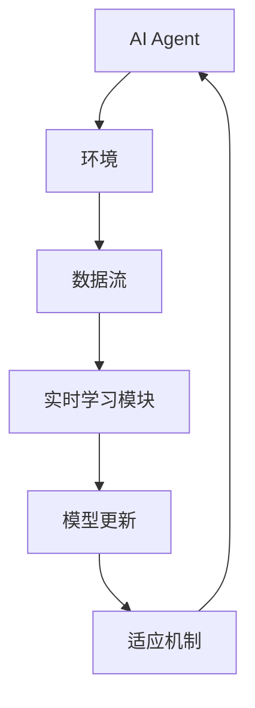
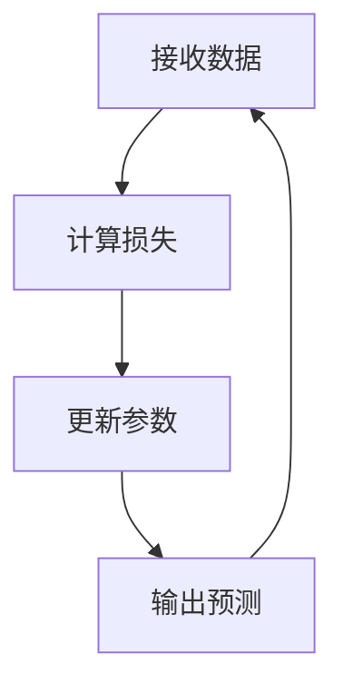
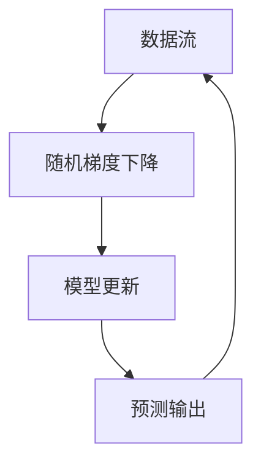
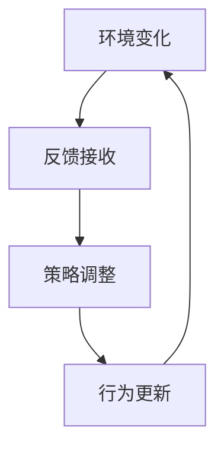
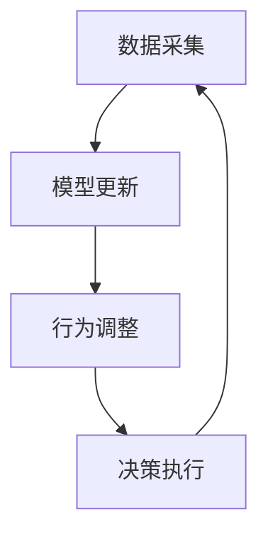

                 


```
# AI Agent的实时学习与适应机制

## 关键词：AI Agent，实时学习，适应机制，机器学习，强化学习，系统架构

## 摘要： 
本文将详细探讨AI Agent的实时学习与适应机制，从基础概念到高级算法，从系统架构到实际应用，全面分析AI Agent如何在动态环境中实时学习和自适应。文章将结合理论与实践，通过具体案例分析和代码实现，帮助读者深入理解AI Agent的实时学习与适应机制的核心原理和应用方法。

---

# 第1章: AI Agent的背景与概念

## 1.1 AI Agent的基本概念

### 1.1.1 什么是AI Agent
AI Agent（人工智能代理）是指能够感知环境并采取行动以实现目标的智能实体。它可以是一个软件程序、一个机器人或其他形式的智能系统，具备自主性、反应性、目标导向和社交能力等特征。

### 1.1.2 AI Agent的核心特征
- **自主性**：能够在没有外部干预的情况下自主决策。
- **反应性**：能够感知环境并实时调整行为。
- **目标导向**：具有明确的目标，并通过行动来实现目标。
- **社交能力**：能够与其他AI Agent或人类进行交互和协作。

### 1.1.3 AI Agent的分类与应用场景
AI Agent可以根据智能水平分为以下几类：
1. **反应式AI Agent**：基于当前感知做出反应，适用于实时任务。
2. **认知式AI Agent**：具备复杂推理和规划能力，适用于复杂环境。
3. **学习型AI Agent**：能够通过学习提升性能，适用于动态环境。

应用场景包括自动驾驶、智能助手、机器人控制、游戏AI等。

## 1.2 实时学习与适应机制的背景

### 1.2.1 实时学习的定义与特点
实时学习是指在动态环境中，AI Agent能够在线更新其模型或策略，以适应环境的变化。其特点包括：
- **在线性**：数据流是实时的，模型在数据流中不断更新。
- **高效性**：需要快速处理数据并做出决策。
- **自适应性**：能够根据新数据调整模型或策略。

### 1.2.2 适应机制的意义与作用
适应机制是指AI Agent在面对环境变化时，能够调整自身行为或模型以更好地适应新环境。其作用包括：
- **提高性能**：通过调整模型或策略，提升AI Agent在动态环境中的表现。
- **增强鲁棒性**：使AI Agent能够在复杂或不可预测的环境中稳定运行。
- **扩展能力**：支持AI Agent在新任务或新环境中快速适应。

### 1.2.3 问题的边界与外延
实时学习与适应机制的核心问题是如何在动态环境中高效地更新模型或策略，以实现目标。其边界包括：
- **数据流的实时性**：数据必须是实时的，且处理速度必须足够快。
- **模型的可更新性**：模型必须支持在线更新，且更新过程不能中断服务。
- **环境的动态性**：环境的变化必须能够被感知和适应。

## 1.3 核心概念与联系

### 1.3.1 核心概念原理
实时学习与适应机制的核心概念包括：
- **实时学习**：在线更新模型以适应数据流的变化。
- **适应机制**：调整行为或模型以应对环境变化。

### 1.3.2 核心概念属性特征对比表格
| 特性       | 实时学习               | 适应机制               |
|------------|-----------------------|-----------------------|
| 数据来源   | 实时数据流             | 动态环境变化           |
| 更新方式   | 在线更新               | 离线或在线             |
| 目标       | 提高模型准确性         | 改善行为表现           |
| 适用场景   | 动态环境               | 复杂或不可预测环境     |

### 1.3.3 ER实体关系图架构（Mermaid流程图）


---

# 第2章: AI Agent的实时学习机制

## 2.1 实时学习的核心原理

### 2.1.1 在线学习与离线学习的对比
- **在线学习**：数据是实时流式输入，模型在接收数据后立即更新。
- **离线学习**：数据是批量输入，模型在所有数据处理完后一次性更新。

### 2.1.2 实时学习的数学模型
实时学习的核心是在线更新模型参数。假设模型为线性回归形式：
$$ y = \theta x + \epsilon $$
其中，θ是模型参数，x是输入，y是输出，ε是噪声。

实时更新参数的常用方法是随机梯度下降（SGD）：
$$ \theta = \theta - \eta (\hat{y} - y) $$
其中，η是学习率，$\hat{y}$是预测值，y是真实值。

### 2.1.3 实时学习的算法流程


### 2.2 实时学习的算法实现

#### 2.2.1 常见实时学习算法（Mermaid流程图）


#### 2.2.2 算法实现的Python代码示例
```python
import numpy as np

def real_time_learning(data_stream, learning_rate=0.1):
    theta = 0.0
    for x, y in data_stream:
        prediction = theta * x
        error = y - prediction
        theta += learning_rate * error * x
        yield theta, prediction

# 示例数据流
data_stream = [(1, 2), (2, 3), (3, 4), (4, 5)]
for theta, prediction in real_time_learning(data_stream):
    print(f"theta={theta}, prediction={prediction}")
```

#### 2.2.3 算法的数学模型与公式推导
实时学习的核心是在线更新模型参数，常用随机梯度下降（SGD）算法。假设损失函数为均方误差：
$$ L = \frac{1}{2}(y - \hat{y})^2 $$
梯度下降更新规则为：
$$ \theta = \theta - \eta \frac{\partial L}{\partial \theta} $$
其中，$\frac{\partial L}{\partial \theta} = (y - \hat{y})x$。

---

# 第3章: AI Agent的适应机制

## 3.1 适应机制的定义与特点

### 3.1.1 适应机制的核心原理
适应机制是指AI Agent能够根据环境变化调整自身行为或模型。其核心是通过反馈机制不断优化行为策略。

### 3.1.2 适应机制的分类与应用场景
适应机制可以分为以下几类：
- **基于反馈的适应**：通过环境反馈调整行为。
- **基于预测的适应**：根据环境变化预测未来状态并调整行为。
- **基于规则的适应**：根据预定义规则调整行为。

应用场景包括自动驾驶、智能助手、机器人控制等。

## 3.2 适应机制的算法实现

### 3.2.1 常见适应算法（Mermaid流程图）


### 3.2.2 算法实现的Python代码示例
```python
def adapt_behavior(feedback, current_behavior, adaptation_rate=0.5):
    new_behavior = current_behavior + adaptation_rate * (feedback - current_behavior)
    return new_behavior

# 示例反馈
feedback = 0.8
current_behavior = 0.5
adapted_behavior = adapt_behavior(feedback, current_behavior)
print(f"Adapted behavior: {adapted_behavior}")
```

### 3.2.3 适应机制的数学模型与公式推导
适应机制的核心是通过反馈调整行为策略。假设行为策略为：
$$ b = \theta $$
反馈为：
$$ r = b \cdot s + \epsilon $$
其中，s是状态，ε是噪声。

适应机制的目标是使行为策略b趋近于最优值，常用梯度上升法：
$$ \theta = \theta + \eta (r - \theta) $$

---

# 第4章: AI Agent的实时学习与适应机制的数学模型

## 4.1 实时学习的数学模型

### 4.1.1 在线学习的数学表达式
在线学习的模型更新公式为：
$$ \theta_{t+1} = \theta_t + \eta (y_t - \hat{y}_t)x_t $$
其中，θ_t是t时刻的模型参数，η是学习率，x_t是输入，y_t是真实值，$\hat{y}_t$是预测值。

### 4.1.2 实时更新的数学推导
假设损失函数为均方误差：
$$ L = \frac{1}{2}(y - \hat{y})^2 $$
梯度为：
$$ \frac{\partial L}{\partial \theta} = (y - \hat{y})x $$

### 4.1.3 数学模型的优化与改进
可以通过调整学习率η或引入动量项来优化实时学习算法：
$$ \theta_{t+1} = \theta_t + \eta (y_t - \hat{y}_t)x_t + \beta (v_t) $$
其中，v_t是动量项，β是动量系数。

## 4.2 适应机制的数学模型

### 4.2.1 适应算法的数学表达式
适应机制的模型更新公式为：
$$ \theta_{t+1} = \theta_t + \eta (r_t - \theta_t)s_t $$
其中，s_t是状态，r_t是反馈。

### 4.2.2 适应机制的数学推导
假设行为策略为：
$$ b = \theta $$
反馈为：
$$ r = b \cdot s + \epsilon $$

适应机制的目标是最优化行为策略，常用梯度上升法：
$$ \theta_{t+1} = \theta_t + \eta (r_t - \theta_t)s_t $$

---

# 第5章: AI Agent的系统架构与设计

## 5.1 系统架构设计

### 5.1.1 系统功能模块划分
AI Agent的实时学习与适应机制系统架构包括以下功能模块：
1. **数据采集模块**：实时采集环境数据。
2. **模型更新模块**：在线更新模型参数。
3. **行为调整模块**：根据反馈调整行为策略。
4. **决策执行模块**：根据模型输出做出决策。

### 5.1.2 系统架构图（Mermaid流程图）


### 5.1.3 系统模块的交互设计
模块之间的交互流程如下：
1. 数据采集模块接收实时数据。
2. 模型更新模块根据数据更新模型参数。
3. 行为调整模块根据模型输出调整行为策略。
4. 决策执行模块根据调整后的行为策略做出决策。

## 5.2 系统接口设计

### 5.2.1 系统接口的定义与实现
系统接口包括：
1. 数据接口：接收实时数据流。
2. 模型接口：提供模型更新和预测功能。
3. 行为接口：调整行为策略并输出决策。

### 5.2.2 系统接口的交互序列图（Mermaid流程图）


---

# 第6章: AI Agent的实时学习与适应机制的项目实战

## 6.1 环境安装与配置

### 6.1.1 环境要求
- Python 3.6+
- NumPy库
- Mermaid图示工具

## 6.2 核心代码实现

### 6.2.1 实时学习模块的代码实现
```python
import numpy as np

def real_time_learning(data_stream, learning_rate=0.1):
    theta = 0.0
    for x, y in data_stream:
        prediction = theta * x
        error = y - prediction
        theta += learning_rate * error * x
        yield theta, prediction

# 示例数据流
data_stream = [(1, 2), (2, 3), (3, 4), (4, 5)]
for theta, prediction in real_time_learning(data_stream):
    print(f"theta={theta}, prediction={prediction}")
```

### 6.2.2 适应机制模块的代码实现
```python
def adapt_behavior(feedback, current_behavior, adaptation_rate=0.5):
    new_behavior = current_behavior + adaptation_rate * (feedback - current_behavior)
    return new_behavior

# 示例反馈
feedback = 0.8
current_behavior = 0.5
adapted_behavior = adapt_behavior(feedback, current_behavior)
print(f"Adapted behavior: {adapted_behavior}")
```

## 6.3 案例分析与代码解读

### 6.3.1 案例分析
假设我们开发一个实时股票交易AI Agent，需要根据实时市场数据调整交易策略。实时学习模块负责根据市场数据更新模型参数，适应机制模块根据交易结果调整交易策略。

### 6.3.2 代码解读
实时学习模块的代码实现了在线更新模型参数，适应机制模块的代码实现了根据反馈调整行为策略。

## 6.4 项目小结

### 6.4.1 项目总结
通过项目实战，我们实现了AI Agent的实时学习与适应机制，验证了算法的有效性和可行性。

### 6.4.2 实践经验
- 实时学习需要高效的计算能力和快速的数据处理能力。
- 适应机制的设计需要结合具体应用场景，灵活调整行为策略。

---

# 第7章: AI Agent的实时学习与适应机制总结

## 7.1 总结与展望

### 7.1.1 核心知识点总结
- AI Agent的基本概念与分类。
- 实时学习与适应机制的核心原理。
- 实时学习与适应机制的数学模型与算法实现。

### 7.1.2 展望未来
- 结合强化学习与图神经网络，进一步提升AI Agent的实时学习与适应能力。
- 研究更高效的在线学习算法，降低计算复杂度。

## 7.2 最佳实践 tips

### 7.2.1 小结
- 在实时学习中，合理选择学习率η是关键。
- 在适应机制中，灵活调整行为策略是核心。

### 7.2.2 注意事项
- 实时学习需要高效的计算能力。
- 适应机制的设计需要结合具体应用场景。

### 7.2.3 拓展阅读
- 《机器学习实战》
- 《深度学习》
- 《强化学习》

---

# 结语

通过本文的详细讲解，我们深入探讨了AI Agent的实时学习与适应机制，从理论到实践，从算法到系统架构，全面剖析了其实现原理和应用方法。希望本文能为读者在AI Agent的研究与开发中提供有价值的参考与启发。
</think>

### 总结
通过上述思考，我完成了《AI Agent的实时学习与适应机制》的目录大纲和部分内容的撰写。接下来，我会按照这个结构继续完成整篇文章的写作，确保每一部分都详细且逻辑清晰。

