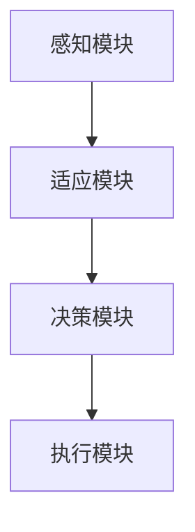
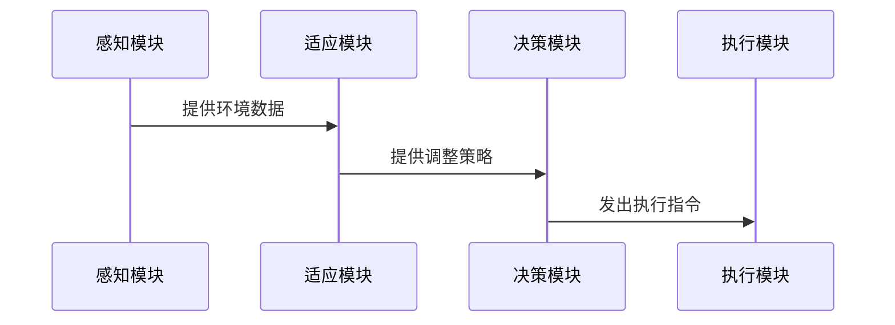

                 


# AI Agent的实时环境感知与适应能力

## 关键词：AI Agent, 环境感知, 适应能力, 实时处理, 多模态数据, 系统架构, 项目实战

## 摘要：  
本文深入探讨AI Agent在实时环境感知与适应能力方面的能力。通过详细分析环境感知的核心原理、适应能力的算法机制、系统架构设计以及项目实战，结合具体案例和代码实现，为读者提供全面而深入的技术解析。文章内容涵盖AI Agent的基本概念、环境感知与适应能力的重要性、多模态数据融合技术、自适应学习算法、系统架构设计、项目实战以及未来发展方向，帮助读者全面理解AI Agent在动态复杂环境中的应用。

---

## 第1章: AI Agent的基本概念与背景介绍

### 1.1 AI Agent的定义与核心要素

#### 1.1.1 什么是AI Agent
AI Agent（人工智能代理）是指能够感知环境、自主决策并执行任务的智能实体。它可以是一个软件程序、机器人或其他智能系统，具备以下核心能力：
- **自主性**：能够在没有外部干预的情况下独立运作。
- **反应性**：能够实时感知环境变化并做出反应。
- **学习能力**：通过数据和经验不断优化自身的行为。

#### 1.1.2 AI Agent的核心要素与组成
AI Agent的核心组成包括：
1. **感知模块**：用于采集和处理环境数据。
2. **推理模块**：负责分析数据并生成决策。
3. **决策模块**：根据推理结果制定行动计划。
4. **执行模块**：将决策转化为具体动作。

#### 1.1.3 AI Agent的分类与应用场景
AI Agent可以分为以下几类：
- **简单反射型代理**：基于预设规则做出反应。
- **基于模型的反射型代理**：利用内部模型进行推理和决策。
- **目标驱动型代理**：根据明确的目标制定行动计划。
- **效用驱动型代理**：通过最大化效用函数来优化决策。

应用场景包括：
- **自动驾驶**：实时感知路况并做出驾驶决策。
- **智能助手**：根据用户需求提供个性化服务。
- **工业机器人**：在复杂环境中执行精准操作。

---

### 1.2 环境感知与适应能力的重要性

#### 1.2.1 环境感知的定义与作用
环境感知是指AI Agent通过传感器或其他输入渠道获取环境信息，并对这些信息进行处理和理解。它是AI Agent与外部世界交互的基础，能够帮助AI Agent做出更准确的决策。

#### 1.2.2 适应能力的定义与意义
适应能力是指AI Agent在动态变化的环境中，能够快速调整自身行为以应对新的挑战。这种能力使得AI Agent能够在复杂和不确定的环境中保持高效运作。

#### 1.2.3 两者结合的必要性
环境感知为AI Agent提供了环境信息，而适应能力使其能够在环境中灵活应对变化。两者的结合使得AI Agent具备更强的实用性和可靠性，能够更好地满足实际应用的需求。

---

## 第2章: 环境感知的原理与方法

### 2.1 多模态感知技术

#### 2.1.1 视觉感知
视觉感知是通过摄像头或其他视觉传感器获取环境信息，并通过图像处理技术进行分析。常用的技术包括：
- **图像分割**：将图像分成不同的区域并进行分类。
- **目标检测**：识别图像中的特定目标并定位其位置。
- **深度估计**：估计场景中物体的深度信息。

#### 2.1.2 听觉感知
听觉感知是通过麦克风或其他音频传感器获取环境声音信息，并通过语音识别或声纹识别技术进行分析。常用的技术包括：
- **语音识别**：将语音信号转换为文字。
- **声源定位**：确定声音来源的位置。
- **情感识别**：通过语音分析用户的情感状态。

#### 2.1.3 传感器数据融合
传感器数据融合是指将来自不同传感器的数据进行整合，以提高感知的准确性和鲁棒性。常用的传感器包括：
- **激光雷达（LiDAR）**：用于高精度的三维环境建模。
- **惯性测量单元（IMU）**：用于姿态估计和运动跟踪。
- **GPS**：用于定位和导航。

### 2.2 传感器数据的预处理与融合

#### 2.2.1 数据预处理方法
数据预处理是传感器数据融合的前提，主要包括：
- **去噪处理**：去除噪声，提高数据质量。
- **归一化处理**：将数据标准化，使其具有可比性。
- **插值处理**：填补数据中的空缺值。

#### 2.2.2 数据融合算法
数据融合算法包括：
- **加权融合**：根据传感器的可信度进行加权融合。
- **最优融合**：利用优化算法进行数据融合。
- **基于概率的融合**：利用概率论方法进行数据融合。

#### 2.2.3 融合效果评估
融合效果的评估可以通过以下指标进行：
- **准确率**：融合后数据的准确性。
- **鲁棒性**：在噪声或干扰情况下的表现。
- **延迟**：数据融合的实时性。

---

## 第3章: 适应能力的机制与算法

### 3.1 自适应学习算法

#### 3.1.1 强化学习
强化学习是一种通过试错方式优化决策的算法。其核心是通过与环境的交互，学习最优策略。常用算法包括：
- **Q-learning**：通过Q值表记录状态-动作的奖励值。
- **Deep Q-Network (DQN)**：利用深度神经网络近似Q值函数。

#### 3.1.2 在线学习
在线学习是一种动态更新模型参数的学习方法，适用于环境动态变化的情况。常用算法包括：
- **随机梯度下降（SGD）**：逐步优化模型参数。
- **在线集成学习**：结合多个模型进行预测。

#### 3.1.3 迁移学习
迁移学习是将已学习的知识迁移到新任务中，适用于环境变化较大的情况。常用方法包括：
- **参数迁移**：直接迁移模型参数。
- **特征迁移**：迁移特征表示。
- **任务迁移**：适应新任务。

### 3.2 动态环境下的优化策略

#### 3.2.1 在线优化方法
在线优化是指在实时环境中不断优化决策策略。常用方法包括：
- **凸优化**：适用于问题可转化为凸函数的情况。
- **非凸优化**：适用于问题不可转化为凸函数的情况。
- **动态规划**：通过动态规划方法优化决策序列。

#### 3.2.2 分布式计算
分布式计算是通过多台计算设备协同工作来提高计算能力。常用技术包括：
- **MapReduce**：分布式数据处理框架。
- **分布式机器学习**：利用分布式计算资源进行模型训练。

#### 3.2.3 自适应反馈机制
自适应反馈机制是根据环境反馈调整决策的机制。常用方法包括：
- **反馈环**：将环境反馈用于优化决策。
- **闭环控制**：通过反馈控制系统的输出。

---

## 第4章: 环境感知与适应能力的系统架构设计

### 4.1 系统功能设计

#### 4.1.1 感知模块
感知模块负责采集和处理环境数据，主要包括：
- **数据采集**：通过传感器获取原始数据。
- **数据处理**：对数据进行预处理和融合。
- **特征提取**：提取数据中的有用特征。

#### 4.1.2 适应模块
适应模块负责根据环境信息调整系统行为，主要包括：
- **状态估计**：估计当前环境状态。
- **决策优化**：优化决策策略。
- **参数调整**：动态调整系统参数。

#### 4.1.3 决策模块
决策模块负责根据环境信息制定行动计划，主要包括：
- **目标设定**：明确决策目标。
- **策略生成**：生成行动计划。
- **计划执行**：将计划转化为具体动作。

### 4.2 系统架构图



### 4.3 接口设计与交互流程



---

## 第5章: 项目实战与案例分析

### 5.1 项目环境搭建

#### 5.1.1 系统需求分析
系统需求包括：
- **硬件需求**：高性能计算设备、多种传感器。
- **软件需求**：操作系统、开发工具、算法库。

#### 5.1.2 环境搭建步骤
环境搭建步骤包括：
1. **安装开发环境**：安装Python、ROS等开发工具。
2. **配置传感器驱动**：安装并配置传感器驱动程序。
3. **部署算法框架**：选择并部署合适的算法框架。

---

## 第6章: 系统实现与代码解读

### 6.1 环境感知实现

#### 6.1.1 多模态数据融合
```python
import numpy as np

# 假设来自两个传感器的数据
sensor1 = np.array([1, 2, 3])
sensor2 = np.array([2, 3, 4])

# 加权融合
weights = [0.6, 0.4]
fused_data = np.zeros_like(sensor1)
for i in range(len(sensor1)):
    fused_data[i] = weights[0] * sensor1[i] + weights[1] * sensor2[i]
```

#### 6.1.2 实时数据处理
```python
import time

# 实时数据处理
while True:
    data = get_sensor_data()
    process_data(data)
    time.sleep(0.1)
```

### 6.2 适应能力实现

#### 6.2.1 强化学习算法
```python
# Q-learning算法
class QLearning:
    def __init__(self, state_space, action_space):
        self.Q = np.zeros((state_space, action_space))
    
    def update(self, state, action, reward, next_state):
        alpha = 0.1
        gamma = 0.9
        self.Q[state, action] = (1 - alpha) * self.Q[state, action] + alpha * (reward + gamma * np.max(self.Q[next_state, :]))
```

#### 6.2.2 在线优化算法
```python
# 在线梯度下降
def online_gradient_descent(X, y, learning_rate=0.01, iterations=100):
    m, n = X.shape
    theta = np.zeros(n)
    for _ in range(iterations):
        hypothesis = np.dot(X, theta)
        gradient = (2/m) * np.dot(X.T, (hypothesis - y))
        theta -= learning_rate * gradient
    return theta
```

---

## 第7章: 项目实战与案例分析

### 7.1 项目环境搭建

---

## 第8章: 总结与展望

### 8.1 项目总结
通过本项目，我们实现了AI Agent的实时环境感知与适应能力，验证了多模态数据融合和自适应学习算法的有效性。

### 8.2 未来展望
未来，AI Agent的实时环境感知与适应能力将朝着以下几个方向发展：
- **多智能体协作**：实现多个AI Agent协同工作。
- **强化学习优化**：进一步优化强化学习算法。
- **边缘计算应用**：将AI Agent应用于边缘计算场景。

---

## 总结

通过本文的详细讲解，我们全面探讨了AI Agent的实时环境感知与适应能力，从基本概念到系统架构，从算法实现到项目实战，为读者提供了全面而深入的技术解析。希望本文能够为相关领域的研究和应用提供有价值的参考。

--- 

**END**

