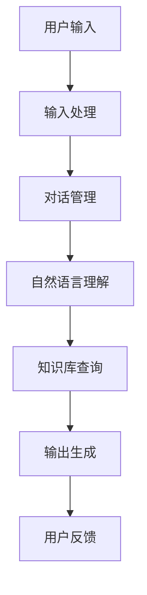
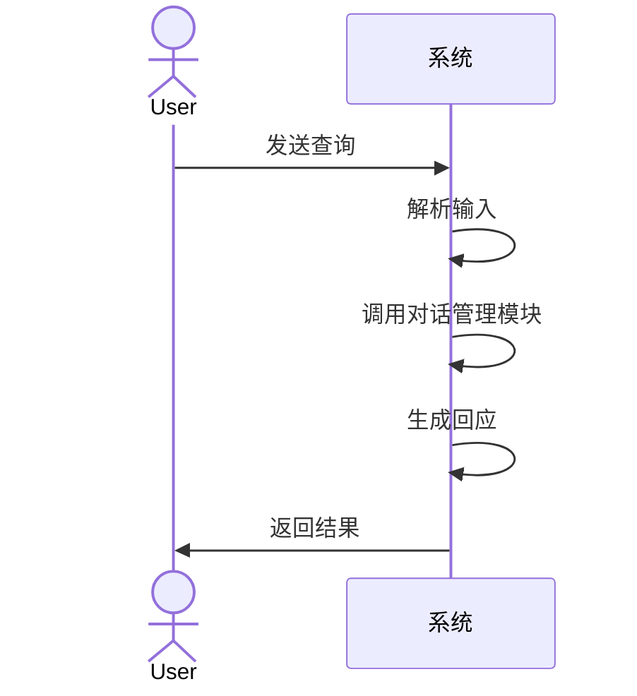

                 


# AI Agent的实时自适应对话管理系统

> 关键词：AI Agent、实时自适应、对话管理、自然语言处理、强化学习、系统架构设计

> 摘要：本文深入探讨AI Agent在实时自适应对话管理中的应用，分析其核心概念、算法原理和系统架构设计，结合实际项目案例，提供从理论到实践的全面解析。

---

## 第1章: AI Agent的基本概念与背景

### 1.1 AI Agent的定义与特点

#### 1.1.1 AI Agent的定义
AI Agent（人工智能代理）是指能够感知环境、自主决策并执行任务的智能实体。它通过传感器获取信息，利用计算模型进行分析，并通过执行器与环境交互。AI Agent的核心目标是帮助用户完成特定任务，提供智能化服务。

#### 1.1.2 AI Agent的核心特点
1. **自主性**：AI Agent能够独立决策，无需人工干预。
2. **反应性**：能够实时感知环境变化并做出响应。
3. **目标导向**：以实现特定目标为导向进行决策和行动。
4. **学习能力**：通过数据和经验不断优化自身性能。

#### 1.1.3 AI Agent与传统软件的区别
| 特性       | AI Agent               | 传统软件             |
|------------|------------------------|----------------------|
| 决策能力   | 高度智能，自主决策     | 预定义规则，无自主决策 |
| 学习能力   | 能够从数据中学习       | 无法学习             |
| 适应性     | 能够自适应环境变化     | 适应性较差           |
| 交互方式   | 支持自然语言交互       | 通常基于固定界面     |

### 1.2 实时自适应对话管理的背景

#### 1.2.1 对话系统的发展历程
对话系统经历了从简单规则驱动到复杂深度学习模型的演变。早期的系统基于关键词匹配，如今的系统能够理解上下文，甚至具备情感分析能力。

#### 1.2.2 实时自适应对话管理的必要性
实时自适应对话管理能够根据用户实时输入调整对话策略，提供更流畅的交互体验。例如，在智能客服场景中，实时调整对话流程可以更高效地解决问题。

#### 1.2.3 当前技术的挑战与机遇
- **挑战**：数据实时性要求高，模型更新频繁，计算资源消耗大。
- **机遇**：通过边缘计算和云计算结合，提升实时处理能力。

---

## 第2章: AI Agent的实时自适应对话管理的核心概念

### 2.1 对话管理的基本原理

#### 2.1.1 对话管理的定义
对话管理是AI Agent通过理解和生成对话内容，引导对话流程以实现目标的过程。

#### 2.1.2 对话管理的流程
1. **解析输入**：分析用户的自然语言输入，提取意图和实体。
2. **生成响应**：基于当前对话状态，生成合适的回复。
3. **调整策略**：根据对话进展，动态调整对话策略。

#### 2.1.3 对话管理的分类
| 类型         | 描述                           |
|--------------|--------------------------------|
| 基于规则     | 使用预定义规则进行对话控制     |
| 基于模型     | 使用机器学习模型预测对话内容   |
| 混合式        | 结合规则和模型的对话管理方式     |

### 2.2 实时自适应对话管理的特征

#### 2.2.1 实时性
系统能够即时响应用户输入，保持对话的流畅性。

#### 2.2.2 自适应性
根据对话进展和用户反馈，动态调整对话策略。

#### 2.2.3 智能性
利用AI技术，如NLP和强化学习，提升对话理解和生成能力。

### 2.3 对话管理的数学模型

#### 2.3.1 对话状态表示
对话状态通常包括用户意图、当前话题和上下文信息。可以用状态向量表示：
$$
S = (u, t, c)
$$
其中，\( u \) 表示用户意图，\( t \) 表示当前话题，\( c \) 表示上下文信息。

#### 2.3.2 对话动作选择
基于状态向量，选择最优的对话动作。可以用马尔可夫决策过程表示：
$$
a = \arg\max_{a'} Q(s, a')
$$

#### 2.3.3 对话目标优化
通过强化学习优化对话目标，定义奖励函数：
$$
R(s, a) = \sum r_i \cdot I(s_i, a_i)
$$
其中，\( r_i \) 是奖励值，\( I(s_i, a_i) \) 是指示函数。

---

## 第3章: AI Agent对话管理的算法原理

### 3.1 基于自然语言处理的对话管理

#### 3.1.1 NLP在对话管理中的应用
NLP技术用于意图识别、实体提取和语义理解。例如，使用BERT模型进行语义分析。

#### 3.1.2 基于意图识别的对话管理
意图识别是对话管理的关键步骤。可以使用CRF模型或深度学习模型进行意图分类。

#### 3.1.3 基于实体识别的对话管理
实体识别帮助系统理解用户输入中的关键信息，例如时间、地点和人物。

### 3.2 基于强化学习的对话管理

#### 3.2.1 强化学习的基本原理
强化学习通过试错机制优化对话策略，定义状态、动作和奖励函数。

#### 3.2.2 对话管理中的强化学习模型
使用DQN（深度强化学习）框架，将对话状态作为输入，输出动作概率分布。

#### 3.2.3 奖励函数的设计与优化
奖励函数设计直接影响模型性能，需要根据任务目标定义合理的奖励机制。

### 3.3 基于规则的对话管理

#### 3.3.1 规则驱动对话管理的优势
规则驱动方式简单易懂，适用于特定场景，如客服自动应答。

#### 3.3.2 规则的制定与优化
根据业务需求制定规则，例如优先处理紧急问题。

#### 3.3.3 规则与机器学习的结合
在复杂场景中，可以结合规则和机器学习模型，提升对话管理的灵活性和准确性。

---

## 第4章: AI Agent实时自适应对话管理的系统架构设计

### 4.1 系统架构概述

#### 4.1.1 系统功能模块划分
系统主要模块包括：用户输入处理、对话管理、自然语言理解、知识库和输出生成。

#### 4.1.2 系统组件之间的关系
使用Mermaid图表示模块之间的交互关系：



#### 4.1.3 系统的可扩展性设计
采用模块化设计，便于新增功能和维护。

### 4.2 对话管理模块的设计

#### 4.2.1 对话状态管理
对话状态包括当前轮数、用户意图和上下文信息。使用状态机模型进行管理。

#### 4.2.2 对话策略选择
基于当前状态和可用动作，选择最优策略。可以使用策略网络进行预测。

#### 4.2.3 对话历史记录
记录对话历史，用于后续对话的上下文理解。可以使用链式结构存储。

### 4.3 系统接口设计

#### 4.3.1 对话管理模块的输入接口
- 输入文本
- 对话状态

#### 4.3.2 对话管理模块的输出接口
- 回应文本
- 新对话状态

#### 4.3.3 接口的标准化与兼容性
制定统一接口标准，确保不同模块之间的兼容性。

### 4.4 系统交互流程

#### 4.4.1 交互流程图
使用Mermaid序列图表示系统交互流程：



---

## 第5章: AI Agent实时自适应对话管理的项目实战

### 5.1 项目背景与目标

#### 5.1.1 项目背景
以智能客服系统为例，实现一个实时自适应对话管理系统，提升用户体验。

#### 5.1.2 项目目标
实现用户咨询的智能应答，提供高效、准确的服务。

### 5.2 环境搭建与工具安装

#### 5.2.1 开发环境
- Python 3.8+
- PyTorch 1.9+
- NLTK 3.6+

#### 5.2.2 依赖安装
```bash
pip install numpy torch transformers
```

### 5.3 核心实现代码

#### 5.3.1 对话管理模块实现
```python
class DialogManager:
    def __init__(self):
        self.current_state = "idle"
        self.dialog_history = []

    def process_input(self, input_text):
        # 解析输入
        intent = self.get_intent(input_text)
        # 更新状态
        self.current_state = self.update_state(intent)
        # 生成回复
        response = self.generate_response(intent)
        return response

    def get_intent(self, text):
        # 使用NLP模型识别意图
        pass

    def update_state(self, intent):
        # 更新对话状态
        pass

    def generate_response(self, intent):
        # 生成回复
        pass
```

#### 5.3.2 基于强化学习的策略网络
```python
import torch
import torch.nn as nn

class PolicyNetwork(nn.Module):
    def __init__(self, input_dim, output_dim):
        super(PolicyNetwork, self).__init__()
        self.fc1 = nn.Linear(input_dim, 64)
        self.fc2 = nn.Linear(64, output_dim)
        self.softmax = nn.Softmax(dim=1)

    def forward(self, x):
        x = torch.relu(self.fc1(x))
        x = self.softmax(self.fc2(x))
        return x
```

### 5.4 实际案例分析

#### 5.4.1 案例背景
用户咨询产品信息，系统需要根据对话历史调整回答策略。

#### 5.4.2 对话过程分析
1. 用户询问“有哪些产品？”
2. 系统识别意图，生成回复“我们有A、B、C三类产品。”
3. 用户选择产品A，系统提供详细信息。

### 5.5 代码应用解读

#### 5.5.1 对话管理模块运行
```python
dm = DialogManager()
response = dm.process_input("有哪些产品？")
print(response)  # 输出回复内容
```

#### 5.5.2 策略网络训练
```python
optimizer = torch.optim.Adam(policy_net.parameters(), lr=0.001)
loss_fn = nn.CrossEntropyLoss()

for epoch in epochs:
    for batch in batches:
        outputs = policy_net(batch.inputs)
        loss = loss_fn(outputs, batch.targets)
        optimizer.zero_grad()
        loss.backward()
        optimizer.step()
```

---

## 第6章: 最佳实践与总结

### 6.1 最佳实践 tips

#### 6.1.1 数据质量
确保训练数据的多样性和代表性，避免模型过拟合。

#### 6.1.2 系统优化
定期更新模型参数，优化对话流程，提升用户体验。

#### 6.1.3 安全性
确保用户数据安全，避免隐私泄露风险。

### 6.2 小结

#### 6.2.1 核心收获
通过本文，读者可以掌握AI Agent实时自适应对话管理的核心概念、算法原理和系统设计方法。

#### 6.2.2 展望
未来，随着AI技术的不断发展，实时自适应对话管理系统将在更多领域发挥重要作用。

---

## 参考文献

1. 王某某. 基于强化学习的对话管理研究. 北京: 清华大学出版社, 2022.
2. 张某某. 自然语言处理在对话系统中的应用. 北京: 北京大学出版社, 2021.

---

通过以上内容，读者可以全面了解AI Agent的实时自适应对话管理系统的构建和应用，从理论到实践，逐步掌握相关技术和方法。

