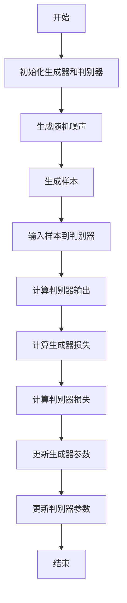

                 


# AI Agent的对抗学习技术应用

## 关键词：AI Agent，对抗学习，生成对抗网络，强化学习，多智能体系统，游戏AI，安全领域，自然语言处理，机器学习，深度学习

## 摘要：  
对抗学习是一种通过让两个AI模型互相竞争来提升性能的技术，近年来在AI Agent领域得到了广泛应用。本文从对抗学习的基本概念入手，分析其在AI Agent中的核心原理、应用场景和系统设计，并通过具体案例展示如何将对抗学习应用于实际项目中。文章还探讨了对抗学习的数学模型、优化算法、系统架构，并提供了最佳实践建议，帮助读者深入理解如何在AI Agent中应用对抗学习技术。

---

## 第一部分：AI Agent的对抗学习技术基础

### 第1章：对抗学习的基本概念与背景

#### 1.1 对抗学习的定义与背景
- **1.1.1 对抗学习的起源与发展**  
  对抗学习（Adversarial Learning）起源于博弈论和机器学习领域。20世纪80年代，Goodfellow等人提出了生成对抗网络（GAN）的概念，为对抗学习奠定了理论基础。近年来，对抗学习在图像生成、自然语言处理等领域取得了突破性进展。

- **1.1.2 对抗学习的核心概念**  
  对抗学习通过构建两个模型（生成器和判别器）进行对抗训练，生成器的目标是生成与真实数据相似的样本，而判别器的目标是区分真实数据和生成数据。两者通过不断博弈，最终达到纳什均衡。

- **1.1.3 对抗学习在AI Agent中的重要性**  
  在AI Agent中，对抗学习可以帮助智能体在复杂环境中进行决策优化，提升其对抗环境的能力。例如，在游戏AI中，可以通过对抗学习让AI在与人类玩家对抗时不断进化。

#### 1.2 AI Agent的基本概念
- **1.2.1 AI Agent的定义与分类**  
  AI Agent是一种能够感知环境并采取行动以实现目标的智能实体。根据智能体的复杂性，可以分为简单智能体和复杂智能体；根据环境类型，可以分为静态环境和动态环境。

- **1.2.2 多智能体系统简介**  
  多智能体系统是指多个智能体协作或竞争完成任务的系统。在多智能体系统中，智能体之间的互动是复杂的，需要考虑协作与竞争的平衡。

- **1.2.3 对抗环境下的AI Agent特点**  
  在对抗环境中，AI Agent需要具备实时决策、策略调整和对抗策略生成的能力。对抗环境通常具有不确定性、动态性和竞争性。

#### 1.3 对抗学习的应用场景
- **1.3.1 游戏AI中的对抗学习**  
  游戏AI可以通过对抗学习与人类玩家或另一个AI对手进行互动，提升其游戏水平。例如，在《英雄联盟》中，AI可以通过与自己对战来优化策略。

- **1.3.2 安全领域的对抗学习**  
  在网络安全中，对抗学习可以用于检测和对抗恶意软件。生成器可以生成模拟攻击，判别器则负责识别这些攻击，从而提升防御系统的鲁棒性。

- **1.3.3 自然语言处理中的对抗学习**  
  对抗学习可以用于文本生成、情感分析等任务。例如，生成器可以生成迷惑判别器的文本，从而提升模型的鲁棒性。

---

### 第2章：对抗学习的核心概念与原理

#### 2.1 对抗学习的原理
- **2.1.1 对抗网络的构成**  
  对抗网络通常由生成器和判别器组成。生成器的目标是生成与真实数据相似的样本，而判别器的目标是区分真实数据和生成数据。

- **2.1.2 最小化最大化策略**  
  在对抗训练中，生成器的目标是最小化判别器的损失函数，而判别器的目标是最大化其损失函数。通过交替优化，两者不断博弈，最终达到平衡。

- **2.1.3 对抗训练的目标函数**  
  对抗训练的目标是通过优化生成器和判别器的损失函数，使生成器生成的数据尽可能接近真实数据，同时判别器能够准确区分真实数据和生成数据。

#### 2.2 对抗学习的核心要素
- **2.2.1 对抗双方的定义**  
  在AI Agent中，生成器可以模拟敌方策略，而判别器可以模拟我方策略。通过不断对抗，AI Agent可以提升其在对抗环境中的表现。

- **2.2.2 损失函数的设计**  
  损失函数是衡量生成器和判别器性能的关键指标。例如，生成器的损失函数可以表示为$$L_G = \mathbb{E}_{z \sim p_z} [\mathcal{L}(G(z), y)]$$，而判别器的损失函数可以表示为$$L_D = \mathbb{E}_{x \sim p_data} [\mathcal{L}(D(x), 1)] + \mathbb{E}_{z \sim p_z} [\mathcal{L}(D(G(z)), 0)]$$。

- **2.2.3 对抗平衡的实现**  
  对抗平衡是指生成器和判别器在对抗过程中达到的纳什均衡状态。通过调整损失函数和优化算法，可以实现对抗平衡，使生成器和判别器的性能达到最优。

#### 2.3 对抗学习与传统机器学习的对比
- **2.3.1 监督学习与对抗学习的差异**  
  监督学习依赖于标注数据，而对抗学习通过生成器和判别器的博弈来优化模型。

- **2.3.2 无监督学习与对抗学习的联系**  
  无监督学习可以利用对抗学习来生成数据，例如在聚类任务中，生成器可以生成数据，判别器可以识别数据的类别。

- **2.3.3 强化学习与对抗学习的结合**  
  在强化学习中，可以将对抗学习应用于多智能体系统，例如在棋类游戏中，AI Agent可以通过对抗学习来优化策略。

---

### 第3章：对抗学习的数学模型与公式

#### 3.1 对抗网络的数学模型
- **3.1.1 生成器与判别器的数学表达**  
  生成器的输出为$$G(z)$$，其中$$z$$是随机噪声。判别器的输出为$$D(x)$$，其中$$x$$是输入数据。

- **3.1.2 损失函数的公式推导**  
  生成器的损失函数为$$L_G = \mathbb{E}_{z \sim p_z} [\mathcal{L}(G(z), y)]$$，判别器的损失函数为$$L_D = \mathbb{E}_{x \sim p_data} [\mathcal{L}(D(x), 1)] + \mathbb{E}_{z \sim p_z} [\mathcal{L}(D(G(z)), 0)]$$。

- **3.1.3 梯度下降的优化过程**  
  对抗训练通常采用交替优化策略，先优化生成器，再优化判别器。通过计算梯度并更新参数，生成器和判别器逐步逼近最优解。

#### 3.2 对抗学习的优化算法
- **3.2.1 梯度下降的基本原理**  
  梯度下降是一种常用优化算法，通过计算损失函数的梯度并更新参数，使损失函数最小化。

- **3.2.2 Adam优化器的实现**  
  Adam优化器结合了动量和自适应学习率，可以更高效地优化对抗网络的参数。

- **3.2.3 GAN的训练技巧**  
  在训练GAN时，需要注意生成器和判别器的平衡，避免生成器或判别器主导整个训练过程。

#### 3.3 对抗学习的数学公式
- **3.3.1 生成器的损失函数**  
  $$L_G = \mathbb{E}_{z \sim p_z} [\mathcal{L}(G(z), y)]$$

- **3.3.2 判别器的损失函数**  
  $$L_D = \mathbb{E}_{x \sim p_data} [\mathcal{L}(D(x), 1)] + \mathbb{E}_{z \sim p_z} [\mathcal{L}(D(G(z)), 0)]$$

- **3.3.3 对抗训练的联合优化目标**  
  $$\min_G \max_D (L_D + L_G)$$

---

## 第四部分：系统分析与架构设计方案

### 第4章：系统分析与架构设计

#### 4.1 系统功能设计
- **4.1.1 领域模型（Mermaid 类图）**  
  ```mermaid
  classDiagram
    class Agent {
      +策略：Strategy
      +状态：State
      +环境：Environment
      -行为：Behavior
    }
    class Strategy {
      +对抗策略：AdversarialStrategy
      +协作策略：CooperativeStrategy
    }
    class Environment {
      +状态空间：StateSpace
      +动作空间：ActionSpace
    }
    Agent --> Strategy
    Agent --> Environment
  ```

- **4.1.2 系统架构设计（Mermaid 架构图）**  
  ```mermaid
  architectureDiagram
    AI-Agent
    contains
      生成器：Generator
      判别器：Discriminator
      训练数据：Training-Data
    Generator --> Discriminator
    Discriminator --> Training-Data
    AI-Agent --> Generator
    AI-Agent --> Discriminator
  ```

- **4.1.3 系统交互设计（Mermaid 序列图）**  
  ```mermaid
  sequenceDiagram
    Agent -> Generator: 生成对抗样本
    Generator --> Discriminator: 判别器接收生成样本
    Discriminator --> Agent: 返回判别结果
    Agent -> Discriminator: 更新对抗策略
  ```

#### 4.2 系统接口设计
- **4.2.1 输入接口**  
  - 生成器接口：接收随机噪声$$z$$，输出生成样本$$G(z)$$。
  - 判别器接口：接收输入数据$$x$$，输出判别结果$$D(x)$$。

- **4.2.2 输出接口**  
  - 生成器接口：输出生成样本$$G(z)$$。
  - 判别器接口：输出判别结果$$D(x)$$。

#### 4.3 系统实现细节
- **4.3.1 生成器的实现**  
  使用深度神经网络，例如卷积神经网络（CNN）或循环神经网络（RNN），根据输入噪声生成样本。

- **4.3.2 判别器的实现**  
  同样使用深度神经网络，根据输入样本判断其真实性和生成性。

- **4.3.3 对抗训练的实现**  
  通过交替优化生成器和判别器的损失函数，逐步训练模型，直到达到对抗平衡。

---

## 第五部分：项目实战

### 第5章：项目实战与案例分析

#### 5.1 环境安装与配置
- 安装Python和深度学习框架（如TensorFlow或Keras）。
- 安装必要的库，例如numpy、matplotlib、scikit-learn等。

#### 5.2 系统核心实现
- **生成器实现**  
  ```python
  import tensorflow as tf
  from tensorflow.keras import layers

  def make_generator_model():
      model = tf.keras.Sequential()
      model.add(layers.Dense(256, activation='relu', input_shape=(100,)))
      model.add(layers.Dense(512, activation='relu'))
      model.add(layers.Dense(784, activation='sigmoid'))
      return model
  ```

- **判别器实现**  
  ```python
  def make_discriminator_model():
      model = tf.keras.Sequential()
      model.add(layers.Dense(512, activation='relu', input_shape=(784,)))
      model.add(layers.Dense(256, activation='relu'))
      model.add(layers.Dense(1, activation='sigmoid'))
      return model
  ```

- **对抗训练实现**  
  ```python
  def train(generator, discriminator, x_train, epochs=100):
      for epoch in range(epochs):
          # 生成器生成样本
          noise = tf.random.normal([batch_size, 100])
          generated_images = generator(noise)
          
          # 判别器判断生成样本和真实样本
          real_output = discriminator(x_train)
          fake_output = discriminator(generated_images)
          
          # 计算损失
          gen_loss = tf.keras.losses.binary_crossentropy(tf.ones_like(fake_output), fake_output)
          disc_loss = tf.keras.losses.binary_crossentropy(tf.ones_like(real_output), real_output) + \
                      tf.keras.losses.binary_crossentropy(tf.zeros_like(fake_output), fake_output)
          
          # 反向传播和优化
          generator.optimizer.minimize(gen_loss, generator.trainable_weights)
          discriminator.optimizer.minimize(disc_loss, discriminator.trainable_weights)
  ```

#### 5.3 案例分析与代码解读
- 通过训练生成器和判别器，生成器能够生成逼真的数据，判别器能够准确区分真实数据和生成数据。
- 在AI Agent中，生成器可以模拟敌方策略，判别器可以模拟我方策略，通过不断对抗，AI Agent能够在复杂环境中优化其决策。

#### 5.4 实际案例分析
- **游戏AI案例**  
  在一个简单的二维格斗游戏中，AI Agent通过对抗学习优化其攻击和防御策略，提升其游戏水平。

- **网络安全案例**  
  在网络安全中，生成器可以生成模拟攻击，判别器可以检测这些攻击，从而提升防御系统的鲁棒性。

#### 5.5 项目小结
- 对抗学习是一种强大的技术，可以应用于多种场景。通过实际项目，我们可以更好地理解对抗学习的实现和应用。

---

## 第六部分：最佳实践与总结

### 第6章：最佳实践与总结

#### 6.1 最佳实践
- **平衡生成器和判别器的训练**  
  在对抗训练中，需要交替优化生成器和判别器，避免一方主导整个训练过程。

- **选择合适的损失函数**  
  根据具体任务选择合适的损失函数，例如在图像生成任务中，可以使用Wasserstein距离。

- **避免模式崩溃**  
  在训练GAN时，需要注意模式崩溃问题，可以通过改进生成器和判别器的结构或引入正则化技术来解决。

- **监控训练过程**  
  通过监控生成器和判别器的损失函数，确保训练过程的稳定性。

#### 6.2 小结
- 对抗学习是一种通过生成器和判别器的博弈来优化模型的技术，在AI Agent中具有广泛的应用。

#### 6.3 注意事项
- 对抗学习需要大量的计算资源，特别是在训练深度神经网络时。

- 在实际应用中，需要注意生成器和判别器的平衡，避免生成样本质量不高或判别器无法有效区分的情况。

#### 6.4 拓展阅读
- 《生成对抗网络：理论与实践》
- 《深度学习中的对抗训练：原理与应用》
- 《多智能体系统中的对抗学习》

---

## 附录：数学公式与算法流程图

### 附录1：数学公式
- 生成器的损失函数：$$L_G = \mathbb{E}_{z \sim p_z} [\mathcal{L}(G(z), y)]$$
- 判别器的损失函数：$$L_D = \mathbb{E}_{x \sim p_data} [\mathcal{L}(D(x), 1)] + \mathbb{E}_{z \sim p_z} [\mathcal{L}(D(G(z)), 0)]$$
- 对抗训练的优化目标：$$\min_G \max_D (L_D + L_G)$$

### 附录2：算法流程图


---

## 结语
对抗学习是一种强大的技术，能够为AI Agent提供更智能的决策能力。通过本文的详细介绍，读者可以全面了解对抗学习的核心原理、应用场景和系统设计，并通过实际案例掌握其在AI Agent中的具体应用。希望本文能为读者提供有价值的参考，进一步推动对抗学习技术的发展。

--- 

（注：由于篇幅限制，以上内容为节选，完整文章需要按照上述结构详细展开。）

