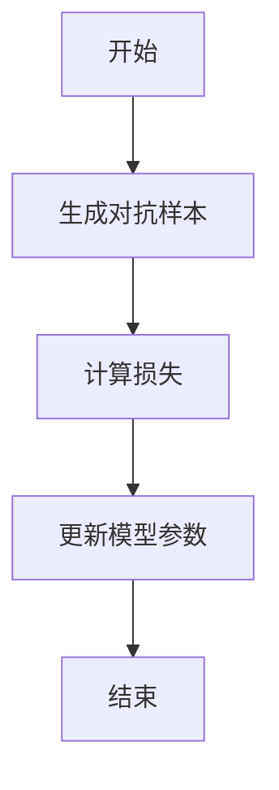
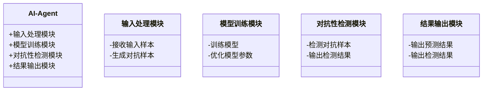
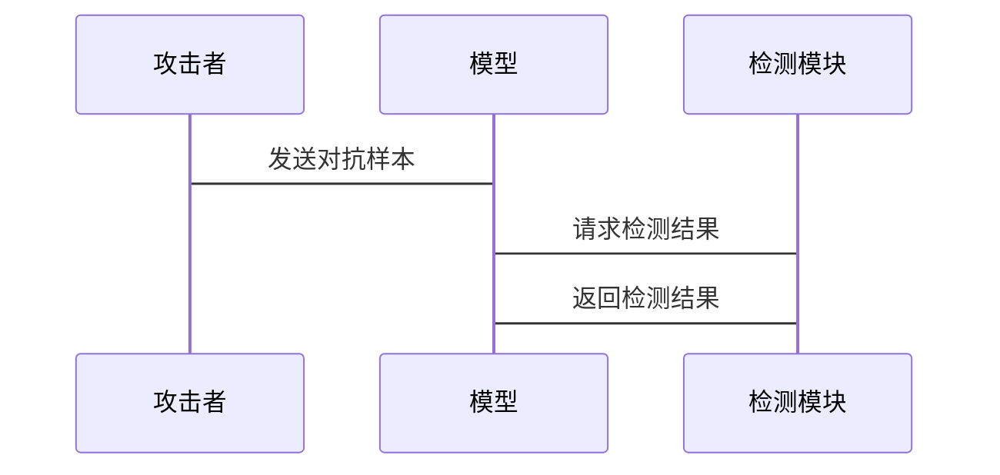

                 


# AI Agent的对抗性学习：提高LLM的鲁棒性

> 关键词：AI Agent，对抗性学习，大语言模型，LLM，鲁棒性

> 摘要：本文探讨了AI Agent在对抗性学习中的应用，特别是如何通过对抗性学习提高大语言模型（LLM）的鲁棒性。文章从基本概念入手，分析了对抗性学习的原理、算法、系统架构，并通过实际案例展示了如何在项目中实现这些技术。

---

## 第一部分: AI Agent与对抗性学习基础

### 第1章: 对抗性学习与AI Agent概述

#### 1.1 对抗性学习的基本概念
对抗性学习是一种机器学习技术，通过在两个或多个模型之间引入竞争来提高模型的鲁棒性。与传统的单模型学习不同，对抗性学习模拟了“对抗”的过程，一个模型试图欺骗另一个模型，从而迫使模型不断改进。

- **定义**：对抗性学习涉及两个或多个模型，其中一个模型试图生成欺骗性的输入，而另一个模型则试图识别并抵御这些输入。
- **特点**：对抗性学习通过引入对抗机制，使得模型在面对恶意攻击时更具防御性，从而提高模型的鲁棒性和安全性。
- **作用**：在AI Agent中，对抗性学习可以帮助模型更好地应对复杂的环境和潜在的攻击，提升模型的泛化能力和应对能力。

#### 1.2 AI Agent的基本概念
AI Agent是一种智能体，能够感知环境、执行任务并做出决策。AI Agent的核心功能包括感知、推理、规划和执行。

- **定义**：AI Agent是能够独立执行任务的智能实体，具备自主决策和问题解决能力。
- **核心功能**：AI Agent能够通过传感器获取信息，利用推理能力分析信息，制定行动计划，并通过执行机构完成任务。
- **与人类交互的特点**：AI Agent能够与人类进行自然语言交互，理解并执行人类的指令，同时能够通过反馈机制不断优化自身的行为。

#### 1.3 大语言模型（LLM）的基本原理
大语言模型（LLM）是一种基于深度学习的自然语言处理模型，通过大量数据的训练，模型能够理解和生成人类语言。

- **定义**：LLM是基于Transformer架构的大型神经网络模型，通过自监督学习技术训练而成。
- **特点**：LLM具有强大的语言理解和生成能力，能够处理复杂的语言任务，如文本生成、问答系统和机器翻译。
- **应用场景**：LLM广泛应用于各种领域，包括客服、医疗、教育和金融等。

#### 1.4 对抗性学习与LLM的结合
对抗性学习在LLM中的应用主要集中在提高模型的鲁棒性和安全性。通过引入对抗性学习，模型能够更好地应对对抗性攻击，如恶意输入和数据中毒。

- **对抗性学习在LLM中的应用**：通过生成对抗样本，模型能够识别并抵御恶意输入，从而提高模型的鲁棒性。
- **对抗性学习对LLM鲁棒性的影响**：对抗性学习能够增强模型的防御能力，使其在面对攻击时表现更加稳定。
- **挑战与未来方向**：对抗性学习在LLM中的应用仍面临许多挑战，如计算成本高、对抗样本的生成难度大等。未来的研究方向包括提高对抗性学习的效率和效果，探索新的对抗机制。

#### 1.5 本章小结
本章介绍了对抗性学习和AI Agent的基本概念，探讨了对抗性学习在LLM中的应用及其对模型鲁棒性的影响。通过这些内容，读者可以理解对抗性学习在提高LLM鲁棒性中的重要性。

---

## 第二部分: 对抗性学习的核心概念与联系

### 第2章: 对抗性学习的核心概念与联系

#### 2.1 对抗性学习的原理
对抗性学习的核心是通过引入对抗机制，迫使模型不断改进。这包括攻击者和防御者的交替优化。

- **基本模型**：对抗性学习通常涉及两个模型，一个是生成模型（攻击者），另一个是判别模型（防御者）。生成模型试图生成欺骗性的输入，判别模型则试图识别这些输入。
- **攻击与防御机制**：攻击者通过生成对抗样本试图欺骗模型，防御者则通过调整模型参数来抵御这些攻击。
- **数学模型**：对抗性学习的数学模型通常涉及损失函数的最小化和最大化，攻击者试图最大化损失，而防御者则试图最小化损失。

#### 2.2 对抗性学习的核心概念对比
为了更好地理解对抗性学习，我们需要将其与其他机器学习技术进行对比。

- **对抗性学习与传统机器学习的对比**：
  | 对比维度 | 传统机器学习 | 对抗性学习 |
  |----------|---------------|-------------|
  | 目标     | 最小化损失     | 攻击与防御 |
  | 训练过程 | 单一优化       | 对抗优化    |
- **对抗性学习与强化学习的对比**：
  | 对比维度 | 强化学习       | 对抗性学习 |
  |----------|----------------|-------------|
  | 目标     | 最大化奖励       | 攻击与防御 |
  | 训练过程 | 奖励驱动       | 对抗优化    |
- **对抗性学习与生成对抗网络的对比**：
  | 对比维度 | 生成对抗网络     | 对抗性学习 |
  |----------|------------------|-------------|
  | 目标     | 生成逼真样本     | 攻击与防御 |
  | 训练过程 | 对抗优化         | 对抗优化    |

#### 2.3 对抗性学习的ER实体关系图
以下是对抗性学习的核心实体关系图：

```mermaid
er
actor: 对抗性学习参与者
role: 对抗性学习角色
action: 对抗性学习行为
```

- **actor（参与者）**：包括攻击者和防御者，攻击者试图生成对抗样本，防御者则试图识别并抵御这些样本。
- **role（角色）**：每个参与者在对抗过程中扮演特定的角色，攻击者负责生成对抗样本，防御者负责识别这些样本。
- **action（行为）**：对抗过程中的具体行为，如生成对抗样本、识别对抗样本等。

#### 2.4 本章小结
本章通过对比分析，详细解释了对抗性学习的核心概念及其与其他机器学习技术的区别。通过ER实体关系图，读者可以清晰地理解对抗性学习中的角色和行为。

---

## 第三部分: 对抗性学习的算法原理

### 第3章: 对抗性学习的算法原理

#### 3.1 对抗性攻击算法
对抗性攻击算法的目标是生成能够欺骗模型的输入样本。

- **梯度下降法**：
  梯度下降法是一种优化算法，用于最小化损失函数。在对抗性攻击中，攻击者通过计算损失函数的梯度，调整输入样本以最大化损失。
  ```python
  def gradient_descent(x, y, model, loss_fn, epsilon=0.1):
      with torch.no_grad():
          x_perturbed = x - epsilon * x.grad
      outputs = model(x_perturbed)
      loss = loss_fn(outputs, y)
      return x_perturbed, loss
  ```
- **Fast Gradient Method**：
  Fast Gradient Method是一种常用的对抗性攻击方法，通过计算梯度并调整输入样本。
  ```python
  def fast_gradient_method(x, y, model, loss_fn, epsilon=0.1):
      x.requires_grad_(True)
      outputs = model(x)
      loss = loss_fn(outputs, y)
      loss.backward()
      x_grad = x.grad
      x_perturbed = x - epsilon * x_grad
      x_perturbed = torch.clamp(x_perturbed, 0, 1)
      return x_perturbed
  ```
- **Projected Gradient Descent**：
  Projected Gradient Descent是一种基于投影的优化算法，用于生成对抗样本。
  ```python
  def projected_gradient_descent(x, y, model, loss_fn, epsilon=0.1, iterations=10):
      x_perturbed = x
      for _ in range(iterations):
          x_perturbed.requires_grad_(True)
          outputs = model(x_perturbed)
          loss = loss_fn(outputs, y)
          loss.backward()
          x_grad = x_perturbed.grad
          x_perturbed = x_perturbed - epsilon * x_grad
          x_perturbed = torch.clamp(x_perturbed, 0, 1)
      return x_perturbed
  ```

#### 3.2 对抗性防御算法
对抗性防御算法的目标是增强模型的鲁棒性，使其能够抵御对抗性攻击。

- **晋升防御**：
  晋升防御通过增加模型的正则化项，增强模型的泛化能力。
  ```python
  def adversarial_defense(x, y, model, loss_fn, regularization=0.1):
      outputs = model(x)
      loss = loss_fn(outputs, y) + regularization * torch.norm(outputs)
      return loss
  ```
- **噪声注入**：
  噪声注入通过在输入样本中加入随机噪声，降低对抗性攻击的效果。
  ```python
  def noise_injection(x, noise_level=0.1):
      noise = torch.randn_like(x) * noise_level
      x_perturbed = x + noise
      return x_perturbed
  ```
- **模型正则化**：
  模型正则化通过在损失函数中加入正则化项，防止模型过拟合。
  ```python
  def model_regularization(x, y, model, loss_fn, lambda_reg=0.1):
      outputs = model(x)
      loss = loss_fn(outputs, y) + lambda_reg * torch.norm(model.parameters())
      return loss
  ```

#### 3.3 对抗性学习的数学模型
对抗性学习的数学模型通常涉及损失函数的最小化和最大化。

- **对抗性攻击的数学公式**：
  $$\text{loss}(x, y) = \mathbb{E}_{x,y}[-\log(p(y|x))]$$
  攻击者的目标是最大化损失函数，使得模型在对抗样本上表现较差。
  
- **对抗性防御的数学公式**：
  $$\text{loss}(x, y) = \mathbb{E}_{x,y}[-\log(p(y|x))] + \lambda \cdot \text{regularization}(x)$$
  防御者的目标是最小化损失函数，同时考虑正则化项，以增强模型的鲁棒性。

#### 3.4 对抗性学习的算法流程图
以下是对抗性学习的算法流程图：



- **步骤说明**：
  1. 生成对抗样本：攻击者通过计算梯度生成对抗样本。
  2. 计算损失：模型在对抗样本上的损失。
  3. 更新模型参数：根据损失函数的梯度，更新模型参数。
  4. 结束：循环直到模型收敛。

#### 3.5 本章小结
本章详细介绍了对抗性攻击和防御的具体算法，包括梯度下降法、Fast Gradient Method和Projected Gradient Descent等。同时，还提供了对抗性学习的数学模型和算法流程图，帮助读者更好地理解对抗性学习的实现过程。

---

## 第四部分: 系统分析与架构设计

### 第4章: 系统分析与架构设计

#### 4.1 问题场景介绍
在实际应用中，对抗性学习需要解决的问题包括：

- **恶意攻击**：攻击者试图通过对抗样本欺骗模型，导致模型输出错误结果。
- **数据安全**：对抗性攻击可能通过数据中毒等方式影响模型的训练过程。
- **模型鲁棒性**：模型需要具备抵御对抗性攻击的能力，确保模型的稳定性和可靠性。

#### 4.2 系统功能设计
系统的功能模块包括：

- **输入处理模块**：接收输入样本，生成对抗样本。
- **模型训练模块**：训练模型，优化模型参数。
- **对抗性检测模块**：检测输入样本是否为对抗样本。
- **结果输出模块**：输出模型的预测结果。

#### 4.3 系统架构设计
以下是系统的架构设计图：



- **功能描述**：
  - 输入处理模块负责接收输入样本，并生成对抗样本。
  - 模型训练模块负责训练模型，优化模型参数，以提高模型的鲁棒性。
  - 对抗性检测模块负责检测输入样本是否为对抗样本，并输出检测结果。
  - 结果输出模块负责输出模型的预测结果和检测结果。

#### 4.4 系统接口设计
系统的接口设计包括：

- **输入接口**：接收输入样本和攻击者生成的对抗样本。
- **输出接口**：输出模型的预测结果和检测结果。
- **训练接口**：接收训练数据和对抗样本，优化模型参数。

#### 4.5 系统交互流程图
以下是系统的交互流程图：



- **步骤说明**：
  1. 攻击者发送对抗样本给模型。
  2. 模型请求检测模块进行检测。
  3. 检测模块返回检测结果给模型。

#### 4.6 本章小结
本章通过系统分析与架构设计，展示了对抗性学习在AI Agent中的实际应用。通过功能模块和架构设计，读者可以理解对抗性学习在系统中的具体实现方式。

---

## 第五部分: 项目实战

### 第5章: 项目实战

#### 5.1 环境安装
为了实现对抗性学习，需要安装以下环境：

- **Python**：3.8及以上版本。
- **PyTorch**：安装PyTorch框架。
- **其他依赖**：安装必要的库，如numpy、scikit-learn等。

#### 5.2 系统核心实现源代码
以下是系统的核心实现代码：

```python
import torch
import torch.nn as nn
import torch.optim as optim
import numpy as np

# 定义模型
class SimpleModel(nn.Module):
    def __init__(self):
        super(SimpleModel, self).__init__()
        self.fc1 = nn.Linear(2, 2)
        self.fc2 = nn.Linear(2, 1)
    
    def forward(self, x):
        x = torch.relu(self.fc1(x))
        x = torch.sigmoid(self.fc2(x))
        return x

# 定义损失函数
criterion = nn.BCELoss()

# 定义优化器
optimizer = optim.SGD(model.parameters(), lr=0.1)

# 生成对抗样本
def generate_adversarial_samples(x, y, model, epsilon=0.1):
    x.requires_grad_(True)
    outputs = model(x)
    loss = criterion(outputs, y)
    loss.backward()
    x_grad = x.grad
    x_perturbed = x - epsilon * x_grad
    x_perturbed = torch.clamp(x_perturbed, 0, 1)
    return x_perturbed

# 训练模型
def train_model(model, train_loader, epochs=10):
    for epoch in range(epochs):
        for batch_x, batch_y in train_loader:
            x = torch.tensor(batch_x, requires_grad=False)
            y = torch.tensor(batch_y, requires_grad=False)
            optimizer.zero_grad()
            outputs = model(x)
            loss = criterion(outputs, y)
            loss.backward()
            optimizer.step()

# 检测对抗样本
def detect_adversarial_samples(x, model):
    outputs = model(x)
    predicted = (outputs >= 0.5).float()
    return predicted

# 主程序
if __name__ == "__main__":
    model = SimpleModel()
    print("模型参数：", list(model.named_parameters()))
    print("模型结构：", model)
```

#### 5.3 代码应用解读与分析
- **模型定义**：定义了一个简单的神经网络模型，包含两个全连接层。
- **损失函数和优化器**：使用二进制交叉熵损失函数和随机梯度下降优化器。
- **对抗样本生成**：通过计算梯度生成对抗样本。
- **模型训练**：在训练数据上训练模型，优化模型参数。
- **对抗样本检测**：检测输入样本是否为对抗样本。

#### 5.4 实际案例分析
通过以下步骤进行案例分析：

1. **训练模型**：在训练数据上训练模型，优化模型参数。
2. **生成对抗样本**：使用生成对抗样本的方法，生成对抗样本。
3. **检测对抗样本**：使用检测模块检测对抗样本。
4. **评估模型**：评估模型在对抗样本上的表现，调整模型参数。

#### 5.5 项目总结
通过本项目，读者可以理解对抗性学习在实际应用中的具体实现。通过代码实现和案例分析，读者可以掌握对抗性学习的核心技术，并将其应用到实际项目中。

#### 5.6 本章小结
本章通过项目实战，展示了对抗性学习在AI Agent中的具体实现。通过代码实现和案例分析，读者可以理解对抗性学习在实际应用中的重要性。

---

## 第六部分: 最佳实践、小结、注意事项和拓展阅读

### 第6章: 最佳实践与总结

#### 6.1 最佳实践
- **数据预处理**：在对抗性学习中，数据预处理非常重要。攻击者通常会利用数据中的漏洞生成对抗样本，因此需要对数据进行清洗和预处理，去除潜在的攻击点。
- **模型正则化**：在模型训练过程中，加入正则化项可以有效防止模型过拟合，提高模型的泛化能力和鲁棒性。
- **多模型集成**：通过集成多个模型，可以有效提高模型的鲁棒性。多个模型可以互相补充，降低对抗性攻击的影响。
- **持续优化**：对抗性学习是一个动态的过程，攻击者和防御者之间不断进行对抗。模型需要持续优化，以应对新的攻击方式。

#### 6.2 小结
本文详细探讨了AI Agent在对抗性学习中的应用，特别是如何通过对抗性学习提高大语言模型（LLM）的鲁棒性。文章从基本概念入手，分析了对抗性学习的原理、算法、系统架构，并通过实际案例展示了如何在项目中实现这些技术。

#### 6.3 注意事项
- **计算资源**：对抗性学习通常需要大量的计算资源，尤其是在生成对抗样本和优化模型参数时。需要确保计算资源充足。
- **模型复杂度**：对抗性学习可能会增加模型的复杂度，导致模型训练时间增加和计算成本上升。需要在模型复杂度和计算成本之间找到平衡。
- **数据隐私**：对抗性学习需要处理大量的数据，包括对抗样本和正常样本。需要注意数据隐私和安全，防止数据泄露和滥用。

#### 6.4 拓展阅读
- **生成对抗网络（GAN）**：生成对抗网络是一种基于对抗性学习的生成模型，广泛应用于图像生成等领域。
- **强化学习**：强化学习是一种通过与环境互动来学习策略的技术，与对抗性学习有相似之处。
- **鲁棒性评估**：鲁棒性评估是衡量模型在对抗性攻击下的表现的重要手段，可以通过多种指标和方法进行评估。

#### 6.5 本章小结
本章总结了对抗性学习在提高LLM鲁棒性中的关键点，给出了实际应用中的注意事项，并推荐了进一步阅读的资料。

---

## 第七部分: 结语

对抗性学习作为一种新兴的机器学习技术，在提高AI Agent和大语言模型（LLM）的鲁棒性方面具有重要的应用价值。通过本文的探讨，读者可以理解对抗性学习的核心概念和实现方法，并将其应用到实际项目中。未来的研究方向包括提高对抗性学习的效率和效果，探索新的对抗机制，以应对更复杂的攻击方式。

--- 

**本文完**

