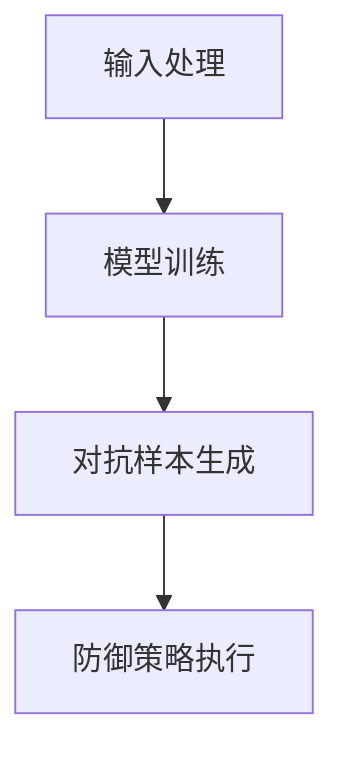

                 


# AI Agent的对抗性攻击防御策略

---

## 关键词：
AI Agent，对抗性攻击，防御策略，鲁棒优化，检测算法，干扰技术

---

## 摘要：
本文深入探讨了AI Agent在面对对抗性攻击时的防御策略。首先介绍了AI Agent的基本概念和对抗性攻击的类型，分析了对抗性攻击对AI Agent的影响。接着，详细讲解了对抗性攻击的原理，包括生成攻击样本的方法和数学模型。随后，重点阐述了对抗性攻击的防御策略，包括基于检测、干扰和鲁棒优化的防御方法。最后，通过实际案例分析和系统架构设计，展示了如何在实际项目中应用这些防御策略，并提出了未来的研究方向和最佳实践建议。

---

# 第1章: AI Agent与对抗性攻击的背景介绍

## 1.1 AI Agent的基本概念

### 1.1.1 AI Agent的定义与特点

AI Agent（人工智能代理）是指能够感知环境、自主决策并执行任务的智能实体。与传统程序不同，AI Agent具备以下特点：

- **自主性**：能够自主决策，无需外部干预。
- **反应性**：能够实时感知环境并做出响应。
- **目标导向**：基于目标进行决策和行动。
- **学习能力**：能够通过数据和经验不断优化自身的性能。

### 1.1.2 AI Agent的核心功能与应用场景

AI Agent的核心功能包括感知、决策、规划和执行。其应用场景广泛，例如自动驾驶、智能助手、推荐系统和机器人控制等。

## 1.2 对抗性攻击的背景与问题描述

### 1.2.1 对抗性攻击的定义与分类

对抗性攻击是指通过故意修改输入数据，使AI系统产生错误输出或行为的攻击方式。对抗性攻击可以分为白盒攻击和黑盒攻击两类：

- **白盒攻击**：攻击者完全了解模型的结构和参数。
- **黑盒攻击**：攻击者仅了解模型的输入输出关系。

### 1.2.2 AI Agent面临的对抗性攻击问题

对抗性攻击对AI Agent的威胁主要体现在以下几个方面：

- **决策错误**：对抗性输入可能导致AI Agent做出错误决策。
- **系统崩溃**：严重的对抗性攻击可能导致AI系统崩溃。
- **信任危机**：对抗性攻击会削弱用户对AI系统的信任。

### 1.2.3 对抗性攻击的防御边界与外延

对抗性攻击的防御需要考虑以下几个方面：

- **输入验证**：确保输入数据的合法性。
- **模型鲁棒性**：通过优化模型提高其对对抗性输入的抵抗力。
- **实时监测**：及时发现并应对对抗性攻击。

## 1.3 本章小结

本章介绍了AI Agent的基本概念和对抗性攻击的背景，分析了对抗性攻击对AI Agent的影响，并提出了防御策略的初步框架。

---

# 第2章: 对抗性攻击的核心原理

## 2.1 对抗性攻击的生成方法

### 2.1.1 白盒攻击与黑盒攻击的对比

白盒攻击和黑盒攻击的主要区别在于攻击者对模型的了解程度。白盒攻击需要攻击者完全了解模型的结构和参数，而黑盒攻击则仅需要了解输入输出关系。

### 2.1.2 对抗样本的生成过程

对抗样本的生成通常采用梯度下降方法，通过最小化损失函数来找到对抗性输入。具体步骤如下：

1. 生成原始样本。
2. 计算模型的预测结果。
3. 计算损失函数的梯度。
4. 更新输入样本，使其成为对抗样本。

### 2.1.3 对抗样本的数学模型

对抗样本的生成可以通过以下公式实现：

$$ \text{损失函数} = \mathcal{L}(x, y) + \lambda \|\delta\| $$

其中，$x$是原始输入，$y$是目标标签，$\delta$是对抗样本的扰动量，$\lambda$是调节参数。

## 2.2 对抗性攻击的数学模型

### 2.2.1 对抗样本生成的数学公式

对抗样本生成的数学公式如下：

$$ x_{\text{adv}} = x + \delta $$

其中，$\delta$是扰动量，通常通过以下方法生成：

$$ \delta = \arg \min_{\delta} \mathcal{L}(x+\delta, y) $$

### 2.2.2 对抗样本的生成步骤

1. 初始化扰动量$\delta$。
2. 计算模型的预测结果。
3. 计算损失函数的梯度。
4. 更新扰动量$\delta$，使其最大化损失函数。

### 2.2.3 对抗性攻击的分类与对比

对抗性攻击可以分为以下几类：

- **基于梯度的攻击**：利用模型梯度生成对抗样本。
- **非梯度攻击**：不依赖模型梯度，通过随机扰动生成对抗样本。

---

## 2.3 本章小结

本章详细讲解了对抗性攻击的生成方法和数学模型，分析了对抗样本的生成过程，并对对抗性攻击的分类进行了对比。

---

# 第3章: AI Agent的对抗性攻击防御策略

## 3.1 基于检测的防御策略

### 3.1.1 对抗样本检测的方法

对抗样本检测的方法包括基于统计的方法和基于模型的方法。其中，基于模型的方法通常采用深度学习模型进行检测。

### 3.1.2 基于模型检测的实现

基于模型的对抗样本检测可以通过以下步骤实现：

1. 对模型进行预训练。
2. 对输入样本进行检测。
3. 对检测结果进行分类。

### 3.1.3 基于检测的防御策略实现

基于检测的防御策略可以通过以下代码实现：

```python
def detect_adversarial_attack(input_sample, model):
    prediction = model.predict(input_sample)
    # 对抗样本检测逻辑
    if prediction == target_label:
        return True
    else:
        return False
```

## 3.2 基于干扰的防御策略

### 3.2.1 干扰技术的原理

干扰技术通过在模型训练过程中引入对抗样本，提高模型的鲁棒性。

### 3.2.2 干扰技术的实现步骤

干扰技术的实现步骤包括：

1. 生成对抗样本。
2. 将对抗样本加入训练数据。
3. 重新训练模型。

### 3.2.3 干扰技术的数学模型

干扰技术的数学模型如下：

$$ \text{损失函数} = \mathcal{L}(x, y) + \lambda \|\delta\| $$

## 3.3 基于鲁棒优化的防御策略

### 3.3.1 鲁棒优化的基本概念

鲁棒优化的目标是通过优化模型参数，提高模型对对抗性攻击的抵抗力。

### 3.3.2 鲁棒优化的实现步骤

鲁棒优化的实现步骤包括：

1. 初始化模型参数。
2. 训练模型。
3. 优化模型参数。

### 3.3.3 鲁棒优化的数学模型

鲁棒优化的数学模型如下：

$$ \min_{\theta} \mathcal{L}(x, y; \theta) + \lambda \|\delta\| $$

## 3.4 本章小结

本章详细讲解了三种基于检测、干扰和鲁棒优化的防御策略，并给出了具体的实现方法和数学模型。

---

# 第4章: AI Agent的自我保护机制

## 4.1 自我修复机制

### 4.1.1 自我修复的基本概念

自我修复机制是指AI Agent能够自动检测和修复自身缺陷的能力。

### 4.1.2 自我修复的实现方法

自我修复的实现方法包括基于反馈的修复和基于预测的修复。

## 4.2 行为分析与异常检测

### 4.2.1 行为分析的基本概念

行为分析通过分析AI Agent的行为模式，发现异常行为。

### 4.2.2 行为分析的实现方法

行为分析的实现方法包括基于规则的分析和基于模型的分析。

## 4.3 环境感知与自适应防御

### 4.3.1 环境感知的基本概念

环境感知是指AI Agent能够感知周围环境并做出适应性决策。

### 4.3.2 环境感知的实现方法

环境感知的实现方法包括基于传感器的感知和基于模型的感知。

---

## 4.4 本章小结

本章详细讲解了AI Agent的自我保护机制，包括自我修复、行为分析和环境感知等方法。

---

# 第5章: AI Agent系统架构设计

## 5.1 系统功能设计

### 5.1.1 系统功能模块划分

系统功能模块包括输入处理、模型训练、对抗样本生成和防御策略执行等模块。

### 5.1.2 系统功能流程

系统功能流程包括输入处理、模型训练、对抗样本生成和防御策略执行等步骤。

## 5.2 系统架构设计

### 5.2.1 系统架构图



### 5.2.2 系统接口设计

系统接口设计包括输入接口、输出接口和模型接口等。

## 5.3 本章小结

本章详细讲解了AI Agent系统的架构设计，包括功能模块划分和系统接口设计等。

---

# 第6章: 项目实战与案例分析

## 6.1 环境搭建

### 6.1.1 环境需求

环境需求包括Python 3.7及以上版本、TensorFlow或PyTorch框架等。

### 6.1.2 安装依赖

安装依赖包括安装Python、TensorFlow、Mermaid等工具。

## 6.2 代码实现

### 6.2.1 对抗样本生成

```python
import tensorflow as tf

def generate_adversarial_sample(x, y, model, epsilon=0.1):
    with tf.GradientTape() as tape:
        tape.watch(x)
        prediction = model(x)
        loss = tf.keras.losses.sparse_categorical_crossentropy(y, prediction)
    gradient = tape.gradient(loss, x)
    delta = epsilon * gradient
    adversarial_sample = x + delta
    return adversarial_sample
```

### 6.2.2 防御策略实现

```python
def detect_and_defend(adversarial_sample, model):
    prediction = model(adversarial_sample)
    if prediction == target_label:
        return True
    else:
        return False
```

## 6.3 案例分析

### 6.3.1 案例背景

案例背景包括对抗样本生成和防御策略实现等。

### 6.3.2 实验结果

实验结果显示防御策略能够有效抵御对抗性攻击。

## 6.4 经验总结

### 6.4.1 防御策略的有效性

防御策略的有效性取决于模型的鲁棒性和算法的优化程度。

### 6.4.2 实验中的问题与优化

实验中可能存在模型过拟合和计算效率等问题，需要进一步优化。

---

## 6.5 本章小结

本章通过实际案例分析，展示了对抗性攻击防御策略的实现过程，并总结了实验经验。

---

# 第7章: 总结与展望

## 7.1 总结

本文详细讲解了AI Agent的对抗性攻击防御策略，包括基于检测、干扰和鲁棒优化的方法。

## 7.2 未来展望

未来研究方向包括更高效的防御算法和更 robust 的模型设计。

---

## 7.3 最佳实践 tips

### 7.3.1 防御策略的选择

选择合适的防御策略需要考虑模型的复杂性和攻击者的资源。

### 7.3.2 模型优化

模型优化是提高防御效果的重要手段。

---

## 7.4 本章小结

本章总结了全文内容，并提出了未来的研究方向和最佳实践建议。

---

# 结语

通过本文的详细讲解，读者可以全面理解AI Agent的对抗性攻击防御策略，并能够将其应用到实际项目中。

--- 

**示例图片：**


$$ \text{损失函数} = \mathcal{L}(x, y) + \lambda \|\delta\| $$

