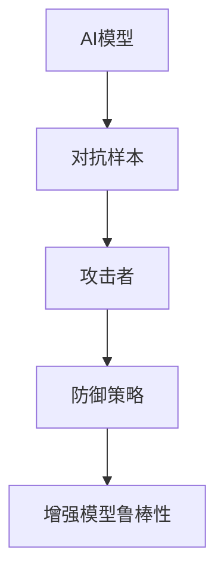

                 


# AI Agent的对抗样本防御：增强模型鲁棒性

> 关键词：对抗样本，深度学习，AI安全，鲁棒性，防御策略

> 摘要：  
在AI Agent的应用日益广泛的今天，对抗样本攻击正成为一个不容忽视的安全威胁。本文从对抗样本的定义、生成原理、防御策略等多个维度进行深入分析，探讨如何通过算法优化、系统架构设计等手段，增强AI模型的鲁棒性，抵御对抗样本攻击。文章结合理论与实践，为AI安全领域的研究者和开发者提供有价值的参考。

---

## 第1章: 对抗样本防御的背景与概念

### 1.1 对抗样本的定义与问题背景

对抗样本（Adversarial Samples）是指经过恶意修改后，能够导致AI模型产生错误输出的输入样本。这些样本通常与正常样本极其相似，甚至人类无法察觉，但会对模型的预测结果造成显著影响。

- **对抗样本的定义**：  
  对抗样本是在原始样本的基础上，通过添加难以被人类感知的小幅度扰动，使得模型输出错误结果的样本。  
  例如，在图像分类任务中，对抗样本可能在图片中添加一些噪声，导致模型将“猫”识别为“狗”。

- **问题背景**：  
  随着深度学习技术的广泛应用，AI Agent在各个领域展现出强大的能力。然而，这些模型的脆弱性也逐渐暴露，对抗样本攻击成为AI安全领域的重大挑战。

- **对抗样本的影响**：  
  对抗样本可能导致AI Agent在关键场景中做出错误决策，例如自动驾驶系统识别错误的交通信号，医疗AI误诊病情等。

---

### 1.2 对抗样本防御的必要性

对抗样本防御是保障AI Agent安全性和可靠性的关键。以下是其必要性的几个方面：

- **AI Agent的安全威胁分析**：  
  对抗样本攻击可能来自恶意攻击者，也可能来自无意的干扰。攻击者可以通过对抗样本操控AI Agent的行为，造成严重的后果。

- **对抗样本攻击的常见手段**：  
  - **基于梯度的攻击**：利用模型梯度信息，逐步调整输入样本，使其成为对抗样本。  
  - **黑盒攻击**：无需模型内部信息，通过试探性攻击生成对抗样本。  
  - **生成对抗网络（GAN）攻击**：利用GAN生成对抗样本，对抗AI模型。

- **增强模型鲁棒性的意义**：  
  通过防御策略，增强模型的鲁棒性，使其在面对对抗样本时依然能够保持稳定性和准确性。

---

### 1.3 对抗样本防御的核心概念

- **对抗样本防御的定义**：  
  对抗样本防御是指通过算法优化、架构设计等手段，增强模型对对抗样本的识别和抵抗能力。

- **防御策略的分类与特点**：  
  - **基于输入变换的防御**：通过预处理输入数据，消除对抗样本的干扰。  
  - **基于模型优化的防御**：通过改进模型结构或训练方法，增强模型的鲁棒性。  
  - **基于特征提取的防御**：通过提取模型中间层特征，构建鲁棒的特征表示。

- **对抗样本防御与AI Agent的关系**：  
  对抗样本防御是AI Agent安全性的核心保障，通过防御技术，AI Agent可以在复杂环境中保持稳定性和准确性。

---

## 第2章: 对抗样本防御的核心概念与联系

### 2.1 对抗样本防御的原理

- **对抗样本的生成过程**：  
  对抗样本通常通过生成对抗网络（GAN）生成。攻击者通过GAN生成对抗样本，使其绕过AI模型的检测。

- **对抗样本的传播机制**：  
  对抗样本可以通过多种方式传播，例如通过社交媒体、恶意网站等渠道，感染目标系统。

- **对抗样本的识别与防御**：  
  通过深度学习模型检测对抗样本的特征，识别潜在的攻击。

---

### 2.2 对抗样本防御的关键技术

- **基于生成对抗网络的防御**：  
  通过生成对抗网络生成对抗样本，训练模型识别和抵御对抗样本。

- **基于模型鲁棒性的优化方法**：  
  通过优化模型参数，增强模型对对抗样本的鲁棒性。

- **基于特征提取的防御策略**：  
  通过提取模型中间层特征，构建鲁棒的特征表示，增强模型的抗干扰能力。

---

### 2.3 对抗样本防御的核心要素对比

- **防御策略的对比分析**：  
  - **基于输入变换的防御**：简单有效，但可能影响模型性能。  
  - **基于模型优化的防御**：增强模型鲁棒性，但需要额外的训练数据和计算资源。  
  - **基于特征提取的防御**：鲁棒性高，但实现复杂。

- **防御技术的优缺点对比**：  
  | 防御策略 | 优点 | 缺点 |  
  |----------|------|------|  
  | 输入变换 | 实现简单 | 可能影响模型性能 |  
  | 模型优化 | 鲁棒性高 | 需要额外资源 |  
  | 特征提取 | 鲁棒性极高 | 实现复杂 |  

---

### 2.4 对抗样本防御的实体关系图



---

## 第3章: 对抗样本防御的算法原理

### 3.1 对抗样本生成的算法原理

- **基于梯度的对抗样本生成方法**：  
  通过计算模型梯度，逐步调整输入样本，生成对抗样本。  
  $$ \text{梯度} = \frac{\partial \text{损失}}{\partial \text{输入}} $$

- **基于黑盒攻击的对抗样本生成**：  
  通过试探性攻击，生成对抗样本，无需模型内部信息。  
  ```python
  def generate_adversarial_example(x, y, model):
      perturbation = 0
      for _ in range(iterations):
          gradient = compute_gradient(x, y, model)
          perturbation += gradient * step_size
          x += perturbation
      return x
  ```

- **基于生成对抗网络的对抗样本生成**：  
  利用GAN生成对抗样本，对抗AI模型。  
  ```python
  def generate_adversarial_example(x, y, generator, discriminator):
      z = torch.randn(batch_size, latent_size)
      adversarial_example = generator(z)
      return adversarial_example
  ```

---

### 3.2 对抗样本防御的算法原理

- **基于梯度的防御方法**：  
  通过调整模型参数，抵消对抗样本的干扰。  
  $$ \text{损失函数} = \text{交叉熵损失} + \lambda \times \text{对抗损失} $$

- **基于模型鲁棒性的优化算法**：  
  通过优化模型参数，增强模型的鲁棒性。  
  ```python
  def robust_optimization(model, optimizer, criterion, x, y):
      optimizer.zero_grad()
      outputs = model(x)
      loss = criterion(outputs, y)
      loss.backward()
      optimizer.step()
      return loss
  ```

---

## 总结

通过对对抗样本防御的背景、核心概念、算法原理等方面进行深入分析，我们可以看到，对抗样本防御是保障AI Agent安全性和可靠性的关键。未来，随着技术的发展，对抗样本防御技术将更加智能化和多样化，为AI Agent的安全保驾护航。

