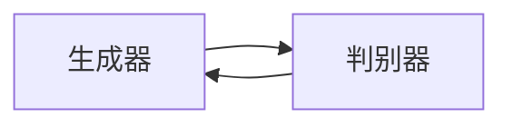
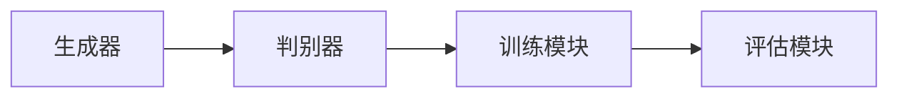
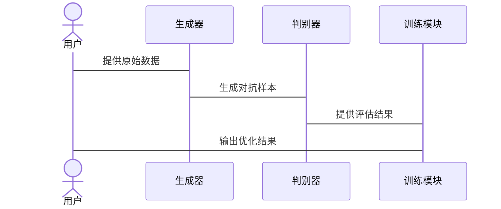

                 


# AI Agent的对抗训练：增强LLM的鲁棒性与安全性

**关键词**：AI Agent，对抗训练，LLM，鲁棒性，安全性，机器学习，深度学习

**摘要**：  
随着大语言模型（LLM）的广泛应用，其鲁棒性和安全性问题日益凸显。对抗训练作为一种有效的技术手段，能够显著增强模型的抗干扰能力和防御能力。本文从AI Agent的角度出发，详细探讨对抗训练的核心原理、实现方法及其在提升LLM鲁棒性和安全性中的应用。通过系统化的分析与实践，本文为AI Agent的对抗训练提供了理论依据和实践指导，为构建更安全、更可靠的AI系统奠定了基础。

---

## 第1章: AI Agent与对抗训练概述

### 1.1 AI Agent的基本概念

#### 1.1.1 AI Agent的定义与特点
AI Agent（人工智能代理）是指能够感知环境、自主决策并执行任务的智能实体。其特点包括：
- **自主性**：无需外部干预，自主完成任务。
- **反应性**：能够实时感知环境变化并做出响应。
- **目标导向**：基于目标进行决策和行动。
- **学习能力**：通过经验或数据改进自身性能。

#### 1.1.2 对抗训练的基本概念
对抗训练是一种通过让两个AI模型相互竞争来提升性能的训练方法。通常包括以下几个步骤：
1. **定义目标函数**：明确模型的优化目标。
2. **设计对抗网络**：构建生成器和判别器，模拟对抗过程。
3. **交替优化**：通过交替训练生成器和判别器，提升模型的鲁棒性。

#### 1.1.3 AI Agent与对抗训练的关系
AI Agent的决策能力和对抗训练的安全性密不可分。对抗训练通过引入对抗性样本，增强AI Agent的抗干扰能力，使其在复杂环境中表现更佳。

---

### 1.2 LLM的鲁棒性与安全性

#### 1.2.1 LLM的潜在风险
- **对抗攻击**：恶意输入可能导致模型输出错误。
- **数据偏差**：训练数据中的偏差可能引发模型决策错误。
- **滥用风险**：模型可能被用于非法目的。

#### 1.2.2 对抗攻击对LLM的影响
- **输出错误**：对抗样本可能导致模型输出不准确。
- **模型漏洞**：对抗攻击可能揭示模型的潜在漏洞。

#### 1.2.3 提升LLM鲁棒性与安全性的必要性
- **增强抗干扰能力**：通过对抗训练，模型能够更好地识别和处理异常输入。
- **提升安全性**：通过防御策略，降低模型被攻击的风险。

---

## 第2章: 对抗训练的核心原理

### 2.1 对抗训练的基本原理

#### 2.1.1 对抗训练的定义
对抗训练是一种通过让生成器和判别器相互竞争来提升模型性能的方法。生成器的目标是生成能够欺骗判别器的样本，而判别器的目标是区分真实样本和生成样本。

#### 2.1.2 对抗训练的数学模型
对抗训练的核心是优化目标函数。生成器的损失函数为：
$$ \mathcal{L}_G = -\log(D(G(x))) $$
判别器的损失函数为：
$$ \mathcal{L}_D = -\log(D(x)) - \log(1 - D(G(x))) $$
其中，$D(x)$表示判别器对输入样本$x$的判别结果。

#### 2.1.3 对抗训练的核心思想
通过交替优化生成器和判别器的参数，逐步提升生成样本的质量，同时增强判别器的识别能力。

---

### 2.2 对抗训练的实现方法

#### 2.2.1 基于生成对抗网络的对抗训练
生成对抗网络（GAN）是实现对抗训练的一种常用方法。其架构如下：


#### 2.2.2 对抗样本生成技术
对抗样本生成技术通过扰动输入样本，使其被误分类为其他类别。例如，攻击者可以通过调整输入图像的像素值，使其被误识别为目标类别。

#### 2.2.3 对抗训练的优化策略
- **梯度下降**：使用梯度下降方法优化生成器和判别器的参数。
- **对抗训练的平衡点**：在生成器和判别器之间找到平衡点，避免一方过度优化。

---

## 第3章: LLM的鲁棒性与安全性分析

### 3.1 LLM的潜在安全风险

#### 3.1.1 对抗攻击对LLM的影响
- **对抗攻击**：通过输入对抗样本，干扰LLM的输出。
- **模型漏洞**：对抗攻击可能揭示模型的潜在漏洞。

#### 3.1.2 LLM的可操控性问题
- **模型易受操控**：攻击者可以通过输入特定的对抗样本，引导模型输出预期结果。
- **模型的脆弱性**：模型在面对对抗样本时，可能表现不稳定。

#### 3.1.3 LLM的滥用风险
- **滥用场景**：模型可能被用于恶意目的，如生成虚假信息或进行网络攻击。

---

### 3.2 对抗训练在提升LLM鲁棒性中的作用

#### 3.2.1 对抗训练如何增强LLM的鲁棒性
- **增强抗干扰能力**：通过对抗训练，模型能够更好地识别和处理异常输入。
- **提升模型的稳健性**：对抗训练使模型在面对对抗样本时表现更稳定。

#### 3.2.2 对抗训练在LLM安全性中的应用
- **防御策略**：通过对抗训练，模型能够识别并抵御对抗攻击。
- **模型鲁棒性优化**：对抗训练使模型在面对不同类型的对抗样本时表现更佳。

#### 3.2.3 对抗训练对LLM性能的影响
- **性能提升**：对抗训练可以提高模型的准确性和鲁棒性。
- **性能下降**：在某些情况下，对抗训练可能会影响模型的性能。

---

## 第4章: 对抗训练算法的实现

### 4.1 对抗训练的数学模型

#### 4.1.1 对抗训练的损失函数
生成器的损失函数：
$$ \mathcal{L}_G = -\log(D(G(x))) $$
判别器的损失函数：
$$ \mathcal{L}_D = -\log(D(x)) - \log(1 - D(G(x))) $$

#### 4.1.2 对抗训练的优化目标
生成器的目标是生成能够欺骗判别器的样本，而判别器的目标是区分真实样本和生成样本。

#### 4.1.3 对抗训练的数学推导
通过交替优化生成器和判别器的参数，逐步提升生成样本的质量，同时增强判别器的识别能力。

---

### 4.2 对抗训练的具体实现方法

#### 4.2.1 基于梯度的对抗攻击方法
攻击者通过计算梯度，生成对抗样本。具体步骤如下：
1. **计算梯度**：对目标函数求梯度。
2. **生成对抗样本**：根据梯度调整输入样本。
3. **攻击模型**：将对抗样本输入模型，观察输出结果。

#### 4.2.2 对抗样本生成算法
对抗样本生成算法通过扰动输入样本，使其被误分类为其他类别。例如，攻击者可以通过调整输入图像的像素值，使其被误识别为目标类别。

#### 4.2.3 对抗训练的防御策略
- **防御策略一**：增强模型的判别能力。
- **防御策略二**：通过正则化方法，提高模型的鲁棒性。

---

## 第5章: 系统架构与设计

### 5.1 系统架构设计

#### 5.1.1 对抗训练系统的整体架构
系统架构包括生成器、判别器、训练模块和评估模块。其架构如下：


#### 5.1.2 系统功能模块划分
- **生成器模块**：生成对抗样本。
- **判别器模块**：区分真实样本和生成样本。
- **训练模块**：优化生成器和判别器的参数。
- **评估模块**：评估模型的性能。

#### 5.1.3 系统的可扩展性设计
系统设计时考虑了模块的可扩展性，便于未来加入新的对抗训练方法。

---

### 5.2 系统接口设计

#### 5.2.1 系统输入接口设计
- **输入接口一**：接收原始数据。
- **输入接口二**：接收对抗样本。

#### 5.2.2 系统输出接口设计
- **输出接口一**：输出生成的对抗样本。
- **输出接口二**：输出模型的评估结果。

#### 5.2.3 系统交互设计
系统交互流程如下：


---

## 第6章: 项目实战

### 6.1 环境安装与配置

#### 6.1.1 开发环境的选择
推荐使用Python 3.8及以上版本，安装必要的库，如TensorFlow、Keras等。

#### 6.1.2 必要软件的安装
安装PyTorch、numpy、matplotlib等库。

#### 6.1.3 环境配置的注意事项
确保GPU支持，安装NVIDIA显卡驱动和CUDA toolkit。

---

### 6.2 系统核心实现

#### 6.2.1 对抗训练算法的实现
实现生成器和判别器的训练过程，代码示例如下：
```python
import torch
import torch.nn as nn

# 定义生成器
class Generator(nn.Module):
    def __init__(self, input_dim, output_dim):
        super(Generator, self).__init__()
        self.fc = nn.Linear(input_dim, output_dim)
    
    def forward(self, x):
        return torch.sigmoid(self.fc(x))

# 定义判别器
class Discriminator(nn.Module):
    def __init__(self, input_dim, output_dim):
        super(Discriminator, self).__init__()
        self.fc = nn.Linear(input_dim, output_dim)
    
    def forward(self, x):
        return torch.sigmoid(self.fc(x))

# 初始化模型
generator = Generator(input_dim=100, output_dim=1)
discriminator = Discriminator(input_dim=1, output_dim=1)

# 定义损失函数
criterion = nn.BCELoss()

# 定义优化器
optimizer_G = torch.optim.Adam(generator.parameters(), lr=0.0002)
optimizer_D = torch.optim.Adam(discriminator.parameters(), lr=0.0002)

# 训练过程
for epoch in range(100):
    for _ in range(100):
        # 生成对抗样本
        z = torch.randn(64, 100)
        gen_output = generator(z)
        # 判别器训练
        d_output = discriminator(gen_output)
        d_loss = criterion(d_output, torch.zeros_like(d_output))
        optimizer_D.zero_grad()
        d_loss.backward()
        optimizer_D.step()
    # 生成器训练
    z = torch.randn(64, 100)
    gen_output = generator(z)
    d_output = discriminator(gen_output)
    g_loss = criterion(d_output, torch.ones_like(d_output))
    optimizer_G.zero_grad()
    g_loss.backward()
    optimizer_G.step()
```

#### 6.2.2 系统核心实现
实现对抗训练的完整流程，包括数据加载、模型训练和结果评估。

#### 6.2.3 代码应用解读与分析
通过代码实现对抗训练，评估模型的性能和鲁棒性。

---

## 第7章: 总结与展望

### 7.1 总结
本文详细探讨了对抗训练在提升LLM鲁棒性和安全性中的作用，分析了对抗训练的核心原理和实现方法，并通过实际案例展示了对抗训练的应用效果。

### 7.2 应用前景
对抗训练在AI Agent中的应用前景广阔，未来可以通过对抗训练进一步提升模型的安全性和鲁棒性。

### 7.3 注意事项
- **模型的过度拟合**：对抗训练可能导致模型过度拟合对抗样本。
- **计算资源消耗**：对抗训练需要大量计算资源。

### 7.4 拓展阅读
建议读者进一步阅读相关论文和书籍，深入了解对抗训练的最新进展和应用。

---

**附录：相关技术细节与代码实现**

附录部分将提供更多的技术细节和代码实现，包括对抗训练的数学推导、算法优化策略以及具体的代码实现。

---

通过以上内容，本文全面分析了AI Agent的对抗训练，为提升LLM的鲁棒性和安全性提供了理论依据和实践指导。

