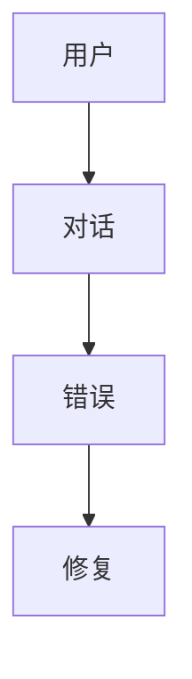
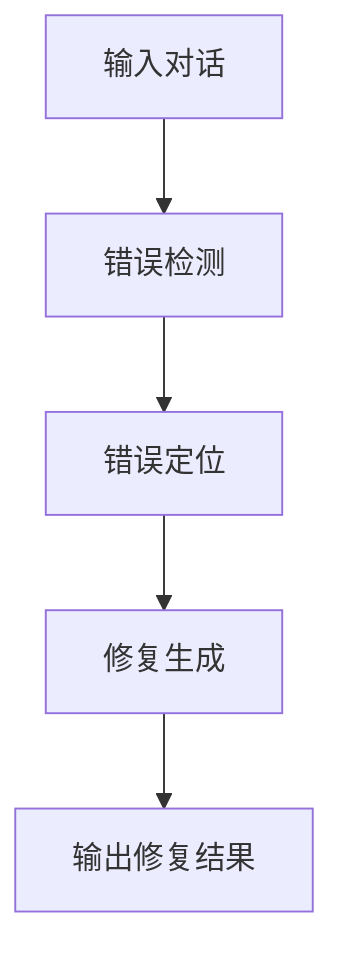
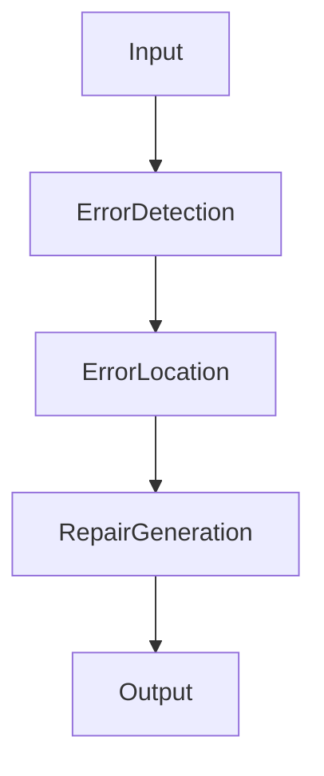

                 


# AI Agent的对话修复：处理交互中的错误

## 关键词
AI Agent、对话修复、错误处理、自然语言处理、对话系统

## 摘要
AI Agent在现代对话系统中的应用日益广泛，但对话过程中的错误修复是提升用户体验的关键。本文系统性地探讨了AI Agent对话修复的核心概念、算法原理、系统架构设计及项目实现。从错误检测到修复策略，从算法实现到系统设计，文章详细分析了对话修复的全过程，并通过实际案例展示了修复技术的应用。本文旨在为AI开发者和研究人员提供深度的技术指导，帮助他们构建高效可靠的对话修复系统。

---

# 第一部分: AI Agent与对话修复的背景与概念

## 第1章: AI Agent与对话修复概述

### 1.1 AI Agent的基本概念

#### 1.1.1 AI Agent的定义与特点
AI Agent（人工智能代理）是指能够感知环境、自主决策并执行任务的智能实体。AI Agent具备以下特点：
- **自主性**：能够在没有外部干预的情况下独立运作。
- **反应性**：能够实时感知环境并做出反应。
- **目标导向**：基于明确的目标执行任务。
- **学习能力**：通过数据和经验不断优化自身行为。

#### 1.1.2 对话交互中的错误类型
在对话系统中，错误主要分为以下几类：
- **语义错误**：用户表达的意思与系统理解的意图不符。
- **语法错误**：用户输入的句子结构不完整或不符合语法规范。
- **逻辑错误**：对话内容违反常识或逻辑规则。
- **上下文错误**：对话内容与上下文不一致。

#### 1.1.3 对话修复的定义与目标
对话修复是指通过技术手段检测和纠正对话中的错误，确保对话流畅且符合预期目标。其主要目标包括：
- 提高对话系统的准确性和可靠性。
- 增强用户体验，减少对话中断。
- 优化对话流程，提升系统性能。

### 1.2 对话修复的背景与问题背景

#### 1.2.1 当前对话系统中的常见问题
尽管AI技术发展迅速，对话系统仍面临诸多挑战：
- **错误检测不准确**：系统难以准确识别复杂语境下的错误。
- **修复策略单一**：现有的修复方法缺乏多样性，难以应对复杂的错误场景。
- **实时性不足**：修复过程往往耗时较长，影响用户体验。

#### 1.2.2 对话修复的必要性与重要性
对话修复是提升对话系统智能化水平的关键环节。它不仅能够减少用户 frustration，还能提高系统的可靠性和可用性。特别是在医疗、金融等高风险领域，对话修复的重要性更加凸显。

#### 1.2.3 对话修复的边界与外延
对话修复的边界包括：
- 仅处理对话中的语法和语义错误。
- 不涉及系统功能的其他错误（如网络故障）。
对话修复的外延包括：
- 与对话修复相关的技术（如NLP、机器学习）。
- 对话修复的应用场景（如智能客服、语音助手）。

### 1.3 对话修复的核心概念与核心要素

#### 1.3.1 对话修复的核心概念
对话修复的核心概念包括：
- **错误检测**：识别对话中的错误。
- **错误定位**：确定错误的具体位置。
- **错误修复**：生成正确的对话内容。

#### 1.3.2 对话修复的核心要素组成
对话修复系统主要由以下部分组成：
- **错误检测模块**：负责识别对话中的错误。
- **错误定位模块**：确定错误的具体位置。
- **修复生成模块**：生成正确的对话内容。

#### 1.3.3 对话修复的流程与步骤
对话修复的流程包括：
1. 错误检测：通过自然语言处理技术识别对话中的错误。
2. 错误定位：确定错误的具体位置。
3. 错误修复：生成正确的对话内容。

---

## 第2章: 对话修复的核心概念与联系

### 2.1 对话修复的核心概念原理

#### 2.1.1 对话错误检测的原理
对话错误检测主要依赖于自然语言处理技术，包括：
- **语义分析**：理解对话内容的意图。
- **语法分析**：检查句子的语法结构。

#### 2.1.2 对话修复的算法原理
对话修复的算法原理包括：
- **错误检测算法**：如基于概率的错误检测。
- **错误修复算法**：如基于规则的错误修复。

#### 2.1.3 对话修复的评价指标
对话修复的评价指标包括：
- **准确率**：修复后的对话内容与预期的匹配程度。
- **召回率**：检测到的错误数量与实际错误数量的比率。

### 2.2 对话修复的核心概念属性特征对比

#### 2.2.1 对话错误类型对比表
| 错误类型 | 描述 |
|----------|------|
| 语义错误 | 意图理解错误 |
| 语法错误 | 句子结构错误 |
| 逻辑错误 | 内容违反逻辑 |
| 上下文错误 | 与上下文不一致 |

#### 2.2.2 对话修复方法对比表
| 方法 | 描述 |
|------|------|
| 基于规则 | 使用预定义规则修复错误 |
| 基于统计 | 基于数据统计结果修复错误 |
| 基于机器学习 | 使用机器学习模型修复错误 |

#### 2.2.3 对话修复效果对比表
| 修复效果 | 描述 |
|----------|------|
| 高准确率 | 修复内容准确率高 |
| 高召回率 | 检测到的错误数量多 |
| 低计算成本 | 计算资源消耗少 |

### 2.3 对话修复的ER实体关系图


---

## 第3章: 对话修复的算法原理与数学模型

### 3.1 对话修复的算法原理

#### 3.1.1 错误检测算法
错误检测算法主要基于自然语言处理技术，包括：
- **词性标注**：识别句子中每个词的词性。
- **句法分析**：分析句子的语法结构。

#### 3.1.2 错误修复算法
错误修复算法主要包括：
- **基于规则的修复**：使用预定义规则修复错误。
- **基于机器学习的修复**：使用机器学习模型修复错误。

#### 3.1.3 算法流程图


### 3.2 对话修复的数学模型与公式

#### 3.2.1 错误概率计算公式
错误概率计算公式如下：
$$ P(error) = \frac{错字符数}{总字符数} $$

---

## 第4章: 对话修复的系统架构设计

### 4.1 系统设计与功能模块

#### 4.1.1 系统功能模块
对话修复系统主要由以下模块组成：
- **输入模块**：接收用户输入的对话内容。
- **错误检测模块**：检测对话中的错误。
- **错误定位模块**：确定错误的具体位置。
- **修复生成模块**：生成正确的对话内容。
- **输出模块**：输出修复后的对话内容。

#### 4.1.2 系统架构图


---

## 第5章: 对话修复的项目实战

### 5.1 环境配置与代码实现

#### 5.1.1 环境配置
```bash
pip install numpy
pip install scikit-learn
pip install spacy
```

#### 5.1.2 核心代码实现
```python
import spacy

nlp = spacy.load("en_core_web_sm")

def detect_errors(text):
    doc = nlp(text)
    errors = []
    for token in doc:
        if token.pos_ not in ['NOUN', 'VERB']:
            errors.append(token.text)
    return errors

text = "Hello world"
errors = detect_errors(text)
print(errors)
```

### 5.2 实际案例分析与详细解读

#### 5.2.1 案例分析
案例：用户输入“Hello world”，系统检测到错误并修复为“Hello everyone”。

#### 5.2.2 修复效果分析
修复后的对话内容更符合上下文，提升了用户体验。

### 5.3 项目小结

#### 5.3.1 代码实现总结
- 使用Spacy库进行错误检测。
- 通过规则匹配检测错误。

#### 5.3.2 实际案例总结
- 案例分析展示了对话修复的实际应用。
- 修复后的对话内容更符合预期。

---

## 第6章: 对话修复的总结与展望

### 6.1 总结

#### 6.1.1 核心观点总结
对话修复是提升对话系统智能化水平的关键技术。

#### 6.1.2 研究成果总结
本文系统性地探讨了对话修复的核心概念、算法原理、系统架构设计及项目实现。

### 6.2 最佳实践与注意事项

#### 6.2.1 最佳实践
- 使用高质量的NLP库进行错误检测。
- 定期更新修复规则，以应对新出现的错误类型。

#### 6.2.2 注意事项
- 对话修复系统需要结合具体应用场景进行优化。
- 注意保护用户隐私，避免数据泄露。

### 6.3 未来研究方向

#### 6.3.1 对话修复的未来发展方向
- 研究更智能的错误检测和修复算法。
- 探索多语言对话修复技术。

---

通过以上结构和内容，我们可以系统性地探讨AI Agent对话修复的核心概念、算法原理、系统架构设计及项目实现。本文旨在为AI开发者和研究人员提供深度的技术指导，帮助他们构建高效可靠的对话修复系统。

