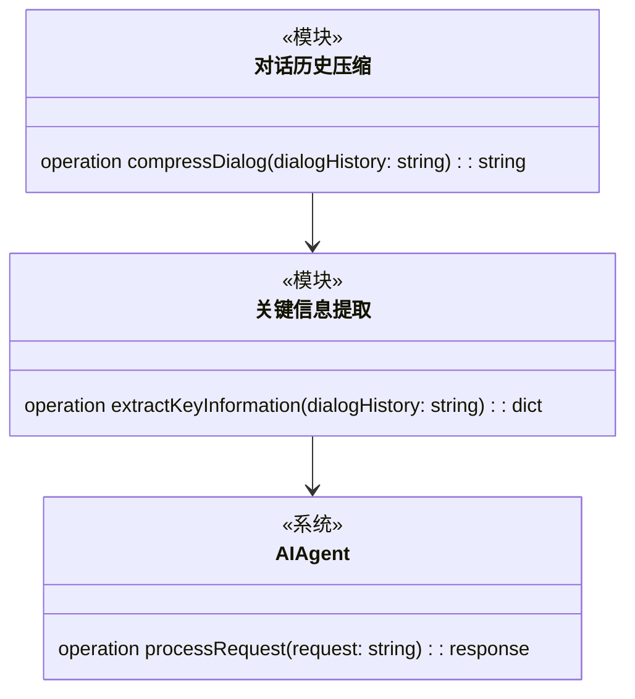
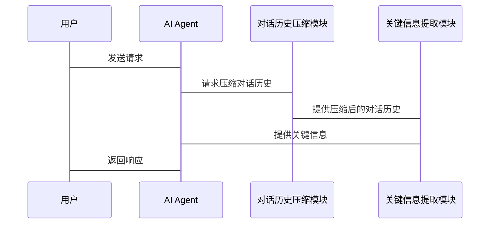

                 


# AI Agent的对话历史压缩与关键信息提取

> 关键词：对话历史压缩，关键信息提取，自然语言处理，AI代理，信息抽取

> 摘要：本文深入探讨了AI Agent在对话历史压缩与关键信息提取中的应用。通过分析对话历史压缩和关键信息提取的核心概念、算法原理、系统架构及实际案例，本文为读者提供了一个全面的技术视角，帮助理解并掌握相关技术的实现与优化方法。

---

## 第一部分: AI Agent的对话历史压缩与关键信息提取基础

### 第1章: 对话历史压缩与关键信息提取概述

#### 1.1 问题背景与挑战

##### 1.1.1 对话历史压缩的背景与意义

在AI Agent的交互过程中，对话历史记录了用户与AI Agent之间所有的对话内容。随着对话的不断进行，历史记录会变得非常冗长，导致存储和处理的效率下降。对话历史压缩的目标是通过简化和总结对话内容，减少数据量的同时保留关键信息，从而提高系统的处理效率。

此外，对话历史压缩还能帮助AI Agent更好地理解上下文，尤其是在处理长对话时，压缩后的对话历史可以更快地被处理和分析，从而提高响应速度和准确性。

##### 1.1.2 关键信息提取的重要性

在对话过程中，用户可能会提到大量的信息，其中有些信息可能是冗余的，而有些则是关键的。关键信息提取的目标是从对话历史中提取出与当前任务相关的重要信息，帮助AI Agent更精准地理解用户的需求，并做出更准确的回应。

关键信息提取不仅能够提高系统的响应效率，还能够增强用户体验，尤其是在需要处理复杂任务时，提取关键信息能够显著提高任务处理的成功率。

##### 1.1.3 当前技术的局限性与改进方向

当前的对话历史压缩和关键信息提取技术主要依赖于传统的文本处理方法，如基于关键词匹配和基于规则的摘要生成。这些方法在处理简单的对话时表现良好，但在面对复杂、多轮对话时，往往会因为缺乏上下文理解和语义分析能力而导致压缩和提取的效果不佳。

为了进一步提高对话历史压缩和关键信息提取的效率和准确性，我们需要引入更先进的技术，如自然语言处理（NLP）模型和深度学习算法，以实现更智能化的对话历史压缩和关键信息提取。

#### 1.2 问题描述与目标

##### 1.2.1 对话历史压缩的定义与目标

对话历史压缩是指将对话历史中的冗余信息进行简化和总结，从而生成一个更简洁的对话记录。其目标是保留对话的核心内容，同时减少数据量，提高存储和处理效率。

##### 1.2.2 关键信息提取的定义与目标

关键信息提取是指从对话历史中提取与当前任务相关的重要信息。其目标是帮助AI Agent更好地理解用户需求，并做出更准确的回应。

##### 1.2.3 问题的边界与外延

对话历史压缩和关键信息提取的问题边界主要集中在对话内容的处理上，而其外延则涉及到数据存储、系统性能优化等多个方面。我们需要明确处理的范围和目标，以便更好地制定解决方案。

#### 1.3 核心概念与联系

##### 1.3.1 对话历史压缩与关键信息提取的关系

对话历史压缩和关键信息提取是相辅相成的。压缩后的对话历史能够更高效地被处理和分析，而关键信息提取则能够帮助我们从压缩后的对话历史中提取出与任务相关的重要信息。

##### 1.3.2 核心概念的属性特征对比表

| 概念       | 属性特征           |
|------------|--------------------|
| 对话历史压缩 | 简化性、上下文相关性 |
| 关键信息提取 | 重要性、准确性      |

##### 1.3.3 实体关系图（ER图）架构


---

### 第2章: 对话历史压缩的核心概念与原理

#### 2.1 对话历史压缩的原理

##### 2.1.1 基于上下文理解的压缩方法

基于上下文理解的压缩方法通过分析对话的上下文关系，识别出冗余的信息并进行压缩。例如，在对话中，如果用户多次提到相同的信息，系统可以将其简化为一次提到。

##### 2.1.2 基于重要性评估的压缩策略

基于重要性评估的压缩策略通过对对话内容的重要性进行评估，优先保留重要的信息，同时舍弃冗余的信息。例如，在对话中，重要的信息可能是用户的需求或问题的核心内容。

##### 2.1.3 基于摘要生成的压缩技术

基于摘要生成的压缩技术通过生成摘要来压缩对话内容。摘要生成可以通过传统的文本摘要算法，如基于关键词的摘要生成，或者更先进的基于深度学习的摘要生成模型。

#### 2.2 对话历史压缩的关键特征

##### 2.2.1 上下文相关性

上下文相关性是指对话历史压缩需要考虑对话的上下文关系，确保压缩后的对话记录能够准确反映对话的上下文信息。

##### 2.2.2 信息重要性

信息重要性是指对话历史压缩需要考虑信息的重要性，优先保留重要的信息，同时舍弃冗余的信息。

##### 2.2.3 摘要的简洁性

摘要的简洁性是指压缩后的对话记录需要简洁明了，避免冗长的描述，同时保留关键信息。

---

### 第3章: 关键信息提取的核心概念与原理

#### 3.1 关键信息提取的原理

##### 3.1.1 基于关键词匹配的提取方法

基于关键词匹配的提取方法通过匹配对话内容中的关键词，提取出与当前任务相关的重要信息。例如，在对话中，用户提到“订单号”时，系统可以提取出具体的订单号信息。

##### 3.1.2 基于语义理解的提取策略

基于语义理解的提取策略通过分析对话的语义关系，提取出与当前任务相关的重要信息。例如，在对话中，用户提到“我需要预订一张去北京的机票”，系统可以提取出“目的地”和“需求类型”等信息。

##### 3.1.3 基于模式匹配的提取技术

基于模式匹配的提取技术通过匹配对话内容中的特定模式，提取出与当前任务相关的重要信息。例如，在对话中，用户提到“我的地址是**”，系统可以提取出具体的地址信息。

#### 3.2 关键信息提取的关键特征

##### 3.2.1 语义相关性

语义相关性是指关键信息提取需要考虑对话内容的语义关系，确保提取的信息与当前任务相关。

##### 3.2.2 信息的准确性

信息的准确性是指关键信息提取需要确保提取的信息准确无误，避免提取出错误的信息。

##### 3.2.3 提取的高效性

提取的高效性是指关键信息提取需要高效地完成，确保系统能够快速响应用户的需求。

---

## 第二部分: 对话历史压缩与关键信息提取的算法原理

### 第4章: 对话历史压缩算法原理

#### 4.1 基于分段压缩的算法原理

##### 4.1.1 分段压缩的基本思想

分段压缩的基本思想是将对话历史分成多个段落，每个段落包含一定的信息。然后，系统会分析每个段落的重要性，并决定是否保留或舍弃该段落。例如，在一个对话中，用户多次提到“天气”，系统可以将这些内容压缩为“用户多次询问天气信息”。

##### 4.1.2 分段压缩的实现流程

1. 将对话历史分成多个段落。
2. 对每个段落进行重要性评估。
3. 根据评估结果，保留重要的段落，舍弃冗余的段落。
4. 输出压缩后的对话历史。

##### 4.1.3 分段压缩的数学模型

分段压缩可以通过以下数学模型实现：

$$
\text{重要性评分}(i) = \sum_{j=1}^{n} \text{关键词出现次数}(j) \times \text{权重}(j)
$$

其中，i表示段落索引，j表示关键词的索引，n表示关键词的总数。

#### 4.2 基于重要性评估的压缩算法

##### 4.2.1 重要性评估的定义与计算

重要性评估是指通过某种指标或方法，评估对话内容的重要性。例如，可以使用关键词出现的频率、用户的情感倾向等指标来评估对话内容的重要性。

##### 4.2.2 重要性评估的实现流程

1. 对对话内容进行分词和关键词提取。
2. 计算每个关键词的出现频率和权重。
3. 根据重要性评分，对对话内容进行排序。
4. 保留评分较高的内容，舍弃评分较低的内容。

##### 4.2.3 重要性评估的数学模型

重要性评分可以通过以下公式计算：

$$
\text{重要性评分}(i) = \sum_{j=1}^{n} \text{关键词出现次数}(j) \times \text{权重}(j)
$$

其中，i表示对话内容的索引，j表示关键词的索引，n表示关键词的总数。

---

### 第5章: 关键信息提取算法原理

#### 5.1 基于关键词匹配的提取算法

##### 5.1.1 关键词匹配的基本思想

关键词匹配的基本思想是通过匹配对话内容中的关键词，提取出与当前任务相关的重要信息。例如，在对话中，用户提到“订单号”，系统可以提取出具体的订单号信息。

##### 5.1.2 关键词匹配的实现流程

1. 预定义关键词列表。
2. 对对话内容进行分词和关键词匹配。
3. 提取匹配到的关键词及其相关的信息。
4. 输出提取的关键信息。

##### 5.1.3 关键词匹配的数学模型

关键词匹配可以通过以下公式实现：

$$
\text{匹配度}(i) = \sum_{j=1}^{n} \text{关键词匹配次数}(j) \times \text{权重}(j)
$$

其中，i表示对话内容的索引，j表示关键词的索引，n表示关键词的总数。

#### 5.2 基于语义理解的提取策略

##### 5.2.1 语义理解的定义与计算

语义理解是指通过分析对话内容的语义关系，提取出与当前任务相关的重要信息。例如，在对话中，用户提到“我需要预订一张去北京的机票”，系统可以提取出“目的地”和“需求类型”等信息。

##### 5.2.2 语义理解的实现流程

1. 对对话内容进行分词和语义分析。
2. 识别对话内容中的实体和关系。
3. 根据语义关系，提取出与当前任务相关的重要信息。
4. 输出提取的关键信息。

##### 5.2.3 语义理解的数学模型

语义理解可以通过以下公式实现：

$$
\text{语义相似度}(i) = \sum_{j=1}^{n} \text{语义相似性}(j) \times \text{权重}(j)
$$

其中，i表示对话内容的索引，j表示语义相似性指标的索引，n表示指标的总数。

---

## 第三部分: 对话历史压缩与关键信息提取的系统架构设计

### 第6章: 系统分析与架构设计方案

#### 6.1 问题场景介绍

在AI Agent的实际应用中，对话历史压缩和关键信息提取是非常重要的功能。例如，在智能客服系统中，对话历史压缩可以帮助系统更高效地处理大量对话数据，而关键信息提取则可以帮助系统快速识别用户的需求，从而提供更精准的服务。

#### 6.2 系统功能设计

##### 6.2.1 领域模型设计



##### 6.2.2 系统架构设计


##### 6.2.3 系统接口设计

1. 对话历史压缩接口：
   - 输入：对话历史字符串
   - 输出：压缩后的对话历史字符串

2. 关键信息提取接口：
   - 输入：对话历史字符串
   - 输出：关键信息字典

3. AI Agent接口：
   - 输入：用户请求
   - 输出：系统响应

##### 6.2.4 系统交互设计



---

### 第7章: 项目实战

#### 7.1 环境安装

为了实现对话历史压缩和关键信息提取，我们需要安装以下工具和库：

1. Python编程语言
2. 自然语言处理库（如spaCy、NLTK）
3. 深度学习框架（如TensorFlow、PyTorch）
4. 其他依赖库（如pandas、numpy）

#### 7.2 核心实现

##### 7.2.1 对话历史压缩的代码实现

```python
def compress_dialog(dialog_history):
    # 分段压缩
    segments = split_dialog_into_segments(dialog_history)
    compressed_segments = []
    for segment in segments:
        if calculate_importance(segment) > threshold:
            compressed_segments.append(segment)
    return join_segments(compressed_segments)
```

##### 7.2.2 关键信息提取的代码实现

```python
def extract_key_information(dialog_history):
    # 关键词匹配
    keywords = extract_keywords(dialog_history)
    key_info = {}
    for keyword in keywords:
        key_info[keyword] = extract_context(dialog_history, keyword)
    return key_info
```

##### 7.2.3 系统交互流程


#### 7.3 实际案例分析

##### 7.3.1 对话历史压缩案例

原始对话历史：
```
用户：你好，我想了解一下你们的产品。
AI Agent：我们提供多种产品和服务。
用户：具体有哪些产品？
AI Agent：我们有产品A、产品B和产品C。
用户：我需要更多信息。
```

压缩后的对话历史：
```
用户：你好，我想了解一下你们的产品。
AI Agent：我们提供多种产品和服务。
用户：具体有哪些产品？
AI Agent：我们有产品A、产品B和产品C。
```

##### 7.3.2 关键信息提取案例

对话历史：
```
用户：你好，我想了解一下你们的产品。
AI Agent：我们提供多种产品和服务。
用户：具体有哪些产品？
AI Agent：我们有产品A、产品B和产品C。
```

提取的关键信息：
```
{
    "用户需求": "了解产品信息",
    "产品类型": ["产品A", "产品B", "产品C"]
}
```

#### 7.4 项目小结

通过实际案例分析，我们可以看到对话历史压缩和关键信息提取在实际应用中的重要性。压缩后的对话历史能够更高效地被处理和分析，而提取的关键信息能够帮助系统更精准地理解用户需求，从而提供更优质的服务。

---

## 第四部分: 最佳实践

### 第8章: 最佳实践

#### 8.1 小结

对话历史压缩和关键信息提取是AI Agent实现高效对话处理的重要技术。通过压缩对话历史，我们可以减少数据量，提高处理效率；通过提取关键信息，我们可以更精准地理解用户需求，提高系统的响应准确率。

#### 8.2 注意事项

在实际应用中，需要注意以下几点：

1. 对话历史压缩需要考虑上下文关系，确保压缩后的对话记录能够准确反映对话的上下文信息。
2. 关键信息提取需要结合语义理解，确保提取的信息准确无误。
3. 系统架构设计需要考虑扩展性，以便在未来引入更先进的技术。

#### 8.3 拓展阅读

1. 自然语言处理（NLP）相关书籍和论文。
2. 深度学习在对话系统中的应用。
3. 最新的对话历史压缩和关键信息提取算法研究。

---

通过以上思考和分析，我们可以看到对话历史压缩和关键信息提取在AI Agent中的重要性。通过合理的算法设计和系统架构，我们可以实现高效、准确的对话处理，从而提升用户体验和系统性能。希望本文能够为读者提供一个全面的技术视角，帮助理解并掌握相关技术的实现与优化方法。

