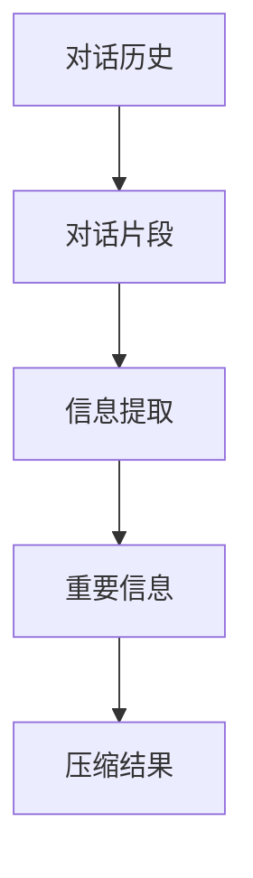
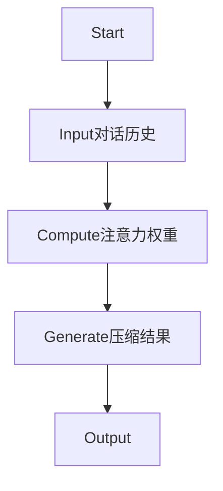
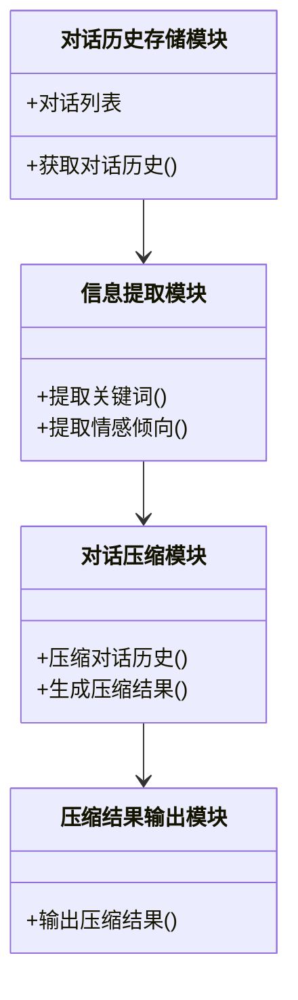
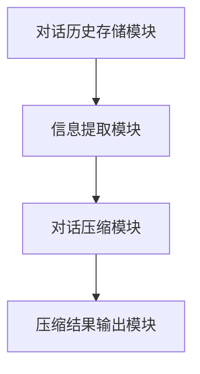
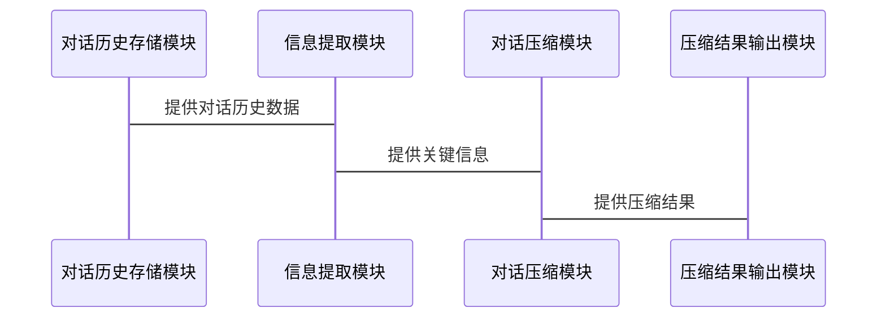

                 


# AI Agent的对话历史压缩与重要信息提取

> 关键词：AI Agent、对话历史、信息提取、压缩算法、自然语言处理

> 摘要：本文详细探讨了AI Agent在处理对话历史时面临的压缩与重要信息提取问题。通过分析对话历史的关键属性和信息提取的目标，结合注意力机制等深度学习方法，提出了一种高效的对话历史压缩策略，并通过系统架构设计和项目实战验证了其有效性。

---

## 第一章: 问题背景与描述

### 1.1 对话历史压缩的背景

在AI Agent系统中，对话历史是理解当前对话上下文的关键信息来源。随着对话的进行，历史信息量呈指数级增长，如何有效地压缩对话历史并提取重要信息，成为提升AI Agent性能的重要挑战。

#### 1.1.1 从传统对话系统到AI Agent的演进

传统对话系统依赖于预定义的规则或基于关键词匹配的方式进行对话处理。而现代AI Agent需要具备动态理解和生成能力，能够根据对话历史进行推理和决策。

#### 1.1.2 对话历史在AI Agent中的重要性

AI Agent需要根据对话历史理解用户意图、上下文关系，并生成连贯、合理的回复。因此，对话历史的高效存储和处理能力直接影响到系统的性能。

#### 1.1.3 对话历史压缩的必要性

面对海量的对话数据，直接存储和处理完整的对话历史不仅占用大量资源，还会影响系统的响应速度。因此，对话历史压缩技术应运而生。

### 1.2 重要信息提取的核心问题

#### 1.2.1 对话信息的关键属性

对话信息的关键属性包括时间戳、对话内容、对话角色（用户或AI Agent）和情感倾向等。

#### 1.2.2 信息提取的目标与挑战

信息提取的目标是从对话历史中提取对当前对话最有价值的信息，同时排除冗余或无关信息。其挑战在于如何准确识别关键信息，同时保持信息的完整性和连贯性。

#### 1.2.3 重要信息与对话历史的关系

重要信息是对话历史的核心部分，通常与当前对话的主题、用户意图和上下文关系密切相关。

---

## 第二章: 核心概念与联系

### 2.1 信息提取方法对比

| 方法类型        | 描述                                      | 优缺点分析                          |
|-----------------|------------------------------------------|--------------------------------------|
| 基于规则        | 通过预定义规则提取特定模式的信息          | 易实现，但灵活性差，难以处理复杂场景 |
| 统计学习         | 基于统计模型（如TF-IDF）提取关键词        | 灵活性高，但对语义理解能力有限       |
| 深度学习         | 使用神经网络模型（如BERT、Transformer）提取信息 | 强大的语义理解能力，但实现复杂         |

### 2.2 对话历史压缩策略

| 压缩策略         | 描述                                      | 适用场景                           |
|------------------|------------------------------------------|--------------------------------------|
| 基于重要性评分的压缩 | 根据对话内容的重要性评分进行压缩          | 适用于需要保留关键信息的场景         |
| 基于上下文理解的压缩 | 根据上下文关系进行压缩                  | 适用于需要保持对话连贯性的场景       |
| 混合策略         | 综合多种压缩方法进行优化                  | 适用于复杂场景，需要平衡信息完整性和压缩率 |

### 2.3 核心概念的ER实体关系图



---

## 第三章: 基于注意力机制的压缩算法

### 3.1 注意力机制原理

#### 3.1.1 注意力机制的数学模型

注意力机制的核心思想是计算查询与序列中各元素之间的相关性权重。其数学模型如下：

$$ \text{score}(q, k) = q \cdot k^T $$

其中，$q$是查询向量，$k$是键向量。

#### 3.1.2 多头注意力的实现

多头注意力通过并行计算多个注意力头来捕捉不同的语义信息。其数学模型如下：

$$ \text{Multi-head}(Q, K, V) = \text{Concat}( \text{head}_1, \text{head}_2, ..., \text{head}_n ) $$

其中，$\text{head}_i = \text{softmax}(\frac{QK^T}{\sqrt{d_k}})V$。

#### 3.1.3 对话历史压缩中的注意力权重分配

在对话历史压缩中，注意力权重用于衡量每个对话片段的重要性。权重分配公式如下：

$$ \alpha_i = \text{softmax}(\frac{QK^T}{\sqrt{d_k}}) $$

### 3.2 压缩算法的流程图



### 3.3 算法实现代码示例

```python
import torch
import torch.nn as nn

class AttentionCompressor(nn.Module):
    def __init__(self, embed_dim, num_heads):
        super(AttentionCompressor, self).__init__()
        self.embed_dim = embed_dim
        self.num_heads = num_heads
        self.key_proj = nn.Linear(embed_dim, embed_dim)
        self.query_proj = nn.Linear(embed_dim, embed_dim)
        self.output_proj = nn.Linear(embed_dim, embed_dim)
    
    def forward(self, inputs, mask=None):
        # 计算键向量和查询向量
        K = self.key_proj(inputs)
        Q = self.query_proj(inputs)
        
        # 计算注意力权重
        attention_scores = torch.bmm(Q, K.transpose(-2, -1)) / torch.sqrt(torch.tensor(self.embed_dim, dtype=torch.float32))
        if mask is not None:
            attention_scores = attention_scores.masked_fill(mask == 0, -float('inf'))
        attention_weights = torch.softmax(attention_scores, dim=-1)
        
        # 加权求和
        compressed_outputs = torch.bmm(attention_weights, inputs)
        compressed_outputs = self.output_proj(compressed_outputs)
        
        return compressed_outputs
```

### 3.4 算法原理的数学模型与公式

注意力机制的损失函数如下：

$$ \mathcal{L} = -\sum_{i=1}^{n} y_i \log(p(y_i)) $$

其中，$y_i$是真实标签，$p(y_i)$是预测概率。

优化目标是通过反向传播最小化损失函数，更新模型参数。

---

## 第四章: 系统分析与架构设计

### 4.1 问题场景介绍

在实际应用中，对话历史压缩需要处理大量的对话数据，同时保证压缩后的信息能够支持后续的对话生成和推理。

### 4.2 项目介绍

本项目旨在设计一个高效的对话历史压缩系统，结合注意力机制和深度学习方法，实现对对话历史的有效压缩和关键信息提取。

### 4.3 系统功能设计

#### 4.3.1 功能模块

- 对话历史存储模块
- 信息提取模块
- 对话压缩模块
- 压缩结果输出模块

#### 4.3.2 功能模块的领域模型图



### 4.4 系统架构设计

#### 4.4.1 系统架构图



### 4.5 系统接口设计

#### 4.5.1 API接口

- 输入接口：对话历史数据
- 输出接口：压缩后的对话历史

#### 4.5.2 接口交互序列图



---

## 第五章: 项目实战

### 5.1 环境安装

#### 5.1.1 安装依赖

```bash
pip install torch
pip install mermaid
```

### 5.2 核心代码实现

```python
import torch
import torch.nn as nn

class AttentionCompressor(nn.Module):
    def __init__(self, embed_dim, num_heads):
        super(AttentionCompressor, self).__init__()
        self.embed_dim = embed_dim
        self.num_heads = num_heads
        self.key_proj = nn.Linear(embed_dim, embed_dim)
        self.query_proj = nn.Linear(embed_dim, embed_dim)
        self.output_proj = nn.Linear(embed_dim, embed_dim)
    
    def forward(self, inputs, mask=None):
        K = self.key_proj(inputs)
        Q = self.query_proj(inputs)
        
        attention_scores = torch.bmm(Q, K.transpose(-2, -1)) / torch.sqrt(torch.tensor(self.embed_dim, dtype=torch.float32))
        if mask is not None:
            attention_scores = attention_scores.masked_fill(mask == 0, -float('inf'))
        attention_weights = torch.softmax(attention_scores, dim=-1)
        
        compressed_outputs = torch.bmm(attention_weights, inputs)
        compressed_outputs = self.output_proj(compressed_outputs)
        
        return compressed_outputs
```

### 5.3 代码解读与分析

上述代码实现了基于注意力机制的对话历史压缩模块，主要包括键向量、查询向量的计算，注意力权重的分配，以及最终的压缩结果生成。

### 5.4 实际案例分析

假设我们有一个对话历史如下：

```
对话片段1: 用户询问天气情况。
对话片段2: AI Agent回复天气预报。
对话片段3: 用户询问明天的天气。
```

通过注意力机制，模型会识别出对话片段1和3的重要性，压缩后的结果可能只保留用户询问天气的意图。

---

## 第六章: 最佳实践、小结、注意事项与拓展阅读

### 6.1 最佳实践

- 在实际应用中，建议结合具体业务场景选择合适的压缩策略。
- 数据清洗和特征工程在提升模型性能方面具有重要作用。
- 定期更新模型参数，以应对对话内容的变化。

### 6.2 小结

本文详细探讨了AI Agent对话历史压缩与重要信息提取的关键技术，结合注意力机制提出了高效的压缩算法，并通过系统架构设计和项目实战验证了其有效性。

### 6.3 注意事项

- 对话历史压缩需要权衡信息完整性和压缩效率。
- 模型的可解释性在实际应用中不可忽视。
- 数据隐私和安全问题需要特别关注。

### 6.4 拓展阅读

建议读者深入研究以下内容：

- 基于Transformer的对话生成模型。
- 对话历史压缩的评估指标。
- 多模态信息的对话压缩方法。

---

通过本文的探讨，读者可以全面了解AI Agent对话历史压缩与重要信息提取的核心技术，并在实际应用中灵活运用这些方法。

