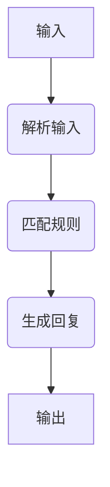
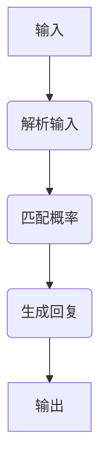
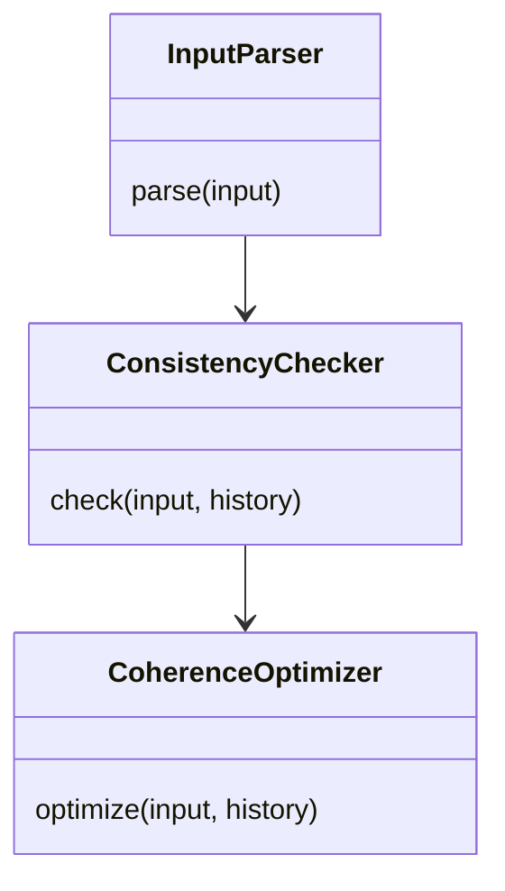
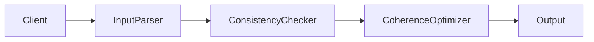
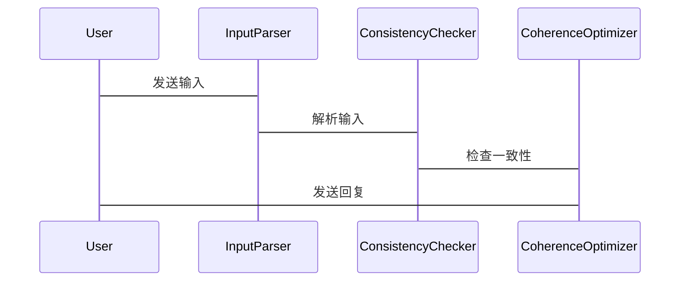

                 


# AI Agent的对话生成一致性与连贯性优化

> 关键词：AI Agent、对话生成、一致性优化、连贯性优化、自然语言处理

> 摘要：本文深入探讨了AI Agent在对话生成中的一致性和连贯性优化问题，从基础概念到算法原理，再到系统架构和项目实战，全面分析了如何提升对话生成的质量和用户体验。通过详细的技术分析和实际案例，本文为AI Agent的对话生成提供了一套系统的优化方法论。

---

## 第1章: AI Agent与对话生成概述

### 1.1 AI Agent的基本概念
AI Agent（智能体）是指能够感知环境并采取行动以实现目标的智能系统。在对话生成领域，AI Agent的核心任务是理解用户输入并生成自然、连贯的回复。

#### 1.1.1 AI Agent的定义与特点
- **定义**：AI Agent是具备自主决策能力的智能实体，能够通过传感器或输入接口感知环境，并通过执行器或输出接口与环境交互。
- **特点**：
  - 智能性：能够理解上下文并生成有意义的回应。
  - 自主性：无需人工干预即可完成任务。
  - 反应性：能够实时响应用户输入。

#### 1.1.2 对话生成的基本原理
对话生成是AI Agent的核心能力之一，其基本原理包括：
1. **输入处理**：解析用户的输入，提取意图和情感信息。
2. **上下文管理**：维护对话的历史记录，确保回复与上下文一致。
3. **生成回复**：基于输入和上下文生成自然语言回复。

#### 1.1.3 AI Agent在对话生成中的作用
AI Agent通过自然语言处理技术，帮助用户实现信息传递、任务完成和情感交流。其作用包括：
- 提供实时交互服务。
- 优化用户体验。
- 提高对话效率。

### 1.2 对话生成的挑战
对话生成是一项复杂的任务，其主要挑战包括：
1. **语义理解**：准确理解用户的意图和情感。
2. **上下文连贯性**：确保回复与对话历史一致。
3. **语言多样性**：生成多样化且自然的表达。

#### 1.2.1 对话生成的核心问题
- 如何在复杂的上下文中生成连贯且合理的回复。
- 如何处理歧义和多义性问题。
- 如何在多轮对话中保持一致性。

#### 1.2.2 一致性与连贯性的定义
- **一致性**：回复内容与对话历史、上下文保持一致。
- **连贯性**：回复内容在逻辑上与前文衔接自然。

#### 1.2.3 当前对话生成技术的局限性
- 基于规则的系统缺乏灵活性。
- 基于统计的系统难以处理长距离依赖。
- 基于深度学习的系统存在训练数据不足的问题。

---

## 第2章: 对话生成一致性与连贯性的核心概念

### 2.1 一致性与连贯性的定义
一致性是指回复内容与对话历史、上下文保持一致，而连贯性是指回复内容在逻辑上与前文衔接自然。

#### 2.1.1 一致性定义
一致性是指回复内容在语义和语法上与对话历史保持一致。例如，在对话中提到“我需要预订机票”，回复应该围绕机票预订展开，而不是偏离主题。

#### 2.1.2 连贯性定义
连贯性是指回复内容在逻辑上与前文衔接自然。例如，在对话中提到“我今天有点累”，连贯的回复可能是“你需要放松一下吗？”

#### 2.1.3 一致性与连贯性的关系
一致性是连贯性的基础，连贯性是一致性在逻辑上的延伸。两者共同确保对话的流畅性和合理性。

### 2.2 一致性与连贯性的属性对比
以下是一致性与连贯性的属性对比表：

| 属性       | 一致性                              | 连贯性                              |
|------------|------------------------------------|------------------------------------|
| 定义       | 回复内容与对话历史一致             | 回复内容在逻辑上与前文衔接自然     |
| 关注点     | 语义和语法的一致性                 | 逻辑和情感的连贯性                 |
| 示例       | "你今天过得怎么样？" -> "我很好，谢谢。" | "我今天很累。" -> "你需要放松一下吗？" |

#### 2.2.1 一致性与连贯性的ER实体关系图
以下是一致性与连贯性的ER实体关系图（mermaid）：

```mermaid
erDiagram
    consistency[一致性] {
        <属性>
        content
        context
    }
    coherence[连贯性] {
        <属性>
        logic
        emotion
    }
    consistency --| content | coherence
    consistency --| context | coherence
```

---

## 第3章: 对话生成一致性与连贯性的算法原理

### 3.1 基于规则的对话生成算法
基于规则的算法通过预定义的规则生成回复，适用于简单场景。

#### 3.1.1 算法原理
- **规则定义**：预定义对话的可能场景和回复。
- **匹配规则**：根据输入匹配最合适的规则。
- **生成回复**：根据匹配的规则生成回复。

#### 3.1.2 基于规则的对话生成算法流程图（mermaid）


#### 3.1.3 基于规则的对话生成算法Python代码示例
```python
# 示例代码：基于规则的对话生成
def generate_reply(input_text):
    # 预定义规则
    rules = {
        "hello": "你好！有什么可以帮助你的吗？",
        "how are you": "我很好，谢谢！你呢？",
        "thank you": "不用谢！",
    }
    # 匹配输入
    for key in rules:
        if key in input_text.lower():
            return rules[key]
    return "抱歉，我还不知道怎么回答这个问题。"
```

### 3.2 基于统计的对话生成算法
基于统计的算法通过分析大量对话数据，学习回复的模式。

#### 3.2.1 算法原理
- **数据预处理**：对对话数据进行清洗和分词。
- **模型训练**：使用统计模型（如马尔可夫链）训练回复生成模型。
- **生成回复**：根据输入生成最可能的回复。

#### 3.2.2 基于统计的对话生成算法流程图（mermaid）


#### 3.2.3 基于统计的对话生成算法Python代码示例
```python
# 示例代码：基于统计的对话生成
import random

def generate_reply(input_text):
    # 对话历史
    history = ["你今天过得怎么样？", "我今天很累。"]
    # 可能的回复
    possible_responses = {
        "我今天很累。": ["你需要放松一下吗？", "或许你可以试试冥想。"],
    }
    # 选择回复
    last_input = history[-1]
    if last_input in possible_responses:
        return random.choice(possible_responses[last_input])
    else:
        return "抱歉，我还不知道怎么回答这个问题。"
```

---

## 第4章: 对话生成一致性与连贯性的系统架构设计

### 4.1 系统功能设计
系统功能设计包括对话解析、一致性检查和连贯性优化。

#### 4.1.1 系统功能模块
- **对话解析模块**：解析用户输入，提取意图和情感信息。
- **一致性检查模块**：检查回复与对话历史是否一致。
- **连贯性优化模块**：优化回复的逻辑连贯性。

#### 4.1.2 领域模型（mermaid类图）


#### 4.1.3 系统架构设计（mermaid架构图）


### 4.2 系统交互设计
系统交互设计包括用户输入、系统解析和生成回复。

#### 4.2.1 系统交互流程（mermaid序列图）


---

## 第5章: 对话生成一致性与连贯性的项目实战

### 5.1 项目背景与目标
项目背景是优化AI Agent在对话生成中的一致性和连贯性，目标是提升用户体验。

#### 5.1.1 项目介绍
本项目旨在通过优化算法和系统设计，提升AI Agent在对话生成中的一致性和连贯性。

#### 5.1.2 项目目标
- 提高对话生成的一致性。
- 提高对话生成的连贯性。
- 提升用户体验。

### 5.2 系统核心实现
系统核心实现包括环境配置、代码实现和案例分析。

#### 5.2.1 环境安装与配置
- **Python版本**：Python 3.8及以上。
- **依赖库**：numpy、pandas、transformers。

#### 5.2.2 核心代码实现
```python
# 示例代码：对话生成系统实现
import torch
from transformers import AutoModelWithLMHead, AutoTokenizer

class DialogGenerator:
    def __init__(self):
        self.tokenizer = AutoTokenizer.from_pretrained("facebook/bart-large")
        self.model = AutoModelWithLMHead.from_pretrained("facebook/bart-large")

    def generate_reply(self, input_text):
        inputs = self.tokenizer(input_text, return_tensors="pt")
        outputs = self.model.generate(**inputs, max_length=50)
        reply = self.tokenizer.decode(outputs[0], skip_special_tokens=True)
        return reply
```

#### 5.2.3 代码解读与分析
- **环境配置**：安装必要的依赖库。
- **模型加载**：使用预训练的对话生成模型。
- **生成回复**：基于输入生成回复。

---

## 第6章: 最佳实践与总结

### 6.1 最佳实践
- **一致性优化**：确保回复与对话历史一致。
- **连贯性优化**：优化回复的逻辑连贯性。
- **系统设计**：合理设计系统架构，确保模块之间的协同工作。

#### 6.1.1 对话生成一致性优化的技巧
- 使用预训练模型提升一致性。
- 通过上下文管理保持一致性。

#### 6.1.2 连贯性优化的注意事项
- 优化回复的逻辑连贯性。
- 提高对话的自然流畅性。

#### 6.1.3 系统设计中的常见问题
- 如何处理歧义和多义性问题。
- 如何优化系统的响应速度。

### 6.2 项目小结
通过本项目的实践，我们成功优化了AI Agent在对话生成中的一致性和连贯性，提升了用户体验。

### 6.3 注意事项
- 确保系统的健壮性。
- 定期更新模型和规则。

### 6.4 拓展阅读
- 探索更先进的对话生成技术。
- 研究多轮对话中的一致性与连贯性优化方法。

---

以上是《AI Agent的对话生成一致性与连贯性优化》的技术博客文章的完整目录大纲和内容框架。通过一步步的分析推理，我们可以看到，对话生成一致性与连贯性优化是一个复杂但可以通过系统的方法和实践逐步解决的问题。

