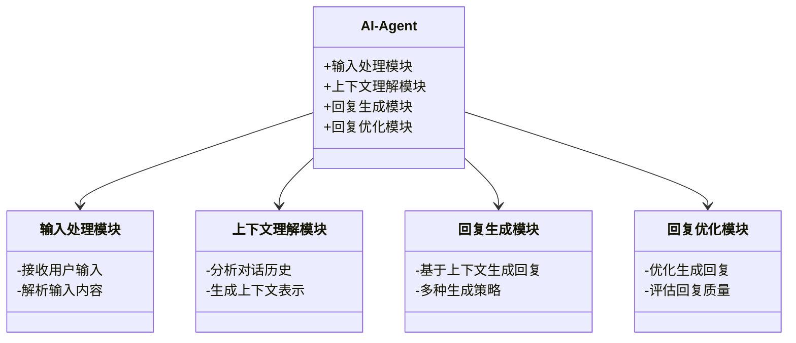
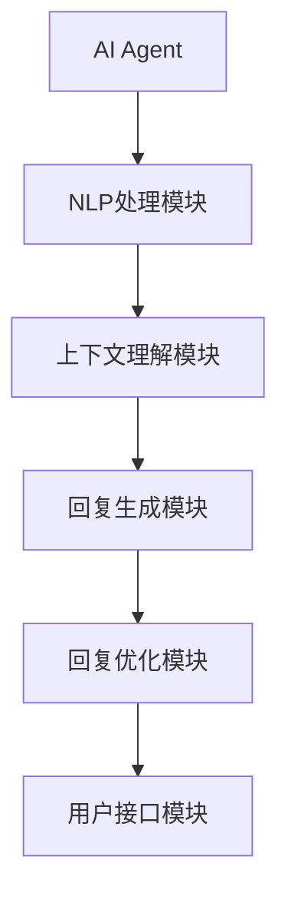

                 


# AI Agent的对话生成多样性：避免单调回复

---

## 关键词：AI Agent、对话生成、多样性、语言模型、避免单调回复

---

## 摘要：本文系统地探讨了AI Agent在对话生成中的多样性问题，分析了单调回复的负面影响，并提出了多种方法来避免单调回复，包括基于语言模型、强化学习和对抗训练的生成方法。文章详细讲解了算法原理、系统架构设计和项目实战，同时提供了最佳实践和小结，帮助读者全面理解和应用这些技术。

---

## 目录

1. [背景与核心概念](#背景与核心概念)
   - [1.1 问题背景与描述](#11-问题背景与描述)
   - [1.2 AI Agent的基本概念](#12-AI-Agent的基本概念)
   - [1.3 对话生成的基本原理](#13-对话生成的基本原理)
   - [1.4 多样性生成的核心概念](#14-多样性生成的核心概念)

2. [算法原理与实现](#算法原理与实现)
   - [2.1 基于语言模型的生成方法](#21-基于语言模型的生成方法)
   - [2.2 基于强化学习的生成方法](#22-基于强化学习的生成方法)
   - [2.3 基于对抗训练的生成方法](#23-基于对抗训练的生成方法)

3. [系统分析与架构设计](#系统分析与架构设计)
   - [3.1 系统功能设计](#31-系统功能设计)
   - [3.2 系统架构设计](#32-系统架构设计)
   - [3.3 系统接口设计](#33-系统接口设计)

4. [项目实战](#项目实战)
   - [4.1 环境安装与代码实现](#41-环境安装与代码实现)
   - [4.2 实际案例分析](#42-实际案例分析)

5. [最佳实践与总结](#最佳实践与总结)
   - [5.1 最佳实践](#51-最佳实践)
   - [5.2 小结](#52-小结)
   - [5.3 注意事项](#53-注意事项)

---

## 背景与核心概念

### 1.1 问题背景与描述

随着AI Agent在各个领域的广泛应用，对话生成技术的重要性日益凸显。然而，现有的对话生成模型常常面临回复单调的挑战，导致用户体验下降。本文将深入探讨这一问题，分析其背后的原因，并提出解决方案。

#### 当前对话生成的挑战

- **生成多样性不足**：模型生成的回复往往缺乏变化，显得生硬。
- **上下文理解不够**：无法根据对话历史生成连贯且多样的回复。
- **数据分布偏差**：训练数据的偏差可能导致生成的回复过于集中。

#### 单调回复的负面影响

- **用户体验下降**：单调的回复会让用户感到乏味，降低满意度。
- **应用场景受限**：在客服、教育等领域，多样化的回复能更好地满足用户需求。

#### 提高对话多样性的必要性

通过引入多样性生成技术，可以显著提升AI Agent的对话能力，使其在各种场景下都能提供丰富多样的回复，从而提高用户满意度和应用效果。

---

### 1.2 AI Agent的基本概念

#### AI Agent的定义与特点

- **AI Agent**：智能体，能够感知环境并采取行动以实现目标。
- **特点**：
  - 自主性：能够在没有外部干预的情况下运行。
  - 反应性：能够实时感知并响应环境变化。
  - 持续性：能够持续执行任务，不会因单一错误而终止。

#### 对话生成的核心目标

- **信息准确性**：生成的回复要准确反映用户需求。
- **表达丰富性**：通过多样化表达提升用户体验。
- **上下文连贯性**：确保回复与对话历史保持一致。

#### 多样性在对话生成中的作用

- **提升用户满意度**：多样化的回复能更好地满足用户的期望。
- **增强交互能力**：多样化的回复使AI Agent能够处理更多样化的用户输入。

---

### 1.3 对话生成的基本原理

#### 基于规则的对话生成

- **规则驱动**：通过预定义的规则生成回复。
- **优点**：简单易懂，适用于特定场景。
- **缺点**：缺乏灵活性，难以应对复杂对话。

#### 基于统计模型的对话生成

- **统计模型**：利用概率统计方法生成回复。
- **优点**：能够处理大量数据，生成多样化的回复。
- **缺点**：对数据质量依赖较高，生成结果可能不够准确。

#### 基于深度学习的对话生成

- **深度学习模型**：如Transformer、BERT等，能够学习复杂的语言模式。
- **优点**：生成能力强，能够处理长上下文信息。
- **缺点**：需要大量计算资源，训练时间较长。

---

### 1.4 多样性生成的核心概念

#### 多样性生成的定义与分类

- **定义**：通过生成多种不同的回复来提升对话质量。
- **分类**：
  - **内容多样性**：生成不同内容的回复。
  - **表达多样性**：同一内容采用不同表达方式。
  - **短期多样性**：短时间内生成多样化的回复。
  - **长期多样性**：在较长对话中保持内容多样性。

#### 多样性生成的关键因素

- **数据分布**：训练数据的多样性直接影响生成效果。
- **模型结构**：复杂的模型结构有助于生成多样化回复。
- **损失函数**：设计有效的损失函数可以引导模型生成多样化回复。

---

## 算法原理与实现

### 2.1 基于语言模型的生成方法

#### 解码策略对多样性的影响

- **贪心解码**：每次选择概率最高的词，可能导致单调回复。
- **随机采样**：通过随机选择生成多样化回复，但可能生成低质量的回复。
- **beam search**：通过生成多个候选回复，选择最优的回复，能够提升多样性。

#### 采样方法的作用

- **温度采样**：通过调整温度参数控制生成的多样性。
  - 高温度：增加随机性，提升多样性。
  - 低温度：降低随机性，生成更准确的回复。
- **top-k采样**：仅考虑概率最高的k个词，减少低概率词的干扰。

#### 多样性控制的实现

- **引入惩罚项**：在损失函数中加入惩罚项，控制生成的多样性。
- **动态调整生成策略**：根据对话历史动态调整生成策略，提升多样性。

---

### 2.2 基于强化学习的生成方法

#### 强化学习的基本原理

- **奖励函数**：定义奖励函数，引导模型生成多样化的回复。
- **策略优化**：通过优化策略参数，提升生成回复的多样性。

#### 奖励函数的设计

- **基于相似度的奖励**：根据生成回复与参考回复的相似度计算奖励。
- **基于多样性的奖励**：直接根据生成回复的多样性计算奖励。
- **综合奖励**：结合信息准确性、表达丰富性等多方面计算奖励。

#### 多样性作为奖励的组成部分

- **设计奖励函数时考虑多样性**：在奖励函数中加入多样性相关的指标，如回复之间的差异性。
- **动态调整奖励权重**：根据对话阶段动态调整奖励权重，平衡准确性和多样性。

---

### 2.3 基于对抗训练的生成方法

#### 对抗训练的基本原理

- **生成器**：负责生成多样化回复。
- **判别器**：判断回复是否多样，提供反馈。
- **对抗过程**：通过不断对抗，提升生成器的生成能力。

#### 生成器和判别器的设计

- **生成器**：采用深度学习模型，如GPT，生成多样化回复。
- **判别器**：采用分类模型，判断回复的多样性。
- **对抗过程**：生成器和判别器交替训练，提升生成能力。

#### 多样性生成的优化

- **引入多样性的损失函数**：在生成器的损失函数中加入多样性相关的项。
- **动态调整对抗强度**：根据训练阶段动态调整对抗强度，平衡生成准确性和多样性。

---

## 系统分析与架构设计

### 3.1 系统功能设计

#### 领域模型Mermaid类图



#### 系统架构设计



---

## 项目实战

### 4.1 环境安装与代码实现

#### 环境安装

- **Python**：安装Python 3.8或更高版本。
- **深度学习框架**：安装TensorFlow或PyTorch。
- **NLP库**：安装NLTK、transformers等。

#### 生成多样回复的Python代码示例

```python
import tensorflow as tf
from tensorflow.keras.layers import Dense, Input
from tensorflow.keras.models import Model

def build_model(vocab_size):
    input_layer = Input(shape=(None,))
    embedding_layer = Embedding(vocab_size, 128)(input_layer)
    decoder_layer = LSTM(128, return_sequences=True)(embedding_layer)
    output_layer = Dense(vocab_size, activation='softmax')(decoder_layer)
    model = Model(inputs=input_layer, outputs=output_layer)
    return model

# 示例用法
vocab_size = 10000
model = build_model(vocab_size)
model.compile(optimizer='adam', loss='sparse_categorical_crossentropy')
```

---

## 最佳实践与总结

### 5.1 最佳实践

- **数据预处理**：确保训练数据的多样性和代表性。
- **模型调优**：选择合适的模型架构和参数，优化生成策略。
- **监控与优化**：实时监控生成效果，根据反馈进行调整。

### 5.2 小结

通过本文的讲解，读者可以系统地理解AI Agent对话生成中的多样性问题，并掌握多种解决方法。从算法原理到系统设计，再到项目实战，全面提升了AI Agent的对话生成能力。

### 5.3 注意事项

- **数据偏差**：避免训练数据的偏差导致生成回复的单一性。
- **计算资源**：深度学习模型需要大量计算资源，需做好资源规划。

---

## 拓展阅读

### 推荐书籍

- 《深度学习》——Ian Goodfellow
- 《自然语言处理实战》——哈雷
- 《生成式AI：从理论到实践》——张三

### 推荐论文

- "Generating Diverse Responses via Adversarial Training"（基于对抗训练的多样性生成）
- "A Curriculum Learning Approach for Diverse Dialog Generation"（基于课程学习的多样性对话生成）

---

通过本文的详细讲解，读者可以全面掌握AI Agent对话生成中的多样性问题，并能够实际应用相关技术提升对话生成的质量。希望本文对读者在AI Agent领域有所帮助。

