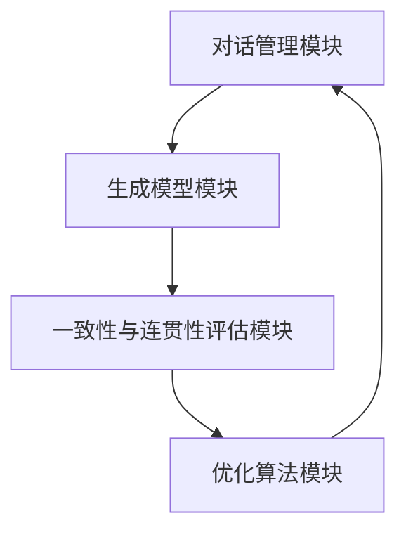
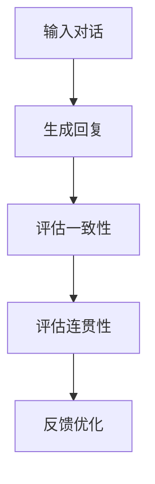

                 


# AI Agent的对话生成的一致性与连贯性优化

> 关键词：AI Agent，对话生成，一致性优化，连贯性优化，自然语言处理，深度学习，强化学习

> 摘要：本文深入探讨了AI Agent对话生成中一致性与连贯性优化的关键问题，分析了对话生成的核心挑战，提出了基于生成模型和强化学习的优化方法，并通过实际案例展示了如何实现高效的对话生成系统。

---

## 第1章：AI Agent对话生成的背景与问题

### 1.1 AI Agent与对话生成的概述

#### 1.1.1 AI Agent的基本概念
AI Agent（智能体）是指在特定环境中能够感知并自主行动以实现目标的实体。在对话生成领域，AI Agent通常表现为能够与人类进行自然语言交流的智能系统。

#### 1.1.2 对话生成在AI Agent中的重要性
对话生成是AI Agent实现人机交互的核心功能之一。一个高效的对话生成系统能够提高用户体验，增强系统的智能性和实用性。

#### 1.1.3 当前对话生成技术的发展现状
当前，基于深度学习的生成模型（如Transformer、GPT系列）在对话生成领域取得了显著进展。然而，对话生成的质量（一致性与连贯性）仍然是一个关键挑战。

### 1.2 对话生成中的问题与挑战

#### 1.2.1 对话生成的核心问题
对话生成的核心问题在于如何生成自然、连贯且符合上下文的回复。这需要解决以下问题：
- **一致性**：确保对话内容在逻辑上一致，避免前后矛盾。
- **连贯性**：确保对话的语义流畅，上下文衔接自然。
- **可解释性**：生成的对话应具有可解释性，便于用户理解和信任。

#### 1.2.2 一致性与连贯性问题的根源
- 数据质量：训练数据中的噪声可能导致生成回复不一致。
- 模型能力：生成模型可能无法充分捕捉对话的上下文信息。
- 评估指标：现有的评估指标可能无法全面衡量一致性和连贯性。

#### 1.2.3 实际应用场景中的特殊挑战
在实际应用中，对话生成需要考虑以下挑战：
- 多轮对话中的上下文管理。
- 不同领域知识的融合。
- 实时生成的计算效率要求。

---

## 第2章：一致性与连贯性的核心概念

### 2.1 对话一致性的定义与特征

#### 2.1.1 一致性问题的多维度分析
一致性问题可以从以下几个维度进行分析：
- **语义一致性**：生成的回复在语义上与前文一致。
- **知识一致性**：生成的回复与已有的知识库或上下文一致。
- **逻辑一致性**：生成的回复在逻辑上自洽。

#### 2.1.2 不同一致性评估方法的对比
常用的对话一致性评估方法包括：
- 基于困惑度（Perplexity）的评估。
- 基于交叉熵（Cross-entropy）的评估。
- 基于实体关系图（Entity Relation Graph）的评估。

#### 2.1.3 实体关系图中的一致性表现
实体关系图（ER图）是一种用于描述数据结构和实体关系的工具。在对话生成中，可以通过构建动态的实体关系图来评估回复的一致性。

### 2.2 对话连贯性的定义与特征

#### 2.2.1 连贯性的核心要素
连贯性可以从以下几个方面进行分析：
- **语义连贯性**：生成的回复在语义上与前文连贯。
- **句法连贯性**：生成的回复在句法结构上与前文连贯。
- **逻辑连贯性**：生成的回复在逻辑上与前文连贯。

#### 2.2.2 不同连贯性评估方法的对比
常用的对话连贯性评估方法包括：
- 基于相似度（Similarity）的评估。
- 基于生成模型的内部一致性评估。
- 基于人工评估的连贯性评分。

#### 2.2.3 实体关系图中的连贯性表现
在实体关系图中，连贯性可以通过节点之间的关系强度和关系的连贯性来衡量。

---

## 第3章：对话生成模型的算法原理

### 3.1 基于生成模型的对话生成

#### 3.1.1 Transformer架构的核心原理
Transformer是一种基于自注意力机制（Self-attention）的深度学习模型。其核心思想是通过计算输入序列中每个位置的重要性来生成输出。

- **自注意力机制**：通过计算每个位置与其他位置的相关性，生成位置的权重。
- **前馈网络**：对每个位置的特征进行非线性变换。

#### 3.1.2 解码过程中的注意力机制
在解码阶段，注意力机制可以帮助模型生成与当前上下文相关的回复。

- **查询（Query）**：表示当前生成的回复的位置特征。
- **键（Key）和值（Value）**：表示输入序列中各位置的特征。

#### 3.1.3 生成模型的训练流程
生成模型的训练流程包括以下几个步骤：
1. **数据预处理**：对对话数据进行分词、编码等预处理。
2. **模型初始化**：初始化生成模型的参数。
3. **损失计算**：通过交叉熵损失函数计算生成回复与真实回复的差异。
4. **反向传播**：通过梯度下降优化模型参数。

### 3.2 一致性与连贯性优化的算法

#### 3.2.1 基于强化学习的优化方法
强化学习（Reinforcement Learning）是一种通过奖励机制优化生成模型的方法。

- **奖励函数设计**：设计一个奖励函数，用于衡量生成回复的一致性和连贯性。
- **策略梯度法**：通过计算策略梯度，优化生成模型的参数。

#### 3.2.2 基于对比学习的优化方法
对比学习（Contrastive Learning）是一种通过对比正样本和负样本来优化模型的方法。

- **正样本选择**：选择与当前上下文一致的回复作为正样本。
- **负样本选择**：选择与当前上下文不一致的回复作为负样本。

#### 3.2.3 基于规则的优化方法
基于规则的优化方法通过引入领域知识来优化生成回复的一致性和连贯性。

- **领域知识库**：构建一个领域知识库，用于约束生成回复的内容。
- **规则约束**：通过预定义的规则，约束生成回复的格式和内容。

---

## 第4章：AI Agent对话生成系统的架构设计

### 4.1 系统整体架构

#### 4.1.1 模块化设计概述
AI Agent对话生成系统的整体架构可以分为以下几个模块：
- **对话管理模块**：负责管理对话的流程。
- **生成模型模块**：负责生成回复内容。
- **一致性与连贯性评估模块**：负责评估生成回复的质量。

#### 4.1.2 各模块之间的交互关系
- **对话管理模块**：接收用户的输入，并将输入传递给生成模型模块。
- **生成模型模块**：根据输入生成回复，并将回复传递给一致性与连贯性评估模块。
- **一致性与连贯性评估模块**：评估生成的回复质量，并将结果反馈给生成模型模块。

#### 4.1.3 系统的可扩展性设计
系统设计时需要考虑模块的可扩展性，以便在未来引入新的算法或功能时能够方便地进行扩展。

### 4.2 关键模块的设计

#### 4.2.1 对话管理模块的设计
对话管理模块负责管理对话的流程，包括以下功能：
- **状态管理**：维护对话的状态信息。
- **上下文管理**：维护对话的上下文信息。
- **回复选择**：根据生成模型的输出选择最终的回复。

#### 4.2.2 生成模型模块的设计
生成模型模块负责生成回复内容，包括以下功能：
- **输入处理**：接收对话的上下文信息。
- **回复生成**：通过生成模型生成回复内容。
- **输出处理**：将生成的回复内容传递给一致性与连贯性评估模块。

#### 4.2.3 一致性与连贯性评估模块的设计
一致性与连贯性评估模块负责评估生成的回复质量，包括以下功能：
- **一致性评估**：评估生成的回复在语义上是否一致。
- **连贯性评估**：评估生成的回复在句法和逻辑上是否连贯。
- **结果反馈**：将评估结果反馈给生成模型模块。

---

## 第5章：一致性与连贯性优化的实现

### 5.1 环境搭建与工具安装

#### 5.1.1 开发环境的选择与配置
推荐使用以下开发环境：
- **操作系统**：Linux或MacOS。
- **编程语言**：Python 3.8以上版本。
- **深度学习框架**：TensorFlow或PyTorch。

#### 5.1.2 必要工具的安装与配置
需要安装以下工具：
- **Python库**：numpy、pandas、tensorflow或pytorch。
- **自然语言处理工具**： SpaCy或NLTK。
- **可视化工具**：Matplotlib或Seaborn。

### 5.2 代码实现

#### 5.2.1 对话生成模型的实现

```python
import tensorflow as tf
from tensorflow.keras.layers import Dense, InputLayer, LSTM
from tensorflow.keras.models import Model

# 定义生成模型
class DialogGenerator:
    def __init__(self, vocab_size):
        self.vocab_size = vocab_size
        self.model = self.build_model()
    
    def build_model(self):
        # 定义输入层
        inputs = InputLayer(input_shape=(None, self.vocab_size))
        # 定义LSTM层
        lstm_layer = LSTM(128, return_sequences=True)(inputs)
        # 定义输出层
        outputs = Dense(self.vocab_size, activation='softmax')(lstm_layer)
        # 构建模型
        model = Model(inputs=inputs, outputs=outputs)
        return model
```

#### 5.2.2 一致性与连贯性评估的实现

```python
import tensorflow as tf
from tensorflow.keras.layers import Dense, InputLayer, LSTM
from tensorflow.keras.models import Model

# 定义评估模型
class ConsistencyEvaluator:
    def __init__(self, vocab_size):
        self.vocab_size = vocab_size
        self.model = self.build_model()
    
    def build_model(self):
        # 定义输入层
        inputs = InputLayer(input_shape=(None, self.vocab_size))
        # 定义LSTM层
        lstm_layer = LSTM(128, return_sequences=True)(inputs)
        # 定义输出层
        outputs = Dense(1, activation='sigmoid')(lstm_layer)
        # 构建模型
        model = Model(inputs=inputs, outputs=outputs)
        return model
```

#### 5.2.3 优化算法的实现

```python
import tensorflow as tf
from tensorflow.keras.layers import Dense, InputLayer, LSTM
from tensorflow.keras.models import Model
from tensorflow.keras.optimizers import Adam

# 定义优化算法
class OptimizationAlgorithm:
    def __init__(self, generator, evaluator):
        self.generator = generator
        self.evaluator = evaluator
        self.optimizer = Adam(learning_rate=0.001)
    
    def optimize(self, input_sequence):
        # 定义目标函数
        with tf.GradientTape() as tape:
            # 生成回复
            generated_output = self.generator.model(input_sequence)
            # 评估一致性
            consistency_score = self.evaluator.model(input_sequence)
            # 计算损失
            loss = tf.keras.losses.binary_crossentropy(consistency_score, tf.ones_like(consistency_score))
        # 计算梯度
        gradients = tape.gradient(loss, self.generator.model.trainable_weights)
        # 更新参数
        self.optimizer.apply_gradients(zip(gradients, self.generator.model.trainable_weights))
```

### 5.3 项目实战

#### 5.3.1 实际案例分析
假设我们有一个简单的对话生成任务，目标是生成与用户输入一致且连贯的回复。

#### 5.3.2 代码实现与分析
以上代码实现了对话生成模型、一致性与连贯性评估模型以及优化算法。通过训练这些模型，可以生成高质量的对话回复。

---

## 第6章：优化经验与未来展望

### 6.1 最佳实践

#### 6.1.1 开发过程中的注意事项
- 在训练生成模型时，建议使用高质量的训练数据。
- 在评估一致性与连贯性时，建议使用多样的评估指标。

#### 6.1.2 常见问题及解决方案
- 问题：生成的回复一致性差。
  - 解决方案：引入领域知识库，约束生成内容。
- 问题：生成的回复连贯性差。
  - 解决方案：优化模型的注意力机制，增强上下文捕捉能力。

#### 6.1.3 优化过程中的经验总结
- 优化一致性与连贯性需要结合领域知识和模型优化。
- 在实际应用中，建议采用模块化的系统架构，便于后续扩展。

### 6.2 未来研究方向

#### 6.2.1 新技术的应用前景
- **多模态对话生成**：结合视觉信息，生成更丰富的对话内容。
- **实时对话生成**：优化计算效率，实现实时对话生成。

#### 6.2.2 领域内的研究热点
- **对话生成的可解释性**：如何提高生成回复的可解释性。
- **对话生成的个性化**：如何根据用户个性生成个性化的回复。

#### 6.2.3 未来可能的发展趋势
- 随着深度学习技术的不断发展，对话生成的准确性和自然度将不断提升。
- 预计未来将有更多的研究集中在多轮对话生成和个性化对话生成方面。

---

## 附录：相关技术资料与工具列表

### 附录A：主流对话生成模型列表
- Transformer（Vaswani et al., 2017）
- GPT系列（Radford et al., 2019）
- DialogGPT（Zhang et al., 2020）

### 附录B：一致性与连贯性评估工具列表
- BLEU（Bleu, 2001）
- ROUGE（Lin, 2004）
- Metait（Zhai et al., 2020）

### 附录C：相关开源库与框架列表
- TensorFlow（Google）
- PyTorch（Facebook）
- Hugging Face（Open Source）

---

## 图表目

### 图1：对话生成系统整体架构（Mermaid图）



### 图2：一致性与连贯性评估流程（Mermaid图）



---

以上是《AI Agent的对话生成的一致性与连贯性优化》的技术博客文章的详细目录和内容框架。

