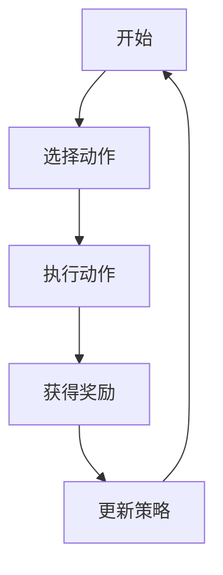
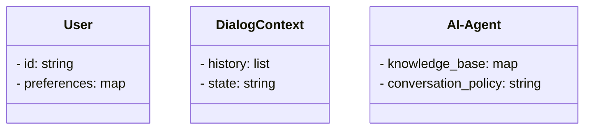
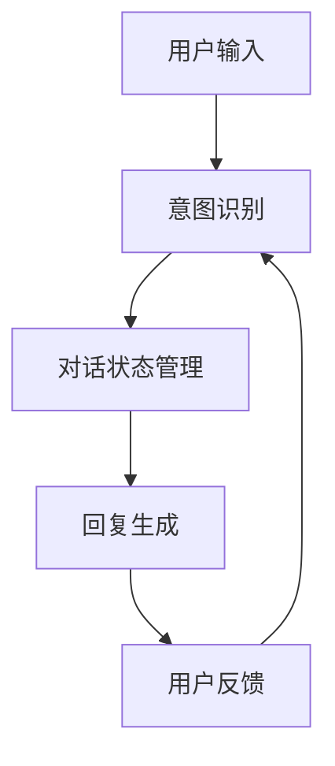

                 


# AI Agent的对话策略优化与个性化

## 关键词：AI Agent，对话策略优化，个性化对话，强化学习，对话系统

## 摘要：  
本文深入探讨了AI Agent在对话系统中的对话策略优化与个性化实现。首先介绍了AI Agent的基本概念和对话策略优化的重要性，然后详细分析了对话策略优化的核心原理和方法，包括基于强化学习的策略优化、个性化回复生成等。接着通过数学模型和算法实现，展示了如何将这些理论应用于实际系统中。最后，通过一个实际项目案例，详细讲解了如何实现一个高效的个性化对话系统，并总结了相关的最佳实践和未来发展方向。

---

# 第一部分: AI Agent的对话策略优化与个性化基础

## 第1章: AI Agent与对话策略优化概述

### 1.1 AI Agent的基本概念
AI Agent（人工智能代理）是指能够感知环境、自主决策并执行任务的智能体。在对话系统中，AI Agent通常表现为能够与用户进行自然语言交互的智能对话系统，例如智能音箱、聊天机器人等。其核心特点包括：

- **自主性**：AI Agent能够独立决策，无需外部干预。
- **反应性**：能够实时感知输入并做出响应。
- **学习能力**：通过数据和反馈不断优化自身的对话策略。

### 1.2 对话策略优化的背景与挑战
对话系统的核心是对话策略优化，即通过优化算法使AI Agent在对话过程中能够选择最优的回复，以提高用户体验。然而，对话策略优化面临以下挑战：

- **上下文理解**：对话是一个动态过程，需要理解用户的意图、情感和背景信息。
- **个性化需求**：不同用户有不同的表达习惯和偏好，如何满足个性化需求是一个难题。
- **实时性要求**：对话需要实时进行，对算法的效率要求较高。

### 1.3 个性化对话的核心要素
个性化对话需要结合用户特征、对话上下文和语境理解，具体包括：

- **用户特征分析**：通过用户的历史行为、偏好和身份信息，生成个性化的回复。
- **对话上下文理解**：基于当前对话内容和历史记录，理解用户的深层需求。
- **个性化回复生成**：根据用户特征和对话上下文，生成符合用户期望的回复。

---

## 第二部分: 对话策略优化的核心概念与联系

## 第2章: 对话策略优化的原理与方法

### 2.1 对话策略优化的基本原理
对话策略优化的核心在于通过算法选择最优的回复策略。常见的优化方法包括：

- **基于强化学习的对话策略优化**：通过强化学习算法（如Q-Learning）在对话过程中不断优化回复策略。
- **基于监督学习的对话策略优化**：通过标注数据训练模型，预测最优回复。
- **基于生成模型的对话策略优化**：利用生成对抗网络（GAN）等生成模型优化回复内容。

### 2.2 对话策略优化的核心方法
- **基于状态的对话策略**：根据对话状态（如当前轮次、用户意图）选择回复策略。
- **基于目标的对话策略**：通过设定目标（如提高用户满意度）优化回复策略。
- **基于反馈的对话策略**：通过用户反馈调整回复策略。

### 2.3 对话策略优化的数学模型
对话策略优化的数学模型通常涉及目标函数和约束条件。例如，基于强化学习的目标函数可以表示为：

$$ J = \sum_{t=1}^{T} r_t $$

其中，$r_t$是第$t$步的奖励值，$T$是对话的总轮数。约束条件则包括对话的连贯性和用户意图的准确性。

### 2.4 对话策略优化的对比分析
以下表格对比了不同策略优化方法的优缺点：

| **策略方法**       | **优点**                           | **缺点**                           |
|--------------------|------------------------------------|------------------------------------|
| 基于规则的策略     | 实现简单，易于控制                 | 无法应对复杂场景                   |
| 基于监督学习的策略  | 可以处理大量数据，准确性高           | 数据标注成本高                   |
| 基于强化学习的策略  | 可以动态优化策略                   | 训练时间长，计算资源消耗大       |

---

## 第三部分: 对话策略优化的算法原理

## 第3章: 强化学习在对话策略优化中的应用

### 3.1 强化学习的基本原理
强化学习通过智能体与环境的交互，通过试错的方式优化策略。在对话系统中，强化学习的目标是通过最大化累积奖励来优化对话策略。

### 3.2 基于强化学习的对话策略优化算法
以下是基于强化学习的对话策略优化流程图：



### 3.3 对话策略优化的数学模型
对话策略优化的数学模型通常包括状态、动作和奖励三个部分。例如，马尔可夫决策过程（MDP）可以表示为：

$$ MDP = (S, A, P, R, \gamma) $$

其中，$S$是状态空间，$A$是动作空间，$P$是状态转移概率，$R$是奖励函数，$\gamma$是折扣因子。

---

## 第四部分: 对话策略优化的系统分析与架构设计

## 第4章: 智能对话系统的架构设计

### 4.1 系统功能设计
以下是智能对话系统的领域模型类图：



### 4.2 系统架构设计
以下是智能对话系统的架构图：



---

## 第五部分: 对话策略优化的项目实战

## 第5章: 实战项目：个性化对话系统的实现

### 5.1 环境安装
- 安装Python和相关库（如TensorFlow、Keras）。
- 安装自然语言处理工具（如spaCy、NLTK）。

### 5.2 核心代码实现
以下是基于强化学习的对话策略优化代码示例：

```python
import numpy as np
import random

class AI-Agent:
    def __init__(self, state_space, action_space):
        self.state_space = state_space
        self.action_space = action_space
        self.Q = np.zeros((state_space, action_space))

    def choose_action(self, state):
        if random.uniform(0, 1) < 0.1:
            return random.choice(self.action_space)
        else:
            return np.argmax(self.Q[state])

    def update_Q(self, state, action, reward):
        self.Q[state, action] = self.Q[state, action] + 0.1 * (reward + np.max(self.Q[state]))
```

### 5.3 项目小结
通过项目实战，我们了解了如何将理论应用于实际。在实现过程中，需要注意数据质量、算法效率和用户体验的平衡。

---

## 第六部分: 对话策略优化的最佳实践

## 第6章: 最佳实践与未来展望

### 6.1 小结
本文详细介绍了AI Agent的对话策略优化与个性化实现，从理论到实践，全面探讨了相关方法和技术。

### 6.2 注意事项
- 数据质量和多样性对策略优化至关重要。
- 需要注意算法的效率和实时性。
- 用户隐私保护是个性化对话系统的重要考量。

### 6.3 拓展阅读
推荐阅读《Reinforcement Learning: Theory and Algorithms》和《Neural Networks for NLP》。

---

通过以上内容，我们全面探讨了AI Agent的对话策略优化与个性化实现，从理论到实践，为读者提供了一个完整的解决方案。希望本文能够为相关领域的研究和应用提供有价值的参考。

