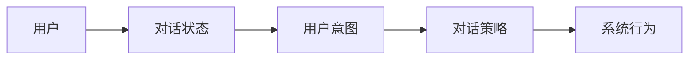
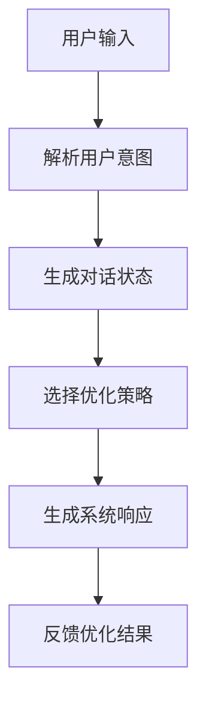
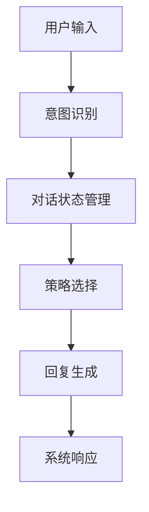

                 


# AI Agent的对话策略优化：提升交互质量和效率

## 关键词：AI Agent, 对话策略优化, 自然语言处理, 强化学习, 对话系统

## 摘要：  
本文深入探讨AI Agent对话策略优化的核心方法，结合实际案例和系统设计，分析如何通过算法改进和系统架构优化，显著提升交互的质量和效率。文章内容涵盖从基础概念到高级算法的详细讲解，以及系统设计与项目实战的具体实现。

---

# 第一部分: AI Agent对话策略优化的背景与基础

## 第1章: AI Agent的基本概念与对话策略概述

### 1.1 AI Agent的定义与核心功能

#### 1.1.1 AI Agent的基本定义
AI Agent（人工智能代理）是能够感知环境、自主决策并执行任务的智能实体。它通过自然语言处理、机器学习等技术，与用户进行交互，提供信息或完成任务。

#### 1.1.2 AI Agent的核心功能与特点
AI Agent的核心功能包括：
- **感知环境**：通过输入数据（如文本、语音）理解用户需求。
- **自主决策**：基于上下文和历史信息，选择最优的行动方案。
- **执行任务**：生成回复或执行预设操作。
- **学习优化**：通过反馈机制改进性能。

特点：
- **智能化**：能够理解用户意图并灵活调整策略。
- **实时性**：快速响应用户需求。
- **适应性**：根据对话进展动态优化交互方式。

#### 1.1.3 AI Agent与传统对话系统的区别
AI Agent的优势在于其自主性和适应性。传统对话系统通常基于固定的规则或模板，而AI Agent能够通过学习和优化提升交互效果。

---

## 第2章: 对话策略优化的背景与问题描述

### 2.1 对话策略优化的背景

随着AI Agent在各个领域的广泛应用，对话策略优化的需求日益迫切。优化的目标是提升用户体验，减少无效对话，提高任务完成效率。

### 2.2 对话策略优化的主要问题

#### 2.2.1 当前对话系统的主要挑战
- **意图识别不准确**：用户输入复杂或歧义时，系统难以准确理解需求。
- **策略选择单一**：缺乏灵活的策略切换机制，导致对话僵化。
- **上下文管理不足**：无法有效维护对话历史信息，导致重复或矛盾的回复。

#### 2.2.2 对话策略优化的必要性
- 提高用户满意度：通过更精准的回复和流畅的对话提升用户体验。
- 提升效率：减少无效对话，快速解决问题。
- 降低运营成本：优化策略可以减少人工干预，降低运营成本。

#### 2.2.3 对话策略优化的目标与边界
目标：
- 提供高质量、个性化的对话体验。
- 动态调整策略，适应用户需求变化。

边界：
- 仅限于文本或语音对话，不涉及其他交互方式。
- 不考虑系统外部因素（如网络延迟）的影响。

---

## 第3章: 对话策略优化的核心概念与联系

### 3.1 对话策略优化的核心概念

#### 3.1.1 对话状态与上下文管理
对话状态是指当前对话的进展情况，包括用户意图、历史信息等。上下文管理涉及如何维护和利用这些信息，以支持后续的对话决策。

#### 3.1.2 用户意图识别与需求分析
用户意图识别是对话策略优化的基础。通过分析用户的输入，系统需要准确判断用户的意图（如查询信息、解决问题等）。

#### 3.1.3 对话策略与系统行为的关系
对话策略决定了系统在不同情况下的行为方式。优化策略可以显著改善系统的响应质量和效率。

### 3.2 对话策略优化的核心概念联系

#### 3.2.1 实体关系图（ER图）展示


#### 3.2.2 对话策略优化的流程图


---

## 第4章: 对话策略优化的算法原理与数学模型

### 4.1 基于规则的对话策略优化算法

#### 4.1.1 基于规则的策略
基于规则的策略通过预定义的规则来决定系统的响应方式。这种方法简单易懂，适用于场景较为固定的对话系统。

#### 4.1.2 基于模板的策略
基于模板的策略利用预定义的模板生成回复。这种方法灵活性较低，但实现起来较为简单。

#### 4.1.3 基于强化学习的策略
强化学习是一种通过不断试错来优化策略的方法。系统通过与用户的互动，不断调整策略以获得更高的奖励。

---

## 第5章: 对话策略优化的系统架构与实现

### 5.1 系统架构设计

#### 5.1.1 系统功能模块
- **意图识别模块**：负责解析用户的输入，识别其意图。
- **对话状态管理模块**：维护对话的上下文信息。
- **策略选择模块**：根据对话状态和用户意图选择最优的回复策略。
- **回复生成模块**：根据选择的策略生成系统的回复。

#### 5.1.2 系统架构图


---

## 第6章: 项目实战与最佳实践

### 6.1 项目实战：构建一个简单的AI Agent对话系统

#### 6.1.1 环境安装
安装必要的库，如Python的`nltk`和`tensorflow`。

#### 6.1.2 核心功能实现
实现意图识别、对话状态管理和策略选择模块。

#### 6.1.3 代码实现
```python
import nltk
from tensorflow import keras

# 意图识别模块
def identify_intent(user_input):
    # 使用预训练模型进行意图识别
    model = keras.models.load_model('intent_model.h5')
    return model.predict(user_input)

# 对话状态管理模块
class DialogState:
    def __init__(self):
        self.history = []
    
    def update(self, input, intent):
        self.history.append((input, intent))

# 策略选择模块
def choose_strategy(dialog_state):
    # 根据对话历史选择最佳策略
    pass
```

#### 6.1.4 代码解读与分析
通过对代码的解读，分析每个模块的功能及其相互关系。

#### 6.1.5 实际案例分析
通过具体案例，展示如何优化对话策略以提升用户体验。

### 6.2 最佳实践与小结

- **持续优化**：定期收集用户反馈，优化对话策略。
- **多领域应用**：将对话策略优化技术应用到不同领域，提升系统性能。
- **关注用户体验**：始终以用户体验为核心，优化对话质量。

---

## 结语

通过对AI Agent对话策略优化的深入探讨，我们了解了其核心方法和实现步骤。从基础概念到系统设计，再到项目实战，我们一步步掌握了优化策略的技巧。未来，随着技术的进步，AI Agent的对话策略优化将更加智能化和个性化，为用户提供更优质的交互体验。

