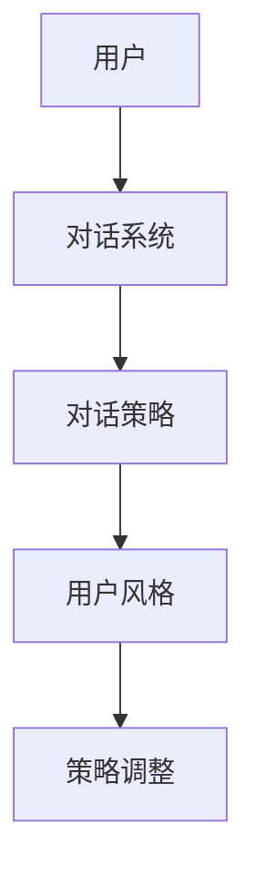
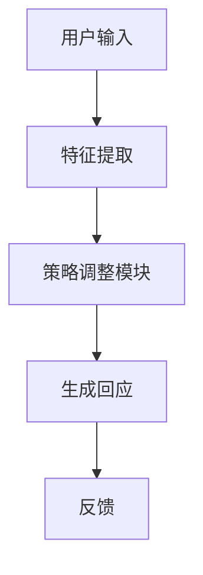
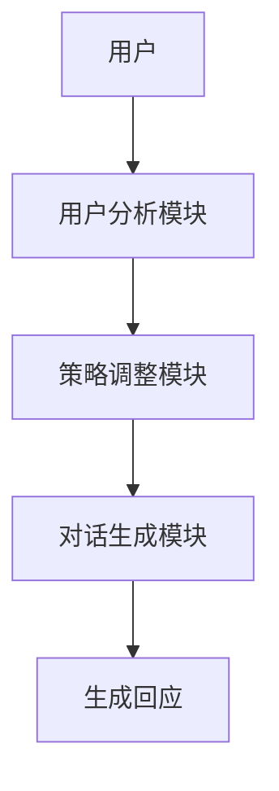
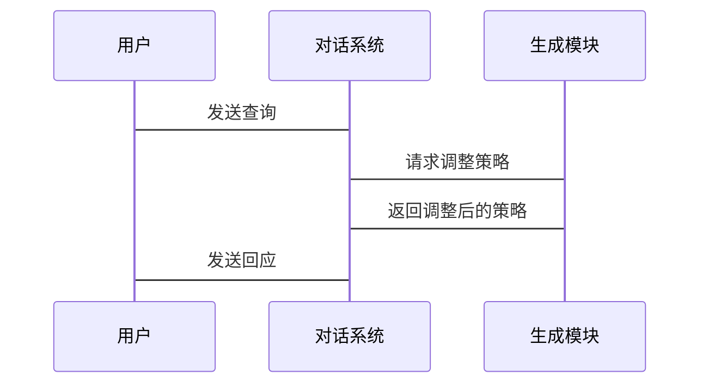

                 


# AI Agent的对话策略动态调整：适应用户风格

## 关键词：AI Agent、对话策略、用户风格、动态调整、自然语言处理、机器学习

## 摘要：本文深入探讨了AI Agent在对话系统中如何根据用户风格动态调整对话策略，以优化用户体验。通过分析对话策略的类型、用户风格的特征，结合算法原理和系统架构设计，本文提出了基于机器学习的动态调整方法，并通过实际案例展示了如何实现和应用这些策略。

---

## 第一部分：背景介绍

### 第1章：AI Agent的对话策略动态调整概述

#### 1.1 问题背景

- **AI Agent的重要性**：AI Agent在对话系统中扮演着关键角色，能够理解用户需求并生成合适的回应。然而，传统的对话系统往往采用固定的策略，难以适应不同用户的风格和需求。
- **对话策略动态调整的必要性**：用户风格多样，从正式到随意，从技术性到情感化，AI Agent需要能够识别并适应这些风格，以提供更个性化的服务。
- **用户风格的影响**：用户风格直接影响对话体验，动态调整对话策略可以提升用户体验和满意度。

#### 1.2 AI Agent的基本概念

- **定义与分类**：AI Agent是能够感知环境并采取行动以实现目标的智能实体。在对话系统中，AI Agent通常分为任务导向型和情感导向型。
- **对话系统的核心要素**：包括自然语言处理（NLP）、用户意图识别、对话生成和反馈机制。
- **用户风格的定义**：用户风格是用户在对话中表现出的语言习惯、情感倾向和表达方式。

#### 1.3 对话策略动态调整的意义

- **提高适应性**：动态调整策略使AI Agent能够根据用户反馈实时优化回应。
- **增强个性化**：通过识别用户风格，AI Agent可以生成更贴合用户习惯的回复。
- **提升用户体验**：动态调整策略能够减少对话中的摩擦，使对话更流畅自然。

#### 1.4 本章小结

- **核心概念回顾**：AI Agent、对话策略、用户风格。
- **后续章节框架**：从理论到算法，从系统设计到实战应用，全面解析动态调整策略。

---

## 第二部分：核心概念与联系

### 第2章：对话策略的核心要素

#### 2.1 对话策略的类型

- **基于规则的对话策略**：通过预定义的规则生成回应，适用于简单场景，但缺乏灵活性。
- **基于机器学习的对话策略**：利用模型学习用户风格和对话历史，生成更自然的回复。
- **混合型对话策略**：结合规则和机器学习的优势，适用于复杂场景。

#### 2.2 用户风格的特征分析

- **用户风格的分类**：包括正式、随意、技术性、情感化等。
- **识别方法**：通过关键词分析、情感分析和语言模型推理识别用户风格。
- **用户风格与对话策略的关系**：用户风格影响策略选择，策略调整反过来影响用户体验。

#### 2.3 对话策略动态调整的机制

- **监控指标**：包括对话长度、关键词频率、情感倾向等。
- **触发条件**：用户风格变化、对话中的冲突或困惑。
- **实现方式**：实时分析用户输入，动态调整生成模型的参数。

#### 2.4 核心概念对比表

| 对话策略类型 | 基于规则 | 基于机器学习 |
|--------------|----------|--------------|
| 优点          | 简单易实现 | 高灵活性和适应性 |
| 缺点          | 缺乏个性化 | 训练数据依赖性强 |

#### 2.5 实体关系图（Mermaid）



---

## 第三部分：算法原理讲解

### 第3章：对话策略动态调整的算法原理

#### 3.1 算法概述

- **算法目标**：根据用户风格特征调整生成策略，优化对话质量。
- **输入与输出**：输入包括用户对话历史和风格特征，输出是调整后的对话策略。

#### 3.2 对话策略动态调整的流程（Mermaid）



#### 3.3 算法实现细节

- **特征提取**：利用NLP技术提取用户风格特征，如情感倾向和关键词频率。
- **策略调整**：基于用户风格特征，动态调整生成模型的参数或权重。
- **生成回应**：使用预训练的语言模型生成个性化回复。

#### 3.4 数学模型与公式

- **情感倾向计算**：使用情感分析模型，计算用户输入的情感分数，范围为-1到1。
  $$ \text{score} = \frac{\text{positive\_count} - \text{negative\_count}}{\text{total\_tokens}} $$
- **策略调整公式**：根据情感分数调整生成模型的温度参数。
  $$ T = T_0 \times (1 + \text{score}) $$

#### 3.5 代码示例

```python
import numpy as np

def get_emotion_score(text):
    # 简化的情感分析函数，返回情感分数（-1到1）
    positive_words = ['happy', 'excited']
    negative_words = ['sad', 'frustrated']
    words = text.lower().split()
    positive_count = sum(1 for word in words if word in positive_words)
    negative_count = sum(1 for word in words if word in negative_words)
    return (positive_count - negative_count) / (len(words) + 1e-9)

def adjust_strategy(emotion_score, base_temp):
    # 根据情感分数调整生成温度
    return base_temp * (1 + emotion_score)

# 示例使用
text = "I'm so excited about this!"
score = get_emotion_score(text)
new_temp = adjust_strategy(score, 1.0)
print(f"Emotion Score: {score}, New Temperature: {new_temp}")
```

---

## 第四部分：系统分析与架构设计方案

### 第4章：系统设计与架构

#### 4.1 问题场景介绍

- **目标**：构建一个能够动态调整对话策略的AI Agent。
- **场景**：用户与AI Agent进行多轮对话，系统根据用户风格调整回应策略。

#### 4.2 系统功能设计

- **用户分析模块**：实时分析用户输入，提取风格特征。
- **策略调整模块**：根据用户风格动态调整生成策略。
- **对话生成模块**：基于调整后的策略生成个性化回复。

#### 4.3 系统架构设计（Mermaid）



#### 4.4 系统接口设计

- **输入接口**：用户输入文本。
- **输出接口**：生成的对话回应。

#### 4.5 系统交互流程（Mermaid）



---

## 第五部分：项目实战

### 第5章：项目实现与案例分析

#### 5.1 环境安装

- **工具**：Python、TensorFlow、Keras、NLTK。
- **安装命令**：`pip install numpy tensorflow keras nltk`

#### 5.2 系统核心实现

- **特征提取函数**：`extract_features(text)`，返回用户风格特征。
- **策略调整函数**：`adjust_strategy(features)`，返回调整后的生成参数。

#### 5.3 代码实现

```python
def extract_features(text):
    # 示例：提取情感倾向和关键词
    features = {}
    features['emotion_score'] = get_emotion_score(text)
    features['关键词'] = ['AI', 'Agent']
    return features

def adjust_strategy(features):
    # 根据特征调整生成策略
    base_temp = 1.0
    new_temp = base_temp * (1 + features['emotion_score'])
    return new_temp
```

#### 5.4 案例分析

- **案例1**：用户风格为正式，系统调整生成策略，生成更正式的回应。
- **案例2**：用户风格为随意，系统生成更口语化的回复。

#### 5.5 项目小结

- **实现总结**：通过特征提取和策略调整，成功实现动态对话策略。
- **优化方向**：引入更复杂的NLP模型，如BERT，提升特征提取的准确性。

---

## 第六部分：最佳实践与总结

### 第6章：总结与优化建议

#### 6.1 小结

- **核心内容回顾**：AI Agent的对话策略动态调整，用户风格识别，算法实现。
- **重要性强调**：动态调整策略能够显著提升用户体验。

#### 6.2 注意事项

- **数据质量**：特征提取依赖高质量的训练数据。
- **模型选择**：选择合适的NLP模型，如BERT、GPT。
- **用户隐私**：确保用户数据的安全和隐私保护。

#### 6.3 拓展阅读

- **推荐书籍**：《Deep Learning for NLP》、《机器学习实战》。
- **技术博客**：自然语言处理、对话系统相关的技术博客。

---

## 第七部分：未来展望

### 第7章：未来发展方向

#### 7.1 技术趋势

- **多模态对话**：结合视觉、听觉信息，提升对话体验。
- **自适应学习**：AI Agent能够自我优化和学习，适应更多用户风格。

#### 7.2 应用场景

- **教育领域**：个性化教学助手。
- **医疗领域**：患者咨询助手。
- **客服领域**：智能客服系统。

#### 7.3 挑战与机遇

- **挑战**：模型泛化能力、数据多样性。
- **机遇**：技术进步推动更智能的对话系统。

---

## 总结

本文系统地探讨了AI Agent对话策略动态调整的核心概念、算法原理和系统架构，并通过实际案例展示了如何实现和优化这些策略。通过本文的学习，读者可以掌握如何根据用户风格动态调整对话策略，从而提升AI对话系统的用户体验和性能。未来，随着NLP和机器学习技术的进步，AI Agent将在更多领域展现出强大的应用潜力。

