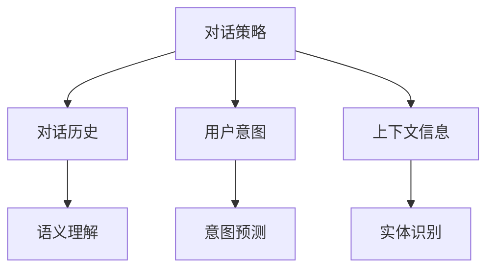
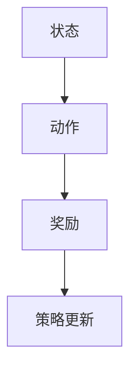
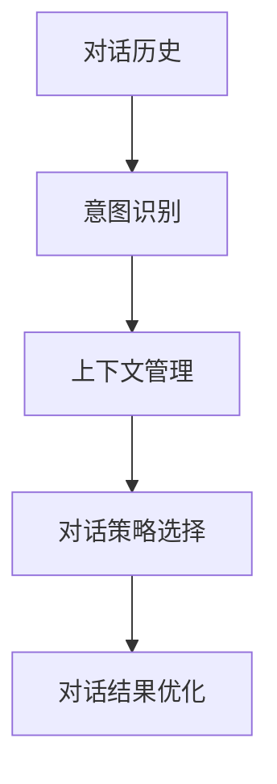
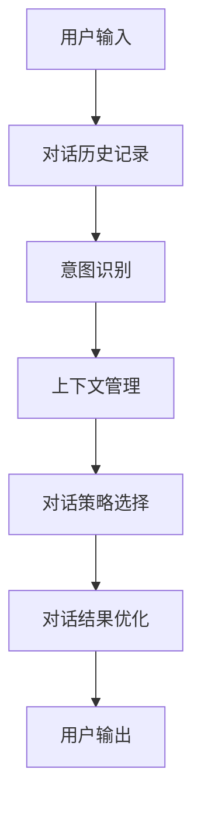

                 


# AI Agent的对话策略在不同场景下的适应性

> 关键词：AI Agent, 对话策略, 适应性机制, 强化学习, 场景切换

> 摘要：本文探讨AI Agent在不同场景下的对话策略适应性问题，分析对话策略的核心概念、算法原理、系统架构，并通过实际案例展示如何实现高效的对话策略适应性。文章内容涵盖AI Agent的基本概念、对话策略的适应性机制、基于强化学习和基于规则的对话策略算法、系统架构设计以及项目实战，旨在为读者提供全面而深入的理论和技术指导。

---

# 第一部分: AI Agent的对话策略概述

## 第1章: AI Agent与对话策略的基本概念

### 1.1 什么是AI Agent

AI Agent（人工智能代理）是一种能够感知环境、做出决策并采取行动的智能实体。它通过与用户或环境的交互，完成特定任务或提供服务。AI Agent的核心特征包括自主性、反应性、目标导向性和社交能力。与传统软件代理相比，AI Agent具备更强的智能性和适应性，能够处理复杂和动态的环境。

### 1.2 对话策略的基本概念

对话策略是指AI Agent在与用户交互过程中，根据当前对话状态、用户意图和上下文信息，选择合适的语言和行为以实现对话目标。对话策略的分类包括基于规则的策略、基于机器学习的策略和混合策略。对话策略在AI Agent中的作用是提升用户体验、提高对话效率并增强系统的智能性。

---

## 第2章: AI Agent对话策略的适应性问题

### 2.1 适应性问题的背景

当前对话策略面临的主要挑战包括场景多样性、用户需求变化和环境动态性。适应性问题的重要性体现在提高系统灵活性、增强用户满意度和提升系统鲁棒性。适应性问题的边界与外延包括对话历史、用户意图和上下文信息。

### 2.2 不同场景下的对话策略需求

通用场景的对话策略特点包括简洁性、通用性和高效性。特定场景的对话策略需求则强调领域知识、专业性和个性化。场景切换中的适应性问题要求对话策略能够快速调整以应对不同场景的需求。

---

# 第二部分: AI Agent对话策略的核心概念与联系

## 第3章: 对话策略的核心概念

### 3.1 对话策略的原理

对话策略的输入包括对话历史、用户意图和上下文信息，输出为对话行为。其决策机制基于语义理解和意图预测。优化目标包括提高对话准确率、降低对话成本和提升用户体验。

### 3.2 对话策略与适应性机制的关系

适应性机制通过动态调整对话策略参数和行为，影响对话策略的性能。两者的关系体现在相互作用和相互影响。

---

## 第4章: 对话策略的核心要素对比

### 4.1 对话策略的属性特征对比

通过对比不同对话策略的性能、适用性和可扩展性，得出适应性策略在复杂场景中的优势。

### 4.2 对话策略的ER实体关系图



---

# 第三部分: AI Agent对话策略的算法原理

## 第5章: 基于强化学习的对话策略算法

### 5.1 强化学习的基本原理

强化学习通过智能体与环境的交互，学习最优策略。其核心要素包括状态、动作、奖励和策略。

### 5.2 基于强化学习的对话策略算法



代码实现：

```python
import numpy as np
from collections import deque

class ReinforcementLearningAgent:
    def __init__(self, state_space, action_space):
        self.state_space = state_space
        self.action_space = action_space
        self.memory = deque(maxlen=1000)
        self.gamma = 0.99  # 折扣因子
        self.lr = 0.001  # 学习率

    def remember(self, state, action, reward, next_state):
        self.memory.append((state, action, reward, next_state))

    def act(self, state):
        if np.random.random() < 0.99:  # 探索与利用策略
            return np.random.randint(0, self.action_space)
        else:
            return np.argmax(state)

    def replay(self, batch_size):
        mini_batch = np.random.choice(len(self.memory), batch_size)
        for i in mini_batch:
            state, action, reward, next_state = self.memory[i]
            target = reward + self.gamma * np.max(next_state)
            target = target if action == np.argmax(state) else target
            self.update(state, action, target)

    def update(self, state, action, target):
        pass  # 具体实现根据具体算法（如DQN）而定
```

数学公式：

$$ Q(s, a) = Q(s, a) + \alpha (r + \gamma \max Q(s', a') - Q(s, a)) $$

---

## 第6章: 基于规则的对话策略算法

### 6.1 基于规则的对话策略

基于规则的策略通过预定义的规则和条件，选择合适的对话行为。

代码实现：

```python
def rule_based_strategy(dialog_history, user_intention):
    if user_intention == 'greeting':
        return '你好！有什么可以帮助你的吗？'
    elif user_intention == 'question':
        return '请问您具体想了解什么？'
    else:
        return '抱歉，我还不太明白您的意思。'
```

---

# 第四部分: AI Agent对话策略的系统分析与架构设计

## 第7章: 系统架构设计

### 7.1 项目介绍

本项目旨在实现一个具备场景适应性的AI Agent对话系统，支持多种场景下的对话策略切换。

### 7.2 系统功能设计

系统功能包括对话历史记录、意图识别、上下文管理、对话策略选择和对话结果优化。

### 7.3 系统架构设计



---

## 第8章: 系统接口设计

### 8.1 系统接口设计

系统接口包括对话历史接口、意图识别接口、上下文管理接口、对话策略选择接口和对话结果优化接口。

### 8.2 系统交互流程图



---

# 第五部分: 项目实战

## 第9章: 项目实战

### 9.1 环境安装

安装必要的库，如Python、TensorFlow、Keras等。

### 9.2 核心代码实现

对话策略实现：

```python
class AdaptiveStrategy:
    def __init__(self):
        self.current_strategy = 'rule_based'

    def switch_strategy(self, context):
        if context['complexity'] > 0.7:
            self.current_strategy = 'reinforcement_learning'
        else:
            self.current_strategy = 'rule_based'

    def get_response(self, input_text, context):
        self.switch_strategy(context)
        if self.current_strategy == 'rule_based':
            return rule_based_strategy(input_text, context['intention'])
        else:
            return reinforcement_learning_strategy(input_text, context)
```

### 9.3 代码解读与分析

对话策略的切换基于场景复杂度，选择最合适的策略。

### 9.4 实际案例分析

案例1：简单场景下的对话

```python
context = {'intention': 'greeting', 'complexity': 0.3}
response = adaptive_strategy.get_response('你好', context)
print(response)  # 输出：'你好！有什么可以帮助你的吗？'
```

案例2：复杂场景下的对话

```python
context = {'intention': 'technical_question', 'complexity': 0.8}
response = adaptive_strategy.get_response('如何实现强化学习？', context)
print(response)  # 输出：'强化学习是一种通过试错来优化策略的方法...'
```

### 9.5 项目小结

通过案例分析，展示了对话策略在不同场景下的适应性。

---

# 第五部分: 其他内容

## 第10章: 最佳实践

### 10.1 小结

对话策略的适应性是提升AI Agent性能的关键。

### 10.2 注意事项

在实际应用中，需要考虑数据质量和模型泛化能力。

### 10.3 拓展阅读

推荐阅读《对话系统中的强化学习》和《自适应对话策略研究》。

---

通过以上内容，您可以深入理解AI Agent对话策略在不同场景下的适应性问题，并掌握其实现方法和应用技巧。

