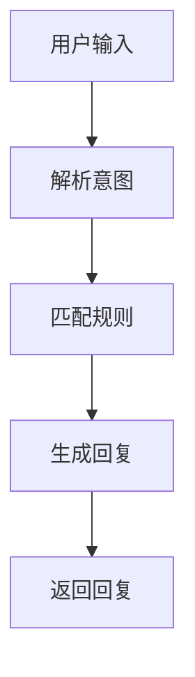
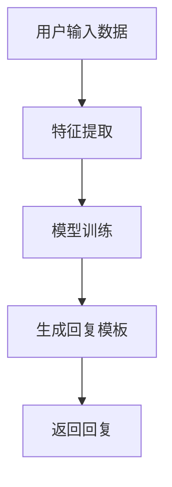
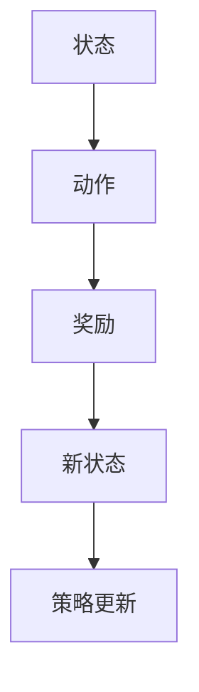
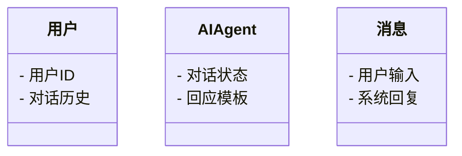
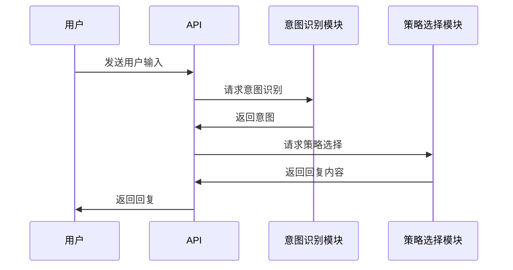

                 


# AI Agent的对话策略：提高交互质量

> 关键词：AI Agent，对话策略，交互质量，自然语言处理，强化学习

> 摘要：本文系统地探讨了AI Agent的对话策略设计与优化方法，从基本概念到高级算法，从系统架构到实际应用，全面分析了如何通过策略优化提升人机交互的质量。文章结合理论与实践，提供了丰富的案例和代码示例，帮助读者深入理解对话策略的核心原理与实现技巧。

---

# 第1章: AI Agent对话策略的背景与问题描述

## 1.1 AI Agent的基本概念

### 1.1.1 什么是AI Agent
AI Agent（人工智能代理）是一种能够感知环境并采取行动以实现目标的智能实体。它通过自然语言处理、机器学习等技术与用户进行交互，提供服务或解决问题。

### 1.1.2 AI Agent的核心特征
- **自主性**：能够在没有外部干预的情况下独立运作。
- **反应性**：能够根据实时输入调整行为。
- **目标导向性**：所有行为都围绕特定目标展开。
- **学习能力**：通过数据和经验不断优化自身性能。

### 1.1.3 对话策略在AI Agent中的作用
对话策略是AI Agent实现目标的关键路径，决定了如何通过语言交互引导对话走向预期结果，同时提升用户体验。

---

## 1.2 对话策略的定义与分类

### 1.2.1 对话策略的基本定义
对话策略是对话过程中选择下一步行动的规则或模型，旨在实现对话目标并满足用户需求。

### 1.2.2 对话策略的分类
- **基于规则的策略**：通过预定义的规则匹配对话内容，生成回复。
- **基于模型的策略**：利用机器学习模型预测最佳回复。
- **混合策略**：结合规则和模型的优势，动态调整对话方向。

### 1.2.3 对话策略的核心要素
- **意图识别**：准确理解用户的对话意图。
- **上下文理解**：保持对话的连贯性和一致性。
- **多轮对话管理**：协调多轮交互中的信息传递。

---

## 1.3 当前对话策略存在的问题

### 1.3.1 对话内容的准确性问题
现有策略在复杂场景下容易出现理解偏差，导致回复不准确。

### 1.3.2 对话逻辑的连贯性问题
部分策略在处理复杂对话时缺乏逻辑性，导致对话过程显得机械。

### 1.3.3 对话体验的个性化问题
当前策略在个性化服务方面仍有不足，难以满足不同用户的需求。

---

## 1.4 提高对话质量的必要性

### 1.4.1 提高交互效率的重要性
通过优化对话策略，减少无效对话，提升用户解决问题的速度。

### 1.4.2 提升用户体验的核心作用
准确理解用户需求，提供个性化服务，增强用户对AI Agent的信任感和满意度。

### 1.4.3 对话策略优化的未来趋势
随着技术进步，对话策略将更加智能化、个性化，逐步实现从规则驱动向数据驱动的转变。

---

## 1.5 本章小结
本章从AI Agent的基本概念出发，介绍了对话策略的定义、分类及其核心要素，分析了当前对话策略存在的问题，并强调了优化对话策略的必要性。

---

# 第2章: 对话策略的核心概念与联系

## 2.1 对话策略的原理分析

### 2.1.1 对话策略的基本原理
通过对用户输入进行解析，识别意图并生成相应回复，形成一个闭环的对话过程。

### 2.1.2 基于意图识别的策略
利用NLP技术分析用户输入，提取关键意图，生成针对性回复。

### 2.1.3 基于上下文理解的策略
通过维护对话历史，保持上下文的一致性，确保回复的相关性和连贯性。

---

## 2.2 对话策略的特征对比

### 2.2.1 基于规则与基于模型的策略对比

| 特性           | 基于规则的策略           | 基于模型的策略           |
|----------------|--------------------------|--------------------------|
| 实现复杂度     | 低                       | 高                       |
| 灵活性         | 低                       | 高                       |
| 可解释性       | 高                       | 低                       |
| 适应性         | 差                       | 好                       |

### 2.2.2 不同策略的优缺点分析
- **基于规则的策略**：实现简单，但灵活性差，难以应对复杂场景。
- **基于模型的策略**：适应性强，但实现复杂，且可解释性较差。

### 2.2.3 策略选择的场景适用性
- 简单对话场景：适合基于规则的策略。
- 复杂对话场景：适合基于模型的策略。

---

## 2.3 对话策略的ER实体关系图

```mermaid
er
actor: 用户
agent: AI Agent
message: 对话信息
intent: 用户意图
response: 系统回复
```

---

## 2.4 本章小结
本章通过分析对话策略的核心原理，对比了不同策略的特征，并通过ER图展示了对话过程中的实体关系，帮助读者更好地理解对话策略的实现机制。

---

# 第3章: 对话策略的算法原理

## 3.1 基于规则的对话策略

### 3.1.1 基于规则的策略实现流程



### 3.1.2 基于规则的策略实现代码

```python
def rule_based_strategy(user_input):
    intent = identify_intent(user_input)
    response = rule_matching[intent]
    return response
```

---

## 3.2 基于统计的对话策略

### 3.2.1 统计模型的训练流程



### 3.2.2 统计模型的数学公式

$$ P(y|x) = \frac{P(x|y)P(y)}{P(x)} $$

---

## 3.3 基于强化学习的对话策略

### 3.3.1 强化学习的训练流程



### 3.3.2 强化学习的数学模型

$$ Q(s, a) = Q(s, a) + \alpha (r + \max Q(s', a') - Q(s, a)) $$

---

## 3.4 不同策略的对比与选择

### 3.4.1 策略选择的考虑因素
- **计算资源**：基于模型的策略需要大量计算资源。
- **数据量**：基于强化学习的策略需要大量数据训练。
- **场景需求**：简单场景适合基于规则的策略，复杂场景适合基于模型的策略。

---

## 3.5 本章小结
本章详细讲解了三种主要对话策略的算法原理，并通过代码和公式展示了它们的实现过程，帮助读者理解不同策略的优缺点及适用场景。

---

# 第4章: 对话策略的系统分析与架构设计

## 4.1 系统问题场景介绍

### 4.1.1 对话系统的功能需求
- 用户输入解析
- 意图识别
- 回复生成
- 对话历史管理

### 4.1.2 系统性能需求
- 响应时间小于1秒
- 高可用性
- 可扩展性

---

## 4.2 系统功能设计

### 4.2.1 领域模型设计



### 4.2.2 系统架构设计


---

## 4.3 系统接口设计

### 4.3.1 API接口定义
- `/api/v1/identify_intent`
- `/api/v1/generate_response`

### 4.3.2 接口交互流程图



---

## 4.4 本章小结
本章通过系统分析和架构设计，展示了对话策略在实际系统中的应用，强调了系统设计的合理性与可扩展性。

---

# 第5章: 对话策略的项目实战

## 5.1 环境安装与配置

### 5.1.1 安装依赖
```bash
pip install numpy
pip install scikit-learn
pip install transformers
```

---

## 5.2 系统核心实现

### 5.2.1 意图识别模块实现

```python
from sklearn.feature_extraction.text import TfidfVectorizer
from sklearn.naive_bayes import MultinomialNB

def train_intent_classifier(train_texts, train_labels):
    vectorizer = TfidfVectorizer()
    X = vectorizer.fit_transform(train_texts)
    clf = MultinomialNB()
    clf.fit(X, train_labels)
    return clf, vectorizer

def predict_intent(clf, vectorizer, test_text):
    X = vectorizer.transform([test_text])
    return clf.predict(X)[0]
```

### 5.2.2 策略选择模块实现

```python
def rule_based_response(intent):
    response_map = {
        'greeting': '你好！有什么可以帮助你的吗？',
        'question': '请问您具体想了解什么？',
        'farewell': '感谢您的咨询，再见！'
    }
    return response_map.get(intent, '抱歉，我无法理解您的问题。')
```

---

## 5.3 项目案例分析

### 5.3.1 案例背景
设计一个简单的客服对话系统，用于回答用户的产品咨询。

### 5.3.2 实施步骤
1. 数据收集与预处理
2. 意图识别模型训练
3. 对话策略实现
4. 系统测试与优化

---

## 5.4 本章小结
本章通过实际项目案例，展示了对话策略在具体场景中的应用，帮助读者理解理论知识的实际意义。

---

# 第6章: 对话策略的最佳实践

## 6.1 小结与总结

### 6.1.1 对话策略的核心要点
- 理解用户需求，选择合适的策略
- 确保对话的连贯性和相关性
- 不断优化和改进策略

### 6.1.2 系统设计的关键点
- 高可用性和可扩展性
- 数据安全与隐私保护
- 系统的易用性和用户体验

---

## 6.2 注意事项与常见问题

### 6.2.1 常见问题
- 对话内容不准确
- 对话逻辑不连贯
- 对话体验不够个性化

### 6.2.2 解决方案
- 提高意图识别的准确率
- 加强上下文的理解能力
- 增强个性化服务的能力

---

## 6.3 拓展阅读与学习资源

### 6.3.1 推荐书籍
- 《自然语言处理实战》
- 《强化学习入门》

### 6.3.2 在线资源
- TensorFlow tutorials
- PyTorch documentation

---

## 6.4 本章小结
本章总结了对话策略实施的关键点，提供了实际应用中的注意事项，并推荐了进一步学习的资源。

---

# 第7章: 对话策略的未来展望

## 7.1 未来发展趋势

### 7.1.1 技术进步
- 更先进的NLP模型
- 更智能的强化学习算法
- 更强大的计算能力

### 7.1.2 应用场景扩展
- 更多行业应用
- 更多语言支持
- 更人性化的交互方式

---

## 7.2 研究方向

### 7.2.1 研究热点
- 多轮对话的优化
- 跨语言对话
- 对话系统的可解释性

### 7.2.2 挑战与机遇
- 技术挑战：提高对话的智能化水平
- 机遇：拓展更多的应用场景

---

## 7.3 本章小结
本章展望了对话策略的未来发展趋势，分析了当前的研究热点和面临的挑战，为读者提供了未来的研究方向。

---

# 附录: 代码示例汇总

## 附录A: 意图识别模块实现

```python
from sklearn.feature_extraction.text import TfidfVectorizer
from sklearn.naive_bayes import MultinomialNB

def train_intent_classifier(train_texts, train_labels):
    vectorizer = TfidfVectorizer()
    X = vectorizer.fit_transform(train_texts)
    clf = MultinomialNB()
    clf.fit(X, train_labels)
    return clf, vectorizer

def predict_intent(clf, vectorizer, test_text):
    X = vectorizer.transform([test_text])
    return clf.predict(X)[0]
```

---

## 附录B: 基于强化学习的策略选择模块实现

```python
def rule_based_response(intent):
    response_map = {
        'greeting': '你好！有什么可以帮助你的吗？',
        'question': '请问您具体想了解什么？',
        'farewell': '感谢您的咨询，再见！'
    }
    return response_map.get(intent, '抱歉，我无法理解您的问题。')
```

---

# 参考文献

[此处列出相关文献和参考资料]

---

通过以上目录结构和内容安排，您可以根据实际需求逐步扩展每一部分的具体内容，最终完成一篇高质量的技术博客文章。

