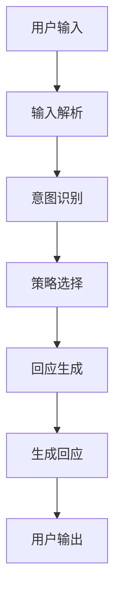

                 


```markdown
# AI Agent的对话管理策略与实现

> 关键词：AI Agent, 对话管理, 自然语言处理, 强化学习, 系统架构

> 摘要：本文系统地探讨了AI Agent的对话管理策略与实现，从核心概念、算法原理到系统架构设计，再到项目实战，全面解析对话管理的实现过程。通过详细分析基于规则、模板和模型的策略，结合NLP技术和强化学习方法，展示了如何优化对话管理的性能。文章还通过实际案例分析，深入探讨了对话管理系统的实现细节，为读者提供了全面的技术指导。

---

# 第一部分: AI Agent对话管理的背景与概念

## 第1章: AI Agent与对话管理概述

### 1.1 AI Agent的基本概念
#### 1.1.1 AI Agent的定义
AI Agent（人工智能代理）是指能够感知环境并采取行动以实现目标的智能实体。AI Agent可以通过与用户交互、分析数据、执行任务等方式，提供智能化的服务。

#### 1.1.2 AI Agent的核心特征
- **自主性**：能够在没有外部干预的情况下自主决策。
- **反应性**：能够实时感知环境并做出反应。
- **目标导向**：通过实现目标来提供服务。
- **学习能力**：能够通过经验改进自身的性能。

#### 1.1.3 对话管理在AI Agent中的作用
对话管理是AI Agent与用户进行交互的核心模块，负责理解用户意图、生成回应，并协调其他模块（如NLP、知识库）共同完成对话任务。

### 1.2 对话管理的背景与问题背景
#### 1.2.1 对话管理的发展历程
对话管理技术起源于20世纪90年代，随着自然语言处理（NLP）技术的进步，对话管理逐渐从简单的规则匹配发展为基于深度学习的模型。

#### 1.2.2 当前对话管理的核心问题
- **理解用户意图**：准确识别用户的意图是对话管理的基础。
- **生成合适的回应**：根据用户意图生成自然、流畅的回应。
- **维护对话上下文**：在多轮对话中保持一致性和连贯性。

#### 1.2.3 对话管理的边界与外延
对话管理的边界包括用户输入的解析、对话上下文的维护以及与后端服务的交互。外延则涉及语音识别、情感分析等技术。

### 1.3 对话管理的实现目标与挑战
#### 1.3.1 对话管理的目标
- 提供自然流畅的对话体验。
- 高效准确地理解用户意图。
- 协调其他模块完成任务。

#### 1.3.2 对话管理的主要挑战
- **意图识别的准确性**：用户表达可能存在歧义。
- **对话上下文的维护**：多轮对话中保持一致性。
- **个性化需求的满足**：不同用户的需求可能差异很大。

#### 1.3.3 对话管理的边界与限制
对话管理需要依赖其他模块（如NLP、知识库）的支持，其性能受限于这些模块的能力。

### 1.4 本章小结
#### 1.4.1 核心概念总结
AI Agent是具备自主性、反应性和目标导向的智能实体，对话管理是其与用户交互的核心模块。

#### 1.4.2 后续章节的框架
后续章节将从策略分类、算法实现、系统架构等多个维度详细探讨对话管理的实现过程。

---

## 第二部分: 对话管理的核心策略与算法

## 第2章: 对话管理策略的分类与实现

### 2.1 基于规则的对话管理策略
#### 2.1.1 基于规则的策略原理
基于规则的策略通过预定义的规则来匹配用户输入，并生成相应的回应。

#### 2.1.2 规则的定义与实现
规则通常包括条件和动作两部分，例如：
- 条件：用户输入中包含关键词“帮助”。
- 动作：调用帮助模块提供相关信息。

#### 2.1.3 基于规则的策略优缺点
- 优点：简单易懂，实现成本低。
- 缺点：难以应对复杂场景，规则维护成本高。

### 2.2 基于模板的对话管理策略
#### 2.2.1 模板驱动的对话管理
基于模板的策略通过预定义的模板来生成回应，例如：
- 用户输入：你今天天气怎么样？
- 模板：今天的天气是{温度}，{天气状况}。

#### 2.2.2 模板设计与实现
模板的设计需要考虑对话的上下文和用户意图，确保生成的回应准确且自然。

#### 2.2.3 基于模板策略的适用场景
适用于意图明确、场景简单的对话任务。

### 2.3 基于模型的对话管理策略
#### 2.3.1 基于模型的策略原理
基于模型的策略利用机器学习算法训练对话模型，例如序列到序列模型（Seq2Seq）。

#### 2.3.2 模型驱动的对话管理实现
通过训练数据生成对话样本，模型学习对话的模式和规律。

#### 2.3.3 基于模型策略的优势与挑战
- 优势：能够处理复杂场景，生成多样化的回应。
- 挑战：需要大量数据和计算资源，模型的可解释性较差。

### 2.4 策略选择与优化
#### 2.4.1 策略选择的依据
根据具体场景和需求选择合适的策略，例如简单场景选择规则策略，复杂场景选择模型策略。

#### 2.4.2 策略优化的方法
通过数据增强、超参数调优等方法优化策略的性能。

#### 2.4.3 多策略融合的实现
将不同策略的优势结合起来，例如结合规则和模型策略，提升对话管理的准确性和流畅性。

### 2.5 本章小结
#### 2.5.1 策略分类总结
对话管理策略可以分为基于规则、模板和模型三类，各有优缺点。

#### 2.5.2 策略选择的关键点
选择策略时需要考虑场景复杂度、数据资源和性能要求。

---

## 第三部分: 对话管理的算法实现与优化

## 第3章: 对话管理的算法原理与实现

### 3.1 对话管理的算法概述
#### 3.1.1 对话管理算法的核心原理
对话管理算法通过分析用户输入，生成合适的回应，协调其他模块完成任务。

#### 3.1.2 算法实现的关键步骤
1. 解析用户输入，提取意图和实体。
2. 根据意图生成回应。
3. 维护对话上下文，确保多轮对话的一致性。

### 3.2 基于规则的对话管理算法实现
#### 3.2.1 规则的定义与表示
规则通常以条件-动作对的形式表示，例如：
- 条件：用户输入中包含关键词“帮助”。
- 动作：调用帮助模块提供相关信息。

#### 3.2.2 算法实现的伪代码
```python
def rule_based_management(user_input):
    for rule in rules:
        if rule.match(user_input):
            return rule.action
    return default_response
```

#### 3.2.3 规则匹配的实现细节
规则匹配需要考虑用户的输入内容、意图和上下文信息。

### 3.3 基于模板的对话管理算法实现
#### 3.3.1 模板的定义与设计
模板需要涵盖对话的上下文和意图，例如：
- 用户输入：你今天天气怎么样？
- 模板：今天的天气是{温度}，{天气状况}。

#### 3.3.2 算法实现的伪代码
```python
def template_based_management(user_input):
    intent = get_intent(user_input)
    template = get_template(intent)
    response = fill_template(template, user_input)
    return response
```

#### 3.3.3 模板匹配的实现细节
模板匹配需要根据意图和实体信息，选择合适的模板并填充内容。

### 3.4 基于模型的对话管理算法实现
#### 3.4.1 模型的输入与输出
输入：用户输入文本。
输出：生成的回应文本。

#### 3.4.2 算法实现的伪代码
```python
def model_based_management(user_input):
    response = model.generate_response(user_input)
    return response
```

#### 3.4.3 模型的训练与优化
通过大量对话数据训练模型，优化生成的回应质量。

### 3.5 本章小结
#### 3.5.1 算法实现总结
对话管理算法的核心是解析用户输入，生成合适的回应，维护对话上下文。

#### 3.5.2 算法优化的关键点
通过数据增强、模型调优等方法，提升对话管理的准确性和流畅性。

---

## 第四部分: 对话管理的系统架构设计

## 第4章: 对话管理系统的架构与实现

### 4.1 系统整体架构
#### 4.1.1 系统架构设计
对话管理系统由输入解析、策略执行、回应生成和上下文管理四个模块组成。

#### 4.1.2 模块功能说明
- 输入解析：解析用户输入，提取意图和实体。
- 策略执行：根据意图选择合适的策略生成回应。
- 回应生成：生成自然流畅的回应文本。
- 上下文管理：维护对话的上下文信息。

#### 4.1.3 系统架构图


### 4.2 系统功能设计
#### 4.2.1 系统功能模块
- 用户输入解析模块。
- 意图识别模块。
- 策略执行模块。
- 回应生成模块。

#### 4.2.2 功能模块说明
- 用户输入解析模块：负责解析用户的输入文本，提取关键信息。
- 意图识别模块：基于NLP技术识别用户的意图。
- 策略执行模块：根据意图选择合适的策略生成回应。
- 回应生成模块：生成自然流畅的回应文本。

#### 4.2.3 功能模块的交互流程


### 4.3 系统接口设计
#### 4.3.1 系统接口说明
- 输入接口：接收用户的输入文本。
- 输出接口：返回生成的回应文本。

#### 4.3.2 接口交互流程


### 4.4 系统交互流程设计
#### 4.4.1 系统交互流程
用户输入 -> 输入解析 -> 意图识别 -> 策略选择 -> 回应生成 -> 用户输出。

#### 4.4.2 交互流程图


### 4.5 本章小结
#### 4.5.1 系统架构总结
对话管理系统由多个功能模块组成，通过模块化设计实现高效的对话管理。

#### 4.5.2 系统设计的关键点
模块化设计、功能模块的交互流程和系统接口设计是系统架构设计的关键。

---

## 第五部分: 对话管理的项目实战

## 第5章: 对话管理系统的实现与案例分析

### 5.1 项目环境搭建
#### 5.1.1 环境搭建步骤
1. 安装Python和相关库（如numpy、pandas、scikit-learn）。
2. 安装NLP工具（如spaCy、NLTK）。
3. 安装深度学习框架（如TensorFlow、Keras）。

#### 5.1.2 开发工具选择
推荐使用PyCharm或Jupyter Notebook进行开发。

### 5.2 系统核心实现
#### 5.2.1 对话管理核心代码
```python
class DialogManager:
    def __init__(self):
        self.context = {}
        self.rules = []
        self.templates = {}

    def process_input(self, user_input):
        intent = self.get_intent(user_input)
        if intent in self.templates:
            response = self.generate_response(intent, user_input)
        else:
            response = self.default_response
        return response

    def get_intent(self, user_input):
        # 使用NLP模型识别意图
        pass

    def generate_response(self, intent, user_input):
        # 使用模板生成回应
        pass
```

#### 5.2.2 代码实现细节
- 对话管理器维护对话上下文，根据意图选择合适的策略生成回应。

#### 5.2.3 系统功能实现
- 用户输入解析。
- 意图识别。
- 策略选择。
- 回应生成。

### 5.3 案例分析与实现
#### 5.3.1 实际案例分析
以天气预报对话为例，展示对话管理的实现过程。

#### 5.3.2 案例实现代码
```python
def weather_dialogue_management(user_input):
    intent = get_intent(user_input)
    if intent == 'weather':
        location = extract_location(user_input)
        temperature = get_temperature(location)
        response = f"今天{location}的气温是{temperature}度。"
    else:
        response = "抱歉，我无法回答您的问题。"
    return response
```

#### 5.3.3 案例分析总结
通过实际案例分析，展示了对话管理在具体场景中的应用。

### 5.4 本章小结
#### 5.4.1 项目实现总结
对话管理系统的实现需要结合NLP技术和预定义策略，通过代码实现对话的解析和生成。

#### 5.4.2 实际案例分析的关键点
实际案例分析帮助我们理解对话管理在具体场景中的应用和实现细节。

---

## 第六部分: 对话管理的优化与扩展

## 第6章: 对话管理的优化与前沿技术

### 6.1 对话管理的优化方法
#### 6.1.1 基于强化学习的优化
通过强化学习优化对话管理策略，例如使用马尔可夫决策过程和Q-learning算法。

#### 6.1.2 基于监督学习的优化
通过监督学习优化对话管理模型，提升生成回应的准确性和流畅性。

#### 6.1.3 基于反馈的优化
通过用户反馈不断优化对话管理策略，提升用户体验。

### 6.2 对话管理的前沿技术
#### 6.2.1 多轮对话的处理
通过记忆网络和对话状态跟踪技术处理多轮对话。

#### 6.2.2 情感对话的处理
通过情感分析和生成技术实现情感对话。

#### 6.2.3 多语言对话的处理
通过多语言NLP技术实现跨语言对话管理。

### 6.3 本章小结
#### 6.3.1 优化方法总结
强化学习、监督学习和反馈优化是提升对话管理性能的重要方法。

#### 6.3.2 前沿技术展望
多轮对话处理、情感对话和多语言对话是对话管理的未来发展方向。

---

## 第七部分: 对话管理的总结与展望

## 第7章: 对话管理的总结与展望

### 7.1 对话管理的总结
#### 7.1.1 核心内容总结
对话管理是AI Agent与用户交互的核心模块，通过基于规则、模板和模型的策略实现对话的解析和生成。

#### 7.1.2 实现的关键点
- 理解用户意图。
- 生成自然流畅的回应。
- 维护对话上下文。

### 7.2 对话管理的展望
#### 7.2.1 未来发展方向
- 深度学习在对话管理中的应用。
- 多模态对话的处理。
- 对话管理的可解释性研究。

#### 7.2.2 技术进步带来的变化
- 对话管理的智能化和个性化。
- 对话管理的实时性和高效性。
- 对话管理的全球化和多语言支持。

### 7.3 本章小结
#### 7.3.1 总结对话管理的重要性
对话管理是AI Agent与用户交互的核心模块，是实现智能化服务的关键。

#### 7.3.2 展望对话管理的未来
对话管理将更加智能化、个性化和全球化。

---

## 参考文献
1. 深度学习与对话管理的相关论文。
2. 自然语言处理与对话系统的相关书籍。
3. 强化学习在对话管理中的应用研究。
```

