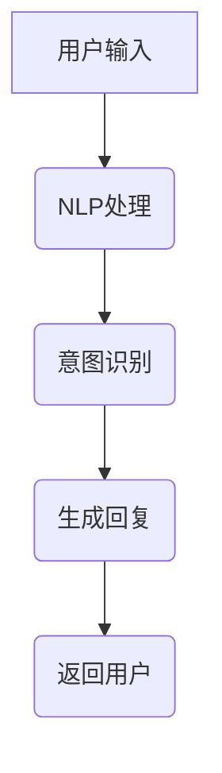
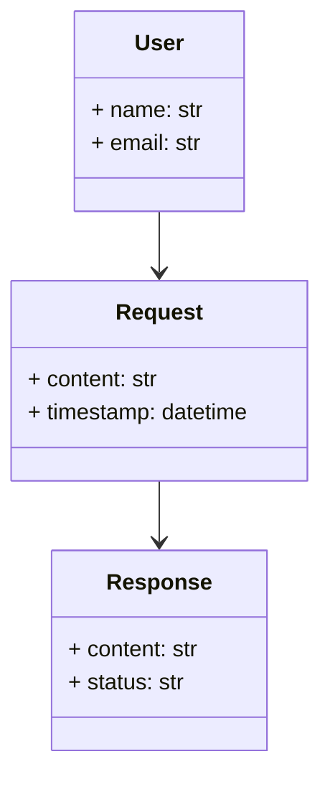
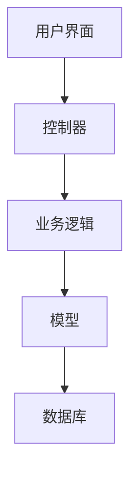
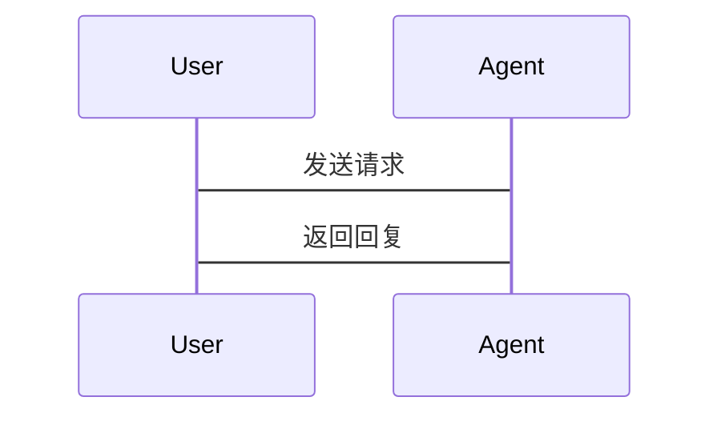

                 


# AI Agent的对话系统在客户支持中的优化

## 关键词：AI Agent，对话系统，客户支持，优化，自然语言处理，算法原理

## 摘要：本文探讨AI Agent在对话系统中的优化，分析其在客户支持中的应用，涵盖背景、核心概念、算法原理、系统设计、项目实战及最佳实践，旨在提升对话系统的效率和用户体验。

---

## 第一部分：背景介绍

### 第1章：AI Agent与对话系统概述

#### 1.1 问题背景
- **客户支持中的痛点**：传统客户支持依赖人工，效率低，成本高，难以满足客户需求。
- **对话系统的作用**：通过自动化对话，提升效率和客户满意度。

#### 1.2 问题描述
- 客户支持中的信息传递不准确，响应时间长，客户体验差。
- 对话系统可以快速响应，提供准确信息，但现有系统存在优化空间。

#### 1.3 解决方法
- 引入AI Agent优化对话系统，提升客户支持效率和质量。

#### 1.4 边界与外延
- **边界**：AI Agent仅处理客户支持对话，不涉及其他业务。
- **外延**：可扩展至销售、市场等领域，但本文仅讨论客户支持。

#### 1.5 核心概念组成
- AI Agent：智能代理，处理客户请求。
- 对话系统：基于NLP的系统，实现自然语言交互。

---

## 第二部分：核心概念

### 第2章：AI Agent与对话系统原理

#### 2.1 核心概念原理
- AI Agent：感知环境，执行任务，具备自主决策能力。
- 对话系统：利用NLP技术，解析用户需求，生成回应。

#### 2.2 属性特征对比
| 属性       | AI Agent                          | 对话系统                          |
|------------|------------------------------------|------------------------------------|
| 功能       | 执行任务，提供解决方案             | 实现对话交互                      |
| 输入输出   | 文本/语音请求，处理后返回结果     | 用户输入，系统生成回复          |
| 学习能力   | 可通过反馈优化                   | 可通过数据训练提升准确性        |

#### 2.3 ER实体关系图
```mermaid
er
  actor(AI Agent)
  actor(对话系统)
  relation：AI Agent驱动对话系统进行交互
```

---

## 第三部分：算法原理

### 第3章：对话系统算法实现

#### 3.1 算法流程


#### 3.2 Python代码实现
```python
import numpy as np
from sklearn.metrics import accuracy_score

def preprocess(text):
    # 文本预处理，如分词、去停用词
    pass

def train_model(X, y):
    # 训练模型，如使用机器学习算法
    model = ... # 初始化模型
    model.fit(X, y)
    return model

def evaluate_model(model, X_test, y_test):
    y_pred = model.predict(X_test)
    print("准确率:", accuracy_score(y_test, y_pred))

# 示例数据
X_train, y_train = ..., ...
model = train_model(X_train, y_train)
evaluate_model(model, X_test, y_test)
```

#### 3.3 数学模型
- **概率计算**：使用贝叶斯定理计算条件概率。
  $$P(y|x) = \frac{P(x|y)P(y)}{P(x)}$$
- **损失函数**：交叉熵损失用于分类任务。
  $$\text{Loss} = -\sum y\log p(y|x)$$

---

## 第四部分：系统分析与架构设计

### 第4章：系统架构设计

#### 4.1 项目介绍
- 项目目标：优化AI Agent在客户支持中的对话系统。
- 项目范围：聚焦于对话交互，不涉及其他业务模块。

#### 4.2 功能设计
- 领域模型类图：


#### 4.3 系统架构
- 架构图：


#### 4.4 接口设计
- API接口：RESTful API，支持POST请求，接收用户输入，返回JSON格式回复。

#### 4.5 交互流程
- 序列图：


---

## 第五部分：项目实战

### 第5章：系统实现

#### 5.1 环境安装
```bash
pip install numpy scikit-learn
```

#### 5.2 核心代码
```python
def handle_request(request_text):
    # 预处理
    processed_text = preprocess(request_text)
    # 分析
    intent = identify_intent(processed_text)
    # 生成回复
    response = generate_response(intent)
    return response
```

#### 5.3 实际案例
- 案例分析：用户询问产品信息，AI Agent识别意图，生成详细回复。

#### 5.4 项目小结
- 通过项目实战，验证了AI Agent优化对话系统的可行性。

---

## 第六部分：最佳实践

### 第6章：经验总结

#### 6.1 小结
- AI Agent优化对话系统，显著提升客户支持效率和满意度。

#### 6.2 注意事项
- 数据质量：确保训练数据多样化、高质量。
- 模型选择：根据需求选择合适的NLP模型。

#### 6.3 未来趋势
- 多轮对话优化，情感计算应用，提升用户体验。

#### 6.4 拓展阅读
- 建议阅读《深度学习入门》和《自然语言处理实战》。

---

通过以上结构，文章详细探讨了AI Agent在对话系统中的优化，从背景到实现，再到实战，为读者提供了全面的技术指导。

