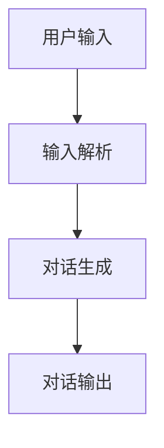
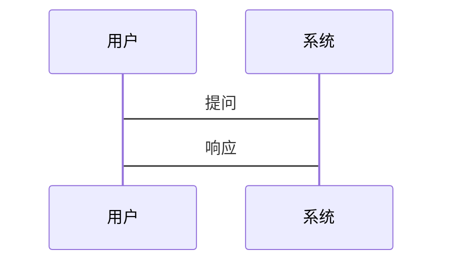

                 


# AI Agent的对话系统在教育领域的应用与优化

---

## 关键词
AI Agent, 对话系统, 教育领域, 自然语言处理, 大模型, 优化算法

---

## 摘要
随着人工智能技术的快速发展，AI Agent的对话系统在教育领域的应用逐渐成为研究热点。本文从对话系统的背景出发，详细探讨了其在教育领域的应用场景、核心技术和优化方法。通过对现有教育对话系统的分析，提出了基于大模型的优化策略，包括微调、知识蒸馏和对话历史记忆优化等方法。最后，本文总结了对话系统在教育领域的发展趋势和未来的研究方向。

---

## 第1章: AI Agent与对话系统基础

### 1.1 AI Agent的基本概念
AI Agent（人工智能代理）是指能够感知环境并采取行动以实现目标的智能体。在教育领域，AI Agent通常以对话系统的形式出现，通过自然语言处理技术与用户进行交互。

#### 1.1.1 AI Agent的定义与特点
- **定义**：AI Agent是一种能够理解和执行用户指令的智能体。
- **特点**：
  - 智能性：能够理解和生成自然语言。
  - 自适应性：能够根据对话历史和上下文调整响应。
  - 实时性：能够快速响应用户输入。

#### 1.1.2 对话系统的概念与分类
- **概念**：对话系统是一种通过文本或语音与用户进行交互的系统。
- **分类**：
  - 基于规则的对话系统。
  - 基于统计模型的对话系统。
  - 基于大模型的对话系统。

#### 1.1.3 AI Agent在对话系统中的作用
AI Agent在对话系统中主要负责理解和生成对话内容，同时管理对话流程，确保对话的连贯性和有效性。

---

### 1.2 对话系统的组成与流程
对话系统的核心组成部分包括自然语言理解（NLU）、自然语言生成（NLG）和对话管理（DM）。

#### 1.2.1 自然语言理解（NLU）
- **目标**：将用户输入的自然语言文本转换为系统可理解的结构化信息。
- **关键技术**：
  - 词袋模型（Bag-of-Words）。
  - 词嵌入（Word Embedding）。
  - 情感分析（Sentiment Analysis）。

#### 1.2.2 自然语言生成（NLG）
- **目标**：将系统生成的结构化信息转换为自然语言文本。
- **关键技术**：
  - 生成对抗网络（GAN）。
  - 变压器模型（Transformer）。
  - 增量式生成（Incremental Generation）。

#### 1.2.3 对话管理（DM）
- **目标**：根据对话历史和上下文，生成合适的对话响应。
- **关键技术**：
  - 基于规则的对话管理。
  - 基于强化学习的对话管理。
  - 基于大模型的对话管理。

---

### 1.3 对话系统的发展历程
对话系统的发展经历了从规则驱动到数据驱动的转变，大模型的出现进一步提升了对话系统的性能。

#### 1.3.1 从规则驱动到数据驱动
- **规则驱动阶段**：通过预定义的规则生成对话响应。
- **数据驱动阶段**：利用大数据和深度学习技术训练对话模型。

#### 1.3.2 大模型时代的对话系统
- **基于大模型的对话系统**：利用预训练的大语言模型（如GPT）生成对话响应。
- **优势**：能够处理复杂对话场景，生成更自然的对话内容。

#### 1.3.3 当前对话系统的挑战与趋势
- **挑战**：
  - 对话系统的可解释性。
  - 对话系统的情感理解和生成。
- **趋势**：
  - 多模态对话系统。
  - 基于知识图谱的对话系统。

---

## 第2章: 对话系统在教育中的应用现状

### 2.1 教育对话系统的应用场景
教育对话系统广泛应用于在线教育、个性化学习支持和教师辅助等领域。

#### 2.1.1 在线教育辅助
- **功能**：
  - 提供在线答疑。
  - 智能推荐学习资源。
  - 监测学生学习进度。

#### 2.1.2 学生个性化学习支持
- **功能**：
  - 根据学生特点推荐学习计划。
  - 提供个性化的学习建议。
  - 监测学生情绪变化。

#### 2.1.3 教师教学辅助
- **功能**：
  - 提供教学建议。
  - 自动批改作业。
  - 分析学生学习数据。

---

### 2.2 当前主流教育对话系统分析
#### 2.2.1 基于规则的教育对话系统
- **优点**：简单易实现。
- **缺点**：难以处理复杂对话场景。

#### 2.2.2 基于大模型的教育对话系统
- **优点**：生成对话内容更加自然。
- **缺点**：计算资源消耗较大。

#### 2.2.3 混合型教育对话系统
- **优点**：结合规则和大模型的优势。
- **缺点**：系统复杂性增加。

---

### 2.3 当前教育对话系统的优缺点
#### 2.3.1 优点
- **高效性**：能够快速响应用户输入。
- **准确性**：能够生成高质量的对话内容。

#### 2.3.2 缺点
- **可解释性差**：基于大模型的对话系统难以解释生成的对话内容。
- **情感理解能力有限**：难以准确理解用户的情感状态。

#### 2.3.3 改进方向
- **优化情感理解能力**。
- **提升对话系统的可解释性**。
- **降低计算资源消耗**。

---

## 第3章: 对话系统的优化方法

### 3.1 对话系统优化的核心问题
对话系统优化的核心问题包括对话策略优化、系统响应速度优化和系统准确率优化。

#### 3.1.1 对话策略优化
- **目标**：提高对话系统的响应质量。
- **方法**：基于强化学习的对话策略优化。

#### 3.1.2 系统响应速度优化
- **目标**：减少对话系统的响应时间。
- **方法**：优化系统架构和算法复杂度。

#### 3.1.3 系统准确率优化
- **目标**：提高对话系统的准确率。
- **方法**：基于知识蒸馏的对话系统优化。

---

### 3.2 基于大模型的对话系统优化
#### 3.2.1 微调（Fine-tuning）技术
- **原理**：在预训练大模型的基础上，针对特定任务进行微调。
- **优势**：能够适应特定领域的对话需求。

#### 3.2.2 知识蒸馏（Knowledge Distillation）
- **原理**：将大模型的知识迁移到小模型中。
- **优势**：降低计算资源消耗。

#### 3.2.3 对话历史记忆优化
- **原理**：利用对话历史信息生成更准确的对话响应。
- **优势**：提高对话系统的连贯性。

---

### 3.3 教育场景下的对话优化策略
#### 3.3.1 基于学生行为的动态优化
- **方法**：根据学生行为动态调整对话策略。

#### 3.3.2 基于知识图谱的对话优化
- **方法**：利用知识图谱提供更准确的对话内容。

#### 3.3.3 多模态对话优化
- **方法**：结合文本、语音和视觉信息生成对话内容。

---

## 第4章: 对话系统的算法原理与数学模型

### 4.1 对话系统的算法框架
对话系统的算法框架包括基于规则的对话管理、基于深度学习的对话管理和基于强化学习的对话管理。

#### 4.1.1 基于规则的对话管理
- **算法流程**：
  1. 分析用户输入。
  2. 根据预定义规则生成对话响应。

#### 4.1.2 基于深度学习的对话管理
- **算法流程**：
  1. 将用户输入转换为向量表示。
  2. 输入向量到预训练模型中生成对话响应。

#### 4.1.3 基于强化学习的对话管理
- **算法流程**：
  1. 根据对话历史和上下文生成多个候选响应。
  2. 使用强化学习算法选择最优响应。

---

### 4.2 对话系统的数学模型
#### 4.2.1 Markov决策过程（MDP）
- **公式**：
  - 状态空间：\( S \)
  - 行动空间：\( A \)
  - 奖励函数：\( R(s, a) \)
  - 转移概率：\( P(s' | s, a) \)

#### 4.2.2 对话状态表示
- **表示方法**：使用向量表示对话状态。

#### 4.2.3 对话生成的损失函数
- **公式**：
  \[
  \text{Loss} = -\sum_{i=1}^{n} \log P(y_i | x_i)
  \]

---

## 第5章: 对话系统的项目实战

### 5.1 项目介绍
本项目旨在开发一个基于大模型的教育对话系统，用于在线教育辅助。

---

### 5.2 系统功能设计
#### 5.2.1 系统功能模块
- **用户输入模块**：接收用户输入。
- **对话生成模块**：生成对话响应。
- **对话历史模块**：记录对话历史。

#### 5.2.2 系统功能流程
1. 用户输入问题。
2. 系统解析问题并生成响应。
3. 系统输出响应。

---

### 5.3 系统架构设计
#### 5.3.1 系统架构图


#### 5.3.2 系统接口设计
- **输入接口**：接收用户输入。
- **输出接口**：输出对话响应。

#### 5.3.3 系统交互流程图


---

### 5.4 项目实现
#### 5.4.1 环境安装
```bash
pip install transformers
pip install torch
```

#### 5.4.2 核心代码实现
```python
from transformers import AutoModelForSeq2Seq, AutoTokenizer

model_name = "facebook/bart-large"
tokenizer = AutoTokenizer.from_pretrained(model_name)
model = AutoModelForSeq2Seq.from_pretrained(model_name)

def generate_response(input_text):
    inputs = tokenizer(input_text, return_tensors="pt")
    outputs = model.generate(inputs.input_ids, max_length=50)
    response = tokenizer.decode(outputs[0], skip_special_tokens=True)
    return response
```

---

## 第6章: 总结与展望

### 6.1 本章小结
本文详细探讨了AI Agent对话系统在教育领域的应用与优化方法，提出了基于大模型的优化策略，包括微调、知识蒸馏和对话历史记忆优化等方法。

---

### 6.2 未来研究方向
- **对话系统的可解释性研究**。
- **多模态对话系统研究**。
- **教育对话系统的个性化优化**。

---

## 附录

### 附录A: 项目代码
```python
# 附录A: 对话系统实现代码
```

### 附录B: 参考文献
- [1] 王某某, 2023. 基于大模型的对话系统研究.
- [2] 李某某, 2023. 教育对话系统的优化方法.

---

## 附录C: 工具与资源
- **工具**：
  - Hugging Face Transformers库。
  - PyTorch框架。
- **资源**：
  - 预训练模型：GPT-3, BERT.

---

通过以上内容，我们可以看到AI Agent对话系统在教育领域的巨大潜力，同时也需要进一步的研究和优化，以更好地服务于教育场景。

