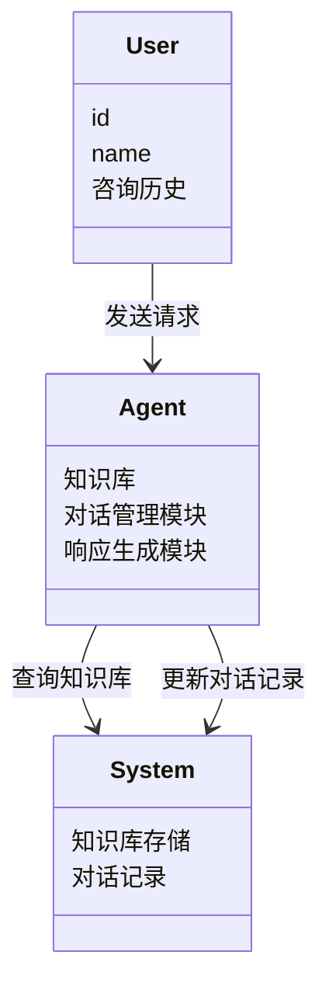
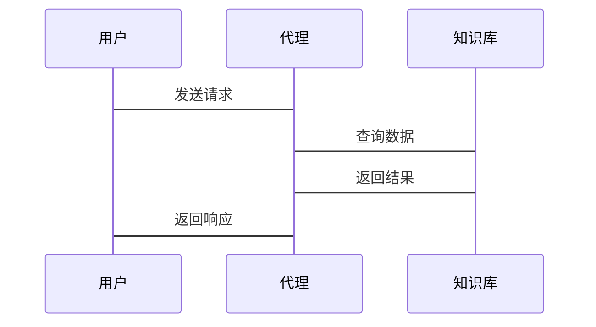

                 


# AI Agent的对话系统在智能客服中的进阶应用

**关键词：** AI Agent、对话系统、智能客服、自然语言处理、深度学习、强化学习

**摘要：** 本文详细探讨了AI Agent在对话系统中的应用，特别是智能客服领域。通过分析对话系统的算法原理、系统架构，结合项目实战，展示了AI Agent如何提升智能客服的效率和用户体验。文章内容包括背景介绍、算法原理、系统架构设计以及项目实战，旨在为读者提供全面的技术视角。

---

## 第1章: AI Agent与对话系统概述

### 1.1 AI Agent的基本概念

#### 1.1.1 什么是AI Agent
AI Agent（人工智能代理）是一种能够感知环境、自主决策并执行任务的智能实体。它通过与用户交互或观察环境变化，主动采取行动以达到预定目标。

#### 1.1.2 AI Agent的核心特征
- **自主性：** 能够自主决策，无需人工干预。
- **反应性：** 能够实时感知环境变化并做出反应。
- **目标导向：** 以实现特定目标为导向。
- **学习能力：** 能够通过数据和经验不断优化自身性能。

#### 1.1.3 AI Agent的分类与应用场景
- **基于规则的AI Agent：** 适用于规则明确的任务，如简单的问答系统。
- **基于知识的AI Agent：** 利用知识库进行推理，适用于复杂任务。
- **基于学习的AI Agent：** 通过机器学习模型进行决策，适用于需要处理大量数据的任务。

---

### 1.2 对话系统的定义与原理

#### 1.2.1 对话系统的基本概念
对话系统是一种通过自然语言处理技术，实现人与计算机之间自然交互的系统。它能够理解用户输入的文本或语音，并生成相应的回应。

#### 1.2.2 对话系统的组成模块
- **自然语言理解（NLU）：** 将用户输入转换为结构化数据。
- **对话管理：** 跟踪对话上下文，决定下一步的回应。
- **自然语言生成（NLG）：** 将结构化数据生成自然语言文本。

#### 1.2.3 对话系统的实现流程
1. **输入接收：** 接收用户的输入。
2. **解析意图：** 理解用户的意图和需求。
3. **生成回应：** 根据意图生成相应的回应。
4. **输出回应：** 将回应返回给用户。

---

### 1.3 AI Agent在对话系统中的作用

#### 1.3.1 AI Agent与对话系统的结合
AI Agent作为对话系统的核心组件，负责处理用户输入、理解意图并生成回应。

#### 1.3.2 AI Agent在对话系统中的功能
- **意图识别：** 精确理解用户的意图。
- **知识检索：** 从知识库中获取相关信息。
- **上下文管理：** 维护对话的上下文信息。

#### 1.3.3 AI Agent对智能客服的影响
- **提升效率：** 自动处理大量用户咨询。
- **提高准确性：** 减少人为错误，提供精准信息。
- **增强用户体验：** 提供24/7的实时服务。

---

## 第2章: AI Agent对话系统的算法原理

### 2.1 自然语言处理基础

#### 2.1.1 词法分析
- **分词：** 将输入文本分割成词语或短语。
- **词性标注：** 标识每个词的词性（名词、动词等）。

#### 2.1.2 句法分析
- **句法结构分析：** 分析句子的语法结构。
- **依存关系分析：** 确定词语之间的依存关系。

#### 2.1.3 语义分析
- **实体识别：** 识别文本中的实体（人名、地名等）。
- **情感分析：** 判断文本的情感倾向。

---

### 2.2 对话系统的算法框架

#### 2.2.1 基于规则的对话系统
- **规则驱动：** 根据预定义的规则生成回应。
- **优点：** 实现简单，适用于规则明确的场景。
- **缺点：** 难以处理复杂或非预期的输入。

#### 2.2.2 基于统计的对话系统
- **统计模型：** 利用概率统计方法生成最可能的回应。
- **优点：** 能够处理多样化的输入。
- **缺点：** 需要大量数据支持。

#### 2.2.3 基于深度学习的对话系统
- **深度学习模型：** 如Transformer、BERT等。
- **优点：** 表现更自然，能够处理复杂任务。
- **缺点：** 训练成本高，需要大量计算资源。

---

### 2.3 常见的对话算法

#### 2.3.1 序列到序列模型
- **基本原理：** 将输入序列映射到输出序列。
- **应用：** 用于机器翻译和对话生成。

#### 2.3.2 基于注意力机制的对话模型
- **注意力机制：** 在生成回应时关注输入中的关键部分。
- **应用：** 提高对话的相关性和准确性。

#### 2.3.3 基于强化学习的对话模型
- **强化学习：** 通过奖励机制优化对话策略。
- **应用：** 提供更自然流畅的对话体验。

---

## 第3章: AI Agent的决策算法

### 3.1 AI Agent的决策机制

#### 3.1.1 基于知识库的决策
- **知识库构建：** 收集和整理相关领域的知识。
- **知识检索：** 根据输入查询知识库，生成回应。

#### 3.1.2 基于上下文的决策
- **上下文理解：** 维护对话的上下文信息。
- **动态调整：** 根据上下文调整回应策略。

#### 3.1.3 基于意图识别的决策
- **意图分类：** 判断用户的意图类型。
- **决策生成：** 根据意图生成相应的回应。

---

### 3.2 常见的决策算法

#### 3.2.1 基于规则的决策算法
- **规则驱动：** 根据预定义的规则进行决策。
- **优点：** 实现简单，易于理解和维护。

#### 3.2.2 基于概率的决策算法
- **概率计算：** 根据概率分布选择最优决策。
- **优点：** 能够处理不确定性和模糊性。

#### 3.2.3 基于强化学习的决策算法
- **强化学习：** 通过与环境互动，学习最优决策策略。
- **优点：** 能够适应动态变化的环境。

---

### 3.3 决策算法的优化策略

#### 3.3.1 知识库的构建与优化
- **知识抽取：** 从大量数据中抽取有用信息。
- **知识更新：** 定期更新知识库，保持信息的准确性和时效性。

#### 3.3.2 上下文的理解与优化
- **上下文表示：** 使用向量或序列模型表示上下文。
- **上下文管理：** 维护和更新对话上下文。

#### 3.3.3 意图识别的优化
- **意图分类：** 提高意图分类的准确率。
- **意图理解：** 深入理解用户的真实需求。

---

## 第4章: AI Agent对话系统的系统架构

### 4.1 智能客服的系统分析

#### 4.1.1 系统功能需求
- **用户咨询处理：** 处理用户的咨询请求。
- **知识库管理：** 维护和更新知识库。
- **对话记录：** 记录和分析对话历史。

#### 4.1.2 系统性能需求
- **响应时间：** 快速响应用户请求。
- **准确率：** 提供准确的咨询服务。
- **用户体验：** 提供流畅的对话体验。

---

### 4.2 系统架构设计

#### 4.2.1 领域模型设计


#### 4.2.2 系统架构设计


#### 4.2.3 系统接口设计
- **用户接口：** 提供用户输入和输出的界面。
- **代理接口：** 处理用户的请求并生成回应。
- **知识库接口：** 提供知识查询和更新的功能。

---

### 4.3 系统交互流程

#### 4.3.1 交互流程图


#### 4.3.2 交互优化
- **上下文跟踪：** 维护对话的上下文信息。
- **意图识别：** 提高意图识别的准确性。
- **响应优化：** 提供更自然流畅的回应。

---

## 第5章: 项目实战与总结

### 5.1 环境安装

#### 5.1.1 安装Python
```bash
python --version
pip install --upgrade pip
```

#### 5.1.2 安装依赖库
```bash
pip install numpy
pip install pandas
pip install transformers
pip install torch
```

---

### 5.2 核心代码实现

#### 5.2.1 意图识别模型
```python
from transformers import pipeline

nlp = pipeline("text-classification", model="bert-base-uncased")
def get_intent(text):
    return nlp(text)[0]["label"]
```

#### 5.2.2 知识库查询
```python
def search_knowledge_base(query):
    # 实现知识库查询逻辑
    pass
```

#### 5.2.3 对话生成
```python
from transformers import AutoModelForSeq2Seq
from transformers import AutoTokenizer

model = AutoModelForSeq2Seq.from_pretrained("t5-base")
tokenizer = AutoTokenizer.from_pretrained("t5-base")
def generate_response(input_text):
    inputs = tokenizer(input_text, return_tensors="np")
    outputs = model.generate(inputs.input_ids, max_length=50)
    response = tokenizer.decode(outputs[0].tolist()[0])
    return response
```

---

### 5.3 案例分析

#### 5.3.1 案例背景
用户咨询：“我的订单在哪里？”

#### 5.3.2 系统处理
1. **意图识别：** 确定用户的意图是查询订单状态。
2. **知识库查询：** 查询订单信息。
3. **生成回应：** 提供订单的详细信息。

#### 5.3.3 代码实现
```python
user_input = "我的订单在哪里？"
intent = get_intent(user_input)
knowledge = search_knowledge_base(user_input)
response = generate_response(user_input)
print(response)
```

---

### 5.4 项目小结

#### 5.4.1 知识库的重要性
知识库的准确性和完整性直接影响对话系统的性能。

#### 5.4.2 算法优化的方向
- **模型优化：** 提高意图识别和对话生成的准确率。
- **数据增强：** 通过数据增强技术提高模型的泛化能力。

#### 5.4.3 系统维护
- **定期更新：** 维护和更新知识库。
- **监控性能：** 监控系统的运行状态，及时发现和解决问题。

---

## 第6章: 总结与展望

### 6.1 总结

AI Agent在对话系统中的应用为智能客服带来了巨大的变革。通过自然语言处理和深度学习技术，AI Agent能够实现更智能、更高效的对话交互，显著提升了用户体验和工作效率。

---

### 6.2 展望

随着技术的不断进步，AI Agent在对话系统中的应用将更加广泛和深入。未来的研究方向包括：
- **多轮对话优化：** 提高对话的连贯性和自然性。
- **多模态交互：** 结合视觉、听觉等多种模态信息，提供更丰富的交互体验。
- **自适应学习：** 实现AI Agent的自适应学习能力，能够根据用户反馈动态调整行为。

---

## 附录: 最佳实践 Tips

- **保持知识库的准确性：** 定期更新和维护知识库，确保信息的准确性。
- **优化意图识别模型：** 使用更先进的模型和算法，提高意图识别的准确率。
- **监控系统性能：** 定期监控系统的运行状态，及时发现和解决问题。

---

## 结语

通过本文的详细讲解，读者可以全面了解AI Agent在对话系统中的应用，掌握其在智能客服中的进阶应用方法。希望本文能为相关领域的技术人员提供有价值的参考和启发。

---

**感谢您的耐心阅读，期待您的反馈与交流！**

