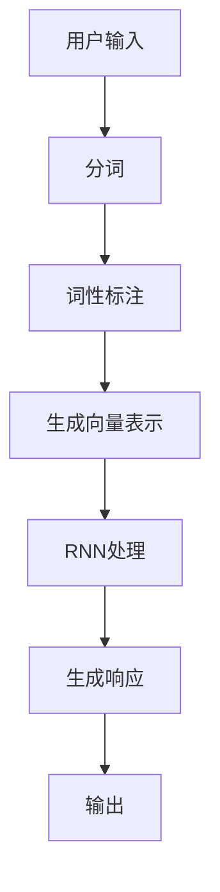
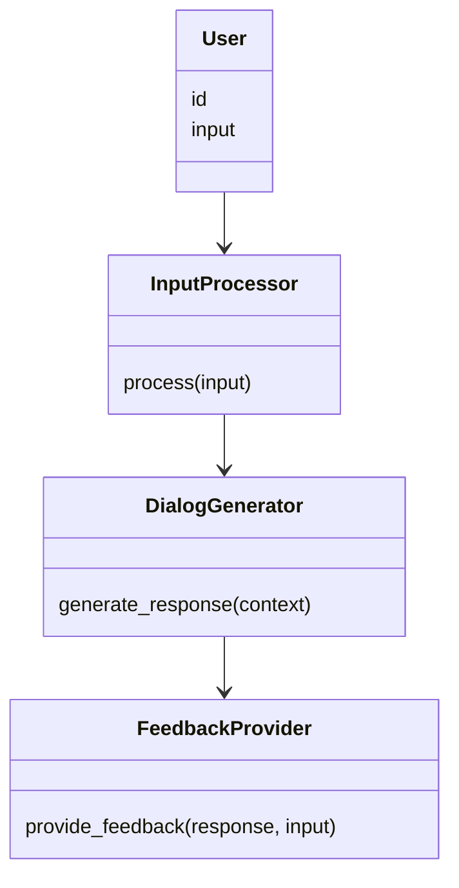
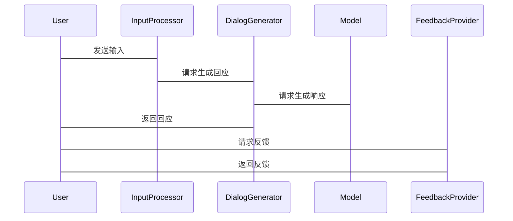

                 


# AI Agent的对话系统在语言学习中的应用

---

## 关键词

- AI Agent
- 对话系统
- 语言学习
- 自然语言处理
- 机器学习
- 对话算法

---

## 摘要

本文探讨了AI Agent的对话系统在语言学习中的应用，分析了对话系统的原理、算法、架构以及实际案例。通过详细讲解核心概念、算法原理和系统架构，结合项目实战和最佳实践，为读者提供全面的视角，展示AI技术如何助力语言学习。

---

## 正文

### 第一部分：引言

#### 第1章：AI Agent与对话系统的概述

##### 1.1 AI Agent的基本概念

- **1.1.1 AI Agent的定义与特点**
  - AI Agent是具有感知和行动能力的智能体，能够理解环境并执行任务。
  - 具有自主性、反应性、目标导向和学习能力。

- **1.1.2 AI Agent的分类与应用场景**
  - 分为简单反射型、基于模型的反应型、目标驱动型和实用驱动型。
  - 应用于智能助手、教育、医疗、金融等领域。

- **1.1.3 对话系统在AI Agent中的重要性**
  - 对话系统是AI Agent与用户交互的核心模块。
  - 通过自然语言处理技术实现高效的人机对话。

##### 1.2 对话系统的分类与特点

- **1.2.1 基于规则的对话系统**
  - 通过预定义的规则生成响应。
  - 优点：简单易实现，缺点：灵活性和扩展性有限。

- **1.2.2 基于机器学习的对话系统**
  - 使用深度学习模型（如RNN、Transformer）进行训练。
  - 优点：灵活性强，适应性强，缺点：需要大量数据和计算资源。

- **1.2.3 基于大模型的对话系统**
  - 利用预训练的大语言模型（如GPT）进行对话生成。
  - 优点：生成能力强，表现自然，缺点：资源消耗大。

##### 1.3 语言学习中的对话系统应用

- **1.3.1 语言学习的特点与需求**
  - 学习者需要实时反馈和个性化指导。
  - 需要支持多种语言和学习场景。

- **1.3.2 对话系统在语言学习中的优势**
  - 提供即时反馈，帮助学习者纠正错误。
  - 支持多轮对话，增强学习互动性。
  - 个性化学习路径，满足不同学习者的需求。

- **1.3.3 当前应用的挑战与未来趋势**
  - 挑战：数据隐私、模型泛化能力、多语言支持。
  - 未来趋势：结合AR/VR技术，提供沉浸式学习体验。

---

### 第二部分：AI Agent对话系统的核心概念

#### 第2章：对话系统的核心原理

##### 2.1 对话系统的组成与流程

- **2.1.1 用户输入处理**
  - 输入预处理：分词、词性标注、句法分析。
  - 使用正则表达式或NLP模型提取关键信息。

- **2.1.2 系统理解与生成**
  - 系统理解：将输入转换为内部表示（如向量）。
  - 系统生成：基于理解生成回应，考虑上下文和目标。

- **2.1.3 反馈与迭代**
  - 根据用户反馈调整生成策略。
  - 使用强化学习优化对话流程。

##### 2.2 自然语言处理的基础知识

- **2.2.1 词法分析**
  - 分词：将输入文本分割为单词或短语。
  - 词性标注：为每个词分配词性。

- **2.2.2 句法分析**
  - 语法树构建：分析句子的结构。
  - 依存关系分析：识别句子中的语法关系。

- **2.2.3 实体识别**
  - 识别文本中的实体（如人名、地名）。
  - 使用CRF或深度学习模型实现。

##### 2.3 对话系统的属性对比

| 属性       | 基于规则的系统 | 基于机器学习的系统 | 基于大模型的系统 |
|------------|----------------|--------------------|------------------|
| 实现复杂度 | 低             | 中到高             | 高               |
| 灵活性      | 低             | 高                 | 极高             |
| 数据需求   | 少             | 大                 | 极大             |
| 表现自然度  | 低             | 中                 | 高               |

---

#### 第3章：对话系统的算法原理

##### 3.1 支持向量机（SVM）在对话系统中的应用

- **3.1.1 SVM的基本原理**
  - SVM用于分类问题，通过构建超平面分割数据。
  - 使用核函数处理非线性可分问题。

- **3.1.2 SVM在对话分类中的应用**
  - 将对话内容映射到特征空间。
  - 使用SVM进行意图分类。

##### 3.2 神经网络算法的核心原理

- **3.2.1 RNN（循环神经网络）**
  - 用于处理序列数据，适合对话生成。
  - 使用LSTM或GRU单元处理长序列。

- **3.2.2 Transformer模型**
  - 基于自注意力机制，捕捉全局依赖。
  - 在大规模数据上表现优异。

##### 3.3 算法流程图



##### 3.4 算法实现代码示例

```python
import numpy as np
from sklearn.svm import SVC

# 示例数据
X = [[0, 0], [1, 1], [1, 0], [0, 1]]
y = [0, 1, 1, 1]

# 训练SVM模型
model = SVC()
model.fit(X, y)

# 预测
print(model.predict([[0.5, 0.5]]))  # 输出：1
```

---

### 第三部分：系统分析与架构设计方案

#### 第4章：系统架构设计

##### 4.1 问题场景介绍

- 语言学习对话系统的应用场景包括语法练习、词汇记忆、口语训练等。

##### 4.2 系统功能设计

- **功能模块**：
  - 输入处理模块：负责接收和解析用户输入。
  - 对话生成模块：基于输入生成回应。
  - 反馈模块：提供实时反馈和学习建议。

- **领域模型（类图）**



##### 4.3 系统架构设计

- **分层架构**：
  - 表现层：用户界面和交互。
  - 业务逻辑层：处理用户请求和生成响应。
  - 数据访问层：访问和管理数据。

- **架构图**


##### 4.4 系统接口设计

- **API接口**：
  - POST /dialog/process
  - GET /feedback/generate

##### 4.5 系统交互流程图



---

### 第四部分：项目实战

#### 第5章：对话系统在语言学习中的实现

##### 5.1 项目介绍

- 项目目标：设计一个AI对话练习系统，帮助学习者练习语言对话。

##### 5.2 核心代码实现

```python
from transformers import pipeline

# 初始化对话生成管道
generator = pipeline("text-generation", model="gpt2")

# 定义对话流程
def generate_response(prompt):
    response = generator(prompt, max_length=50, num_return_sequences=1)
    return response[0]['generated_text']

# 示例对话
user_input = "How are you?"
response = generate_response(user_input)
print(response)  # 示例输出：I'm fine, thank you. How can I assist you today?
```

##### 5.3 功能分析与优化

- 功能分析：支持多轮对话，提供实时反馈。
- 优化方向：引入上下文记忆模块，增强对话连贯性。

##### 5.4 实际案例分析

- 案例：用户练习英语对话。
  - 用户输入："What's your name?"
  - 系统生成："My name is Alice. What's yours?"
  - 用户输入："My name is Bob."
  - 系统生成："Nice to meet you, Bob!"

---

### 第五部分：总结与展望

#### 第6章：总结与最佳实践

##### 6.1 小结

- AI Agent的对话系统在语言学习中具有重要价值。
- 结合NLP技术和机器学习算法，能够提供个性化的学习体验。

##### 6.2 注意事项

- 数据隐私保护：避免用户数据泄露。
- 模型优化：提升对话系统的准确性和流畅性。
- 多语言支持：拓展系统支持更多语言。

##### 6.3 未来趋势

- 结合AR/VR技术，提供沉浸式学习体验。
- 利用大语言模型，增强对话的自然性和智能性。

##### 6.4 拓展阅读

- 推荐书籍：《自然语言处理入门》、《深度学习入门》。
- 推荐论文：关注最新的对话系统研究。

---

### 结语

AI Agent的对话系统正在 revolutionize 语言学习的方式，通过不断的优化和创新，未来将为学习者提供更加智能化和个性化的学习体验。

