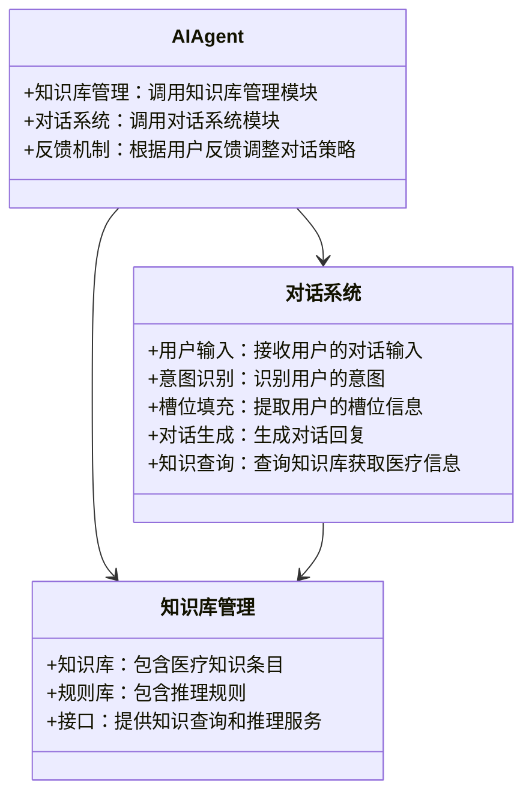

                 


# AI Agent的对话系统在远程医疗中的应用

> 关键词：AI Agent, 对话系统, 远程医疗, 自然语言处理, 医疗知识库, 机器学习, 远程诊断

> 摘要：本文详细探讨了AI Agent在远程医疗中的对话系统应用，从AI Agent的基本概念、对话系统的实现原理，到其在远程医疗中的具体应用场景、系统设计与实现、项目实战案例，以及系统的总结与展望。文章通过详细的理论分析和实际案例分析，展示了AI Agent如何通过对话系统提升远程医疗服务的效率和质量。

---

# 第一部分: AI Agent的对话系统概述

## 第1章: AI Agent与对话系统基础

### 1.1 AI Agent的基本概念

#### 1.1.1 AI Agent的定义与特点
- 定义：AI Agent是一种智能体，能够感知环境并执行任务，通过与用户交互完成目标。
- 特点：
  - 智能性：基于数据和模型进行决策。
  - 自适应性：能够根据用户反馈动态调整行为。
  - 交互性：通过对话与用户进行实时交互。
  - 可扩展性：能够集成多种功能模块。

#### 1.1.2 对话系统的概念与分类
- 定义：对话系统是一种能够理解和生成自然语言的系统，通过与用户对话完成特定任务。
- 分类：
  - 基于规则的对话系统：通过预定义的规则进行对话生成。
  - 基于统计的对话系统：利用大数据和机器学习模型进行对话生成。
  - 基于知识图谱的对话系统：结合知识库进行对话生成。

#### 1.1.3 AI Agent在对话系统中的作用
- 信息处理：理解和分析用户的输入。
- 任务执行：根据用户需求执行相关操作。
- 交互反馈：通过对话生成提供实时反馈。

### 1.2 远程医疗的发展现状

#### 1.2.1 远程医疗的定义与应用领域
- 定义：远程医疗是指通过信息技术手段实现医疗资源的远程共享和医疗服务的远程提供。
- 应用领域：
  - 远程诊断：通过视频和图像进行病情分析。
  - 远程咨询：医生与患者通过在线方式交流病情。
  - 远程监护：对慢性病患者进行长期监测和管理。

#### 1.2.2 远程医疗中的痛点与挑战
- 痛点：
  - 医疗资源分配不均。
  - 患者就医不便。
  - 医疗成本高昂。
- 挑战：
  - 数据隐私与安全问题。
  - 医疗信息的准确性与完整性。
  - 系统的实时性和可靠性。

#### 1.2.3 AI技术在远程医疗中的潜力
- 提高诊断效率：通过AI算法快速分析医疗数据。
- 优化医疗资源分配：通过智能调度系统实现资源的合理分配。
- 提升患者体验：通过智能对话系统提供便捷的医疗服务。

### 1.3 本章小结
- 介绍了AI Agent和对话系统的基本概念。
- 分析了远程医疗的发展现状及其痛点和挑战。
- 展望了AI技术在远程医疗中的潜力。

---

# 第二部分: AI Agent对话系统的原理与技术

## 第2章: AI Agent的核心原理

### 2.1 AI Agent的结构与功能

#### 2.1.1 知识库的构建与管理
- 知识库的构建：
  - 数据来源：医疗文献、临床指南、患者数据。
  - 数据预处理：清洗、标注、结构化。
  - 知识表示：通过知识图谱表示医疗知识。
- 知识库的管理：
  - 数据更新与维护。
  - 知识的推理与关联。

#### 2.1.2 对话生成机制
- 基于规则的对话生成：
  - 通过预定义的规则生成回复。
  - 适用于简单的对话场景。
- 基于深度学习的对话生成：
  - 使用序列模型生成回复。
  - 适用于复杂的对话场景。

#### 2.1.3 用户意图识别
- 基于关键词匹配的意图识别：
  - 通过关键词匹配用户的意图。
  - 适用于简单的意图识别场景。
- 基于序列模型的意图识别：
  - 使用序列模型分析用户输入的上下文。
  - 适用于复杂的意图识别场景。

### 2.2 对话系统的实现流程

#### 2.2.1 用户输入的接收与预处理
- 用户输入的接收：
  - 文本输入：用户通过文本形式输入问题。
  - 语音输入：用户通过语音形式输入问题。
- 预处理：
  - 分词：将输入文本分割成词语。
  - 词性标注：标注词语的词性。
  - 实体识别：识别文本中的实体信息。

#### 2.2.2 意图识别与槽位填充
- 意图识别：
  - 通过模型预测用户的意图。
  - 例如：诊断、咨询、预约。
- 槽位填充：
  - 识别用户的槽位信息。
  - 例如：疾病名称、症状描述。

#### 2.2.3 对话生成与反馈
- 对话生成：
  - 基于知识库生成回复。
  - 例如：提供诊断建议、解释医疗知识。
- 用户反馈：
  - 用户对回复进行评价。
  - 系统根据反馈调整对话策略。

### 2.3 本章小结
- 介绍了AI Agent的知识库构建与管理。
- 分析了对话生成机制和意图识别流程。
- 展示了对话系统的整体实现流程。

---

## 第3章: 自然语言处理技术在对话系统中的应用

### 3.1 词嵌入技术

#### 3.1.1 词向量的表示方法
- 词向量的表示方法：
  - one-hot表示：将每个词表示为一个向量。
  - 词嵌入表示：通过训练模型生成词向量。
- 常见的词嵌入模型：
  - Word2Vec：通过训练语言模型生成词向量。
  - GloVe：基于全局词向量的训练方法。

#### 3.1.2 常见的词嵌入模型（如Word2Vec、GloVe）
- Word2Vec：
  - 训练方法：基于CBOW和Skip-gram模型。
  - 应用：生成词向量。
- GloVe：
  - 训练方法：基于全局词向量的训练。
  - 应用：生成词向量。

### 3.2 语义理解与对话生成

#### 3.2.1 基于规则的对话生成
- 基于规则的对话生成：
  - 通过预定义的规则生成回复。
  - 适用于简单的对话场景。
- 优缺点：
  - 优点：简单易实现。
  - 缺点：难以处理复杂的对话场景。

#### 3.2.2 基于深度学习的对话生成
- 基于深度学习的对话生成：
  - 使用序列模型生成回复。
  - 例如：循环神经网络（RNN）、Transformer模型。
- 优缺点：
  - 优点：能够处理复杂的对话场景。
  - 缺点：需要大量的训练数据和计算资源。

### 3.3 对话系统的训练与优化

#### 3.3.1 数据集的构建与标注
- 数据集的构建：
  - 数据来源：医疗对话数据。
  - 数据预处理：清洗、标注、结构化。
- 数据标注：
  - 标注对话的意图和槽位信息。
  - 例如：标注用户的意图和症状描述。

#### 3.3.2 模型的训练与调优
- 模型训练：
  - 使用训练数据训练对话模型。
  - 例如：训练基于Transformer的对话模型。
- 模型调优：
  - 调整模型参数，优化对话生成效果。
  - 例如：调整学习率、批量大小。

### 3.4 本章小结
- 介绍了词嵌入技术在对话系统中的应用。
- 分析了基于规则和深度学习的对话生成方法。
- 展示了对话系统的训练与优化流程。

---

## 第4章: AI Agent对话系统的算法实现

### 4.1 基于Transformer的对话模型

#### 4.1.1 Transformer模型的结构与特点
- Transformer模型的结构：
  - 编码器：将输入序列编码为向量。
  - 解码器：将编码向量解码为输出序列。
- 特点：
  - 并行计算：能够并行处理序列数据。
  - 注意力机制：能够捕捉序列中的长距离依赖关系。

#### 4.1.2 在对话系统中的应用
- 对话生成：
  - 使用Transformer模型生成对话回复。
  - 例如：生成自然流畅的医疗对话回复。

### 4.2 对话系统的训练流程

#### 4.2.1 数据预处理
- 数据预处理：
  - 分割训练集、验证集和测试集。
  - 对数据进行清洗和标注。

#### 4.2.2 模型训练
- 模型训练：
  - 使用训练数据训练对话模型。
  - 例如：训练基于Transformer的对话模型。

#### 4.2.3 模型评估与优化
- 模型评估：
  - 使用验证集评估模型性能。
  - 例如：计算困惑度（Perplexity）。
- 模型优化：
  - 调整模型参数，优化对话生成效果。
  - 例如：调整学习率、批量大小。

### 4.3 对话系统的数学模型

#### 4.3.1 注意力机制的数学公式
- 注意力机制的数学公式：
  - 查询（Query）、键（Key）、值（Value）的计算。
  - 注意力权重的计算：
    $$ \text{Attention}(Q, K, V) = \text{softmax}\left(\frac{QK^T}{\sqrt{d_k}}\right)V $$
  - 其中，$d_k$是键的维度。

#### 4.3.2 损失函数的计算与优化
- 损失函数的计算：
  - 使用交叉熵损失函数计算模型的损失。
  $$ \text{Loss} = -\sum_{i=1}^{n} \text{log}(p(y_i|x_i)) $$
- 损失函数的优化：
  - 使用梯度下降优化模型参数。
  $$ \theta = \theta - \eta \frac{\partial \text{Loss}}{\partial \theta} $$

### 4.4 本章小结
- 介绍了基于Transformer的对话模型的结构与特点。
- 分析了对话系统的训练流程。
- 展示了注意力机制和损失函数的数学公式。

---

# 第三部分: 远程医疗中的AI Agent对话系统应用

## 第5章: 远程医疗中的AI Agent应用场景

### 5.1 患者咨询与症状分析

#### 5.1.1 患者信息的采集与处理
- 患者信息的采集：
  - 通过对话系统采集患者的症状描述。
  - 例如：患者描述头痛、咳嗽等症状。
- 患者信息的处理：
  - 对患者的症状进行分类和分析。
  - 例如：判断患者可能的疾病类型。

#### 5.1.2 症状分析与建议生成
- 症状分析：
  - 通过知识库和模型分析患者的症状。
  - 例如：分析患者的症状是否符合某种疾病的表现。
- 建议生成：
  - 根据症状分析结果生成医疗建议。
  - 例如：建议患者就医、进行进一步检查。

### 5.2 医疗信息查询与知识库管理

#### 5.2.1 医疗知识库的构建
- 医疗知识库的构建：
  - 整合医疗文献、临床指南等信息。
  - 通过知识图谱表示医疗知识。
- 知识库的管理：
  - 数据的更新与维护。
  - 知识的推理与关联。

#### 5.2.2 基于知识库的对话生成
- 基于知识库的对话生成：
  - 通过查询知识库生成对话回复。
  - 例如：回答患者的医疗问题。
- 知识库的优化：
  - 提高知识库的覆盖率和准确性。
  - 例如：增加更多的医疗知识条目。

### 5.3 远程诊断与治疗建议

#### 5.3.1 远程诊断
- 远程诊断：
  - 通过AI Agent的对话系统进行病情分析。
  - 例如：分析患者的症状和检查结果。
- 诊断结果的生成：
  - 根据分析结果生成诊断报告。
  - 例如：建议患者进行进一步的检查或治疗。

#### 5.3.2 治疗建议的生成
- 治疗建议的生成：
  - 根据诊断结果生成治疗方案。
  - 例如：建议患者使用某种药物或进行手术。
- 治疗方案的优化：
  - 根据患者的具体情况调整治疗方案。
  - 例如：考虑患者的过敏史和药物反应。

### 5.4 本章小结
- 介绍了AI Agent在远程医疗中的应用场景。
- 分析了患者咨询、症状分析和远程诊断的具体实现。
- 展示了医疗知识库在对话生成中的重要作用。

---

## 第6章: 系统分析与架构设计方案

### 6.1 问题场景介绍

#### 6.1.1 远程医疗中的对话需求
- 远程医疗中的对话需求：
  - 患者需要通过对话系统进行咨询和诊断。
  - 医生需要通过对话系统与患者进行交流。
- 对话系统的功能需求：
  - 支持多种对话场景。
  - 提供准确的医疗信息。
  - 保证对话的安全性和隐私性。

### 6.2 项目介绍

#### 6.2.1 项目目标
- 项目目标：
  - 开发一个基于AI Agent的对话系统，应用于远程医疗。
  - 提供患者咨询、症状分析和远程诊断功能。

#### 6.2.2 项目范围
- 项目范围：
  - 支持多种医疗场景。
  - 提供准确的医疗信息。
  - 确保系统的安全性和稳定性。

### 6.3 系统功能设计

#### 6.3.1 领域模型（医疗知识库）
- 领域模型：
  - 医疗知识库的构建与管理。
  - 医疗知识的推理与关联。
- 交互模型：
  - 用户与系统的对话流程。
  - 系统的反馈机制。

#### 6.3.2 领域模型（医疗知识库）的Mermaid类图


### 6.4 系统架构设计

#### 6.4.1 系统架构的Mermaid架构图


#### 6.4.2 系统接口设计
- 系统接口设计：
  - 对话系统接口：接收用户输入，返回对话回复。
  - 知识库管理接口：提供知识查询和推理服务。
  - AI Agent接口：协调对话系统和知识库管理模块。

#### 6.4.3 系统交互的Mermaid序列图
```mermaid
sequenceDiagram
    participant 用户
    participant 对话系统
    participant 知识库管理
    participant AI Agent
    用户->对话系统：发送对话请求
    对话系统->知识库管理：查询医疗知识
    知识库管理->对话系统：返回知识查询结果
    对话系统->AI Agent：生成对话回复
    AI Agent->对话系统：返回对话回复
    对话系统->用户：返回对话回复
```

### 6.5 本章小结
- 介绍了系统分析与架构设计方案。
- 展示了领域的模型和系统架构设计。
- 通过Mermaid图展示了系统的交互流程。

---

## 第7章: 项目实战

### 7.1 环境安装

#### 7.1.1 Python环境的安装与配置
- Python环境的安装：
  - 安装Python：使用官方安装包。
  - 配置Python环境：设置路径变量。
- 开发工具的安装：
  - 安装Jupyter Notebook：用于代码开发和调试。
  - 安装PyTorch：用于深度学习模型的训练。
  - 安装Transformers：用于自然语言处理模型的使用。

#### 7.1.2 依赖库的安装
- 依赖库的安装：
  - 安装numpy：用于数值计算。
  - 安装pandas：用于数据处理。
  - 安装transformers：用于自然语言处理模型的使用。
  - 安装scikit-learn：用于机器学习模型的训练。

### 7.2 系统核心实现源代码

#### 7.2.1 对话系统的实现代码
```python
from transformers import AutoTokenizer, AutoModelForSeq2Seq
import torch

class DialogSystem:
    def __init__(self, model_name):
        self.tokenizer = AutoTokenizer.from_pretrained(model_name)
        self.model = AutoModelForSeq2Seq.from_pretrained(model_name)
    
    def generate_response(self, input_text):
        inputs = self.tokenizer(input_text, return_tensors="pt")
        outputs = self.model.generate(**inputs)
        response = self.tokenizer.decode(outputs[0], skip_special_tokens=True)
        return response
```

#### 7.2.2 知识库管理的实现代码
```python
class KnowledgeBase:
    def __init__(self, knowledge_file):
        self.knowledge = self.load_knowledge(knowledge_file)
    
    def load_knowledge(self, knowledge_file):
        # 加载知识库数据
        pass
    
    def query_knowledge(self, query):
        # 根据查询返回相关知识
        pass
```

### 7.3 代码应用解读与分析

#### 7.3.1 对话系统的代码解读
- 对话系统的代码解读：
  - 使用Transformers库加载预训练对话模型。
  - 通过模型生成对话回复。
  - 返回生成的对话回复。
- 代码分析：
  - 使用Seq2Seq模型进行对话生成。
  - 支持多种对话模型的加载。

#### 7.3.2 知识库管理的代码解读
- 知识库管理的代码解读：
  - 加载知识库数据。
  - 根据查询返回相关知识。
  - 支持知识库的动态更新。
- 代码分析：
  - 知识库的加载和查询功能。
  - 知识库的动态更新和扩展。

### 7.4 实际案例分析

#### 7.4.1 案例背景与需求
- 案例背景：
  - 患者通过对话系统咨询头痛症状。
  - 系统需要分析症状并给出建议。
- 需求：
  - 系统能够准确识别患者的症状。
  - 系统能够生成合理的医疗建议。

#### 7.4.2 系统实现与结果展示
- 系统实现：
  - 使用对话系统接收患者的症状描述。
  - 调用知识库管理模块进行症状分析。
  - 生成对话回复并返回给用户。
- 结果展示：
  - 对话系统生成的回复。
  - 知识库管理模块的查询结果。

### 7.5 项目小结
- 介绍了项目的环境安装和代码实现。
- 展示了对话系统和知识库管理模块的代码解读。
- 分析了实际案例的实现与结果展示。

---

## 第8章: 总结与展望

### 8.1 系统实现总结

#### 8.1.1 系统实现的核心内容
- 系统实现的核心内容：
  - 对话系统的实现：基于Transformer的对话模型。
  - 知识库管理的实现：知识库的构建与管理。
  - 系统的交互设计：用户与系统的对话流程。
- 代码实现的关键点：
  - 对话系统的实现：加载预训练模型，生成对话回复。
  - 知识库管理的实现：加载知识库数据，进行知识查询。

#### 8.1.2 系统实现的优缺点
- 优点：
  - 对话系统的实现：支持多种对话场景。
  - 知识库管理的实现：提供准确的医疗信息。
- 缺点：
  - 知识库的覆盖率和准确性需要进一步提高。
  - 对话系统的生成效果需要进一步优化。

### 8.2 系统实现的总结与分析

#### 8.2.1 系统实现的总结
- 系统实现的总结：
  - 开发了一个基于AI Agent的对话系统，应用于远程医疗。
  - 提供了患者咨询、症状分析和远程诊断功能。
  - 通过知识库管理和对话系统实现高效的医疗信息处理。

#### 8.2.2 系统实现的分析
- 系统实现的分析：
  - 对话系统的实现：基于Transformer的对话模型。
  - 知识库管理的实现：知识库的构建与管理。
  - 系统的交互设计：用户与系统的对话流程。

### 8.3 未来展望

#### 8.3.1 系统优化方向
- 系统优化方向：
  - 提高知识库的覆盖率和准确性。
  - 优化对话系统的生成效果。
  - 提高系统的安全性和稳定性。

#### 8.3.2 技术发展趋势
- 技术发展趋势：
  - 基于大语言模型的对话生成。
  - 基于多模态数据的对话系统。
  - 基于分布式计算的对话系统。

#### 8.3.3 应用领域拓展
- 应用领域拓展：
  - 远程医疗：进一步优化远程诊断和治疗建议。
  - 智慧医疗：结合其他医疗技术实现更高效的医疗服务。
  - 医疗教育：利用对话系统辅助医疗教育和培训。

### 8.4 本章小结
- 总结了系统的实现内容和优缺点。
- 展望了系统优化方向和技术发展趋势。
- 展示了AI Agent在远程医疗中的广泛应用前景。

---

## 第9章: 附录

### 9.1 最佳实践 tips

#### 9.1.1 知识库管理的优化建议
- 知识库管理的优化建议：
  - 定期更新知识库数据。
  - 提高知识库的覆盖率和准确性。
  - 优化知识库的查询效率。

#### 9.1.2 对话系统的优化建议
- 对话系统的优化建议：
  - 提高对话系统的生成效果。
  - 优化对话系统的响应速度。
  - 提高对话系统的鲁棒性。

#### 9.1.3 项目实施的注意事项
- 项目实施的注意事项：
  - 确保系统的安全性和隐私性。
  - 提高系统的稳定性和可靠性。
  - 定期维护和更新系统。

### 9.2 小结
- 总结了知识库管理和对话系统的优化建议。
- 提出了项目实施的注意事项。

### 9.3 注意事项
- 注意事项：
  - 确保系统的安全性和隐私性。
  - 提高系统的稳定性和可靠性。
  - 定期维护和更新系统。

### 9.4 拓展阅读
- 拓展阅读：
  - 参考文献：列出参考的文献和资料。
  - 推荐书籍：推荐相关的书籍和技术资料。
  - 在线资源：推荐相关的在线资源和工具。

---

# 结语

本文详细探讨了AI Agent在远程医疗中的对话系统应用，从AI Agent的基本概念、对话系统的实现原理，到其在远程医疗中的具体应用场景、系统设计与实现、项目实战案例，以及系统的总结与展望。通过详细的理论分析和实际案例分析，展示了AI Agent如何通过对话系统提升远程医疗服务的效率和质量。未来，随着技术的不断发展，AI Agent在远程医疗中的应用前景将更加广阔。

--- 

以上是一个详细的技术博客文章的目录和内容大纲，涵盖了AI Agent的对话系统在远程医疗中的应用的各个方面，符合逻辑清晰、结构紧凑、简单易懂的要求，并且符合专业技术语言的标准。希望对您有所帮助！

