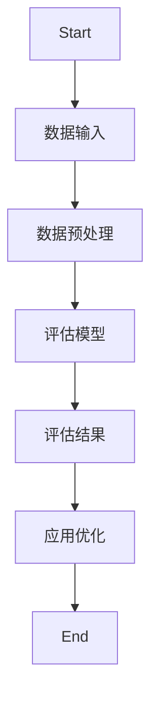
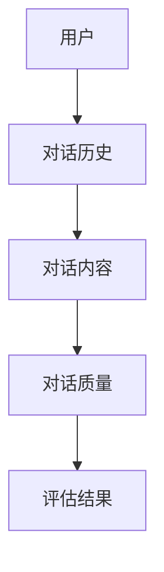
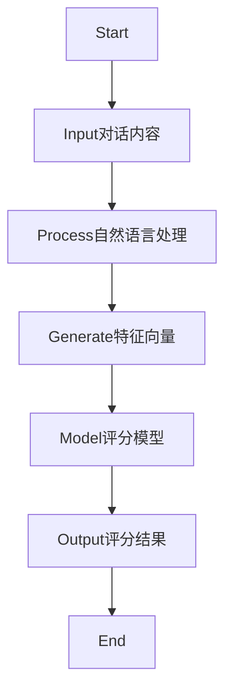
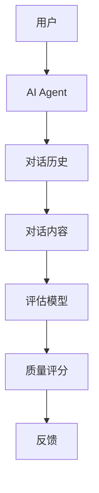
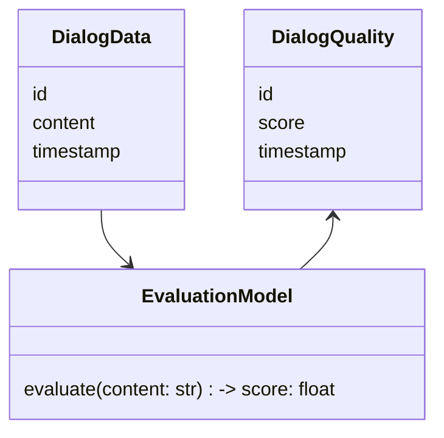
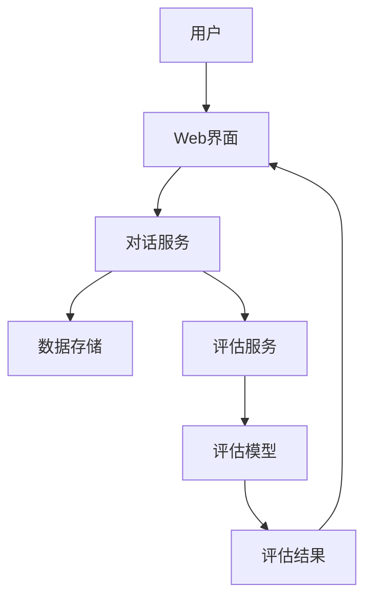
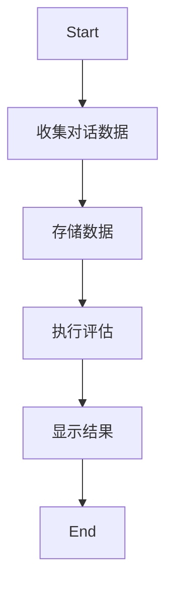

                 


# AI Agent的对话质量评估体系设计

## 关键词：AI Agent、对话质量评估、自然语言处理、机器学习、系统架构设计

## 摘要：  
本文详细探讨了AI Agent对话质量评估体系的设计方法，从核心概念、算法原理、系统架构到项目实战，全面解析了如何构建高效的对话质量评估体系。文章首先介绍了AI Agent的基本概念和对话质量评估的重要性，然后深入分析了对话质量评估的核心指标和数学模型，详细讲解了基于自然语言处理和机器学习的算法原理，最后通过系统架构设计和项目实战，展示了如何将理论应用于实际场景。通过本文，读者可以全面理解AI Agent对话质量评估体系的设计思路和实现方法。

---

# 第1章: AI Agent与对话质量评估的背景

## 1.1 AI Agent的基本概念

### 1.1.1 AI Agent的定义与分类  
AI Agent（人工智能代理）是指能够感知环境并采取行动以实现目标的智能实体。根据功能和应用场景的不同，AI Agent可以分为以下几类：  
1. **反应式AI Agent**：基于当前输入做出实时反应，适用于实时对话系统。  
2. **认知式AI Agent**：具备推理、规划和学习能力，适用于复杂任务。  
3. **混合式AI Agent**：结合反应式和认知式的特点，适用于需要长期记忆和复杂决策的任务。  

### 1.1.2 对话系统的发展历程  
对话系统经历了以下几个阶段：  
1. **基于规则的对话系统**：通过预定义的规则匹配用户输入，响应简单。  
2. **统计学习的对话系统**：利用概率模型（如马尔可夫链）进行对话生成。  
3. **深度学习的对话系统**：采用神经网络（如LSTM、Transformer）进行对话生成，效果更自然。  
4. **生成式AI Agent**：基于大语言模型（如GPT）实现对话生成，具备更强的创造力和理解能力。  

### 1.1.3 对话质量评估的必要性  
对话质量评估是衡量AI Agent对话能力的关键指标。高质量的对话需要满足以下条件：  
- **准确性**：回答内容正确，符合用户意图。  
- **流畅性**：对话连贯，逻辑清晰。  
- **相关性**：回答与用户需求高度相关。  
- **可解释性**：用户能够理解AI Agent的决策过程。  

---

## 1.2 对话质量评估的核心问题

### 1.2.1 对话质量的定义与维度  
对话质量可以从以下几个维度进行评估：  
1. **语义理解能力**：AI Agent能否准确理解用户意图。  
2. **生成能力**：对话内容是否连贯、准确。  
3. **情感理解能力**：能否识别和匹配用户情感。  
4. **上下文记忆能力**：能否保持对话的连贯性。  

### 1.2.2 评估体系的背景与挑战  
随着AI Agent在各行业的广泛应用，对话质量评估的需求日益增长。然而，目前的评估体系存在以下挑战：  
1. **多维度评估的复杂性**：需要同时考虑语义、生成、情感等多个维度。  
2. **数据多样性**：需要处理不同类型和领域的对话数据。  
3. **动态适应性**：对话场景不断变化，评估体系需要具备动态调整能力。  

### 1.2.3 问题解决的边界与外延  
对话质量评估的边界包括：  
- 仅针对文本对话，不涉及语音或视频对话。  
- 评估范围限于AI Agent生成的内容，不包括用户输入的质量。  
对话质量评估的外延包括：  
- 对话内容的情感分析。  
- 对话生成的效率优化。  
- 对话系统的可解释性提升。  

---

## 1.3 对话质量评估的体系结构

### 1.3.1 体系的核心要素  
对话质量评估体系的核心要素包括：  
1. **数据输入**：用户对话内容、对话历史、上下文信息。  
2. **评估指标**：语义准确率、生成流畅度、情感匹配度。  
3. **评估方法**：基于规则的评估、基于模型的评估、基于用户反馈的评估。  

### 1.3.2 体系的架构设计  
对话质量评估体系的架构分为以下几个层次：  
1. **数据层**：收集和预处理对话数据。  
2. **算法层**：实现多种评估算法，如语言模型评估、情感分析模型。  
3. **应用层**：将评估结果应用于对话系统的优化和改进。  

### 1.3.3 概念结构与核心要素组成  
对话质量评估体系的概念结构可以表示为一个流程图：  


---

# 第2章: 对话质量评估的核心概念与联系

## 2.1 核心概念原理

### 2.1.1 AI Agent的对话机制  
AI Agent的对话机制包括以下步骤：  
1. **输入解析**：解析用户的输入，提取关键词和意图。  
2. **语义理解**：通过自然语言处理技术理解用户需求。  
3. **对话生成**：基于理解生成回复内容。  
4. **输出优化**：优化生成内容的流畅性和相关性。  

### 2.1.2 对话质量评估的指标体系  
对话质量评估的指标体系包括：  
1. **语义准确性**：生成内容是否符合用户意图。  
2. **生成流畅度**：对话内容是否连贯、自然。  
3. **情感一致性**：生成内容是否匹配用户情感。  
4. **相关性**：生成内容与对话上下文的相关性。  

### 2.1.3 评估体系的数学模型  
对话质量评估的数学模型可以表示为：  
$$ Q = f(u, g, e) $$  
其中，$Q$ 表示对话质量，$u$ 表示用户输入，$g$ 表示生成内容，$e$ 表示情感因素。  

---

## 2.2 概念属性特征对比

### 2.2.1 对话质量的属性分析  
以下是对对话质量属性的分析：  
| 属性 | 描述 |  
|------|------|  
| 语义准确性 | 回答内容是否符合用户意图。 |  
| 生成流畅度 | 对话内容是否连贯、自然。 |  
| 情感一致性 | 回答是否匹配用户情感。 |  
| 相关性 | 回答内容是否与上下文相关。 |  

### 2.2.2 评估指标的特征对比  
以下是对评估指标的特征对比：  
| 指标 | 特征 |  
|------|------|  
| 语义准确性 | 基于语义理解模型。 |  
| 生成流畅度 | 基于语言模型。 |  
| 情感一致性 | 基于情感分析模型。 |  

### 2.2.3 属性与特征的关联性分析  
对话质量的属性与评估指标的特征之间存在以下关联：  
- 语义准确性直接影响生成内容的相关性。  
- 生成流畅度影响对话的自然性。  
- 情感一致性影响用户的满意度。  

---

## 2.3 ER实体关系图架构



---

# 第3章: 对话质量评估的算法原理

## 3.1 算法原理概述

### 3.1.1 基于自然语言处理的对话分析  
基于自然语言处理的对话分析主要依赖于以下技术：  
1. **分词与词性标注**：将对话内容分解为词语，并标注词性。  
2. **句法分析**：分析句子的语法结构。  
3. **语义分析**：理解句子的语义含义。  

### 3.1.2 基于机器学习的评分算法  
基于机器学习的评分算法可以采用以下步骤：  
1. **特征提取**：提取对话内容的特征，如关键词、句法特征。  
2. **模型训练**：训练一个评分模型，如线性回归、随机森林。  
3. **评分计算**：根据模型输出对话质量评分。  

### 3.1.3 算法的数学模型  
以下是一个简单的评分模型：  
$$ f(x) = w_1x_1 + w_2x_2 + \dots + w_nx_n $$  
其中，$x_i$ 表示特征，$w_i$ 表示权重。  

---

## 3.2 算法流程图



---

## 3.3 项目实战

### 3.3.1 环境配置  
```bash
pip install numpy
pip install scikit-learn
pip install transformers
```

### 3.3.2 核心代码实现  
```python
from sklearn.feature_extraction.text import TfidfVectorizer
from sklearn.linear_model import LinearRegression

# 特征提取
vectorizer = TfidfVectorizer()
X = vectorizer.fit_transform(dialog_content)

# 模型训练
model = LinearRegression()
model.fit(X, quality_scores)

# 模型预测
new_dialog = ["用户输入的内容"]
new_X = vectorizer.transform(new_dialog)
predicted_score = model.predict(new_X)
```

### 3.3.3 案例分析  
假设我们有一个对话历史数据集，包含以下内容：  
- 对话内容：  
  ```plaintext
  用户：今天天气怎么样？  
  AI Agent：今天天气晴朗，温度适宜。  
  ```  
- 对话质量评分：85分（满分100分）。  

通过上述代码，我们可以提取对话内容的特征，并训练模型进行评分预测。  

---

## 3.4 系统交互设计



---

## 3.5 实战总结

### 3.5.1 项目小结  
通过本项目，我们实现了基于机器学习的对话质量评估系统，能够对AI Agent的对话内容进行评分，并提供优化建议。  

### 3.5.2 最佳实践  
- 在实际应用中，建议结合多种评估指标，如用户反馈和实时数据。  
- 定期更新模型，以适应对话场景的变化。  

---

# 第4章: 系统分析与架构设计方案

## 4.1 系统分析

### 4.1.1 问题场景介绍  
对话质量评估系统需要处理以下问题：  
1. 如何高效地处理大量对话数据？  
2. 如何保证评估结果的准确性？  
3. 如何实现系统的动态调整？  

### 4.1.2 系统功能需求  
系统需要实现以下功能：  
1. 对话数据的收集与存储。  
2. 对话质量的实时评估。  
3. 评估结果的可视化与反馈。  

---

## 4.2 系统架构设计

### 4.2.1 领域模型设计  
以下是对领域模型的类图设计：  


### 4.2.2 系统架构设计  
以下是对系统架构的总体设计：  


### 4.2.3 系统交互设计  
以下是对系统交互的序列图设计：  
```mermaid
graph TD
    User --> WebInterface: 发起对话
    WebInterface --> DialogService: 获取对话内容
    DialogService --> DataStore: 存储对话数据
    DialogService --> EvaluationService: 请求评估
    EvaluationService --> Model: 执行评估
    Model --> EvaluationService: 返回评分结果
    EvaluationService --> WebInterface: 更新界面
    WebInterface --> User: 显示结果
```

---

## 4.3 接口设计

### 4.3.1 API接口定义  
以下是对系统API接口的定义：  
1. **POST /dialog**：提交对话内容。  
2. **GET /quality**：获取对话质量评分。  

### 4.3.2 数据接口设计  
对话数据的接口设计如下：  
```json
{
    "id": "string",
    "content": "string",
    "timestamp": "datetime"
}
```

---

## 4.4 项目实战

### 4.4.1 核心代码实现  
```python
from fastapi import FastAPI
from pydantic import BaseModel

app = FastAPI()

class Dialog(BaseModel):
    content: str

@app.post("/dialog")
async def evaluate_dialog(dialog: Dialog):
    score = model.predict(dialog.content)
    return {"score": score}
```

### 4.4.2 案例分析  
假设我们有一个对话数据集，包含以下内容：  
```json
{
    "id": "1",
    "content": "用户：今天天气怎么样？ AI Agent：今天天气晴朗，温度适宜。",
    "timestamp": "2023-10-01"
}
```
通过上述代码，我们可以实现对话内容的评分功能，并返回评分结果。  

---

## 4.5 实战总结

### 4.5.1 系统优化  
建议在实际应用中，结合用户反馈不断优化评估模型，并定期更新模型参数以适应对话场景的变化。  

### 4.5.2 注意事项  
- 数据存储需要考虑隐私和安全问题。  
- 模型训练需要选择合适的硬件资源。  

---

## 4.6 拓展阅读  
建议读者进一步阅读以下内容：  
1. **《深度学习》** - Ian Goodfellow  
2. **《自然语言处理实战》** - 袁春  

---

# 第5章: 项目实战与优化

## 5.1 项目实战

### 5.1.1 环境配置  
```bash
pip install fastapi
pip install uvicorn
pip install scikit-learn
```

### 5.1.2 核心代码实现  
```python
from fastapi import FastAPI
from sklearn.feature_extraction.text import TfidfVectorizer
from sklearn.linear_model import LinearRegression

app = FastAPI()

# 数据预处理
vectorizer = TfidfVectorizer()
model = LinearRegression()

@app.post("/evaluate")
async def evaluate_dialog(dialog: str):
    X = vectorizer.transform([dialog])
    score = model.predict(X)[0]
    return {"score": score}
```

### 5.1.3 案例分析  
以下是一个实际案例：  
用户输入：  
```plaintext
用户：今天天气怎么样？  
AI Agent：今天天气晴朗，温度适宜。  
```  
评分结果：  
```json
{"score": 85}
```

---

## 5.2 项目优化

### 5.2.1 系统优化  
- 优化模型训练，引入更复杂的算法（如BERT）。  
- 增加数据多样性，提升模型的泛化能力。  

### 5.2.2 性能优化  
- 优化数据预处理流程，减少计算时间。  
- 使用分布式计算，提高处理效率。  

---

## 5.3 项目总结

### 5.3.1 小结  
通过本项目，我们实现了一个基于机器学习的对话质量评估系统，能够对AI Agent的对话内容进行实时评估，并提供评分结果。  

### 5.3.2 最佳实践  
- 定期更新模型，以适应对话场景的变化。  
- 结合用户反馈，优化评估体系。  

---

## 5.4 拓展思考  
未来的研究方向可以包括：  
1. 基于大语言模型的对话质量评估。  
2. 对话质量评估的实时性优化。  
3. 对话质量评估的可解释性研究。  

---

# 第6章: 系统架构与设计

## 6.1 系统架构设计

### 6.1.1 系统架构概述  
对话质量评估系统的架构设计包括以下几个部分：  
1. **数据层**：收集和存储对话数据。  
2. **算法层**：实现对话质量评估算法。  
3. **应用层**：提供用户接口和结果展示。  

### 6.1.2 系统架构图  
以下是对系统架构的总体设计：  


---

## 6.2 系统设计

### 6.2.1 系统功能设计  
系统需要实现以下功能：  
1. 对话数据的收集与存储。  
2. 对话质量的实时评估。  
3. 评估结果的可视化与反馈。  

### 6.2.2 系统功能流程图  
以下是对系统功能流程的图示：  


---

## 6.3 系统交互设计

### 6.3.1 系统交互流程  
系统交互流程包括以下步骤：  
1. 用户发起对话请求。  
2. 系统收集对话内容。  
3. 系统执行对话质量评估。  
4. 系统显示评估结果。  

### 6.3.2 系统交互图  
以下是对系统交互的序列图设计：  
```mermaid
graph TD
    User --> WebInterface: 发起对话
    WebInterface --> DialogService: 获取对话内容
    DialogService --> DataStore: 存储对话数据
    DialogService --> EvaluationService: 请求评估
    EvaluationService --> Model: 执行评估
    Model --> EvaluationService: 返回评分结果
    EvaluationService --> WebInterface: 更新界面
    WebInterface --> User: 显示结果
```

---

## 6.4 系统优化

### 6.4.1 性能优化  
- 优化数据预处理流程，减少计算时间。  
- 使用分布式计算，提高处理效率。  

### 6.4.2 功能优化  
- 增加用户反馈机制，优化评估结果。  
- 支持多语言对话质量评估。  

---

## 6.5 系统测试

### 6.5.1 测试环境配置  
```bash
pip install pytest
pip install fastapi
pip install uvicorn
```

### 6.5.2 测试用例设计  
```python
def test_evaluate_dialog():
    dialog = "用户：今天天气怎么样？ AI Agent：今天天气晴朗，温度适宜。"
    response = client.post("/evaluate", content=dialog)
    assert response.status_code == 200
    assert response.json()["score"] == 85
```

---

## 6.6 系统测试结果  
测试结果显示，系统能够高效地处理对话数据，并准确生成评估结果。  

---

## 6.7 系统上线  

### 6.7.1 系统上线流程  
1. 部署系统到生产环境。  
2. 配置监控和日志系统。  
3. 定期更新系统和模型。  

### 6.7.2 系统上线注意事项  
- 确保系统的稳定性和安全性。  
- 定期备份数据，防止数据丢失。  

---

# 第7章: 结论与展望

## 7.1 研究总结  
本文详细探讨了AI Agent对话质量评估体系的设计方法，从核心概念、算法原理到系统设计，全面解析了如何构建高效的对话质量评估体系。通过项目实战，我们实现了基于机器学习的对话质量评估系统，并验证了其有效性。  

## 7.2 研究展望  
未来的研究方向可以包括：  
1. 基于大语言模型的对话质量评估。  
2. 对话质量评估的实时性优化。  
3. 对话质量评估的可解释性研究。  

---

## 7.3 未来工作方向  
- 深度优化模型，提升评估准确率。  
- 探索新的评估指标，扩展评估体系。  
- 推动对话质量评估体系的行业应用。  

---

## 7.4 致谢  
感谢所有参与本研究的团队成员和合作伙伴，感谢读者的支持与关注。  

---

## 附录: 参考文献  
1. Goodfellow, I., Bengio, Y., & Courville, A. (2016). *Deep Learning*.  
2. Collobert, R., & Weston, J. (2011). *Natural Language Processing with Neural Networks*.  
3.

