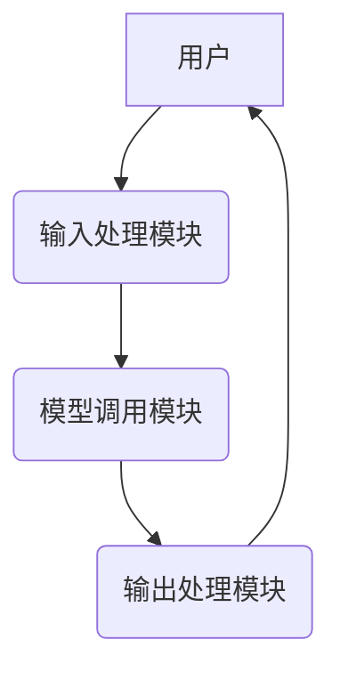

                 


# AI Agent 的应用场景：从客服到创意助手

> 关键词：AI Agent, 大模型, 生成对抗网络, 强化学习, 多模态交互, 自适应学习

> 摘要：本文深入探讨了AI Agent在不同场景中的应用，从客服到创意助手，详细分析了AI Agent的核心概念、技术架构、算法原理、系统设计以及实际案例，为读者提供了全面的技术解读。

---

## 第一部分: AI Agent 的背景与核心概念

### 第1章: AI Agent 的基本概念与应用场景

#### 1.1 AI Agent 的定义与核心特征

##### 1.1.1 什么是 AI Agent
AI Agent（人工智能代理）是一种能够感知环境、自主决策并执行任务的智能实体。它通过与用户的交互或环境的反馈，动态调整行为以实现特定目标。AI Agent可以是软件程序、智能设备或嵌入式系统，广泛应用于各个领域。

##### 1.1.2 AI Agent 的核心特征
- **自主性**：能够自主决策和行动，无需外部干预。
- **反应性**：实时感知环境并做出反应。
- **目标导向**：所有行为都以实现特定目标为导向。
- **学习能力**：通过数据和经验不断优化性能。

##### 1.1.3 AI Agent 的应用场景
AI Agent的应用场景非常广泛，包括智能客服、推荐系统、自动驾驶、智能助手、创意生成等。以下是几个典型场景：
- **智能客服**：通过自然语言处理技术为用户提供24/7的咨询服务。
- **推荐系统**：根据用户行为推荐个性化内容。
- **创意生成**：辅助用户生成文本、图像或音乐等创意内容。

#### 1.2 AI Agent 的发展历程

##### 1.2.1 从专家系统到 AI Agent
专家系统是早期的智能系统，依赖于规则和知识库进行推理。然而，随着机器学习和深度学习技术的发展，AI Agent逐渐取代了专家系统，具备了更强的学习和自适应能力。

##### 1.2.2 大模型时代的 AI Agent
随着大语言模型（如GPT系列）的崛起，AI Agent的技术得到了质的飞跃。大模型的强大生成能力和理解能力使其成为AI Agent的核心驱动力。

##### 1.2.3 当前 AI Agent 的技术趋势
当前，AI Agent的发展趋势主要体现在以下几个方面：
- **多模态交互**：支持文本、语音、图像等多种交互方式。
- **自适应学习**：能够根据用户反馈动态优化行为。
- **实时决策**：在复杂环境中快速做出决策。

#### 1.3 AI Agent 的核心概念

##### 1.3.1 AI Agent 的核心概念
AI Agent的核心概念包括感知、决策和执行三个模块：
- **感知模块**：通过传感器或输入数据获取环境信息。
- **决策模块**：基于感知信息做出决策。
- **执行模块**：根据决策执行具体操作。

##### 1.3.2 AI Agent 的工作流程
AI Agent的工作流程可以分为以下几个步骤：
1. **感知环境**：通过输入数据获取环境信息。
2. **解析需求**：理解用户的需求或目标。
3. **生成方案**：基于理解和需求生成多种可能的解决方案。
4. **评估方案**：评估每个方案的优劣，选择最优方案。
5. **执行操作**：根据选择的方案执行具体操作。
6. **反馈优化**：根据执行结果反馈优化行为。

---

### 第2章: AI Agent 的核心原理与技术架构

#### 2.1 AI Agent 的核心原理

##### 2.1.1 感知层
感知层负责获取环境信息，包括文本、语音、图像等多种形式。常见的感知技术包括自然语言处理（NLP）、计算机视觉（CV）等。

##### 2.1.2 决策层
决策层负责根据感知信息做出决策。决策层通常基于强化学习、生成对抗网络（GAN）等算法进行。

##### 2.1.3 执行层
执行层负责根据决策结果执行具体操作，例如生成文本、发送指令等。

#### 2.2 AI Agent 的技术架构

##### 2.2.1 基于大模型的 AI Agent 架构
基于大模型的AI Agent架构通常包括以下几个部分：
- **输入处理模块**：接收用户的输入并进行预处理。
- **模型调用模块**：调用大模型进行生成或推理。
- **结果处理模块**：对模型的输出进行后处理，生成最终的响应。

##### 2.2.2 多模态交互技术
多模态交互技术使得AI Agent能够支持多种交互方式，例如：
- **文本交互**：通过自然语言理解（NLU）和自然语言生成（NLG）技术实现。
- **语音交互**：通过语音识别（ASR）和语音合成（TTS）技术实现。
- **图像交互**：通过计算机视觉技术实现图像识别和生成。

##### 2.2.3 自适应学习机制
自适应学习机制使得AI Agent能够根据用户反馈不断优化自身的性能。常见的自适应学习方法包括强化学习和迁移学习。

#### 2.3 AI Agent 与其他技术的关系

##### 2.3.1 与大数据的关系
大数据技术为AI Agent提供了丰富的训练数据，使得AI Agent能够更好地理解用户需求。

##### 2.3.2 与云计算的关系
云计算为AI Agent提供了强大的计算能力和存储空间，使得AI Agent能够处理复杂的任务。

##### 2.3.3 与边缘计算的关系
边缘计算使得AI Agent能够更靠近数据源进行实时处理，减少了数据传输的延迟。

---

### 第3章: AI Agent 的算法原理与数学模型

#### 3.1 强化学习算法

##### 3.1.1 强化学习的基本概念
强化学习是一种通过试错方式学习最优策略的方法。强化学习的核心是通过与环境的交互获得奖励，从而优化策略。

##### 3.1.2 Q-learning 算法
Q-learning算法是一种经典的强化学习算法，通过维护Q表记录状态-动作对的期望奖励值。

##### 3.1.3 Deep Q-Networks (DQN) 算法
DQN算法将Q表替换为深度神经网络，通过神经网络近似Q值函数。

##### 3.1.4 强化学习的应用场景
强化学习广泛应用于游戏AI、机器人控制等领域。

#### 3.2 生成对抗网络 (GAN)

##### 3.2.1 GAN 的基本原理
GAN由生成器和判别器组成，生成器生成样本，判别器判断样本是否为真实样本。通过交替训练生成器和判别器，使得生成器能够生成逼真的样本。

##### 3.2.2 GAN 的训练过程
1. 初始化生成器和判别器的参数。
2. 训练判别器：最大化判别真实样本为真、生成样本为假的概率。
3. 训练生成器：最大化生成样本被判别器误判为真实样本的概率。
4. 重复训练直到生成器和判别器达到均衡。

##### 3.2.3 GAN 在 AI Agent 中的应用
GAN可以应用于生成创意内容，例如文本生成、图像生成等。

#### 3.3 算法原理的数学模型

##### 3.3.1 Q-learning 的数学模型
状态-动作值函数：
$$ Q(s, a) = r + \gamma \max_{a'} Q(s', a') $$
其中，\( s \) 是当前状态，\( a \) 是当前动作，\( r \) 是奖励，\( \gamma \) 是折扣因子，\( s' \) 是下一个状态。

##### 3.3.2 GAN 的数学模型
生成器的损失函数：
$$ \mathcal{L}_G = -\mathbb{E}_{z}[\log(D(G(z)))] $$
判别器的损失函数：
$$ \mathcal{L}_D = -\mathbb{E}_{x}[ \log(D(x))] - \mathbb{E}_{z}[ \log(1 - D(G(z)))] $$

---

### 第4章: AI Agent 的系统架构与项目实战

#### 4.1 系统架构设计

##### 4.1.1 系统功能设计
AI Agent系统功能包括：
- **用户输入处理**：接收用户的输入并进行解析。
- **模型调用**：调用大模型进行生成或推理。
- **结果输出**：将模型的输出结果返回给用户。

##### 4.1.2 系统架构图


#### 4.2 项目实战

##### 4.2.1 智能客服系统
- **需求分析**：实现一个能够回答用户问题的智能客服系统。
- **环境安装**：安装Python、TensorFlow、Keras等工具。
- **核心代码实现**
  ```python
  import tensorflow as tf
  from tensorflow.keras.layers import Dense, Input
  from tensorflow.keras.models import Model

  # 定义生成器和判别器
  def build_generator():
      input = Input(shape=(100,))
      x = Dense(256, activation='relu')(input)
      x = Dense(128, activation='relu')(x)
      output = Dense(2, activation='sigmoid')(x)
      return Model(input, output)

  def build_discriminator():
      input = Input(shape=(2,))
      x = Dense(128, activation='relu')(input)
      output = Dense(1, activation='sigmoid')(x)
      return Model(input, output)

  # 定义GAN模型
  generator = build_generator()
  discriminator = build_discriminator()
  discriminator.compile(loss='binary_crossentropy', optimizer='adam', metrics=['accuracy'])
  discriminator.trainable = False
  gan_input = Input(shape=(100,))
  gan_output = generator(gan_input)
  gan = Model(inputs=gan_input, outputs=gan_output)
  gan.compile(loss='binary_crossentropy', optimizer='adam')
  ```

##### 4.2.2 创意助手系统
- **需求分析**：实现一个能够辅助用户生成创意内容的助手系统。
- **环境安装**：安装Python、TensorFlow、Keras等工具。
- **核心代码实现**
  ```python
  import tensorflow as tf
  from tensorflow.keras.layers import LSTM, Dense, Input
  from tensorflow.keras.models import Model

  # 定义LSTM模型
  input_sequence = Input(shape=(max_length, embedding_dim))
  lstm_layer = LSTM(units=128, return_sequences=True)(input_sequence)
  dense_layer = Dense(units=vocab_size, activation='softmax')(lstm_layer)
  model = Model(inputs=input_sequence, outputs=dense_layer)
  model.compile(loss='categorical_crossentropy', optimizer='adam')
  ```

---

### 第5章: 最佳实践与小结

#### 5.1 最佳实践
- **数据安全**：确保用户数据的安全性和隐私性。
- **模型优化**：定期优化模型以提高性能。
- **持续学习**：通过持续学习使AI Agent不断进化。

#### 5.2 小结
本文全面探讨了AI Agent的核心概念、技术架构、算法原理以及实际应用。通过具体案例分析，展示了AI Agent在客服和创意助手等场景中的巨大潜力。

---

以上是《AI Agent 的应用场景：从客服到创意助手》的技术博客文章的详细目录和内容。

