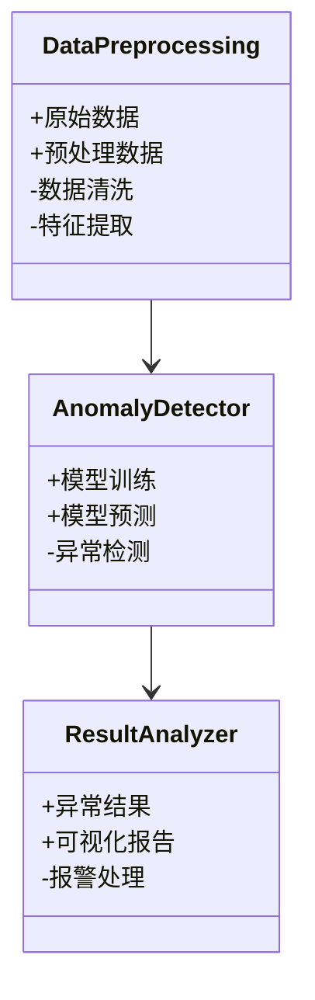
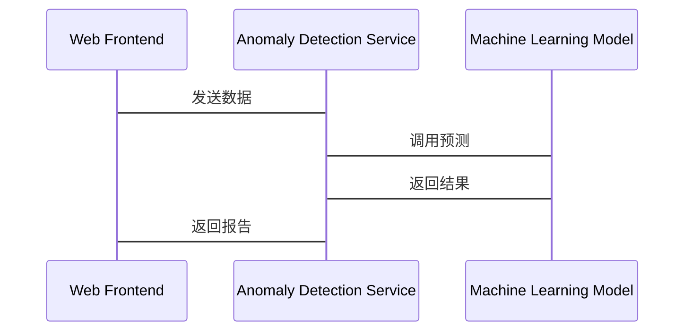

                 


```markdown
# AI Agent的异常检测：识别非正常模式

> **关键词**：AI Agent，异常检测，机器学习，深度学习，数据挖掘

> **摘要**：  
本文深入探讨AI Agent中的异常检测技术，通过分析异常模式的识别方法，结合机器学习和深度学习算法，详细讲解如何在实际场景中实现高效的异常检测。文章从背景、核心概念、算法原理到系统架构、项目实战，全面剖析异常检测的关键技术，并结合实际案例进行详细解读，为读者提供从理论到实践的全面指南。

---

## 第1章: AI Agent异常检测背景与核心概念

### 1.1 异常检测问题背景

#### 1.1.1 异常检测的定义与核心概念
异常检测（Outlier Detection）是指识别数据集中与大多数数据点显著不同的数据点。在AI Agent中，异常检测用于识别不符合预期行为模式的事件或数据，这些异常可能表示系统故障、安全威胁或潜在的优化机会。

#### 1.1.2 AI Agent中的异常检测场景
- **安全监控**：检测未经授权的操作或攻击行为。
- **故障预测**：识别系统中的异常状态，提前进行维护。
- **用户行为分析**：识别异常的用户行为，防止欺诈或滥用。

#### 1.1.3 异常检测的业务价值与应用领域
- **提升系统可靠性**：通过及时发现异常，减少系统故障。
- **增强安全性**：识别潜在的安全威胁。
- **优化用户体验**：通过异常检测提供更个性化的服务。

### 1.2 异常检测的核心要素

#### 1.2.1 异常模式的特征提取
- **数据分布**：分析数据的分布特性，识别偏离正常模式的数据点。
- **时间序列分析**：通过时间序列数据的波动，识别异常点。

#### 1.2.2 异常检测的分类方法
- **基于统计的方法**：利用统计学原理（如Z-score、概率密度函数）识别异常。
- **基于机器学习的方法**：使用监督或无监督学习算法进行异常检测。
- **基于深度学习的方法**：利用神经网络模型（如Autoencoder、GAN）进行异常检测。

#### 1.2.3 异常检测的特征对比与ER实体关系图
- **特征对比表格**：
  | 方法       | 基础原理           | 优点                | 缺点                |
  |------------|--------------------|---------------------|--------------------|
  | 统计方法   | 基于概率分布       | 实现简单            | 易受数据分布影响    |
  | 机器学习   | 基于数据模式       | 高准确性            | 需大量标注数据      |
  | 深度学习   | 基于非线性特征     | 强大学习能力        | 训练时间长          |

- **ER实体关系图**：
  ```mermaid
  entity AI Agent {
    id: string
    name: string
    status: string
    action: string
    timestamp: datetime
  }
  entity Anomaly {
    id: string
    agent_id: string
    timestamp: datetime
    description: string
    severity: integer
  }
  ```

---

## 第2章: 异常检测的核心算法与数学模型

### 2.1 基于统计的异常检测算法

#### 2.1.1 Z-score方法
- **原理**：通过计算数据点与均值的距离标准化值，超过一定阈值的数据点视为异常。
- **公式**：
  $$ Z = \frac{x - \mu}{\sigma} $$
  其中，$\mu$ 是均值，$\sigma$ 是标准差。

#### 2.1.2 LOF（Local Outlier Factor）
- **原理**：基于局部密度差异，计算数据点的局部异常因子。
- **公式**：
  $$ LOF(x) = \frac{d(k, x)}{d(k, x_{neighbors})} $$
  其中，$d(k, x)$ 是点$x$的k近邻密度，$d(k, x_{neighbors})$是其邻居的密度。

### 2.2 基于机器学习的异常检测算法

#### 2.2.1 One-Class SVM
- **原理**：通过训练一个支持向量机模型，仅使用正常数据点进行学习，识别异常点。
- **代码实现**：
  ```python
  from sklearn.svm import OneClassSVM
  model = OneClassSVM(gamma='auto')
  model.fit(X_train)
  y_pred = model.predict(X_test)
  ```

#### 2.2.2 Isolation Forest
- **原理**：通过构建随机森林，将数据点隔离到较短的路径上，判断是否为异常点。
- **代码实现**：
  ```python
  from sklearn.ensemble import IsolationForest
  model = IsolationForest(contamination=0.1)
  model.fit(X_train)
  y_pred = model.predict(X_test)
  ```

### 2.3 基于深度学习的异常检测算法

#### 2.3.1 Autoencoder
- **原理**：通过构建自编码器，学习正常数据的表示，识别异常点。
- **网络结构**：
  ```mermaid
  graph LR
    Input --> Dense(64) --> ReLU --> Dense(32) --> ReLU --> Dense(64) --> ReLU --> Output
  ```
- **损失函数**：使用重构损失（Reconstruction Loss）。
  $$ L = ||x - \hat{x}||_2 $$

#### 2.3.2 GAN（生成对抗网络）
- **原理**：通过生成器和判别器的对抗训练，识别异常点。
- **网络结构**：
  ```mermaid
  graph LR
    Generator -->判别器
    判别器 --> 判别器输出
  ```

---

## 第3章: 系统架构与设计

### 3.1 问题场景分析
- **输入数据**：多维时间序列数据。
- **输出结果**：异常标志和异常描述。

### 3.2 系统功能设计

#### 3.2.1 领域模型（Mermaid类图）


#### 3.2.2 系统架构（Mermaid架构图）
```mermaid
architecturalDiagram
    component Web Frontend {
        -接收用户请求
        -显示异常报告
    }
    component Anomaly Detection Service {
        -处理请求
        -调用模型
    }
    component Machine Learning Model {
        -训练模型
        -预测结果
    }
    Web Frontend --> Anomaly Detection Service
    Anomaly Detection Service --> Machine Learning Model
```

#### 3.2.3 接口设计与交互（Mermaid序列图）


---

## 第4章: 项目实战与实现

### 4.1 环境搭建

#### 4.1.1 安装依赖
```bash
pip install numpy pandas scikit-learn tensorflow
```

#### 4.1.2 数据集准备
- 数据来源：公开数据集（如KDD Cup数据集）。
- 数据格式：CSV文件，包含时间戳、特征向量和标签。

### 4.2 核心实现

#### 4.2.1 数据预处理
```python
import pandas as pd
import numpy as np

# 读取数据
data = pd.read_csv('data.csv')

# 数据清洗
data.dropna()
data = data.drop(columns=['label'])

# 特征提取
features = data.iloc[:, :-1].values
labels = data.iloc[:, -1].values
```

#### 4.2.2 模型实现（Autoencoder）

```python
import tensorflow as tf
from tensorflow.keras import layers

# 模型构建
model = tf.keras.Sequential([
    layers.Dense(64, activation='relu'),
    layers.Dense(32, activation='relu'),
    layers.Dense(64, activation='relu'),
    layers.Dense(features.shape[1], activation='sigmoid')
])

# 模型编译
model.compile(optimizer='adam', loss='binary_crossentropy')
```

#### 4.2.3 训练与预测
```python
# 训练模型
model.fit(features, features, epochs=100, batch_size=32)

# 预测异常
reconstructed = model.predict(features)
error = np.mean(np.abs(reconstructed - features), axis=1)
threshold = np.percentile(error, 95)
anomalies = error > threshold
```

### 4.3 实际案例分析
- 数据集：假设我们使用的是一个包含正常和异常交易的金融数据集。
- 模型表现：通过混淆矩阵评估模型的准确性。
  ```python
  from sklearn.metrics import confusion_matrix

  cm = confusion_matrix(labels, anomalies)
  print(cm)
  ```

---

## 第5章: 最佳实践与小结

### 5.1 最佳实践
- **数据预处理**：确保数据质量，进行归一化或标准化处理。
- **模型选择**：根据数据特性选择合适的算法，如时间序列数据适合LSTM。
- **实时检测**：优化模型以支持实时或在线检测。

### 5.2 小结
异常检测是AI Agent中的重要技术，通过统计方法、机器学习和深度学习算法，可以在复杂场景中识别非正常模式。实际应用中，需要结合具体业务需求，选择合适的算法和系统架构，确保检测的准确性和实时性。

### 5.3 注意事项
- **模型解释性**：异常检测结果需要可解释，便于业务人员理解和处理。
- **模型鲁棒性**：确保模型在数据分布变化时仍能有效工作。
- **计算资源**：深度学习模型需要较高的计算资源，需提前规划。

### 5.4 拓展阅读
- **书籍推荐**：
  - 《Anomaly Detection: A Survey》
  - 《Deep Learning: Methods and Applications》
- **工具推荐**：
  - TensorFlow、PyTorch
  - Scikit-learn、Yellowbrick
```

---

## 结语

通过本文的详细讲解，读者可以系统地了解AI Agent中的异常检测技术，从理论到实践，掌握核心算法和系统设计方法。希望本文能为读者在实际项目中提供有价值的参考和指导。

```

