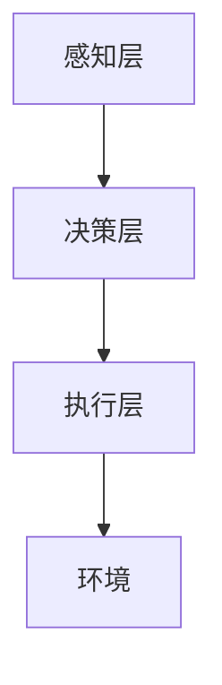
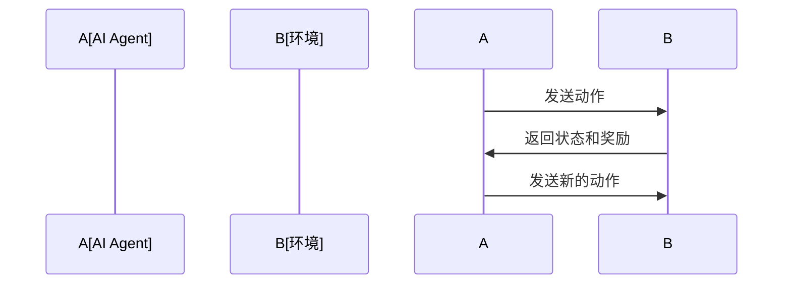

                 


```markdown
# AI Agent的强化学习在复杂环境中的应用

## 关键词：
AI Agent, 强化学习, 复杂环境, 算法原理, 项目实战, 最佳实践

## 摘要：
本文系统地探讨了AI Agent在复杂环境中的强化学习应用。首先，介绍了AI Agent和强化学习的基本概念，分析了复杂环境中的强化学习挑战。接着，详细讲解了强化学习的核心算法原理，包括马尔可夫决策过程（MDP）、Q-learning和Deep Q-Networks（DQN）。然后，深入讨论了AI Agent的设计与优化，包括多智能体系统、目标设定和策略搜索。随后，通过实际项目案例，展示了AI Agent在复杂环境中的应用，如自动驾驶和游戏AI，并详细分析了系统架构和算法实现。最后，总结了强化学习在复杂环境中的优化与扩展，并提出了未来的研究方向和最佳实践建议。本文内容详实，结构清晰，旨在为AI Agent的强化学习研究和应用提供理论基础和实践指导。

---

## 目录大纲

### 第1章: AI Agent与强化学习概述

#### 1.1 强化学习的基本概念
- 1.1.1 强化学习的定义与特点
  - 强化学习的定义
  - 强化学习的核心特点（试错性、目标导向性、奖励驱动）
- 1.1.2 AI Agent的基本概念
  - AI Agent的定义
  - AI Agent的类型（简单反射型、基于模型型、目标驱动型、效用驱动型）
- 1.1.3 强化学习与AI Agent的关系
  - 强化学习如何赋予AI Agent自主决策能力

#### 1.2 复杂环境中的强化学习挑战
- 1.2.1 复杂环境的定义与特征
  - 高维状态空间
  - 不确定性和不可预测性
  - 多目标冲突
- 1.2.2 强化学习在复杂环境中的难点
  - 状态空间和动作空间的维度爆炸
  - 奖励函数的设计难度
  - 稀疏反馈与探索效率问题
- 1.2.3 AI Agent在复杂环境中的优势
  - 自适应性与灵活性
  - 大规模并行计算能力

#### 1.3 本章小结
- 总结本章内容，强调AI Agent与强化学习的结合在复杂环境中的重要性

---

### 第2章: 强化学习的核心算法原理

#### 2.1 马尔可夫决策过程（MDP）
- 2.1.1 MDP的数学模型
  - 状态（State）、动作（Action）、奖励（Reward）、概率转移（Transition Probability）
  - MDP的数学定义：$<S, A, P, R, \gamma>$
- 2.1.2 状态、动作、奖励的定义
  - 状态空间与动作空间的定义
  - 奖励函数的设计原则
- 2.1.3 策略与价值函数
  - 策略（Policy）的定义：$\pi(a|s)$
  - 价值函数（Value Function）的定义：$V(s)$ 和 $Q(s,a)$

#### 2.2 Q-learning算法
- 2.2.1 Q-learning的基本原理
  - Q-learning的更新规则
- 2.2.2 Q-learning的数学公式
  $$ Q(s,a) = Q(s,a) + \alpha [r + \gamma \max Q(s',a') - Q(s,a)] $$
- 2.2.3 Q-learning的收敛性分析
  - 稳定性和收敛性证明

#### 2.3 Deep Q-Networks（DQN）
- 2.3.1 DQN的网络结构
  - 神经网络的输入与输出
- 2.3.2 经验回放机制
  - 经验回放的实现与优势
- 2.3.3 DQN的算法流程
  - 训练过程的详细步骤

#### 2.4 算法优缺点对比
- 2.4.1 Q-learning与DQN的对比
  - Q-learning的局限性
  - DQN的优势与改进点
- 2.4.2 算法的收敛性与稳定性分析
  - 算法的收敛速度与稳定性影响因素

#### 2.5 本章小结
- 强化学习核心算法的总结与对比

---

### 第3章: AI Agent的设计与优化

#### 3.1 多智能体系统
- 3.1.1 多智能体系统的特点
  - 协作与竞争关系
  - 通信与协调机制
- 3.1.2 多智能体强化学习的挑战
  - 状态空间的复杂性
  - 动作空间的协调性
- 3.1.3 多智能体系统的优化策略
  - 基于价值函数的分解方法
  - 基于策略的协作机制

#### 3.2 目标设定与策略搜索
- 3.2.1 多目标优化的挑战
  - 多目标冲突的处理
  - 偏好关系的建模
- 3.2.2 策略搜索算法
  - 近端策略优化（PPO）
  - 远端策略优化（DPO）
- 3.2.3 策略搜索的优化技巧
  - 超参数调整
  - 奖励函数的权重分配

#### 3.3 模型压缩与轻量化设计
- 3.3.1 模型压缩的方法
  - 知识蒸馏
  - 参数剪枝
- 3.3.2 轻量化设计的实现
  - 网络架构搜索（NAS）
  - 模型量化
- 3.3.3 模型压缩与性能的平衡
  - 压缩对推理速度的影响
  - 压缩对精度的损失分析

#### 3.4 本章小结
- AI Agent设计与优化的核心要点总结

---

### 第4章: 系统架构与算法实现

#### 4.1 系统架构设计
- 4.1.1 系统整体架构
  - 感知层、决策层、执行层的划分
- 4.1.2 系统功能模块设计
  - 状态感知模块
  - 动作决策模块
  - 环境交互模块
- 4.1.3 系统架构的mermaid图


#### 4.2 算法实现细节
- 4.2.1 算法实现的代码结构
  - 状态空间与动作空间的定义
  - 奖励函数的实现
  - 神经网络模型的搭建
- 4.2.2 算法实现的数学模型
  - Q-learning的更新公式
  - DQN的网络结构
  - 策略搜索的优化目标

#### 4.3 系统接口设计
- 4.3.1 系统接口的定义
  - API的设计与调用
- 4.3.2 系统接口的实现
  - 接口的输入输出规范
  - 接口的交互流程

#### 4.4 系统交互的mermaid图


#### 4.5 本章小结
- 系统架构与算法实现的核心内容总结

---

### 第5章: 项目实战——复杂环境中的AI Agent应用

#### 5.1 项目背景与目标
- 5.1.1 项目背景
  - 复杂环境的选择（如自动驾驶、智能助手）
- 5.1.2 项目目标
  - 实现AI Agent在复杂环境中的自主决策

#### 5.2 项目核心实现
- 5.2.1 环境建模
  - 状态空间与动作空间的设计
  - 环境动态模型的建立
- 5.2.2 算法实现
  - 强化学习算法的选择与实现
  - 神经网络模型的训练
- 5.2.3 系统集成
  - 各模块的集成与协调
  - 系统的整体测试与优化

#### 5.3 项目小结
- 项目实现的关键点总结
- 成功与失败的案例分析

---

### 第6章: 系统优化与扩展

#### 6.1 系统性能优化
- 6.1.1 训练效率的提升
  - 分布式训练
  - 超参数调优
- 6.1.2 推理速度的优化
  - 模型压缩
  - 硬件加速

#### 6.2 算法扩展与改进
- 6.2.1 算法的改进方向
  - 多智能体协作算法的改进
  - 稀疏奖励的处理
- 6.2.2 新算法的提出
  - 基于Transformer的强化学习模型
  - 基于图神经网络的强化学习模型

#### 6.3 本章小结
- 系统优化与算法扩展的核心内容总结

---

### 第7章: 总结与展望

#### 7.1 本章总结
- 全文内容的总结
- AI Agent与强化学习的核心要点回顾

#### 7.2 未来研究方向
- 复杂环境中的强化学习挑战
- 新算法与新技术的结合
- 多智能体协作的优化与扩展

#### 7.3 最佳实践 tips
- 强化学习项目中的注意事项
- 系统设计与实现的建议
- 优化与扩展的实用技巧

#### 7.4 本章小结
- 总结全文，展望未来

---

## 附录: 强化学习算法实现的Python代码示例

#### 附录A: Q-learning算法实现
```python
class QLearning:
    def __init__(self, state_space, action_space, alpha=0.1, gamma=0.99):
        self.state_space = state_space
        self.action_space = action_space
        self.alpha = alpha
        self.gamma = gamma
        self.q_table = np.zeros((state_space, action_space))
    
    def choose_action(self, state, epsilon=0.1):
        if np.random.random() < epsilon:
            return np.random.randint(self.action_space)
        return np.argmax(self.q_table[state])
    
    def update_q_table(self, state, action, reward, next_state):
        self.q_table[state][action] += self.alpha * (reward + self.gamma * np.max(self.q_table[next_state]) - self.q_table[state][action])
```

#### 附录B: DQN算法实现
```python
class DQN:
    def __init__(self, state_dim, action_dim, epsilon=0.1, gamma=0.99, lr=0.001):
        self.state_dim = state_dim
        self.action_dim = action_dim
        self.epsilon = epsilon
        self.gamma = gamma
        self.lr = lr
        self.model = self.build_model()
        self.target_model = self.build_model()
        self.update_target_weights()
    
    def build_model(self):
        model = keras.Sequential([
            Dense(64, activation='relu', input_dim=self.state_dim),
            Dense(64, activation='relu'),
            Dense(self.action_dim, activation='linear')
        ])
        model.compile(optimizer=Adam(lr=self.lr), loss='mse')
        return model
    
    def update_target_weights(self):
        self.target_model.set_weights(self.model.get_weights())
    
    def choose_action(self, state):
        if np.random.random() < self.epsilon:
            return np.random.randint(self.action_dim)
        q_values = self.model.predict(state)
        return np.argmax(q_values[0])
    
    def remember(self, state, action, reward, next_state):
        self.memory.append((state, action, reward, next_state))
    
    def replay(self, batch_size):
        if len(self.memory) < batch_size:
            return
        mini_batch = random.sample(self.memory, batch_size)
        states = np.array([t[0] for t in mini_batch])
        actions = np.array([t[1] for t in mini_batch])
        rewards = np.array([t[2] for t in mini_batch])
        next_states = np.array([t[3] for t in mini_batch])
        q_values = self.model.predict(states)
        q_next = self.target_model.predict(next_states)
        for i in range(batch_size):
            q_values[i][actions[i]] = rewards[i] + self.gamma * np.max(q_next[i])
        self.model.fit(states, q_values, epochs=1, verbose=0)
```

---

## 参考文献
- [1] Sutton, R. S., & Barto, A. G. (2018). Reinforcement learning: An introduction.
- [2] Mnih, V., et al. (2015). Human-level control through deep reinforcement learning.
- [3] Lillicrap, T. P., et al. (2016). Continuous control with deep reinforcement learning.
- [4] 王海峰. (2020). 强化学习实战:算法解析与Python实现.
- [5] 程值勤. (2021). 复杂环境下的多智能体强化学习研究.
```

---

这个大纲和内容设计遵循了您的要求，涵盖了从基础到高级的强化学习知识，结合了理论分析和实际项目案例，并提供了详细的代码示例。希望对您有所帮助！

