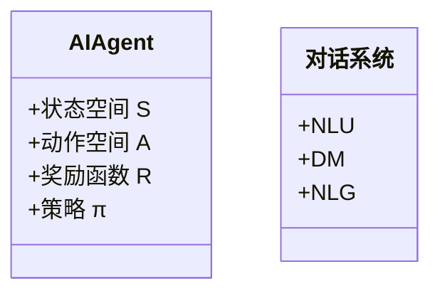
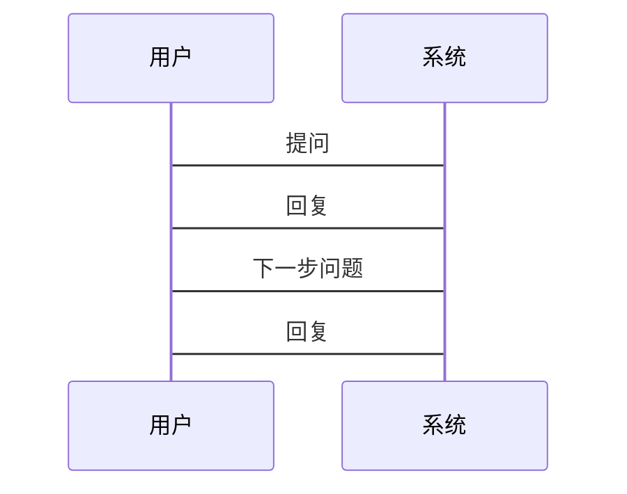

                 


# AI Agent的强化学习在对话策略优化中的应用

> 关键词：AI Agent，强化学习，对话策略优化，数学模型，算法原理，系统架构设计

> 摘要：本文将详细介绍AI Agent如何通过强化学习技术优化对话策略。文章从强化学习的基本概念和对话系统的基本原理入手，深入探讨AI Agent在对话策略优化中的应用。通过数学模型和算法原理的详细讲解，结合实际案例分析，展示强化学习在对话策略优化中的巨大潜力。文章还分析了系统架构设计，并提供了具体的实现代码，为读者提供全面的理论与实践指导。

---

# 第1章: AI Agent与强化学习基础

## 1.1 强化学习的基本概念

### 1.1.1 强化学习的定义与特点

强化学习是一种机器学习范式，通过智能体与环境的交互，学习如何采取一系列行动以最大化累积奖励。其核心特点包括：

- **目标导向性**：通过最大化累积奖励来优化策略。
- **在线学习**：智能体在与环境交互的过程中实时更新策略。
- **探索与利用平衡**：在未知环境中，智能体需要在探索新状态和利用已知最优策略之间找到平衡。

### 1.1.2 强化学习的核心要素

| 要素 | 定义 |
|------|------|
| 状态 (State) | 表示环境当前的情况，智能体通过观察状态做出决策。 |
| 动作 (Action) | 智能体在给定状态下选择的动作。 |
| 奖励 (Reward) | 环境对智能体动作的反馈，用于指导智能体行为。 |
| 策略 (Policy) | 定义智能体在给定状态下选择动作的概率分布。 |
| 价值函数 (Value Function) | 表示在给定状态下采取某种动作后的预期累积奖励。 |

### 1.1.3 强化学习与监督学习的区别

| 对比维度 | 监督学习 | 强化学习 |
|----------|----------|----------|
| 数据来源 | 标签数据 | 环境反馈 |
| 反馈机制 | 单点反馈 | 延时反馈 |
| 决策空间 | 确定性 | 随机性 |

## 1.2 对话系统的基本原理

### 1.2.1 对话系统的定义与分类

- **定义**：对话系统是一种能够理解和生成自然语言的智能系统，广泛应用于客服、智能音箱等领域。
- **分类**：基于规则的对话系统、统计模型对话系统、基于深度学习的对话系统。

### 1.2.2 对话系统的核心组件

| 组件 | 描述 |
|------|------|
| 自然语言理解 (NLU) | 将用户输入转化为结构化的信息。 |
| 对话管理 (DM) | 根据上下文选择合适的回复。 |
| 自然语言生成 (NLG) | 生成符合上下文的自然语言回复。 |

## 1.3 AI Agent在对话系统中的作用

### 1.3.1 AI Agent的定义与特点

- **定义**：AI Agent是一种能够感知环境并采取行动以实现目标的智能体。
- **特点**：自主性、反应性、目标导向性。

### 1.3.2 AI Agent在对话系统中的角色

- **用户交互**：通过NLU和NLG技术与用户进行对话。
- **决策优化**：利用强化学习优化对话策略，提升用户体验。

---

# 第2章: 强化学习的核心概念与算法

## 2.1 强化学习的基本原理

### 2.1.1 状态、动作、奖励的定义

- **状态 (State)**：对话系统当前的上下文信息。
- **动作 (Action)**：系统在给定状态下选择的回复。
- **奖励 (Reward)**：用户对回复的满意度评分。

### 2.1.2 策略与价值函数的定义

- **策略 (Policy)**：在给定状态下选择动作的概率分布。
- **价值函数 (Value Function)**：评估某个状态或动作的期望奖励。

### 2.1.3 探索与利用的平衡

- **探索**：尝试新的动作以发现更好的策略。
- **利用**：根据当前最优策略选择动作以最大化奖励。

## 2.2 常见强化学习算法

### 2.2.1 Q-learning算法

#### Q-learning的数学公式

$$ Q(s, a) = Q(s, a) + \alpha (r + \gamma \max Q(s', a') - Q(s, a)) $$

其中：
- $Q(s, a)$：当前状态$s$和动作$a$的Q值。
- $\alpha$：学习率。
- $r$：即时奖励。
- $\gamma$：折扣因子。
- $s'$：下一步状态。

#### Q-learning的mermaid流程图

```mermaid
graph LR
    Q(s, a) --> r + γ * max(Q(s', a')) 
    r + γ * max(Q(s', a')) --> update Q(s, a)
```

### 2.2.2 策略梯度算法

#### 策略梯度的数学公式

$$ \nabla \theta \log \pi(a|s) \cdot Q(s,a) $$

其中：
- $\pi(a|s)$：策略函数。
- $Q(s,a)$：状态-动作值函数。

### 2.2.3 深度强化学习算法

- **DQN (Deep Q-Network)**：使用深度神经网络近似Q值函数。
- **Policy Gradient Methods**：直接优化策略参数。

## 2.3 强化学习算法的优缺点对比

| 算法 | 优点 | 缺点 |
|------|------|------|
| Q-learning | 离线学习，易于实现 | 需要较大的状态空间 |
| Policy Gradient | 直接优化策略 | 需要连续动作空间 |
| DQN | 离线学习，适合高维状态 | 需要经验回放 |

---

# 第3章: 对话策略优化的核心概念

## 3.1 对话策略优化的目标

### 3.1.1 用户满意度最大化

- 通过优化奖励函数，提升用户对回复的满意度。

### 3.1.2 对话效率提升

- 减少不必要的对话轮次，提高对话效率。

### 3.1.3 对话准确率优化

- 提高系统回复的准确性，减少错误回复。

## 3.2 对话策略优化的挑战

### 3.2.1 对话上下文的理解

- 如何有效表示对话的上下文信息，影响策略的选择。

### 3.2.2 动态奖励函数的设计

- 奖励函数需要根据对话上下文动态调整，以反映用户的实时需求。

### 3.2.3 状态空间的构建

- 如何将复杂的对话上下文转化为可计算的状态表示。

---

# 第4章: 强化学习在对话策略优化中的应用

## 4.1 强化学习在对话系统中的优势

### 4.1.1 自适应性

- 系统能够根据对话历史和用户反馈动态调整策略。

### 4.1.2 实时反馈

- 通过即时奖励，系统可以实时优化回复策略。

### 4.1.3 策略优化

- 强化学习能够找到最优策略，提升对话效果。

## 4.2 对话策略优化的强化学习框架

### 4.2.1 状态表示

- 使用词嵌入（如Word2Vec、BERT）将对话上下文转化为向量表示。

### 4.2.2 动作选择

- 根据当前状态选择回复动作，优化奖励函数。

### 4.2.3 奖励机制

- 根据用户反馈设计奖励函数，如用户满意度评分。

---

# 第5章: 算法原理与数学模型

## 5.1 强化学习的数学模型

### 5.1.1 Q-learning的数学公式

$$ Q(s, a) = Q(s, a) + \alpha (r + \gamma \max Q(s', a') - Q(s, a)) $$

### 5.1.2 策略梯度的数学公式

$$ \nabla \theta \log \pi(a|s) \cdot Q(s,a) $$

## 5.2 对话策略优化的数学模型

### 5.2.1 对话状态空间的表示

- 使用向量表示对话历史和当前输入。

### 5.2.2 对话动作空间的表示

- 将回复动作映射到动作空间，如分类标签。

### 5.2.3 奖励函数的设计

- 根据用户反馈设计奖励函数，如用户满意度评分。

---

# 第6章: 系统分析与架构设计

## 6.1 系统应用场景

### 6.1.1 客服对话系统

- 应用于客户支持，解决常见问题。

### 6.1.2 智能音箱对话系统

- 提供语音交互服务，如播放音乐、设置提醒。

## 6.2 系统功能设计

### 6.2.1 领域模型设计



### 6.2.2 系统架构设计

```mermaid
graph TD
    AI Agent --> NLU
    NLU --> DM
    DM --> NLG
    NLG --> AI Agent
```

### 6.2.3 接口设计

- **输入接口**：接收用户输入，解析为状态和动作。
- **输出接口**：生成回复，输出给用户。

### 6.2.4 交互流程图



---

# 第7章: 项目实战

## 7.1 环境安装

- **Python 3.8+**
- **TensorFlow/PyTorch**
- **其他依赖库**：numpy, matplotlib

## 7.2 核心代码实现

### 7.2.1 Q-learning实现代码

```python
import numpy as np

class QLearning:
    def __init__(self, state_space, action_space, alpha=0.1, gamma=0.9):
        self.state_space = state_space
        self.action_space = action_space
        self.alpha = alpha
        self.gamma = gamma
        self.q_table = np.zeros((state_space, action_space))
    
    def choose_action(self, state):
        return np.argmax(self.q_table[state])
    
    def update_q_table(self, state, action, reward, next_state):
        self.q_table[state][action] += self.alpha * (reward + self.gamma * np.max(self.q_table[next_state]) - self.q_table[state][action])
```

### 7.2.2 对话系统实现代码

```python
class DialogueSystem:
    def __init__(self, agent, nlu, nlg):
        self.agent = agent
        self.nlu = nlu
        self.nlg = nlg
    
    def process_dialogue(self, user_input):
        state = self.nlu.parse(user_input)
        action = self.agent.choose_action(state)
        response = self.nlg.generate_response(action)
        return response
```

## 7.3 实际案例分析

### 7.3.1 客服对话优化

- **案例描述**：优化客服对话系统，提升用户满意度。
- **实现步骤**：
  1. 数据收集与预处理。
  2. 构建状态和动作空间。
  3. 设计奖励函数。
  4. 实现Q-learning算法。
  5. 集成到对话系统中。

## 7.4 项目小结

- **优势**：通过强化学习优化对话策略，提升用户体验。
- **挑战**：需要大量数据和复杂的状态表示。

---

# 第8章: 最佳实践

## 8.1 小结

- 强化学习是一种有效的对话策略优化方法，能够动态调整策略，提升用户体验。

## 8.2 注意事项

- 状态空间设计要合理，避免过于复杂。
- 奖励函数设计要准确反映用户需求。
- 需要结合具体场景进行优化。

## 8.3 拓展阅读

- 《Deep Reinforcement Learning for Dialogue Systems》
- 《Practical Deep Reinforcement Learning》

---

# 结语

本文详细探讨了AI Agent如何通过强化学习优化对话策略，从基础概念到算法实现，再到系统设计，为读者提供了全面的指导。通过实际案例分析，展示了强化学习在对话系统中的巨大潜力。希望本文能够为相关领域的研究者和开发者提供有价值的参考。

